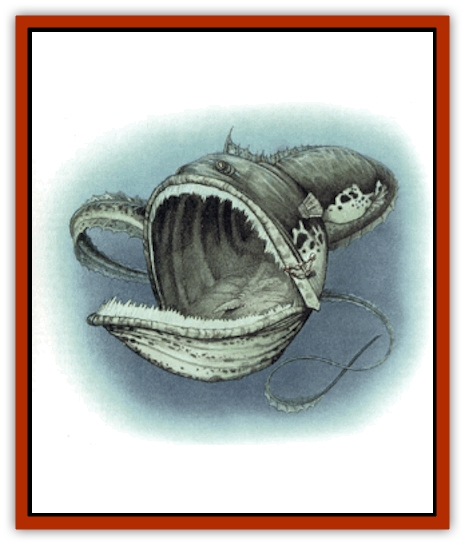

# Fish - Vurgens

| Statistic | **Fish, Vurgens** |
| --- | --- |
| **Activity Cycle:** | Any |
| **Alignment:** | Neutral |
| **Armor Class:** | 4 |
| **Climate/Terrain:** | Ocean depths |
| **Damage/Attack:** | 2d6 or 3d4 |
| **Diet:** | Carnivore |
| **Frequency:** | Very rare |
| **Hit Dice:** | 7+7 to 9+9 |
| **Intelligence:** | Animal (1) |
| **Magic Resistance:** | Nil |
| **Morale:** | Average (8-10) |
| **Movement:** | Sw 15 |
| **No. Appearing:** | 1 |
| **No. of Attacks:** | 1 bite or tail slap |
| **Organization:** | Solitary |
| **Size:** | H (20-40' long) |
| **Special Attacks:** | Swallow whole, paralyze, acid |
| **Special Defenses:** | Nil |
| **THAC0:** | 7+7 HD: 13 / 8+8,9+9 HD: 11 |
| **Treasure:** | Nil |
| **XP Value:** | 4,000-6,000 |

The Vurgens, also known as the giant gulper [[Eel|eel]], is a fierce marine predator that roams the depths of the sea. Its body consists of a long, sinuous torso and tail, and an oversized head and detachable jaw. Its eyes are tiny but acute. The vurgens has a bite radius of six feet; the mouth and stomach can expand, to hold prey as large as it is. Rows of spines extend down either side of its body from its head to the tip of its tail. The tail is extremly strong and formed from a pointed, tapered cluster of spines, making the vurgens a powerful swimmer.

Most vurgens are colored a mottled brown, though olive, russet, white, and purple spezimens have been reported. The small eyes are a flat black.

**Combat:** Vurgens prefer to strike quickly, swallow prey whole, and move on to the next meal. Their great jaws enable them to swallow even huge prey. However, the large jaws of the vurgens causes only 2d6 points of damage, as these are toothless, bony ridges designed to clamp down on prey and hold it inside the mouth, rather than to shred or chew food.

Once prey is swallowed, corrosive saliva floods the mouth. Victims must make a successful saving throw vs. poison or be paralyzed by it. Digestive acids combine with the saliva to dissolve the intended meal; the prey suffers 4d4 points of damage each round it remains within the creature. This occurs whether the prey is paralyzed or not. Active prey can easily cut or eat itsels free if in good shape and if it can fit between the curving ribs and jaw.

The vurgen's spines are extremly sharp; any creature contacting them suffers 1d4 points of damage. The vurgens can lash with its tail to inflict 3d4 points of damage.

**Habitat/Society:** Little is known about the vurgens. The simple reason is that any time someone encounters the monster, chances are that either the observer or the eel dies.

These solitary hunters endlessly cruise the ocean depths, swallowing anything edible in their paths. These creatures consider vast tracts of the ocean to be their territories. Rival vurgens participate in titanic battles over territory. They do not keep lairs, although they may retreat to ocean-floor caves to give birth or heal wounds. Vurgens will certainly haunt waters that have yielded plentiful food in the past.

Vurgens spawn once every two years, producing 20 to 40 offspring. The female carries the fertilized eggs and hatchlings within her. The hatchlings emerge when they are one foot long (1 HD, inflict 1 point of damage). The young gain 1 HD each year, maturing in six years, provided they live that long.

**Ecology:** Vurgens are the terror of deep sea-dwelling races like the [[Locathah|locathah]]. They perceive any creature their own size as a rival, thus they attack even [[Whale|whales]] and [[Squid_Giant|kraken]]. Humanoids are fortunate in that vurgens prefer the depths of the sea and come near the surface only when forced up by unguessed-at disturbances.

---
## Discovery & Documentation

**Source Publication:** Monstrous Compendium, 1997 Annual, Volume 4 (1995)
**Campaign Setting:** Advanced Dungeons & Dragons 2nd Edition
**Author(s):** Jon Pickens

### Other Creatures Found in This Source Book
   * [[Anemone_Giant_Sea|Anemone, Giant Sea]]
   * [[Asperii|Asperii]]
   * [[Bainligor|Bainligor]]
   * [[Beast_of_Chaos|Beast of Chaos]]
   * [[Blindheim|Blindheim]]
   * [[Bloodsipper_Far_Realm|Bloodsipper (Far Realm)]]
   * [[Bulette_Gohlbrorn|Bulette, Gohlbrorn]]
   * [[Child_of_the_Sea|Child of the Sea]]
   * [[Clockwork_Horror|Clockwork Horror]]
   * [[Clockwork_Swordsman|Clockwork Swordsman]]
   * [[Coral|Coral]]
   * [[Darklore|Darklore]]
   * [[Dharculus|Dharculus]]
   * [[Dolphin_Athas|Dolphin (Athas)]]
   * [[Dragon_Neutral_Moonstone|Dragon, Neutral, Moonstone]]
   * [[Dragon_Prismatic|Dragon, Prismatic]]
   * [[Dream_Stalker|Dream Stalker]]
   * [[Dragon-kin_Albino_Wyrm|Dragon-kin, Albino Wyrm]]
   * [[Echyan|Echyan]]
   * [[Firestar|Firestar]]
   * [[Firetail|Firetail]]
   * [[Fish_Ascallion|Fish, Ascallion]]
   * [[Fish_Deep_Ocean|Fish, Deep Ocean]]
   * [[Fish_Tropical|Fish, Tropical]]
   * [[Fogwarden|Fogwarden]]
   * [[Fraal|Fraal]]
   * [[Giant_Crag|Giant, Crag]]
   * [[Gibberling_Brood|Gibberling, Brood]]
   * [[Glutton_Sea|Glutton, Sea]]
   * [[Golden_Ammonite|Golden Ammonite]]
   * [[Golem_Brass_Minotaur|Golem, Brass Minotaur]]
   * [[Golem_Gemstone|Golem, Gemstone]]
   * [[Golem_Maggot|Golem, Maggot]]
   * [[Groundling|Groundling]]
   * [[Hermit_Sea|Hermit, Sea]]
   * [[Hound_of_Law|Hound of Law]]
   * [[Human_Amazon|Human, Amazon]]
   * [[Human_Pygmy|Human, Pygmy]]
   * [[Inquisitor|Inquisitor]]
   * [[Kercpa|Kercpa]]
   * [[Kreel|Kreel]]
   * [[Lycanthrope_Lythari|Lycanthrope, Lythari]]
   * [[Mercurial|Mercurial]]
   * [[Mold_Chromatic|Mold, Chromatic]]
   * [[Mummy_Bog|Mummy, Bog]]
   * [[Neh-thalggu|Neh-thalggu]]
   * [[Nymph_Grain|Nymph, Grain]]
   * [[Nymph_Unseelie|Nymph, Unseelie]]
   * [[Octopus_Octo-Jelly|Octopus, Octo-Jelly]]
   * [[Puddingfish|Puddingfish]]
   * [[Sea_Demon|Sea Demon]]
   * [[Shade|Shade]]
   * [[Shadowrath|Shadowrath]]
   * [[Shark_Athas|Shark (Athas)]]
   * [[Siren_Ravenloft|Siren (Ravenloft)]]
   * [[Skeleton_Variant|Skeleton, Variant]]
   * [[Skyfish|Skyfish]]
   * [[Spectral_Scion|Spectral Scion]]
   * [[Spyder_Fiend|Spyder Fiend]]
   * [[Squid_Squark|Squid, Squark]]
   * [[Tanar'ri_Lesser_Uridezu|Tanar'ri, Lesser, Uridezu]]
   * [[Troll_Mutate|Troll Mutate]]
   * [[Vaati|Vaati]]
   * [[Vampire_Cerebral|Vampire, Cerebral]]
   * [[Varkha|Varkha]]
   * [[Wizshade|Wizshade]]
   * [[Worm_Lukhorn|Worm, Lukhorn]]
   * [[Wyste|Wyste]]
   * [[Yugoloth_Lesser_Gacholoth|Yugoloth, Lesser, Gacholoth]]
   * [[Zombie_Mud|Zombie, Mud]]
