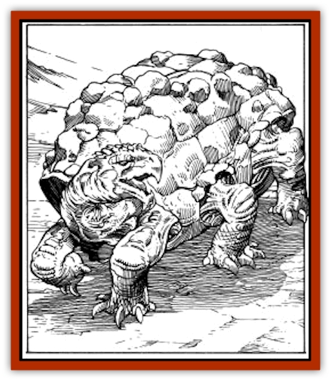

# Flailer

| Statistic | **Flailer** |
| --- | --- |
| **Activity Cycle:** | Any |
| **Alignment:** | Neutral |
| **Armor Class:** | 1 |
| **Climate/Terrain:** | Stony barrens |
| **Damage/Attack:** | 1-4/1-4/1-8/1-6/1-6 |
| **Diet:** | Carnivore |
| **Frequency:** | Rare |
| **Hit Dice:** | 9+9 |
| **Intelligence:** | Average (8-10) |
| **Magic Resistance:** | Nil |
| **Morale:** | Elite (13-14) |
| **Movement:** | 9 |
| **No. Appearing:** | 1 |
| **No. of Attacks:** | 5 |
| **Organization:** | Solitary |
| **Size:** | S (4' long) |
| **Special Attacks:** | Surprise, back attack |
| **Special Defenses:** | Nil |
| **THAC0:** | 11 |
| **Treasure:** | Nil |
| **XP Value:** | 2,000 |

**Psionics Summary**

| Level | Dis/Sci/Dev | Attack/Defense | Score | PSPs |
| --- | --- | --- | --- | --- |
| 7 | 3/5/13 | MT,EW,PB/TS,MB,M-,TW | 13 | 120 |

**Clairsentience -** *Science:* aura sight; *Devotions:* combat mind, danger sense, all-round vision.

**Psychometabolism -** *Science:* shadow form; *Devotions:* body equilibrium, chameleon power, double pain.

**Telepathy -** *Sciences:* tower of iron will, psionic blast, probe; *Devotions:* mind thrust, ego whip, thought shield, mental barrier, mind blank, inflict pain, contact.

Flailers are solitary creatures that live in the rocky terrain near the tablelands of Athas. To frequent travelers of these areas, flailers serve as a constant reminder of the harsh dangers of life on Athas.

Flailers are similar is shape to giant tortoises, but sport six legs instead of four. These limbs are often concealed beneath their large, hardened torsos. The shell of a flailer is similar in color and texture to that of most rocky terrains, allowing them to appear as stones or rocks until they strike. Typical flailers grow up to four feet in length.

**Combat:** Flailers generally wait until suitable prey approaches close enough to be attacked. Because of their natural camouflage, flailers often surprise their victims, resulting in a -3 penalty to an opponent's surprise roll. A flailer will usually wait for its victim to pass by so that it may attack from behind, gaining a +2 to its attack roll.

When they attack, flailers do so with their two frontal limbs, followed by their bite, and then by their two middle limbs. The forward most limbs do 1d4 points of damage each. The bite of a flailer does 1d8 points, while their middle limbs do 1d6 points. The hard, tortoise-like shell of a flailer provides excellent defense against attacks (AC 1), but the underside of the creature is softer and more vulnerable (AC 4). Hitting the underside of a flailer is very difficult and requires a called shot (see page 58 of the *Dungeon Master Guide*), unless it has been turned over onto its back.

In addition to its limb and bite attacks, flailers also boast powerful psionic abilities. Instead of using its normal attacks, a flailer can choose to attack using its psionic powers, one at a time, just the same as any other psionic creature. Like many psionic creatures of Athas, flailers also have natural psionic defense modes, which are considered always "on". Even when making a physical attack, a flailer's defense modes can be used, so long as it has sufficient PSPs to power the modes used.

**Habitat/Society:** When not waiting for a victim, flailers live in small caves and crevices characteristic of the rocky terrains of Athas. Flailers feed on nearly any animal, ranging from small rodents to large mammals, such as humans and demi-humans. After a victim has been killed, a flailer will often bring the carcass to its lair where it can enjoy its meal.

Born in litters of four to six young, flailers remain with their sire for a period of up to one year. Their solitary existence begins after this first year and ends only when the creatures are near death. At this time, adult flailers seek out mates and bear offspring. Adult male flailers die naturally soon after their yearlong sojourn with the offspring; the females are devoured by the young immediately after giving birth.

**Ecology:** The hard shell of flailers is unsuitable for purposes of making armor due to its unusual shape and texture. However, Athasian weaponsmiths have been able to use it to form small-bladed weapons such as dirks, daggers, and arrowheads, as well as small, buckler-sized shields.

---
## Discovery & Documentation

**Source Publication:** MC12 Dark Sun Appendix I - Terrors of the Desert (1991)
**Campaign Setting:** Dark Sun
**Author(s):** Tom Prusa, Louis J. Prosperi, Walter M. Baas

### Other Creatures Found in This Source Book
   * [[Animal_Herd_Athas|Animal, Herd (Athas)]]
   * [[Animal_Household_Athas|Animal, Household (Athas)]]
   * [[Antloid_Desert|Antloid, Desert]]
   * [[Banshee_Dwarf|Banshee, Dwarf]]
   * [[Beetle_Agony|Beetle, Agony]]
   * [[Bog_Wader|Bog Wader]]
   * [[Brambleweed|Brambleweed]]
   * [[B'rohg|B'rohg]]
   * [[Burnflower|Burnflower]]
   * [[Cat_Psionic|Cat, Psionic]]
   * [[Cha'thrang|Cha'thrang]]
   * [[Cistern_Fiend|Cistern Fiend]]
   * [[Clam_Giant|Clam, Giant]]
   * [[Cloud_Ray|Cloud Ray]]
   * [[Drake_Athas_Air|Drake (Athas), Air]]
   * [[Drake_Athas_Earth|Drake (Athas), Earth]]
   * [[Drake_Athas_Fire|Drake (Athas), Fire]]
   * [[Drake_Athas_Water|Drake (Athas), Water]]
   * [[Dune_Runner|Dune Runner]]
   * [[Dune_Trapper|Dune Trapper]]
   * [[Elemental_Athas_Greater_Air|Elemental (Athas), Greater, Air]]
   * [[Elemental_Athas_Greater_Earth|Elemental (Athas), Greater, Earth]]
   * [[Elemental_Athas_Greater_Fire|Elemental (Athas), Greater, Fire]]
   * [[Elemental_Athas_Greater_Water|Elemental (Athas), Greater, Water]]
   * [[Elemental_Athas_Lesser_Air_Earth|Elemental (Athas), Lesser, Air/Earth]]
   * [[Elemental_Athas_Lesser_Fire_Water|Elemental (Athas), Lesser, Fire/Water]]
   * [[Elemental_Athas_General_Information|Elemental (Athas), General Information]]
   * [[Erdland|Erdland]]
   * [[Esperweed|Esperweed]]
   * [[Floater|Floater]]
   * [[Giant_Athas|Giant (Athas)]]
   * [[Golem_Athas_I|Golem (Athas) I]]
   * [[Golem_Athas_II|Golem (Athas) II]]
   * [[Golem_Athas_III|Golem (Athas) III]]
   * [[Golem_Athas_General_Information|Golem (Athas), General Information]]
   * [[Halfling_Renegade|Halfling, Renegade]]
   * [[Hej-kin|Hej-kin]]
   * [[Id_Fiend|Id Fiend]]
   * [[Insect_Swarm_Athas|Insect Swarm (Athas)]]
   * [[Kank_Wild|Kank, Wild]]
   * [[Kirre|Kirre]]
   * [[Megapede|Megapede]]
   * [[Mul_Wild|Mul, Wild]]
   * [[Nightmare_Beast|Nightmare Beast]]
   * [[Plant_Carnivorous_Athas|Plant, Carnivorous (Athas)]]
   * [[Pterran|Pterran]]
   * [[Pterrax|Pterrax]]
   * [[Pulp_Bee|Pulp Bee]]
   * [[Pyreen|Pyreen]]
   * [[Rasclinn|Rasclinn]]
   * [[Razorwing|Razorwing]]
   * [[Roc_Athas|Roc (Athas)]]
   * [[Sand_Bride|Sand Bride]]
   * [[Sand_Cactus|Sand Cactus]]
   * [[Sand_Vortex|Sand Vortex]]
   * [[Scrab|Scrab]]
   * [[Silt_Horror|Silt Horror]]
   * [[Silt_Runner|Silt Runner]]
   * [[Sink_Worm|Sink Worm]]
   * [[Sloth_Athas|Sloth (Athas)]]
   * [[So-ut|So-ut]]
   * [[Spider_Cactus|Spider Cactus]]
   * [[Spider_Crystal|Spider, Crystal]]
   * [[Spirit_of_the_Land|Spirit of the Land]]
   * [[T'Chowb|T'Chowb]]
   * [[Thrax|Thrax]]
   * [[Tohr-kreen_I|Tohr-kreen I]]
   * [[Villichi|Villichi]]
   * [[Zhackal|Zhackal]]
   * [[Zombie_Plant|Zombie Plant]]
