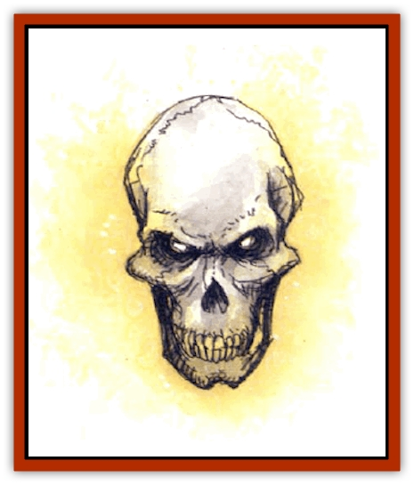

# Flame Skull

| Statistic | **Flame Skull** |
| --- | --- |
| **Activity Cycle:** | Any |
| **Alignment:** | Lawful evil |
| **Armor Class:** | 3 |
| **Climate/Terrain:** | Any land |
| **Damage/Attack:** | 2d4 (&times;2) |
| **Diet:** | Nil |
| **Frequency:** | Rare |
| **Hit Dice:** | 4+4 |
| **Intelligence:** | As in life (usually 8-16) |
| **Magic Resistance:** | 88% |
| **Morale:** | Elite (13-14) |
| **Movement:** | Fl 21 (A) |
| **No. Appearing:** | 1 (or, very rarely, 1d6) |
| **No. of Attacks:** | 2 plus special |
| **Organization:** | Solitary or small groups |
| **Size:** | S (about 1' diameter) |
| **Special Attacks:** | Spells |
| **Special Defenses:** | Regeneration, spell immunity |
| **THAC0:** | 15 |
| **Treasure:** | Any |
| **XP Value:** | 2,000 |

Flameskulls are rare undead guardian creatures. These magically powered flying skulls are fashioned from human heads soon after their owners' deaths.

Flameskulls can speak Common and up to 14 other languages that they knew in life.

**Combat:** Flameskulls use their voices to lure intruders into traps or deceive them about the presence of other dangers. They can spew fire from their mouths twice per round, in straight gouts up to 10 feet long.

If enchanted to do so at the time of their making, each can also cast one spell per round, by verbal means only. Most flameskulls cast *magic missile* or *flame strike* spells; none can use mind-control spells. Most flameskulls can cast up to three different spells, and almost all flameskulls cast their attack spells every second round. On the rounds between, they utter a single-segment, verbal-only incantation now lost to most spellcasters: *spell reflection*, which returns any and all cast spells reaching the flameskull in that round back on the caster(s). If the spells inflict damage, the casters suffer normal damage; if not, they are merely negated.

Flameskulls cannot be affected by mind-control spells like *charm person*, or by *sleep*, *hold*, and other spells to which undead are immune. Neither are they affected by cold, fire, or heat-related magical attacks, or by electrical (lightning) attacks. Their high magic resistance often protects them against spells they fail to reflect back at their casters. Flameskulls are turned as liches and may be struck by any sort of weapon.

These creatures regenerate 1 hp per round and reassemble even after being shattered unless a *dispel magic*, *exorcise*, or *remove curse* spell is cast on their remains, or the majority of their bone fragments are doused with holy water.

Flameskulls fly about trailing little jets of flame. They move in complete silence unless uttering spells or screaming for effect.

**Habitat/Society:** Flameskulls do not reproduce, nor have they any purpose in life beyond the guardianship for which they were created. Though they retain their intelligence, they often go insane from sheer boredom and may, if the DM wishes, exhibit erratic behavior. They always want to be entertained, and if freed from their guardianship by the destruction or pilferage of whatever they were set to guards they do not hurl themselves to attack to achieve their own destruction. Instead, they try to follow or accompany the being(s) who freed them from guardianship. Typically they float along, just out of reach, making smart comments and wanting to see everything interesting that is going on (including secret meetings, seductions, magical research, and other private matters). Flameskulls are utterly lonely and act accordingly.

**Ecology:** Flameskulls fill no niche in the ecology. They are studied by alchemists, priests, and wizards whenever possible in an effort to duplicate their powers or the means of their making (so far without reported success), or to find special properties that their flames might possess.

---
## Discovery & Documentation

**Source Publication:** Monstrous Compendium, 1994 Annual, Volume 1 (1995)
**Campaign Setting:** Advanced Dungeons & Dragons 2nd Edition
**Author(s):** David Wise

### Other Creatures Found in This Source Book
   * [[Abyss_Ant|Abyss Ant]]
   * [[Achaierai|Achaierai]]
   * [[Afanc|Afanc]]
   * [[Al-Jahar|Al-Jahar]]
   * [[Baelnorn|Baelnorn]]
   * [[Baneguard|Baneguard]]
   * [[Banelar|Banelar]]
   * [[Bird_Talking|Bird, Talking]]
   * [[Blazing_Bones|Blazing Bones]]
   * [[Campestri|Campestri]]
   * [[Caniquine|Caniquine]]
   * [[Cat_Winged|Cat, Winged]]
   * [[Crypt_Servant|Crypt Servant]]
   * [[Death's_Head_Tree|Death's Head Tree]]
   * [[Dog_Saluqi|Dog, Saluqi]]
   * [[Dragon_Electrum|Dragon, Electrum]]
   * [[Dragon_Fang|Dragon, Fang]]
   * [[Dragon_Linnorm_Corpse_Tearer|Dragon, Linnorm, Corpse Tearer]]
   * [[Dragon_Linnorm_Dread|Dragon, Linnorm, Dread]]
   * [[Dragon_Linnorm_Flame|Dragon, Linnorm, Flame]]
   * [[Dragon_Linnorm_Forest|Dragon, Linnorm, Forest]]
   * [[Dragon_Linnorm_Frost|Dragon, Linnorm, Frost]]
   * [[Dragon_Linnorm_Gray|Dragon, Linnorm, Gray]]
   * [[Dragon_Linnorm_Land|Dragon, Linnorm, Land]]
   * [[Dragon_Linnorm_Midgard|Dragon, Linnorm, Midgard]]
   * [[Dragon_Linnorm_Rain|Dragon, Linnorm, Rain]]
   * [[Dragon_Linnorm_Sea|Dragon, Linnorm, Sea]]
   * [[Dragon_Neutral_Jacinth|Dragon, Neutral, Jacinth]]
   * [[Dragon_Neutral_Jade|Dragon, Neutral, Jade]]
   * [[Dragon_Neutral_Pearl|Dragon, Neutral, Pearl]]
   * [[Dread|Dread]]
   * [[Dragon-kin|Dragon-kin]]
   * [[Elemental_Earth_Kin_Chrysmal|Elemental, Earth Kin, Chrysmal]]
   * [[Elemental_Earth_Kin_Earth_Weird|Elemental, Earth Kin, Earth Weird]]
   * [[Elemental_Fire_Kin_Azer|Elemental, Fire Kin, Azer]]
   * [[Elemental_Sandman|Elemental, Sandman]]
   * [[Elemental_Wind_Walker|Elemental, Wind Walker]]
   * [[Elemental_Vermin|Elemental Vermin]]
   * [[Feystag|Feystag]]
   * [[Foulwing|Foulwing]]
   * [[Gambado|Gambado]]
   * [[Garbug|Garbug]]
   * [[Genie_Tasked_Administrator|Genie, Tasked, Administrator]]
   * [[Genie_Tasked_Deceiver|Genie, Tasked, Deceiver]]
   * [[Genie_Tasked_Harim_Servant|Genie, Tasked, Harim Servant]]
   * [[Genie_Tasked_Messenger|Genie, Tasked, Messenger]]
   * [[Genie_Tasked_Miner|Genie, Tasked, Miner]]
   * [[Genie_Tasked_Oathbinder|Genie, Tasked, Oathbinder]]
   * [[Gibbering_Mouther|Gibbering Mouther]]
   * [[Gnasher|Gnasher]]
   * [[Gnasher_Winged|Gnasher, Winged]]
   * [[Golem_Brain|Golem, Brain]]
   * [[Golem_Hammer|Golem, Hammer]]
   * [[Golem_Metagolem|Golem, Metagolem]]
   * [[Golem_Spiderstone|Golem, Spiderstone]]
   * [[Gorynych|Gorynych]]
   * [[Greelox|Greelox]]
   * [[Helmed_Horror|Helmed Horror]]
   * [[Jarbo|Jarbo]]
   * [[Laraken|Laraken]]
   * [[Lich_Psionic|Lich, Psionic]]
   * [[Living_Steel|Living Steel]]
   * [[Lock_Lurker|Lock Lurker]]
   * [[Loxo|Loxo]]
   * [[Lycanthrope_Loup_de_Noir|Lycanthrope, Loup de Noir]]
   * [[Lycanthrope_Werebadger|Lycanthrope, Werebadger]]
   * [[Lycanthrope_Werejaguar|Lycanthrope, Werejaguar]]
   * [[Lythlyx|Lythlyx]]
   * [[Magebane|Magebane]]
   * [[Marrashi|Marrashi]]
   * [[Metalmaster|Metalmaster]]
   * [[Mimic_House_Hunter|Mimic, House Hunter]]
   * [[Naga_Bone|Naga, Bone]]
   * [[Nautilus_Giant|Nautilus, Giant]]
   * [[Nightshade_Toril|Nightshade (Toril)]]
   * [[Nishruu|Nishruu]]
   * [[Noran|Noran]]
   * [[Opinicus|Opinicus]]
   * [[Ormyrr|Ormyrr]]
   * [[Parasite|Parasite]]
   * [[Pasari-Niml|Pasari-Niml]]
   * [[Plant_Vampire_Moss|Plant, Vampire Moss]]
   * [[Pteraman|Pteraman]]
   * [[Rautym|Rautym]]
   * [[Shadeling|Shadeling]]
   * [[Skum|Skum]]
   * [[Snake_Giant_Cobra|Snake, Giant Cobra]]
   * [[Snake_Stone|Snake, Stone]]
   * [[Spectral_Wizard|Spectral Wizard]]
   * [[Spell_Weaver|Spell Weaver]]
   * [[Spider_Brain|Spider, Brain]]
   * [[Suwyze|Suwyze]]
   * [[Tatalla|Tatalla]]
   * [[Tick_Heart|Tick, Heart]]
   * [[Tree_Dark|Tree, Dark]]
   * [[Tree_Singing|Tree, Singing]]
   * [[Tressym|Tressym]]
   * [[Troll_Snow|Troll, Snow]]
   * [[Tuyewera|Tuyewera]]
   * [[Ulitharid|Ulitharid]]
   * [[Undead_Dwarf|Undead Dwarf]]
   * [[Undead_Lake_Monster|Undead Lake Monster]]
   * [[Whipsting|Whipsting]]
   * [[Windghost|Windghost]]
   * [[Wolf_Dread|Wolf, Dread]]
   * [[Wolf_Stone|Wolf, Stone]]
   * [[Wolf_Vampiric|Wolf, Vampiric]]
   * [[Wraith_Shimmering|Wraith, Shimmering]]
   * [[Xantravar|Xantravar]]
   * [[Xaver|Xaver]]
