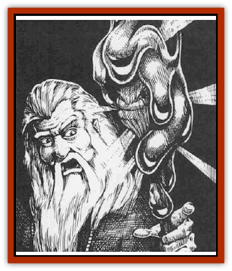

# Flareater

| Statistic | **Flareater** |
| --- | --- |
| **Activity Cycle:** | Any |
| **Alignment:** | Neutral |
| **Armor Class:** | 0 |
| **Climate/Terrain:** | Subterranean |
| **Damage/Attack:** | 3d4 |
| **Diet:** | Omnivorous |
| **Frequency:** | Very rare |
| **Hit Dice:** | 6 to 12 (see below) |
| **Intelligence:** | Average (8-10) |
| **Magic Resistance:** | Special |
| **Morale:** | Elite (13-14) |
| **Movement:** | 15 |
| **No. Appearing:** | 1-4 |
| **No. of Attacks:** | 1 |
| **Organization:** | Solitary |
| **Size:** | M (6' wide) |
| **Special Attacks:** | Surprise, dissolve, HD growth |
| **Special Defenses:** | Immune to heat and flame |
| **THAC0:** | 6 HD: 15 / 7 HD: 13 / 9 HD: 11 / 11 HD: 9 |
| **Treasure:** | Nil |
| **XP Value:** | 1,400-2,400 |

Flareaters, some of the most deadly underground denizens, appear to be related to [[Ooze_Slime_Jelly_II|green slime]] - they may be green slime altered into new forms and given intelligence by magical experiments. Though actually deep emerald green, flareaters' glossy hides seem almost black in the dark dungeons. A single flareater rarely exceeds 6 feet across, and they are no more than three inches thick. They are unnaturally warm to the touch. Flareaters thrive in damp, subterranean places, where they ooze freely over all surfaces. Intelligent, organized, methodical, and eternally hungry, they ever search for their favorite food source - light.

Its fluid nature allows the creature to move at a surprisingly quick rate compared to other slimes and jellies. Like running water, it can overtake its quarry. Those who witness flareaters say their movement is unnerving, like watching dark, evil water flowing over stone walls.

Flareaters have no verbal language. It is believed they communicate with each other by sending pulsating ripples through their forms.

**Combat:** Like green slime, flareaters can drop onto their victims; such victims receive a -3 to surprise rolls. However, flareaters might also follow their intended targets, running like water along a cavern floor or ceiling while gauging their foes' strength and determining the best initial targets.

Flareaters adhere to flesh, and dissolve that flesh into their own systems in 2d8 melee rounds (no saving throw). Flareaters can eat through one inch of metal in 4 melee rounds; magical bonuses delay this process, adding 1 round per magical plus of the metal. They also dissolve one inch of wood in 6 melee rounds, and one inch of leather or leather-like substances in 8 melee rounds, again adding 1 round per magical plus of the material. Unlike green slime, flareaters cannot easily be removed by scraping with metal, wood, or leather scrapers; the creature will attempt to dissolve any such item. Flareaters will flow over a victim, probing weak spots in armor or clothing; they are smart enough to attack bare flesh first, ensuring at other items remain for later consumption.

If a flareater's target is carrying a light source, the creature rakes a different combat tactic. The creature moves over a light and drops down on it, smothering the torch or lantern; it is not harmed by flames. For each nonmagical light source a flareater engulfs, it gains 1 Hit Die. Flareaters also devour magical light by moving into the area of effect, absorbing the magical light, and cancelling its effects. Flareaters are immune to damage from all light-, fire-, and heat-related spells, including *fireballs*, *Melf's minute meteors*, *flame strike*, and others. Cold-based spells paralyze them for 2d4 rounds. The following spells aid the creature's growth by 1 Hit Die per spell absorbed or cast at it: *dancing lights*, *glitterdust*, *faerie fire*, and *moonbeam*. *Light*, *continual light*, and *sunray* cause it to grow by 2 Hit Dice. THAC0 adjusts to the creature's current Hit Dice totals.

When the monster reaches 12 Hit Dice, it splits in two, creating two 6 HD creatures. The division process takes 4 full rounds; once the process begins, it cannot be halted. If the original flareater is damaged during this time, simply divide its total hit points between its two offspring.

**Habitat/Society:** Flareaters exist solely to eat and increase their numbers. They live in damp, underground caverns, though drawn to light for food. Some sages suspect flareaters could evaporate with long exposure to full sunlight, their fluid bodies being better suited for the damp atmosphere and darkness of the caverns.

A maximum of four flareaters might be encountered living together. Flareaters tend to limit their numbers in one area to ensure proper amounts of food for each individual creature.

All flareaters are asexual. They produce by division, like an amoeba, when special conditions are met. This is explained in the Combat section.

**Ecology:** Wizards have been known to hunt flareaters in the hopes that the creatures' remains (or a live specimen) can be used as components in spells like *create darkness* and *shapechange*, and potions that grant immunity to fire. It is rumored that large colonies of flareaters exist deep underground.

---
## Discovery & Documentation

**Source Publication:** Monstrous Compendium, 1995 Annual, Volume 2 (1995)
**Campaign Setting:** Advanced Dungeons & Dragons 2nd Edition
**Author(s):** Jon Pickens

### Other Creatures Found in This Source Book
   * [[Aboleth_Savant|Aboleth, Savant]]
   * [[Addazahr|Addazahr]]
   * [[Amiq_Rasol|Amiq Rasol]]
   * [[Arch-Shadow|Arch-Shadow]]
   * [[Automaton_Scaladar|Automaton, Scaladar]]
   * [[Automaton_Trobriand's|Automaton, Trobriand's]]
   * [[Bat_Sporebat|Bat, Sporebat]]
   * [[Beetle_Dragon|Beetle, Dragon]]
   * [[Bi-nou|Bi-nou]]
   * [[Boggle|Boggle]]
   * [[Brownie_Dobie|Brownie, Dobie]]
   * [[Brownie_Quickling|Brownie, Quickling]]
   * [[Cat_Crypt|Cat, Crypt]]
   * [[Cat_Great_Cath_Shee|Cat, Great, Cath Shee]]
   * [[Centaur-kin_Dorvesh|Centaur-kin, Dorvesh]]
   * [[Centaur-kin_Gnoat|Centaur-kin, Gnoat]]
   * [[Centaur-kin_Ha'pony|Centaur-kin, Ha'pony]]
   * [[Centaur-kin_Zebranaur|Centaur-kin, Zebranaur]]
   * [[Chronolily|Chronolily]]
   * [[Curst|Curst]]
   * [[Darktentacles|Darktentacles]]
   * [[Dinosaur_Aquatic|Dinosaur, Aquatic]]
   * [[Dinosaur_II|Dinosaur II]]
   * [[Dinosaur_III|Dinosaur III]]
   * [[Doppelganger_Greater|Doppelganger, Greater]]
   * [[Dragon_Brine|Dragon, Brine]]
   * [[Dragon_Half-|Dragon, Half-]]
   * [[Dragon-kin_Sea_Wyrm|Dragon-kin, Sea Wyrm]]
   * [[Dwarf_Wild|Dwarf, Wild]]
   * [[Ekimmu|Ekimmu]]
   * [[Elemental_Nature|Elemental, Nature]]
   * [[Elf_Winged|Elf, Winged]]
   * [[Fish_Great_Glacier|Fish (Great Glacier)]]
   * [[Fish_Subterranean|Fish, Subterranean]]
   * [[Fish_Toril|Fish (Toril)]]
   * [[Flumph|Flumph]]
   * [[Froghemoth|Froghemoth]]
   * [[Ghost_Casurua|Ghost, Casurua]]
   * [[Ghost_Ker|Ghost, Ker]]
   * [[Ghul|Ghul]]
   * [[Ghul-Kin|Ghul-Kin]]
   * [[Giant_Half-giant|Giant, Half-giant]]
   * [[Golem_Burning_Man|Golem, Burning Man]]
   * [[Golem_Phantom_Flyer|Golem, Phantom Flyer]]
   * [[Gulguthhydra|Gulguthhydra]]
   * [[Hakeashar|Hakeashar]]
   * [[Horse_Moon-|Horse, Moon-]]
   * [[Human_Dragonslayer|Human, Dragonslayer]]
   * [[Human_Vistana|Human, Vistana]]
   * [[Jellyfish_Giant|Jellyfish, Giant]]
   * [[Kalin|Kalin]]
   * [[Kholiathra|Kholiathra]]
   * [[Laerti|Laerti]]
   * [[Leucrotta_Greater|Leucrotta, Greater]]
   * [[Lich_Suel|Lich, Suel]]
   * [[Lurker_Shadow|Lurker, Shadow]]
   * [[Lycanthrope_Werepanther|Lycanthrope, Werepanther]]
   * [[Lycanthrope_Wereshark|Lycanthrope, Wereshark]]
   * [[Mammal_Herd_II|Mammal, Herd II]]
   * [[Marl|Marl]]
   * [[Meenlock|Meenlock]]
   * [[Mimic_Greater|Mimic, Greater]]
   * [[Mold_II|Mold II]]
   * [[Mummy_Creature|Mummy, Creature]]
   * [[Nyth|Nyth]]
   * [[Ooze_Slime_Jelly_Ghaunadan|Ooze/Slime/Jelly, Ghaunadan]]
   * [[Palimpsest|Palimpsest]]
   * [[Peltast|Peltast]]
   * [[Plant_Dangerous_II|Plant, Dangerous II]]
   * [[Pleistocene_Animal|Pleistocene Animal]]
   * [[Pudding_Subterranean|Pudding, Subterranean]]
   * [[Raggamoffyn|Raggamoffyn]]
   * [[Snake_Serpent|Snake, Serpent]]
   * [[Snake_Serpent_Vine|Snake, Serpent Vine]]
   * [[Sphinx_Draco-|Sphinx, Draco-]]
   * [[Sprite_Seelie_Faerie|Sprite, Seelie Faerie]]
   * [[Sprite_Unseelie_Faerie|Sprite, Unseelie Faerie]]
   * [[Squealer|Squealer]]
   * [[Turtle_Giant|Turtle, Giant]]
   * [[Umpleby|Umpleby]]
   * [[Vizier's_Turban|Vizier's Turban]]
   * [[Wall_Walker|Wall Walker]]
   * [[Webbird|Webbird]]
   * [[Yak-Man|Yak-Man]]
   * [[Zorbo|Zorbo]]
