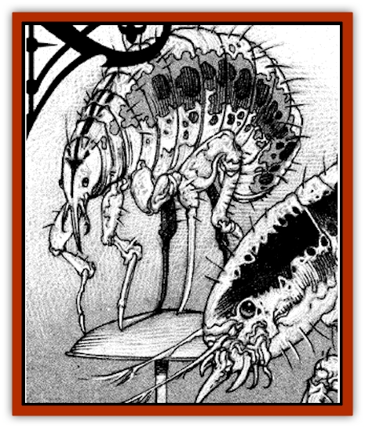

# Fleas of Madness

| Statistic | **Fleas of Madness** |
| --- | --- |
| **Activity Cycle:** | Any |
| **Alignment:** | Neutral |
| **Armor Class:** | N/A |
| **Climate/Terrain:** | Temperate or tropical lands |
| **Damage/Attack:** | Special |
| **Diet:** | Blood |
| **Frequency:** | Rare |
| **Hit Dice:** | N/A |
| **Intelligence:** | Non- (0) |
| **Magic Resistance:** | Nil |
| **Morale:** | Nil |
| **Movement:** | 3 |
| **No. Appearing:** | Hundreds |
| **No. of Attacks:** | See below |
| **Organization:** | Infestation |
| **Size:** | T |
| **Special Attacks:** | Madness |
| **Special Defenses:** | Nil |
| **THAC0:** | See below |
| **Treasure:** | Nil |
| **XP Value:** | 270 per infestation |

While the normal flea is a parasitic pest that has plagued mankind since the dawn of time, its Ravenloft cousin is a terrible curse. By comparison. the mundane flea is a blessing.

Fleas of madness resemble any other flea: tiny (smaller than a grain of rice), black, and difficult to get rid of once an infestation has occurred. Like normal fleas, they feed on blood and usually reside with in the fur or hair of mammals. They transfer themselves from one creature to the next by leaping to any new host who touches the fur or hair of the original. They also lurk in carpets and bedding, where they can go without food for several days while waiting for a new host to infest.

As one might expect, these minute creatures have no ability to communicate.

**Combat:** The bite of a flea of madness is almost insignificant. The victim may feel a slight sting and afterward develop a small red welt, but other wise takes no real damage. The danger lies not in the bite, but in the magical disease these fleas carry.

For each hour (or portion thereof) spent in an infested area (or in the company of an infested creature), there is a 75% chance of suffering 1d4 flea bites. Each bite has a 25% chance of immediately causing the victim to experience effects similar to either the 2nd level wizard spell *Tahsa's uncontrollable hideous laughter* or the 8th level wizard spell *Otto's irresistible dance*.

In addition, the victim must make a saving throw vs. poison for each bite suffered. Failure of any saving throw means the victim slips into madness over a period of 1d4 days.

If the victim is an animal (or is only semi-intelligent), the madness takes the form of simple delusions. The animal believes itself to be some other creature with which it is already familiar. Alternatively, an animal may believe itself to be human and may attempt to walk about on its hind legs and perform many of the activities humans do.

If the victim is a human, hallucinations result. A victim might see a setting different from the one that actually exists (for exampie, a jungle as opposed to a stone corridor), might see fellow humans as monsters, or might see creatures or items that do not actually exist. Erratic, inexplicable behavior results.

Note: Once madness has set in, the victim no longer needs to make additional saving throws vs. poison, as no intensification of the madness takes place. The victim is, however, still susceptible to the effects of *Tasha's uncontrollable hideous laughter* and *Otto's irresistible dance* with subsequent flea bites.

The madness caused by the fleas can be cured by magical means. Effective wizard spells include *limited wish* and *wish*; effective priest spells include *cure disease*, *heal*, *heroes' feast*, and *restoration*. The psionic science psychic surgery can also be uses to cure madness.

Once the victim is cured, however, there is a good chance that the madness will recur with further flea bites. The only way to ensure safety is to deal with the infestation itself. Wizards might act as exterminators, using such spells as *stinking cloud*, *cloudkill*, or *deathfog* to fumigate a building. Priests can use the spells *anti-vermin barrier* or *repel insects* to cleanse an individual. Psionicists can offer similar protection with an inertial barrier devotion. The spell-like effects of the flea bites (magical laughter and dancing) can be eliminated with a *dispel magic* spell.

**Habitat/Society:** Fleas of madness are insects that are unique to the Demiplane of Dread. They appear in scattered locations throughout the Ravenloft world, infesting one area for a summer, then dying out in the winter months and reappearing somewhere else the next summer. On occasion, they are carried indoors during winter by household pets or vermin. When this happens, individual households or towns might be afflicted with the madness the fleas carry, while neighbors are not.

**Ecology:** There is much speculation as to how fleas of madness originated. Those who study science say these are ordinary fleas that carry a disease and believe there might be a natural plant or chemical substance that can counteract the madness the fleas induce. Others point to the fact that two of the effects produced by the fleas resemble wizard spells, and believe the fleas of madness have a magical origin. They speculate that the fleas may be the result of a wizard whose curse tainted a *summon swarm* spell. Still other sages speculate that the fleas might be the work of an evil priest who combined a *summon insects* or an *insect plague* spell with the madness-inducing spell *mindshatter*.

---
## Discovery & Documentation

**Source Publication:** Ravenloft Appendix III (1991)
**Campaign Setting:** Ravenloft
**Author(s):** Kirk Botulla

### Other Creatures Found in This Source Book
   * [[Akikage|Akikage]]
   * [[Animator_Common|Animator, Common]]
   * [[Animator_Greater|Animator, Greater]]
   * [[Animator_Minor|Animator, Minor]]
   * [[Animator_General_Information|Animator, General Information]]
   * [[Bakhna_Rakhna|Bakhna Rakhna]]
   * [[Baobhan_Sith|Baobhan Sith]]
   * [[Beetle_Scarab|Beetle, Scarab]]
   * [[Boneless|Boneless]]
   * [[Boowray|Boowray]]
   * [[Bruja|Bruja]]
   * [[Carrionette|Carrionette]]
   * [[Carrion_Stalker|Carrion Stalker]]
   * [[Cat_Midnight|Cat, Midnight]]
   * [[Cat_Skeletal|Cat, Skeletal]]
   * [[Cloaker_Resplendent|Cloaker, Resplendent]]
   * [[Cloaker_Shadow|Cloaker, Shadow]]
   * [[Cloaker_Undead|Cloaker, Undead]]
   * [[Corpse_Candle|Corpse Candle]]
   * [[Death's_Head_Tree|Death's Head Tree]]
   * [[Doppelganger_Ravenloft|Doppelganger (Ravenloft)]]
   * [[Familiar_Pseudo-|Familiar, Pseudo-]]
   * [[Familiar_Undead|Familiar, Undead]]
   * [[Feathered_Serpent|Feathered Serpent]]
   * [[Fenhound|Fenhound]]
   * [[Figurine_Ceramic|Figurine, Ceramic]]
   * [[Figurine_Crystal|Figurine, Crystal]]
   * [[Figurine_Ivory|Figurine, Ivory]]
   * [[Figurine_Obsidian|Figurine, Obsidian]]
   * [[Figurine_Porcelain|Figurine, Porcelain]]
   * [[Figurine_General_Information|Figurine, General Information]]
   * [[Furies|Furies]]
   * [[Geist|Geist]]
   * [[Ghost_Animal|Ghost, Animal]]
   * [[Golem_Flesh_Ravenloft|Golem, Flesh (Ravenloft)]]
   * [[Golem_Mist_Ravenloft|Golem, Mist (Ravenloft)]]
   * [[Golem_Wax_Ravenloft|Golem, Wax (Ravenloft)]]
   * [[Gremishka|Gremishka]]
   * [[Hag_Spectral|Hag, Spectral]]
   * [[Head_Hunter|Head Hunter]]
   * [[Hearth_Fiend|Hearth Fiend]]
   * [[Hebi-No-Onna|Hebi-No-Onna]]
   * [[Hound_Phantom|Hound, Phantom]]
   * [[Hound_Skeletal|Hound, Skeletal]]
   * [[Imp_Wishing|Imp, Wishing]]
   * [[Ivy_Crawling|Ivy, Crawling]]
   * [[Jack_Frost|Jack Frost]]
   * [[Jolly_Roger|Jolly Roger]]
   * [[Kizoku|Kizoku]]
   * [[Lashweed|Lashweed]]
   * [[Leech_Magical|Leech, Magical]]
   * [[Leech_Psionic|Leech, Psionic]]
   * [[Lich_Defiler|Lich, Defiler]]
   * [[Lich_Drow|Lich, Drow]]
   * [[Lich_Elemental|Lich, Elemental]]
   * [[Lich_Psionic|Lich, Psionic]]
   * [[Living_Tattoo|Living Tattoo]]
   * [[Lycanthrope_Loup-garou|Lycanthrope, Loup-garou]]
   * [[Lycanthrope_Werejackal|Lycanthrope, Werejackal]]
   * [[Lycanthrope_Werejaguar_Ravenloft|Lycanthrope, Werejaguar (Ravenloft)]]
   * [[Lycanthrope_Wereleopard|Lycanthrope, Wereleopard]]
   * [[Lycanthrope_Wereray|Lycanthrope, Wereray]]
   * [[Mist_Ferryman|Mist Ferryman]]
   * [[Moor_Man|Moor Man]]
   * [[Obedient|Obedient]]
   * [[Odem|Odem]]
   * [[Paka|Paka]]
   * [[Plant_Blood_Rose|Plant, Blood Rose]]
   * [[Plant_Fearweed|Plant, Fearweed]]
   * [[Radiant_Spirit|Radiant Spirit]]
   * [[Recluse|Recluse]]
   * [[Remnant_Aquatic|Remnant, Aquatic]]
   * [[Rushlight|Rushlight]]
   * [[Sea_Spawn_Master|Sea Spawn, Master]]
   * [[Sea_Spawn_Minion|Sea Spawn, Minion]]
   * [[Shadow_Asp|Shadow Asp]]
   * [[Shattered_Brethren|Shattered Brethren]]
   * [[Skeleton_Archer|Skeleton, Archer]]
   * [[Skeleton_Insectoid|Skeleton, Insectoid]]
   * [[Skin_Thief|Skin Thief]]
   * [[Spirit_Psionic|Spirit, Psionic]]
   * [[Strahd_Skeleton|Strahd Skeleton]]
   * [[Strahd_Zombie|Strahd Zombie]]
   * [[Unicorn_Shadow|Unicorn, Shadow]]
   * [[Vampire_Drow|Vampire, Drow]]
   * [[Vampire_Nosferatu|Vampire, Nosferatu]]
   * [[Vampire_Oriental|Vampire, Oriental]]
   * [[Virus_General_Information|Virus, General Information]]
   * [[Virus_I|Virus I]]
   * [[Virus_II|Virus II]]
   * [[Virus_III|Virus III]]
   * [[Vorlog|Vorlog]]
   * [[Will_O'Dawn|Will O'Dawn]]
   * [[Will_O'Deep|Will O'Deep]]
   * [[Will_O'Mist|Will O'Mist]]
   * [[Will_O'Sea|Will O'Sea]]
   * [[Zombie_Cannibal|Zombie, Cannibal]]
   * [[Zombie_Desert|Zombie, Desert]]
   * [[Zombie_Wolf|Zombie Wolf]]
   * [[Zombie_Fog|Zombie Fog]]
