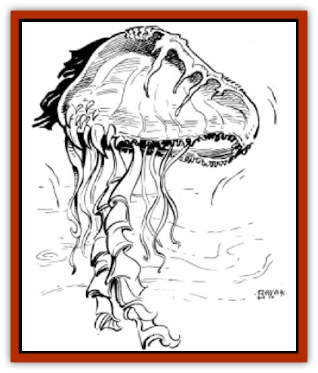

# Floater

| Statistic | **Floater** |
| --- | --- |
| **Activity Cycle:** | Night |
| **Alignment:** | Neutral |
| **Armor Class:** | 8 |
| **Climate/Terrain:** | Sea of Silt |
| **Damage/Attack:** | 1-4/1-4/1-4/1-4/1-4/1-4 |
| **Diet:** | Herbivore |
| **Frequency:** | Common |
| **Hit Dice:** | 3 |
| **Intelligence:** | Low (5-7) |
| **Magic Resistance:** | Nil |
| **Morale:** | Steady (11-12) |
| **Movement:** | Fl 12 (B) |
| **No. Appearing:** | 2-8 (2d4) |
| **No. of Attacks:** | 6 |
| **Organization:** | Flock |
| **Size:** | S (3' long) |
| **Special Attacks:** | Poison |
| **Special Defenses:** | Nil |
| **THAC0:** | 17 |
| **Treasure:** | Nil |
| **XP Value:** | 420 |

**Psionics Summary**

| Level | Dis/Sci/Dev | Attack/Defense | Score | PSPs |
| --- | --- | --- | --- | --- |
| 3 | 2/2/11 | PB,PsC/M-,IF | 12 | 90 |

**Psychometabolism -** *Science:* life draining; *Devotions:* double pain, mind over body, flesh armor, chameleon power, displacement.

**Telepathy -** *Science:* psionic blast; *Devotions:* psionic crush, mind blank, intellect fortress, life detection, aversion, contact.

Floaters are small, aerial, jelly fish that drift above the Sea of Silt. They are often found at the edges of the silt sea, near the mudflats that form its perimeter.

Floaters resemble jelly fish in all ways save that they exist out of water. Their bodies are bulbous and translucent, and have a diameter of about 2 feet. They also sport a large number of poisoned tentacles, up to 3 feet in length. Coloration is the only way by which males and females can be distinguished from each other. Males generally have a reddish tint to them, while females are more often tan or yellowish in tint.

**Combat:** Floaters fly via hydrogen filled gas bladders located on their underside. By expelling small bursts of gas, the creatures are able to propel themselves about, using their bodies and tentacles for navigation. Being herbivores, floaters do not usually engage in combat with other creatures, unless startled or threatened.

When they do engage in combat, floaters are capable opponents. A floater can attack up to six times per round using its tentacles, each doing 1d4 points of damage. Each tentacle attack also injects the victim with a paralytic poison. Those struck by a floater's tentacles must make a saving throw versus paralyzation. Those succeeding suffer no ill effects, but those who fail are paralyzed for 2d6 turns.

Because of their hydrogen gas bladders, floaters are especially susceptible to flame attacks. Any successful flame attack made against a floater does four times normal damage and has a 75% chance of causing the creature to explode into flames. If engaged in melee when it explodes, the floater's opponent suffers 1d8 points of damage. A successful saving through against breath weapon reduces the damage by one half.

Floaters also have psionic abilities that can be used instead of its normal physical attacks. A floater's psionic defense modes are always considered to be "on", meaning that even in rounds during which a floater makes physical attacks, it can use its defense modes, provided it has enough PSPs to power the mode being used.

**Habitat/Society:** Floaters make their homes on the mudflats located at the edges of the Sea of Silt. They often make nests from dead bushes and trees, but occasionally form nests within live trees as well. A nest commonly contains from three to five floaters, with some larger nests having up to eight members. These creatures group in nests for protective purposes, as they are often attacked by [[Razorwing|razorwings]].

Floaters bear their young one at a time. For a period of six months after a birth, the mother will leave the nest for only brief periods of time, and then only to find food for its young. By the time a young floater reaches six months of age it will be on its own, seeking others to nest with.

Floaters survive largely on the ferns and roots that grow in the wetter areas of the mudflats. When a mother gathers food for its young, it will often take leaves and roots of nearby plants, but will occasionally gather berries and seeds from the few fruit-bearing plants that grow on the mudflats.

Floaters also occasionally eat esperweed, boosting their existing psionic powers by five levels as described in the [[Esperweed|esperweed entry]]. Since the effects of esperweed have such a short duration, it is very rare that a group of adventurers will encounter a floater while its psionic abilities are boosted (2% chance per floater).

**Ecology:** Floaters are the favorite prey of razorwings, who make their home beneath the Sea of Silt. Floaters boast no usable by-products, though many researchers have tried to make use of the gas-producing glands of this creature as a source of flammable gas. None have had success.

---
## Discovery & Documentation

**Source Publication:** MC12 Dark Sun Appendix I - Terrors of the Desert (1991)
**Campaign Setting:** Dark Sun
**Author(s):** Tom Prusa, Louis J. Prosperi, Walter M. Baas

### Other Creatures Found in This Source Book
   * [[Animal_Herd_Athas|Animal, Herd (Athas)]]
   * [[Animal_Household_Athas|Animal, Household (Athas)]]
   * [[Antloid_Desert|Antloid, Desert]]
   * [[Banshee_Dwarf|Banshee, Dwarf]]
   * [[Beetle_Agony|Beetle, Agony]]
   * [[Bog_Wader|Bog Wader]]
   * [[Brambleweed|Brambleweed]]
   * [[B'rohg|B'rohg]]
   * [[Burnflower|Burnflower]]
   * [[Cat_Psionic|Cat, Psionic]]
   * [[Cha'thrang|Cha'thrang]]
   * [[Cistern_Fiend|Cistern Fiend]]
   * [[Clam_Giant|Clam, Giant]]
   * [[Cloud_Ray|Cloud Ray]]
   * [[Drake_Athas_Air|Drake (Athas), Air]]
   * [[Drake_Athas_Earth|Drake (Athas), Earth]]
   * [[Drake_Athas_Fire|Drake (Athas), Fire]]
   * [[Drake_Athas_Water|Drake (Athas), Water]]
   * [[Dune_Runner|Dune Runner]]
   * [[Dune_Trapper|Dune Trapper]]
   * [[Elemental_Athas_Greater_Air|Elemental (Athas), Greater, Air]]
   * [[Elemental_Athas_Greater_Earth|Elemental (Athas), Greater, Earth]]
   * [[Elemental_Athas_Greater_Fire|Elemental (Athas), Greater, Fire]]
   * [[Elemental_Athas_Greater_Water|Elemental (Athas), Greater, Water]]
   * [[Elemental_Athas_Lesser_Air_Earth|Elemental (Athas), Lesser, Air/Earth]]
   * [[Elemental_Athas_Lesser_Fire_Water|Elemental (Athas), Lesser, Fire/Water]]
   * [[Elemental_Athas_General_Information|Elemental (Athas), General Information]]
   * [[Erdland|Erdland]]
   * [[Esperweed|Esperweed]]
   * [[Flailer|Flailer]]
   * [[Giant_Athas|Giant (Athas)]]
   * [[Golem_Athas_I|Golem (Athas) I]]
   * [[Golem_Athas_II|Golem (Athas) II]]
   * [[Golem_Athas_III|Golem (Athas) III]]
   * [[Golem_Athas_General_Information|Golem (Athas), General Information]]
   * [[Halfling_Renegade|Halfling, Renegade]]
   * [[Hej-kin|Hej-kin]]
   * [[Id_Fiend|Id Fiend]]
   * [[Insect_Swarm_Athas|Insect Swarm (Athas)]]
   * [[Kank_Wild|Kank, Wild]]
   * [[Kirre|Kirre]]
   * [[Megapede|Megapede]]
   * [[Mul_Wild|Mul, Wild]]
   * [[Nightmare_Beast|Nightmare Beast]]
   * [[Plant_Carnivorous_Athas|Plant, Carnivorous (Athas)]]
   * [[Pterran|Pterran]]
   * [[Pterrax|Pterrax]]
   * [[Pulp_Bee|Pulp Bee]]
   * [[Pyreen|Pyreen]]
   * [[Rasclinn|Rasclinn]]
   * [[Razorwing|Razorwing]]
   * [[Roc_Athas|Roc (Athas)]]
   * [[Sand_Bride|Sand Bride]]
   * [[Sand_Cactus|Sand Cactus]]
   * [[Sand_Vortex|Sand Vortex]]
   * [[Scrab|Scrab]]
   * [[Silt_Horror|Silt Horror]]
   * [[Silt_Runner|Silt Runner]]
   * [[Sink_Worm|Sink Worm]]
   * [[Sloth_Athas|Sloth (Athas)]]
   * [[So-ut|So-ut]]
   * [[Spider_Cactus|Spider Cactus]]
   * [[Spider_Crystal|Spider, Crystal]]
   * [[Spirit_of_the_Land|Spirit of the Land]]
   * [[T'Chowb|T'Chowb]]
   * [[Thrax|Thrax]]
   * [[Tohr-kreen_I|Tohr-kreen I]]
   * [[Villichi|Villichi]]
   * [[Zhackal|Zhackal]]
   * [[Zombie_Plant|Zombie Plant]]
