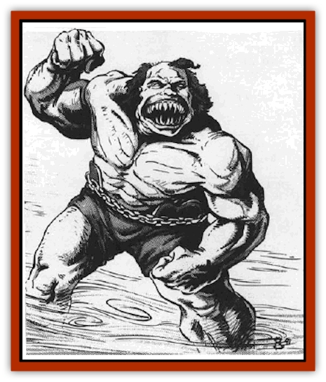

# Flowfiend

| Statistic | **Flowfiend** |
| --- | --- |
| **Activity Cycle:** | Any |
| **Alignment:** | Chaotic evil |
| **Armor Class:** | 0 |
| **Climate/Terrain:** | Phlogiston |
| **Damage/Attack:** | 1d12/1d12/1d12/1d12/2d10 |
| **Diet:** | Omnivore |
| **Frequency:** | Rare |
| **Hit Dice:** | 7+7 |
| **Intelligence:** | Highly (13) |
| **Magic Resistance:** | 10% |
| **Morale:** | Very steady (14) |
| **Movement:** | 9. Fl 18 (D) |
| **No. Appearing:** | 2-8 |
| **No. of Attacks:** | 5 |
| **Organization:** | Pack |
| **Size:** | Varies |
| **Special Attacks:** | See below |
| **Special Defenses:** | +1 or better weapon to hit |
| **THAC0:** | 13 |
| **Treasure:** | Nil |
| **XP Value:** | 5,000 |

Sometimes travellers between crystal spheres fall (or are thrown) into the phlogiston flow. Most simply calcify. Some evil folk are spared this fate; a shadowy presence of great power and evil "rescues" the castaways by transforming them into smaller versions of itself. Thus the flowfiends are born.

Flowfiends vary in height, depending on the race of the original victim; as a rule, a victim grows between a quarter and a third of its original height. Flowfiends have four muscular arose each with a powerful hand with overgrown fingernails. The flowfiend's mouth is filled with razor-sharp teeth. The creature walks upright, its body bulging with exaggerated, twisted muscles rippling under sickly yellow skin. Sometimes, the victim's previous features are still recognizable. It has its own language, a form of Common as ugly and transformed as it is.

The flowfiend "swims" through the flow in search of food or other victims to convert. The beasts know the flow offers many spelljamming vessels travelling between the crystal spheres,

**Combat:** Flowfiends relish combat and waylay as many ships as possible. Their bite does 2d10 damage, but the fiends rely on their four sets of claws, each set doing 1d12 damage.

One of the flowfiend's favorite tactics is to use two arms to pin a victim, then use its other two arms and its bite to reduce the victim to a bloody pulp. If the flowfiend gets two arm hits on one victim, the victim is pinned. A pinned character is hit automatically by the flowliend's jaws and other arms. A pinned foe may attempt to break the beast's hold once per round, using the punching and wrestling rules in the *Player's Handbook*. The flowfiend has Strength 18/50.

Note that the pin and claw/bite attacks are for victims who are ineligible for "conversion" into more flowfiends. To gain new recruits for transformation, all flowfiends can cast *detect evil*, *detect good*, *detect magic*, and *know alignment* at 7th level, though only one at a time. Only evil or chaotic neutral characters are eligible. Flowfiends attempt to pin evil victims haplessly and carry them away. If a victim fights, the flowfiend strikes it, doing non-lethal damage.

Flowfiends sometimes use their powerful claws and jaws to grab a spelljammer hull and climb on deck. If more than three flowfiends are encountered, they attack at different parts of the ship to surround their victims. Sometimes they just toss sailors overboard to other flowfiends waiting in the flow.

Flowfiends are immune to the calcifying process of the flow and to all *hold*, *flesh to stone*, *paralyzation*, or *petrification* spells. They regenerate 2 hp each round, starting three rounds after they first take damage. A dead flowfiend's body must be burned to ashes, or it regenerates.

**Habitat/Society:** The flowfiends have forgotten everything about their former lives and now exist as a hunting pack eager to please their master. All flowfiends obey the mysterious entity they call "Great Father". Scholars speculate that this is a double-strength flowfiend, probably a native of the Outer Planes. The flowfiends' greatest goal in life is to please the Great Father by bringing victims for conversion and capturing meat.

Flowfiends take candidates for conversion to a remote spot in the flow resembling a rocky island. This is a platform built of thousands of calcified victims of the flow. The victims even make up decorative columns, a dais, and a 6x6' altar.

When victims are placed on the altar, all flowfiends in attendance begin a shrill whistling. In 1d10 hours, the Great Father appears and transforms the victim, which takes 1d4 turns. The victim makes a system shock roll; success means the birth of a new flowfiend. Failure means the victim dies. The Great Father returns to his secret lair, and the ceremony ends.

Chaotic neutral victims turn chaotic evil. All memories of the victims' past lives give way to a new purpose: Kill and capture for the glory of the Great Father!

**Ecology:** Flowfiends have no gender. They add to their numbers only by getting more victims from spelljamming ships. Flowfiends require no sleep, just food.

No one knows why the Great Father is creating flowfiends. Some speculate that the monster plans to conquer wildspace.

---
## Discovery & Documentation

**Source Publication:** MC9 Spelljammer Appendix II (1991)
**Campaign Setting:** Planescape
**Author(s):** Scott Davis, Newton Ewell, John Terra

### Other Creatures Found in This Source Book
   * [[Alchemy_Plant|Alchemy Plant]]
   * [[Allura|Allura]]
   * [[Aperusa|Aperusa]]
   * [[Autognome|Autognome]]
   * [[Bionoid|Bionoid]]
   * [[Bloodsac|Bloodsac]]
   * [[Buzzjewel|Buzzjewel]]
   * [[Constellate|Constellate]]
   * [[Contemplator|Contemplator]]
   * [[Dohwar|Dohwar]]
   * [[Dragon_Moon|Dragon, Moon]]
   * [[Dragon_Stellar|Dragon, Stellar]]
   * [[Dragon_Sun|Dragon, Sun]]
   * [[Dreamslayer|Dreamslayer]]
   * [[Dweomerborn|Dweomerborn]]
   * [[Fal|Fal]]
   * [[Feesu|Feesu]]
   * [[Fire_Bat|Fire Bat]]
   * [[Firebird|Firebird]]
   * [[Firelich|Firelich]]
   * [[Gadabout|Gadabout]]
   * [[Gammaroid|Gammaroid]]
   * [[Gonn|Gonn]]
   * [[Gossamer|Gossamer]]
   * [[Grav|Grav]]
   * [[Great_Dreamer|Great Dreamer]]
   * [[Greatswan|Greatswan]]
   * [[Grell_Colonial|Grell, Colonial]]
   * [[Gullion|Gullion]]
   * [[Insectare|Insectare]]
   * [[Lhee|Lhee]]
   * [[Mercurial_Slime|Mercurial Slime]]
   * [[Meteorspawn|Meteorspawn]]
   * [[Monitor|Monitor]]
   * [[Owl_Space|Owl, Space]]
   * [[Pristatic|Pristatic]]
   * [[Scro|Scro]]
   * [[Selkie_Star|Selkie, Star]]
   * [[Silatic|Silatic]]
   * [[Skullbird|Skullbird]]
   * [[Sleek|Sleek]]
   * [[Sluk|Sluk]]
   * [[Space_Swine|Space Swine]]
   * [[Sphinx_Astro-|Sphinx, Astro-]]
   * [[Spirit_Warrior|Spirit Warrior]]
   * [[Starfly_Plant|Starfly Plant]]
   * [[Stargazer|Stargazer]]
   * [[Undead_Stellar|Undead, Stellar]]
   * [[Witchlight_Marauder|Witchlight Marauder]]
   * [[Xixchil|Xixchil]]
   * [[Yitsan|Yitsan]]
   * [[Zurchin|Zurchin]]
