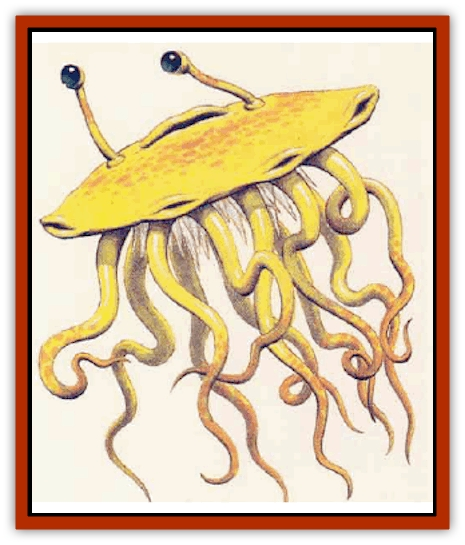

# Flumph

| Statistic | **Common** | **Monastic** |
| --- | --- | --- |
| **Activity Cycle:** | Night | Night |
| **Alignment:** | Lawful good | Lawful good |
| **Armor Class:** | 0 (underside 8) | 0 (underside 8) |
| **Climate/Terrain:** | Any dark | Any dark |
| **Damage/Attack:** | 1d8 | 1d6 |
| **Diet:** | Carnivore | Carnivore |
| **Frequency:** | Rare | Very rare |
| **Hit Dice:** | 2 | 2-5 |
| **Intelligence:** | Average (8-10) | High (13-14) |
| **Magic Resistance:** | Nil | Nil |
| **Morale:** | Elite (13-14) | Elite(13-14) |
| **Movement:** | Fl 6 (D) | Fl 6 (D) |
| **No. Appearing:** | 2-16 | 4-32 |
| **No. of Attacks:** | 1 | 1 |
| **Organization:** | Solitary | Monastic |
| **Size:** | T (2' diameter) | T (2' diameter) |
| **Special Attacks:** | Acid | Acid |
| **Special Defenses:** | Foul smell | Foul smell, spells |
| **THAC0:** | 19 | 2 HD: 19 / 3-4 HD: 17 / 5 HD: 15 |
| **Treasure:** | Nil | Nil (U) |
| **XP Value:** | 270 | Monk 650 / Prior: 975 or 1,400 / Abbot: 3,000 |

Flumpb resemble aerial jellyfish. These odd creatures are round and almost flat, perhaps the or four inches thick in the center, tapering to one or two inches near the edge. The body is mostly hollow, much like a large cushion. A round orifice si+s in the center of the upper surface, flanked by two eyestalks, each about six inches long. Several short tentacles hang from the creature's underside, concealing a mass of small spikes. The tentacles closest to the flumph�s rim can be used for fine manipulation of small objects. A common flumph is pure white in color; a monastic flumph is generally a pale yellow or green, with darker tentacles.

A flumph flies by taking in air through the hole on its upper surface, and expelling it through several small holes on its underside. The creature also has several small apertures along its equator, for use in maneuvering. It usually hovers about four to six inches above the ground. Keeping its body aloft does not require great amounts of air. It creates a gentle breeze, and a slight whistling sound can be heard in a quiet area.

Common flumphs cannot communicate vocally, but have a unique sign language that makes use of their tentacles and eyestalks. Some monastic flumphs, perhaps 10%, can speak and understand common or another language.

**Combat:** The flumph survives by hunting small creatures, such as rats, lizards, frogs, and the like. The flumph hovers along just above the ground, or hangs motionless in reeds or similar concealment. When it finds a small creature, it rises a foot or two, then drops onto its prey, its spikes inflicting 1d8 points of damage on a successful attack. In addition, the flumphs tentacles secrete digestive acids into the wounds; the acid causes an additional 1d4 points of damage each round for the next 2d4 rounds. Once the prey is dead, the flumph settles on it and absorbs nutrients through its tentacles. Flumphs often need to pursue their healthier prey for a short distance before the victim dies. The acid can be washed away by complete immersion in a fast-moving stream, or by actively washing with 2d4 gallons of water (simple immersion or rinsing will not work).

If threatened by a larger creature, the flumph usually attempts to drive it away by squirting a foul-smelling liquid from an orifice on its equator, in the front. This can strike anyone in a 60 degree arc before the flumph, within a range of 20 feet. Any creature struck by the noxious liquid must make a successful saving throw vs. poison or become nauseated, reeling and unable to attack for 2-5 rounds. The odor lingers for 1d4 hours, and can be detected up to 100 feet away. If this method of repulsion fails, the flumph can rise to a height of 10 feet and drop onto an opponent, as if hunting.

A flumph is helpless if turned over.

**Habitat/Society:** The common flumph is a nomadic hunter, intelligent, good-aligned, and peaceful. A flumph reproduces about every two years by budding, producing 1d8 tiny flumphs on its underside. These become independent after about three months when they reach two inches in diameter. They grow to adult size within a month, and live for 20 years.

**Ecology:** Flumphs are predators low on the food chain, feeding on smaller creatures and clearing their area of vermin. Flumph flesh has a foul taste, and they are generally considered unpalatable, though [[Ogre|ogres]] and some goblinoids will eat them.

**Monastic Flumph**

  The seldom-seen monastic flumphs are more advanced creatures that can cast spells as if they were clerics of levels equal to their Hit Dice. They gather in cloisters to share knowledge and to worship deities unknown to humanoids. A cloister is usually in a large cavern or (in swamps and grasslands) a large, nest-like bower constructed of grass and mud. The inside of a cloister is decorated with fine, colorful paintings, made by flumphs dabbing natural pigments with their tentacles. The paintings are usually abstract, showing spirals and other curved lines, though some are vaguely representational of flumphs engaged in hunting.

Each cloister is led by an "abbot", a flumph with 5 HD. The abbot is aided by one "prior" per six flumphs in the cloister; a prior has 3 or 4 HD. The remainder of the flumphs are "monks," each with 2 HD. On occasion, a small group of common flumphs can be found near a cloister, bringing food as an offering in return for healing or guidance.

---
## Discovery & Documentation

**Source Publication:** Monstrous Compendium, 1995 Annual, Volume 2 (1995)
**Campaign Setting:** Advanced Dungeons & Dragons 2nd Edition
**Author(s):** Jon Pickens

### Other Creatures Found in This Source Book
   * [[Aboleth_Savant|Aboleth, Savant]]
   * [[Addazahr|Addazahr]]
   * [[Amiq_Rasol|Amiq Rasol]]
   * [[Arch-Shadow|Arch-Shadow]]
   * [[Automaton_Scaladar|Automaton, Scaladar]]
   * [[Automaton_Trobriand's|Automaton, Trobriand's]]
   * [[Bat_Sporebat|Bat, Sporebat]]
   * [[Beetle_Dragon|Beetle, Dragon]]
   * [[Bi-nou|Bi-nou]]
   * [[Boggle|Boggle]]
   * [[Brownie_Dobie|Brownie, Dobie]]
   * [[Brownie_Quickling|Brownie, Quickling]]
   * [[Cat_Crypt|Cat, Crypt]]
   * [[Cat_Great_Cath_Shee|Cat, Great, Cath Shee]]
   * [[Centaur-kin_Dorvesh|Centaur-kin, Dorvesh]]
   * [[Centaur-kin_Gnoat|Centaur-kin, Gnoat]]
   * [[Centaur-kin_Ha'pony|Centaur-kin, Ha'pony]]
   * [[Centaur-kin_Zebranaur|Centaur-kin, Zebranaur]]
   * [[Chronolily|Chronolily]]
   * [[Curst|Curst]]
   * [[Darktentacles|Darktentacles]]
   * [[Dinosaur_Aquatic|Dinosaur, Aquatic]]
   * [[Dinosaur_II|Dinosaur II]]
   * [[Dinosaur_III|Dinosaur III]]
   * [[Doppelganger_Greater|Doppelganger, Greater]]
   * [[Dragon_Brine|Dragon, Brine]]
   * [[Dragon_Half-|Dragon, Half-]]
   * [[Dragon-kin_Sea_Wyrm|Dragon-kin, Sea Wyrm]]
   * [[Dwarf_Wild|Dwarf, Wild]]
   * [[Ekimmu|Ekimmu]]
   * [[Elemental_Nature|Elemental, Nature]]
   * [[Elf_Winged|Elf, Winged]]
   * [[Fish_Great_Glacier|Fish (Great Glacier)]]
   * [[Fish_Subterranean|Fish, Subterranean]]
   * [[Fish_Toril|Fish (Toril)]]
   * [[Flareater|Flareater]]
   * [[Froghemoth|Froghemoth]]
   * [[Ghost_Casurua|Ghost, Casurua]]
   * [[Ghost_Ker|Ghost, Ker]]
   * [[Ghul|Ghul]]
   * [[Ghul-Kin|Ghul-Kin]]
   * [[Giant_Half-giant|Giant, Half-giant]]
   * [[Golem_Burning_Man|Golem, Burning Man]]
   * [[Golem_Phantom_Flyer|Golem, Phantom Flyer]]
   * [[Gulguthhydra|Gulguthhydra]]
   * [[Hakeashar|Hakeashar]]
   * [[Horse_Moon-|Horse, Moon-]]
   * [[Human_Dragonslayer|Human, Dragonslayer]]
   * [[Human_Vistana|Human, Vistana]]
   * [[Jellyfish_Giant|Jellyfish, Giant]]
   * [[Kalin|Kalin]]
   * [[Kholiathra|Kholiathra]]
   * [[Laerti|Laerti]]
   * [[Leucrotta_Greater|Leucrotta, Greater]]
   * [[Lich_Suel|Lich, Suel]]
   * [[Lurker_Shadow|Lurker, Shadow]]
   * [[Lycanthrope_Werepanther|Lycanthrope, Werepanther]]
   * [[Lycanthrope_Wereshark|Lycanthrope, Wereshark]]
   * [[Mammal_Herd_II|Mammal, Herd II]]
   * [[Marl|Marl]]
   * [[Meenlock|Meenlock]]
   * [[Mimic_Greater|Mimic, Greater]]
   * [[Mold_II|Mold II]]
   * [[Mummy_Creature|Mummy, Creature]]
   * [[Nyth|Nyth]]
   * [[Ooze_Slime_Jelly_Ghaunadan|Ooze/Slime/Jelly, Ghaunadan]]
   * [[Palimpsest|Palimpsest]]
   * [[Peltast|Peltast]]
   * [[Plant_Dangerous_II|Plant, Dangerous II]]
   * [[Pleistocene_Animal|Pleistocene Animal]]
   * [[Pudding_Subterranean|Pudding, Subterranean]]
   * [[Raggamoffyn|Raggamoffyn]]
   * [[Snake_Serpent|Snake, Serpent]]
   * [[Snake_Serpent_Vine|Snake, Serpent Vine]]
   * [[Sphinx_Draco-|Sphinx, Draco-]]
   * [[Sprite_Seelie_Faerie|Sprite, Seelie Faerie]]
   * [[Sprite_Unseelie_Faerie|Sprite, Unseelie Faerie]]
   * [[Squealer|Squealer]]
   * [[Turtle_Giant|Turtle, Giant]]
   * [[Umpleby|Umpleby]]
   * [[Vizier's_Turban|Vizier's Turban]]
   * [[Wall_Walker|Wall Walker]]
   * [[Webbird|Webbird]]
   * [[Yak-Man|Yak-Man]]
   * [[Zorbo|Zorbo]]
