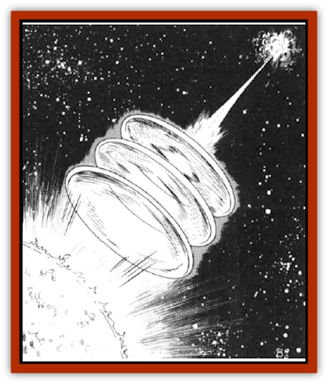

# Focoid

| Statistic | **Focoid** |
| --- | --- |
| **Activity Cycle:** | Constant |
| **Alignment:** | Neutral |
| **Armor Class:** | 0 |
| **Climate/Terrain:** | Deep space, near bright stars |
| **Damage/Attack:** | 1-12/1-12/1-12 |
| **Diet:** | Carnivore |
| **Frequency:** | Very rare |
| **Hit Dice:** | 6+3 |
| **Intelligence:** | Average (8-10) |
| **Magic Resistance:** | Nil |
| **Morale:** | Steady (11-12) |
| **Movement:** | 24 |
| **No. Appearing:** | 1 |
| **No. of Attacks:** | 3 |
| **Organization:** | Solitary |
| **Size:** | L (9' long) |
| **Special Attacks:** | None |
| **Special Defenses:** | Partial invisibility |
| **THAC0:** | 13 |
| **Treasure:** | Q |
| **XP Value:** | 1,400 |

Focoids are a severe navigational hazard near the brighter stars of the Known Sphere. They manipulate their gelatinous bodies into lenses, focusing intense light on any object they choose, thus roasting enemies and lighting rigging and decks on fire almost at will. In many ports, adventurers can receive bounties, up to 500 gp, for every focoid carcass they bring in.

Focoids consist of three clear gelatin spheres that are joined into a short chain. They are so close to transparent that they are difficult to see unless they are moving against the star field behind them, in which case the refraction of starlight gives the observer a vague notion of where they are. They are especially difficult to see when between the observer and a bright star, not surprisingly the focoid's favorite position of attack.

There is a small mouth at one end of a focoid. Until its last meal is completely digested, the food can be seen through the creature, temporarily rendering it visible.

Each spherical action of a focoid's body can be manipulated into various shapes. In its combat posture, the spheres are flattened into lenses. At other times the body sections may be elongated, squashed, or left as spheres. These shape variations may indicate some kind of communication or mood changes.

**Combat:** A focoid's mouth is completely unsuited for combat. The creature's only means of attack is by focusing light through its lens-shaped body sections. Obviously, a focoid must have a bright source of light in order to attack. It is therefore seldom found away from fire bodies. On the rare occasions that a focoid does travel in deep space, it cannot attack and therefore most likely goes unnoticed.

Each of the focoid's three body sections can become a lens and can fire at a seperate target. Each has five hexes (2,500 yards) range, and inflicts 1d12 points (1-2 hull points) of damage. Each section can fire once per round.

Neither a focoid nor the focused beams of light it fires are easily seen. A typical encounter with a focoid opens as the creature attacks for one or more rounds while the confused targets attempt to get a handle on its position. All missile attacks against a focoid suffers a -3 penalty to the attack roll. Melee attacks are not affected, since a focoid is relatively easy to see close up.

A focoid can use its light-focusing weapon only when it is between a star and the target. If it is maneuvered out of position, it cannot fire. The focoid then usually evaluates the situation, moving off if the odds are against it, pressing the attack if it thinks it can get a meal. In either case, a focoid out of position is not firing and is, therefore, impossible to locate visually.

**Habitat/Society:** Focoids are creatures of space - living, breeding, and dying there. They are never encountered in groups. Focoids have apparently not discovered the advantages of cooperative hunting. They attack only to acquire food - they have no animosity toward any particular race. However, most other spacefaring races have tremendous animosity toward focoids, since these creatures are a menace to navigation.

**Ecology:** A focoid is unisexual, though reproduction requires the union of three adults. Each grows a new gelatin sphere and the three are joined to create a new individual. Once the new focoid is born, all participating focoids disperse. They eat meat and attack only to obtain food.

---
## Discovery & Documentation

**Source Publication:** MC7 Spelljammer Appendix I (1990)
**Campaign Setting:** Advanced Dungeons & Dragons 2nd Edition
**Author(s):** various

### Other Creatures Found in This Source Book
   * [[Aartuk|Aartuk]]
   * [[Albari|Albari]]
   * [[Ancient_Mariner|Ancient Mariner]]
   * [[Argos|Argos]]
   * [[Beholder_Abomination_Astereater|Beholder (Abomination), Astereater]]
   * [[Blazozoid|Blazozoid]]
   * [[Chattur|Chattur]]
   * [[Chevall|Chevall]]
   * [[Clockwork_Horror|Clockwork Horror]]
   * [[Colossus|Colossus]]
   * [[Delphinid|Delphinid]]
   * [[Dizantar|Dizantar]]
   * [[Dog|Dog]]
   * [[Dog_Bog_Hound|Dog, Bog Hound]]
   * [[Esthetic|Esthetic]]
   * [[Fractine|Fractine]]
   * [[Giant_Spacesea|Giant, Spacesea]]
   * [[Golem_Furnace|Golem, Furnace]]
   * [[Golem_Radiant|Golem, Radiant]]
   * [[Gravislayer|Gravislayer]]
   * [[Grommam|Grommam]]
   * [[Hadozee|Hadozee]]
   * [[Hamster_Giant_Space|Hamster, Giant Space]]
   * [[Jammer_Leech|Jammer Leech]]
   * [[Lakshu|Lakshu]]
   * [[Lumineaux|Lumineaux]]
   * [[Lutum|Lutum]]
   * [[Mimic_Space|Mimic, Space]]
   * [[Misi|Misi]]
   * [[Moon_Rogue|Moon, Rogue]]
   * [[Mortiss|Mortiss]]
   * [[Murderoid|Murderoid]]
   * [[Nay-Churr|Nay-Churr]]
   * [[Phlog-Crawler|Phlog-Crawler]]
   * [[Plasman|Plasman]]
   * [[Plasmoid_DeGleash|Plasmoid, DeGleash]]
   * [[Plasmoid_DelNoric|Plasmoid, DelNoric]]
   * [[Plasmoid_General_Information|Plasmoid, General Information]]
   * [[Plasmoid_Ontalak|Plasmoid, Ontalak]]
   * [[Puffer|Puffer]]
   * [[Q'nidar|Q'nidar]]
   * [[Rastipede|Rastipede]]
   * [[Reigar|Reigar]]
   * [[Rock_Hopper|Rock Hopper]]
   * [[Slinker|Slinker]]
   * [[Spider_Asteroid|Spider, Asteroid]]
   * [[Spiritjam|Spiritjam]]
   * [[Survivor|Survivor]]
   * [[Syllix|Syllix]]
   * [[Symbiont_Power|Symbiont, Power]]
   * [[Vine_Infinity|Vine, Infinity]]
   * [[Wiggle|Wiggle]]
   * [[Wizshade|Wizshade]]
   * [[Wryback|Wryback]]
   * [[Zard|Zard]]
   * [[Zodar|Zodar]]
