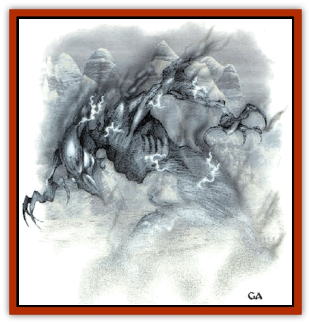

# Fogwarden

| Statistic | **Fogwarden** |
| --- | --- |
| **Activity Cycle:** | Any |
| **Alignment:** | Neutral evil |
| **Armor Class:** | 0 |
| **Climate/Terrain:** | Arctic, subarctic, cold temperate |
| **Damage/Attack:** | 3d6 lightning |
| **Diet:** | Emotion |
| **Frequency:** | Very rare |
| **Hit Dice:** | 4 |
| **Intelligence:** | Very (11-12) |
| **Magic Resistance:** | Nil |
| **Morale:** | Champion (15-16) |
| **Movement:** | 15 |
| **No. Appearing:** | 1 |
| **No. of Attacks:** | Special |
| **Organization:** | Solitary |
| **Size:** | M (6' tall) |
| **Special Attacks:** | Fear aura, lighting bolt (3d6) |
| **Special Defenses:** | +1 or better magical wooden weapon to hit; / immune to lightning, cold, poison, and gases; animate dead |
| **THAC0:** | Special |
| **Treasure:** | Nil |
| **XP Value:** | 4,000 |

The fogwarden is a solitary creature that inhabits the cold, icy fogs or arctic, subarctic, and extremly cold areas of temperate zones. It feeds on strong emotions, especially the fear it creates in the victims it terrorizes. As a creature of fog and mist, it is found only within heavy mists. The fogs they inhabit sometimes flash with light.

The fogwarden has a misty, vaguely humanoid shape, somewhat darker than the surrounding fog. Its eyes glow with an intense blue light. Although a fogwarden might be mistaken for a [[Wraith|wraith]], it is not undead. Instead, it seems to be a type of para- or quasi-elemental creature, composed of both fog and ice, but with some electrical properties as well.

Fogwarders have no known method of communication, nor do they utter any sound.

**Combat:** A forwarden does not willingly engage in battle, preferring to terrorize opponents and feed from their fear. When the creature is within 60 feet, a smell of ozone fills the air and hairs prickle. Within a 30-foot radius, the forwarder projects an *aura of fear* (save vs. spell or flee). Although the creature has no physical attack - and usually does not attack at all unless it is attacked - it can deliver a powerful bolt of electricity every second rotund if provoked. This is exactly like a *lightning bolt*, but has a maximum range and length of 30 feet, and delivers 3d6 points of damage (a saving throw vs. spell reduces damage by half).

When a metal weapon touches the fogwarden, the weapon must make an immediate item saving throw vs. electricity or be destroyed in a brilliant flash of light. Anyone wielding the weapon also receives 3d6 points of electrical damage (save vs. spell for half damage).

Only wooden weapons of +1 or better enchantment can damage the creature. The fogwarden is immune to cold- and electricity-based attacks, as well as gases and poisons. It shuns sunlight, and is destroyed by a full hour of exposure to it.

The electrical aura of the fogwarden temporarily animates all dead flesh within 15 feet. These animated bodies act as [[Zombie|zombies]] under the control of the fogrwarden in all respects except that they are not undead creatures and cannot be turned. The animation lasts only so long as the body is within 15 feet of the fogwarden. When destroyed, a fogwarden evaporates completely, leaving no trace.

**Habitat/Society:** Fogwardens have no society, as far as is known. The solitary creatures spend their time inside deep, icy fogs, prowling relentlessly for other creatures to terrorize. They collect no treasure, though incidental treasure may be found on their victims. The fogwarden leaves such treasures behind when it moves on. Since the fogrwarden cannot create its own fog, it moves underground when conditions are unfavorable. It is not known how, or it they reproduce.

**Ecology:** The fogwarden is attracted to and preys on intelligent creatures, though it is believed that it can survive on the fear of creatures of animal intelligence. It has no natural enemies, but the general rarity of persistent icy fog banks limits its range to far northlands, high mountains, and similar areas of natural or unnatural cold fog.

**Giant Fogwardens**

  These creatures are similar to fogwardens in many ways, but are considerably larger, and even more rare. A giant fogwarden is 12 feet tall, and has 8 Hit Dice. All of the usual fogwarden abilities have doubled effects: the ozone smell 120 feet, the fear aura 60 feet, the lightning bolt a 60-foot stroke and 6d6 damage, contact damage 6d6, and body animation range 30 feet. The creature is still vulnerable to +1 magical wooden weapons, and immune to poison, gases, cold, and electricity-based attacks. In addition, the giant fogwarden is immune to 1st-level spells, and suffers only half damage from fire-based attacks.

An even larger fogwarden is rumored, although this is not confirmed. Its size is estimated at 18 feet, and its abilities are tripled in effect. It is vulnerable to +2 magical wooden weapons, is immune to 1st- and 2nd-level spells, and takes half or no damage from fire. It is rumored to be exceptionally intelligent, to have the spellcasting abilities of both a 9th-level wizard and a 7th-level priests and to be able to converse telepathically with intelligent creatures.

---
## Discovery & Documentation

**Source Publication:** Monstrous Compendium, 1997 Annual, Volume 4 (1995)
**Campaign Setting:** Advanced Dungeons & Dragons 2nd Edition
**Author(s):** Jon Pickens

### Other Creatures Found in This Source Book
   * [[Anemone_Giant_Sea|Anemone, Giant Sea]]
   * [[Asperii|Asperii]]
   * [[Bainligor|Bainligor]]
   * [[Beast_of_Chaos|Beast of Chaos]]
   * [[Blindheim|Blindheim]]
   * [[Bloodsipper_Far_Realm|Bloodsipper (Far Realm)]]
   * [[Bulette_Gohlbrorn|Bulette, Gohlbrorn]]
   * [[Child_of_the_Sea|Child of the Sea]]
   * [[Clockwork_Horror|Clockwork Horror]]
   * [[Clockwork_Swordsman|Clockwork Swordsman]]
   * [[Coral|Coral]]
   * [[Darklore|Darklore]]
   * [[Dharculus|Dharculus]]
   * [[Dolphin_Athas|Dolphin (Athas)]]
   * [[Dragon_Neutral_Moonstone|Dragon, Neutral, Moonstone]]
   * [[Dragon_Prismatic|Dragon, Prismatic]]
   * [[Dream_Stalker|Dream Stalker]]
   * [[Dragon-kin_Albino_Wyrm|Dragon-kin, Albino Wyrm]]
   * [[Echyan|Echyan]]
   * [[Firestar|Firestar]]
   * [[Firetail|Firetail]]
   * [[Fish_Ascallion|Fish, Ascallion]]
   * [[Fish_Deep_Ocean|Fish, Deep Ocean]]
   * [[Fish_Tropical|Fish, Tropical]]
   * [[Fish_Vurgens|Fish, Vurgens]]
   * [[Fraal|Fraal]]
   * [[Giant_Crag|Giant, Crag]]
   * [[Gibberling_Brood|Gibberling, Brood]]
   * [[Glutton_Sea|Glutton, Sea]]
   * [[Golden_Ammonite|Golden Ammonite]]
   * [[Golem_Brass_Minotaur|Golem, Brass Minotaur]]
   * [[Golem_Gemstone|Golem, Gemstone]]
   * [[Golem_Maggot|Golem, Maggot]]
   * [[Groundling|Groundling]]
   * [[Hermit_Sea|Hermit, Sea]]
   * [[Hound_of_Law|Hound of Law]]
   * [[Human_Amazon|Human, Amazon]]
   * [[Human_Pygmy|Human, Pygmy]]
   * [[Inquisitor|Inquisitor]]
   * [[Kercpa|Kercpa]]
   * [[Kreel|Kreel]]
   * [[Lycanthrope_Lythari|Lycanthrope, Lythari]]
   * [[Mercurial|Mercurial]]
   * [[Mold_Chromatic|Mold, Chromatic]]
   * [[Mummy_Bog|Mummy, Bog]]
   * [[Neh-thalggu|Neh-thalggu]]
   * [[Nymph_Grain|Nymph, Grain]]
   * [[Nymph_Unseelie|Nymph, Unseelie]]
   * [[Octopus_Octo-Jelly|Octopus, Octo-Jelly]]
   * [[Puddingfish|Puddingfish]]
   * [[Sea_Demon|Sea Demon]]
   * [[Shade|Shade]]
   * [[Shadowrath|Shadowrath]]
   * [[Shark_Athas|Shark (Athas)]]
   * [[Siren_Ravenloft|Siren (Ravenloft)]]
   * [[Skeleton_Variant|Skeleton, Variant]]
   * [[Skyfish|Skyfish]]
   * [[Spectral_Scion|Spectral Scion]]
   * [[Spyder_Fiend|Spyder Fiend]]
   * [[Squid_Squark|Squid, Squark]]
   * [[Tanar'ri_Lesser_Uridezu|Tanar'ri, Lesser, Uridezu]]
   * [[Troll_Mutate|Troll Mutate]]
   * [[Vaati|Vaati]]
   * [[Vampire_Cerebral|Vampire, Cerebral]]
   * [[Varkha|Varkha]]
   * [[Wizshade|Wizshade]]
   * [[Worm_Lukhorn|Worm, Lukhorn]]
   * [[Wyste|Wyste]]
   * [[Yugoloth_Lesser_Gacholoth|Yugoloth, Lesser, Gacholoth]]
   * [[Zombie_Mud|Zombie, Mud]]
