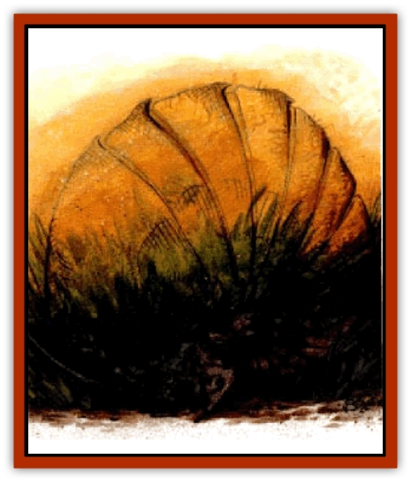

# Fordorran

| Statistic | **Fordorran** |
| --- | --- |
| **Activity Cycle:** | Day |
| **Alignment:** | Chaotic neutral |
| **Armor Class:** | 4/0 |
| **Climate/Terrain:** | Tablelands |
| **Damage/Attack:** | 1d6/1d6/2d4 |
| **Diet:** | Omnivore |
| **Frequency:** | Uncommon |
| **Hit Dice:** | 5 |
| **Intelligence:** | Low (5-7) |
| **Magic Resistance:** | 20% |
| **Morale:** | Irregular (5-7) |
| **Movement:** | 6 |
| **No. Appearing:** | 1 |
| **No. of Attacks:** | 3 |
| **Organization:** | Solitary |
| **Size:** | L (8' long) |
| **Special Attacks:** | Stench |
| **Special Defenses:** | See below |
| **THAC0:** | 15 |
| **Treasure:** | Nil (Q) |
| **XP Value:** | 1,400 |

**Psionics Summary**

| Level | Dis/Sci/Dev | Attack/Defense | Score | PSPs |
| --- | --- | --- | --- | --- |
| 5 | 2/3/10 | EW,MT,PsC/MB,MBk,TS | 11 | 40 |

**Psychokinesis -** *Science:* detonate; *Devotions:* soften, levitation, ballistic attack.

**Telepathy -** *Sciences:* domination, psionic crush; *Devotions:* attraction, ego whip, false sensory input, inflict pain, mind thrust, repugnance, psionic inflation.

The fordorran is a foul, disgusting creature that inhabits the Tablelands surrounding the Silt Sea. It is extremely unpredictable, wanders aimlessly, and may attack for no reason. It is believed to be a distant cousin of the [[So-ut|so-ut]].

The fordorran is a large, lumbering quadruped with a tough, armored shell. It resembles an enormous armadillo with a formation of three horns on its head. Its armored plates are divided into sections that allow the beast to curl into a ball for protection. The fordorran has the ability to blend in with its surroundings by changing its coloration. This would make the beast nearly undetectable if it weren't for the foul stench it constantly emits. The armored plates are hairless, but there is a light coat of fur on the underside of its body, on its legs, and between its armored plates.

**Combat:** The fordorran, while slow and stupid, is still a very dangerous opponent. It is completely random and changes the target of its attacks to a different individual with no warning or predictability. Each round there is a 25% chance the beast changes opponents. It can do this without suffering any penalty. It switches opponents even if the second target is out of its current attack range. If there is no other target when a change of opponent is indicated, the fordorran just wanders off absentmindedly. If attacked, it defends itself. In melee, the fordorran attacks with its three toed front claws for 1-6 (1d6) points of damage each, and gores with its horned head for 2-8 (2d4) points of damage. Any creature within 10 feet of the beast must make a successful save vs. poison or begin gagging and retching for 1-6 (1d6) rounds. Another successful saving throw is needed to recover. The victim can do nothing but move at one third its normal speed while gagging and retching.

If the fordorran detects its opponents before being detected itself, it uses its psionic abilities. The creature uses its psionic science of domination to seize control of an opponent. If successful, the controlled individual attacks its comrades. If there is only one opponent, the fodorran uses its false sensory ability to cover its foul stench. The creature then uses its devotions of ballistic attack and detonate before rushing in to attack. Fordorrans are immune to all *sleep*, *charm*, and *hold* spells.

**Habitat/Society:** Fordorrans are known to inhabit the Tablelands, making their lairs in caves and crevasses. They have never been known to congregate in groups. Perhaps even they can't stand the stench of their own kind. Therefore, it remains unknown how the creatures reproduce. They are just as likely to ignore other creatures as they are to attack them or even befriend them temporarily. They will eat gems or colored glass, despite the fact that they can't digest either material.

**Ecology:** Fordorrans flesh is edible, but tastes as bad as it smells. It is rumored that certain [[Elf_Athas|elf]] tribes know how to prepare fordorran meat to make it palatable. The gland that is responsible for the creature's horrible aroma is highly sought by preservers and defilers to create potions.

---
## Discovery & Documentation

**Source Publication:** Dark Sun Appendix II - Terrors Beyond Tyr (1991)
**Campaign Setting:** Dark Sun
**Author(s):** Jim Atkiss, Steve Brown, Timothy B. Brown, Andrew P. Morris, Bruce Nesmith, Wes Nicholson, Bill Slavicsek

### Other Creatures Found in This Source Book
   * [[Aarakocra_Athas|Aarakocra (Athas)]]
   * [[Animal_Domestic_Athas_II|Animal, Domestic (Athas) II]]
   * [[Aviarag|Aviarag]]
   * [[Baazrag|Baazrag]]
   * [[Baazrag_Boneclaw|Baazrag, Boneclaw]]
   * [[Bloodgrass|Bloodgrass]]
   * [[Cactus_Hunting|Cactus, Hunting]]
   * [[Cactus_Rock|Cactus, Rock]]
   * [[Cilops|Cilops]]
   * [[Crodlu|Crodlu]]
   * [[Dagorran|Dagorran]]
   * [[Dhaot|Dhaot]]
   * [[Drake_Lesser_Athas_General_Information|Drake, Lesser (Athas), General Information]]
   * [[Drake_Lesser_Athas_Magma|Drake, Lesser (Athas), Magma]]
   * [[Drake_Lesser_Athas_Rain|Drake, Lesser (Athas), Rain]]
   * [[Drake_Lesser_Athas_Silt|Drake, Lesser (Athas), Silt]]
   * [[Drake_Lesser_Athas_Sun|Drake, Lesser (Athas), Sun]]
   * [[Dray|Dray]]
   * [[Drik|Drik]]
   * [[Dune_Reaper|Dune Reaper]]
   * [[Dwarf_Athas|Dwarf (Athas)]]
   * [[Elemental_Beast_Athas_Air|Elemental Beast (Athas), Air]]
   * [[Elemental_Beast_Athas_Earth|Elemental Beast (Athas), Earth]]
   * [[Elemental_Beast_Athas_Fire|Elemental Beast (Athas), Fire]]
   * [[Elemental_Beast_Athas_Water|Elemental Beast (Athas), Water]]
   * [[Elf_Athas|Elf (Athas)]]
   * [[Fael|Fael]]
   * [[Feylaar|Feylaar]]
   * [[Giant_Half-giant|Giant, Half-giant]]
   * [[Giant_Shadow|Giant, Shadow]]
   * [[Golem_Athas_Magma|Golem (Athas), Magma]]
   * [[Golem_Athas_Salt|Golem (Athas), Salt]]
   * [[Golem_Athas_General_Information|Golem (Athas), General Information]]
   * [[Gorak|Gorak]]
   * [[Halfling_Athas|Halfling (Athas)]]
   * [[Human_Athas|Human (Athas)]]
   * [[Jhakar|Jhakar]]
   * [[Kaisharga|Kaisharga]]
   * [[Kes'trekel|Kes'trekel]]
   * [[Klar|Klar]]
   * [[Krag|Krag]]
   * [[Kragling|Kragling]]
   * [[Lirr|Lirr]]
   * [[Mastyrial|Mastyrial]]
   * [[Meorty|Meorty]]
   * [[Mul|Mul]]
   * [[Nikaal|Nikaal]]
   * [[Paraelemental_Beast_General_Information|Paraelemental Beast, General Information]]
   * [[Paraelemental_Beast_Magma|Paraelemental Beast, Magma]]
   * [[Paraelemental_Beast_Rain|Paraelemental Beast, Rain]]
   * [[Paraelemental_Beast_Silt|Paraelemental Beast, Silt]]
   * [[Paraelemental_Beast_Sun|Paraelemental Beast, Sun]]
   * [[Pakubrazi|Pakubrazi]]
   * [[Psionocus|Psionocus]]
   * [[Psurlon|Psurlon]]
   * [[Raaig|Raaig]]
   * [[Retriever_Obsidian|Retriever, Obsidian]]
   * [[Ruktoi|Ruktoi]]
   * [[Ruvoka_Athas|Ruvoka (Athas)]]
   * [[Sand_Howler|Sand Howler]]
   * [[Scorpion_Athas|Scorpion (Athas)]]
   * [[Seed_Brain|Seed, Brain]]
   * [[Silt_Horror_Black|Silt Horror, Black]]
   * [[Silt_Horror_Magma|Silt Horror, Magma]]
   * [[Silt_Horror_Red|Silt Horror, Red]]
   * [[Silt_Spawn|Silt Spawn]]
   * [[Slig|Slig]]
   * [[Spider_Athas|Spider (Athas)]]
   * [[Spinewyrm|Spinewyrm]]
   * [[Ssurran|Ssurran]]
   * [[Stalking_Horror|Stalking Horror]]
   * [[Tarek|Tarek]]
   * [[Tari|Tari]]
   * [[Thri-kreen|Thri-kreen]]
   * [[T'liz|T'liz]]
   * [[Tohr-kreen_II|Tohr-kreen II]]
   * [[Tohr-kreen_III|Tohr-kreen III]]
   * [[Trin|Trin]]
   * [[Tul'k|Tul'k]]
   * [[Undead_Athas_General_Information|Undead (Athas), General Information]]
   * [[Wraith_Athas|Wraith (Athas)]]
   * [[Xerichou|Xerichou]]
   * [[Zombie_Thinking|Zombie, Thinking]]
