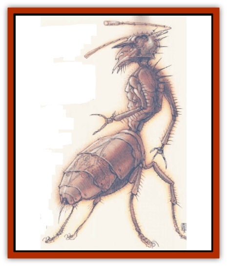

# Formian

| Statistic | **Myrmarch** | **Queen** | **Warrior** | **Worker** |
| --- | --- | --- | --- | --- |
| **Activity Cycle:** | Any | Any | Any | Any |
| **Alignment:** | Lawful neutral | Lawful neutral | Lawful neutral | Lawful neutral (good) |
| **Armor Class:** | 1 | 7 | 2 | 3 |
| **Climate/Terrain:** | Arcadia | Arcadia | Arcadia | Arcadia |
| **Damage/Attack:** | 2d4/3d12 | Nil | 1d6/1d6/1d4/2d4 | 1d4 |
| **Diet:** | Omnivore | Omnivore | Carnivore | Omnivore |
| **Frequency:** | Very rare | Very rare | Very rare | Rare |
| **Hit Dice:** | 6+6 | 9+9 | 3+3 | 1+1 |
| **Intelligence:** | Exceptional (16) | Supra-genius (20) | Average (10) | Low (6) |
| **Magic Resistance:** | Nil | 20% | Nil | Nil |
| **Morale:** | Champion (15) | Fearless (20) | Fanatic (17) | Fearless (19) |
| **Movement:** | 15 | 1 | 15 | 18 |
| **No. Appearing:** | 5-8 | 1 | 21-40 | 1d4&times;00 |
| **No. of Attacks:** | 2 | Nil | 4 | 1 |
| **Organization:** | Hive | Hive | Hive | Hive |
| **Size:** | L (7' tall) | L (10' tall) | M (5' tall) | S (4' tall) |
| **Special Attacks:** | Poison | Nil | Poison | Nil |
| **Special Defenses:** | Nil | 20 myrmarches | Nil | Nil |
| **THAC0:** | 13 | Nil | 17 | 19 |
| **Treasure:** | Nil | Nil | Nil | Nil |
| **XP Value:** | 2,000 | 5,000 | 420 | 35 |

Native to Arcadia, formians are also called [[Centaur|centaur]] [[Ant|ants]]. As their moniker indicates, they appear to he upright-walking ants, but their sentience is that of warmblooded creatures as opposed to insects. They've always inhabited Arcadia, and sages say they always will. Though formians found on the Prime make war on each other, Arcadian formians of different hives have learned to live together peaceably.

Similar to true ants, there are three basic types of formians: the worker, the warrior, and the myrmarch. (A fourth type, the queen, is extremely rare.) Unlike ants, formians' waists are flexible; thus, they often move with only four legs, their heads and thoraces raised. Their forelegs are jointed at the wrist and have three opposing claws, which they can use to manipulate objects and to attack. Formians come in various subdued colors, which serve no function other than to indicate their cities of origin

The worker, the smallest of the four formian types, is also the most commonly encountered. It's about the size of a large dog. Its claws are somewhat clumsy, though they make efficient tools for manual labor. The warrior is the size of a pony, and its claws are indicative of its capability to defend the hive. The myrmarch is the size of a horse. Its claws are capable of finer manipulation than that of human hands. Lastly, the queen is half again as large as a mvrmarch. She is in charge of administering the city and never leaves the central hive, and therefore her legs have atrophied.

Formians of warrior level and higher can communicate with humans, though their version of common sounds more like eerie chittering. They communicate with one another in their own speech, which is incomprehensible to most other beings.

**Combat:** When workers attack (a rare occurrence, for they're used only if a city's under siege), they use their small mandibles to bite for 1d4 points of damage. Warriors attack with their mandibles, two forelegs, and a stinger that injects poison, causing 2d4 points of damage (save versus poison or suffer -2 to attack rolls for 1d6 turns). Myrmarches attack with their mandibles and a poisoned sting. The poison causes 3d12 points of damage and paralyzes opponents for 1d4 turns (save versus poison to take half damage and avoid paralyzation). Queens cannot attack.

**Habitat/Society:** Unlike true ants, formians do not have a hive mind. Though they can receive messages from the hive queen (and can even be commanded and directly controlled by her), they are capable of acting independently of the queen if need be. However, formians of lower levels automatically respond to the direct commands of their superiors. Thus, a worker responds to the warrior, the myrmarch, and the queen, while a myrmarch can only he commanded by the queen.

A formian queen is protected at all times by 20 mymmrches, who will gladly sacrifice themselves for her, since she cannot move on her own. Her intelligence is at the supra-genius level, and she can control an entire hive at any time if she needs to. However, most queens allow their subjects some measure of free will.

Formians are born into their station, and that station never changes. There's never been a revolution in the annals of formian history. It seems the formians, like the [[Modron|modrons]], have no conception of aspiring to higher stations. They simply are the way they are.

**Ecology:** Some of the most magnificent cities in Arcadia are the constructions of the centaur ants. Many of these metropolises can house more than 10,000 formians. Though they appear to be normal (that is, "human") cities with structures and walls above ground, they extend far underground for many miles. The architecture underneath the sands is truly extraordinary - the formian buildings are said to rival that of Sigil. This is perhaps all the more extraordinary knowing that formians do not use any building method known to people.

---
## Discovery & Documentation

**Source Publication:** Monstrous Compendium, 1996 Annual, Volume 3 (1995)
**Campaign Setting:** Advanced Dungeons & Dragons 2nd Edition
**Author(s):** Jon Pickens

### Other Creatures Found in This Source Book
   * [[Alaghi|Alaghi]]
   * [[Alhoon|Alhoon]]
   * [[Aranea_Savage_Coast|Aranea (Savage Coast)]]
   * [[Arcane_Head|Arcane Head]]
   * [[Banedead|Banedead]]
   * [[Banelich|Banelich]]
   * [[Bat_Bonebat|Bat, Bonebat]]
   * [[Beetle|Beetle]]
   * [[Belgoi|Belgoi]]
   * [[Bladeling|Bladeling]]
   * [[Braxat|Braxat]]
   * [[Bunyip|Bunyip]]
   * [[Burbur|Burbur]]
   * [[Bvanen|Bvanen]]
   * [[Cat_Great_Snow_Tiger|Cat, Great, Snow Tiger]]
   * [[Chosen_One|Chosen One]]
   * [[Chronovoid|Chronovoid]]
   * [[Cildabrin|Cildabrin]]
   * [[Coffer_Corpse|Coffer Corpse]]
   * [[Disenchanter|Disenchanter]]
   * [[Dog_Temporal|Dog, Temporal]]
   * [[Dragon_Cerilia|Dragon (Cerilia)]]
   * [[Dragon_Ghost|Dragon, Ghost]]
   * [[Dragon_Lesser_Undead|Dragon, Lesser Undead]]
   * [[Dragon_Neutral_Amber|Dragon, Neutral, Amber]]
   * [[Dread_Warrior|Dread Warrior]]
   * [[Dreamweaver|Dreamweaver]]
   * [[Dream_Spawn_Greater_Ennui|Dream Spawn, Greater, Ennui]]
   * [[Dream_Spawn_Lesser_Morph|Dream Spawn, Lesser, Morph]]
   * [[Dwarf_Arctic|Dwarf, Arctic]]
   * [[Dwarf_Urdunnir|Dwarf, Urdunnir]]
   * [[Eel_Giant_Moray|Eel, Giant Moray]]
   * [[Elemental_Fire_Kin_Tome_Guardian|Elemental, Fire Kin, Tome Guardian]]
   * [[Elf_Rockseer|Elf, Rockseer]]
   * [[Ethyk|Ethyk]]
   * [[Faerie_Faerie_Fiddler|Faerie, Faerie Fiddler]]
   * [[Faerie_Petty_Bramble|Faerie, Petty, Bramble]]
   * [[Faerie_Petty_Gorse|Faerie, Petty, Gorse]]
   * [[Faerie_Petty|Faerie, Petty]]
   * [[Firenewt|Firenewt]]
   * [[Gargoyle_II|Gargoyle II]]
   * [[Giant_Cerilia|Giant (Cerilia)]]
   * [[Goblin_Cerilia|Goblin (Cerilia)]]
   * [[Golem_Magic|Golem, Magic]]
   * [[Golem_Shaboath|Golem, Shaboath]]
   * [[Hag_Bheur|Hag, Bheur]]
   * [[Hamadryad|Hamadryad]]
   * [[Hound_of_Ill-Omen|Hound of Ill-Omen]]
   * [[Human_Cerilia|Human (Cerilia)]]
   * [[Hybsil|Hybsil]]
   * [[Ibrandlin|Ibrandlin]]
   * [[Imp_Chaos|Imp, Chaos]]
   * [[Ixitxachitl_Ixzan|Ixitxachitl, Ixzan]]
   * [[Jabberwock|Jabberwock]]
   * [[Kyton|Kyton]]
   * [[Kyuss_Son_of|Kyuss, Son of]]
   * [[Lillend|Lillend]]
   * [[Life-Shaped_Creation_Guardian|Life-Shaped Creation, Guardian]]
   * [[Life-Shaped_Creation_Transport|Life-Shaped Creation, Transport]]
   * [[Lycanthrope_Werecrocodile|Lycanthrope, Werecrocodile]]
   * [[Lycanthrope_Werespider|Lycanthrope, Werespider]]
   * [[Magedoom|Magedoom]]
   * [[Manotaur|Manotaur]]
   * [[Mastiff_Shadow|Mastiff, Shadow]]
   * [[Meazel|Meazel]]
   * [[Mist_Scarlet_Dancer|Mist, Scarlet Dancer]]
   * [[Needleman|Needleman]]
   * [[Orc_Neo-Orog|Orc, Neo-Orog]]
   * [[Orc_Ondonti|Orc, Ondonti]]
   * [[Owlbear_II|Owlbear II]]
   * [[Pegataur|Pegataur]]
   * [[Phaerimm|Phaerimm]]
   * [[Reggelid|Reggelid]]
   * [[Render|Render]]
   * [[Saurial|Saurial]]
   * [[Scalamagdrion|Scalamagdrion]]
   * [[Sharn|Sharn]]
   * [[Snake_Messenger|Snake, Messenger]]
   * [[Spirit_Forest_Uthraki|Spirit, Forest, Uthraki]]
   * [[Spirit_Forest_Wood_Man|Spirit, Forest, Wood Man]]
   * [[Spirit_Ice_Orglash|Spirit, Ice, Orglash]]
   * [[Spirit_Rock_Thomil|Spirit, Rock, Thomil]]
   * [[Strider_Giant|Strider, Giant]]
   * [[Tembo|Tembo]]
   * [[Temporal_Glider|Temporal Glider]]
   * [[Temporal_Stalker|Temporal Stalker]]
   * [[Tether_Beast|Tether Beast]]
   * [[Thessalmonster|Thessalmonster]]
   * [[Time_Dimensional|Time Dimensional]]
   * [[Tomb_Tapper|Tomb Tapper]]
   * [[Undead_Dragon_Slayer|Undead Dragon Slayer]]
   * [[Unicorn_Black_Toril|Unicorn, Black (Toril)]]
   * [[Vaath|Vaath]]
   * [[Vortex_Spider|Vortex Spider]]
   * [[Weredragon|Weredragon]]
   * [[Zhentarim_Spirit|Zhentarim Spirit]]
