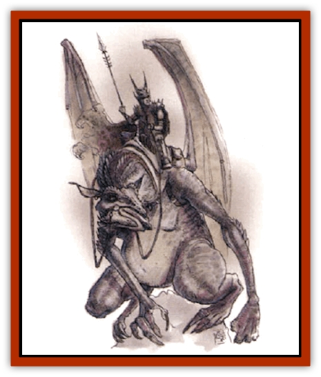
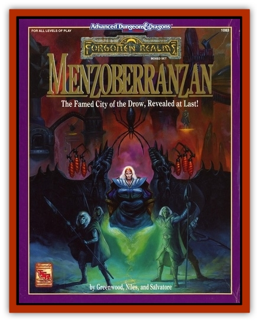

# Foulwing

| Statistic | **Foulwing** |
| --- | --- |
| **Activity Cycle:** | Any |
| **Alignment:** | Neutral evil |
| **Armor Class:** | 3 |
| **Climate/Terrain:** | Any land |
| **Damage/Attack:** | 2-5/2-5/2-5/1-4/1-4 |
| **Diet:** | Carnivore |
| **Frequency:** | Rare |
| **Hit Dice:** | 6 |
| **Intelligence:** | Low (5-7) |
| **Magic Resistance:** | Nil |
| **Morale:** | Elite (14) |
| **Movement:** | 6, Fl 13 (D) |
| **No. Appearing:** | 1-4 |
| **No. of Attacks:** | 5 |
| **Organization:** | Flock |
| **Size:** | H (16-20' long, 40' wingspan) |
| **Special Attacks:** | Ammonia breath, blood drain |
| **Special Defenses:** | Nil |
| **THAC0:** | 15 |
| **Treasure:** | Nil |
| **XP Value:** | 975 |

Foulwings are grotesquely misshapen flying predators, thought to have originated on another plane. Mildly empathic and essentially lazy hunters, these clumsy fliers are often tamed for use as steeds by evil humans and [[Elf_Drow|drow]] hunting in the surface world by night.

Foulwings have black, leathery wings, tailless, toad-shaped bodies, and vaguely horse-like heads. The shapes of their heads and the location and size of the many horn-shaped, wriggling skin growths that cover their black bodies vary from individual to individual. Every foulwing has three needle-toothed jaws set around a single-nostril snout. Their glowing, many-faceted red eyes have infravision (range: 90')

Foulwings communicate with each other in harsh creakings, conveying identities, basic emotions, urges, and warnings.

**Combat:** Foulwings prefer to fight in the air, or pounce from it, allowing them use of their wing-claws and the weight of their wings and great bulk, to knock down and pin prey to the ground. Savage and wantonly destructive, foulwings enjoy killing. They twist their heads in battle so as to bite with all their jaws, and their ammonia-like breath causes opponents to temporarily (round of contact and following round) suffer -1 on attack rolls due to the stinging irritation it causes to visual and olfactory senses.

If a foulwing disables or pins prey (a Strength of at least 16 is required to escape pinning unaided; allow one Strength Check per round), it will attempt to leisurely drain blood from the prey by sucking with one of its hollow, tube-like tongues, biting open wounds to do so. The blood drain is equal to 2-5 points a round; pulling free causes prey another 2 points of damage (each time).

When used as a steed, a Foulwing flies at MV 11 (E), and its powerful flight settles (in 1d3 rounds) into a rhythm stable enough to allow riders to cast spells and use missile weapons without penalty. In a pinch, two M-size beings (or up to 4 S-sized creatures) can ride a single Foulwing, but the crowding makes spellcasting impossible, and all weapon uses force both -3 attack roll penalties, and a Dexterity Check (to avoid falling off!) on every rider. A Foulwing this heavily laden is reduced to MV 9 (E).

Foulwings can be trained to pounce upon running or riding creatures from the air, doing 2d4 points of impact damage and trying to pin the quarry (the target is allowed a Dexterity Check to avoid this fate), and to crush fences, flimsy buildings, and carts by the same means. If there is a chance that the Foulwing could be impaled on a ready-held spear, wooden spar, or similar piercing point, it must make a Dexterity Check. If the check succeeds, the Foulwing takes only half weapon damage (in the case of a deliberately-placed or -wielded weapon), or 1d4 points of damage from a wreckage hazard. If the check fails, full weapon damage is suffered, or 3d4 points is taken from wreckage.

**Habitat/Society:** Foulwings may be solitary hunters, or flock together in family groups or as unrelated individuals, gathering while courting or to attack strong prey. Every "flock" (of up to four foulwings) will be dominated by the largest specimen, and will work together to scatter, disable, and herd prey.

**Ecology:** Foulwings are rapacious scavengers, but will eat carrion or even plant leaves if no other food is available. They have been known to keep a "larder" of captive creatures for later food. Foulwings hate [[Asperii|asperii]] and [[Griffon|griffons]], and will attack both on sight.

Foulwings bear live young, typically 1-3 at once, nesting in rocky, mountainous wilderland areas. Young are born with a single hit dice, and only bite attacks (for 1-2 damage, each jaw), but rapidly grow to full size, whereupon the parents abandon them and each other.

Foulwing flesh is heavy, oily, and foul in taste (hence the creature's name). It quickly rots upon the creature's death, and has no known usefulness as armor or in magical practices. Foulwing blood and salivary fluid, however, have both been found to be a mildly caustic cleanser that brings metal to a bright, long-lasting sheen.

---
## Discovery & Documentation

**Source Publication:** Menzoberranzan (1992)
**Campaign Setting:** Forgotten Realms
**Author(s):** Greenwood, Niles, and Salvatore

### Other Creatures Found in This Source Book
   * [[Alhoon|Alhoon]]
   * [[Cloaker_Lord|Cloaker Lord]]
   * [[Lizard_Subterranean_Toril|Lizard, Subterranean (Toril)]]
   * [[Riding_Lizard|Riding Lizard]]
   * [[Wingless_Wonder|Wingless Wonder]]
