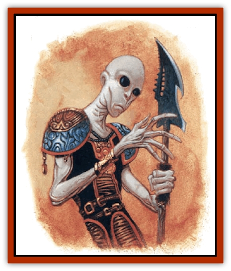

# Fraal

| Statistic | **Fraal** |
| --- | --- |
| **Activity Cycle:** | Any |
| **Alignment:** | Lawful neutral |
| **Armor Class:** | 8 (or 2) |
| **Climate/Terrain:** | Any |
| **Damage/Attack:** | By weapon |
| **Diet:** | Herbivore |
| **Frequency:** | Very rare |
| **Hit Dice:** | 2 |
| **Intelligence:** | High to genius (13-18) |
| **Magic Resistance:** | Nil |
| **Morale:** | Elite (14) |
| **Movement:** | 12 |
| **No. Appearing:** | 7-12 (10%: 2-8) |
| **No. of Attacks:** | 1 |
| **Organization:** | Company |
| **Size:** | M (5' tall) |
| **Special Attacks:** | Psionic use, devices |
| **Special Defenses:** | Psionic use, devices |
| **THAC0:** | 19 |
| **Treasure:** | Special |
| **XP Value:** | Varies |

**Psionics Summary**

| Level | Dis/Sci/Dev | Attack/Defense | Score | PSPs |
| --- | --- | --- | --- | --- |
| 2 | 4/6/17 | All/All | 15 | 75+1d20 |

Sometimes known simply as the *visitors*, the psionic fraal are highly evolved and sophisticated humanoids from somewhere else. Some sages speculate that these visitors come from either another plane of existence or perhaps from another world within the Prime Material Plane. Of seemingly fragile build, the fraal rely on devices of unusual workmanship and power to protect themselves. These devices are not magical; in fad, the fraal know almost nothing of magic.

The fraal are thin humanioids, averaging about five feet in height. They can be distinguished by their large eyes, their pale, almost luminous skin, their swept-back ears, and their round heads. Most fraal encountered so far have been bald, although some individuals have been encountered who have wisps of silver, white, or pale-yellow hair. A most disconcerting element is that all fraal display a wizened countenance, much like the eldest of wizards.

The frail are natural telepathic and can telepathically communicate with creatures of low intelligence or better. Wether they have a verbal language of their own is uncertain, though they have never been seen to converse verbally among themselves. They have been known to speak Common to those not of their kind, though they speak it slowly and with some difficulty. Their words display a quiet demeanor and they are not given to excitement or violent emotion.

**Combat:** The fraal avoid confrontation whenever possible, negotiating when able and fleeing when communication fails. Indeed, fraal seem more interested in observing violence than taking part in it themselves. Witnesses agree that fraal have been drawn to violence and spectacular conflict. Their behavior is almost childlike as they watch physical combat with wonder and an almost clinical detachment. If fraal should find combat unavoidable, they rely upon their psionic talents, which they call *mindwalking*, to defend themselves. Even more rarely, fraal use alien devices of great power to dissuade attackers.

The fraal are highly intelligent, using their psionic talents and their unusual devices to best advantage. Fraal almost always operate in groups of seven or more. These small companies prove very effective at eluding and countering enemy threats; most attribute the fraal cohesion to their extensive use of telepathy.

In psionic combat, the fraal incapacitate and neutralize opponents rather than making lethal attacks. However, they don't seem adverse to prying into others' thoughts, dominating minds, or even erasing memories when necessary.

No more than one fraal in three will have a device that can deliver a ranged attack. Two different types of fraal ranged devices have been seen: *firerods* and *firestaves*. These devices and others that the fraal employ do not radiate any magical signature. The fraal seem reluctant to use their fire devices unless absolutely necessary. Most learned sages suspect that this involves a religious taboo against fire, but no one knows for sure. Communication with the fraal has revealed little, as they babble on about a morality of "limited resource development" and "conversationism" whenever the subject is broached.

**Habitat/Society:** Fraal are not native to the Prime Material plane - at least, not this one. The accepted theory is that the fraal are planewalkers who have somehow lost the ability to traverse the planes and have become stranded. Others claim that the fraal are denizens of another crystal sphere who have crashed their spelljamming ship here. One element is common to all accounts of the fraal and their origin: the fraal have sucessfully conveyed that they have arrived on the Prime Material plane accidentally, and do not possess a means to travel home. A ranger claiming to have a fraal encounter reported that they revealed that the "Dark Master" that gave their floating world life has fallen asleep and must be awakened. While such reports make many believe that the fraal are evil, this doesn't seem to be the case. Estimates place fraal population at less than a 1,000. Only recently has the existence of fraal children been confirmed. Even more recently it has been learned that the fraal, long-lived though they may be, are not immortal.

For every five fraal encountered, there will be a team leader of 4 HD with 80+3d12 PSPs. This leader is usually referred to as simply "captain", but bears no obvious marks or symbols of rank or precedence. If more than 50 fraal are encountered, four captains (4 HD, as above) and one great captain (6 HD, 90+4d10 PSPs) will be present.

To date, no major fraal cities or communities have been found. Fraal are nearly always encountered in small groups, wandering from one place to the next. These groups display intense curiosity about the natural world; they seem unfamiliar with even the most common forms of local fauna and flora. The diversity of humanoid races also seems shocking to these visitors - fraal discussions of "radical genetic diversity" have been witnessed by many of those who have encountered them. Finally, the fraal seem completely amazed by well-known monsters and even the smallest displays of magic. To date, no fraal magician or priest has been encountered.

Much like explorers and cartographers, the fraal measure and record their findings as they wander over all types of terrain. As the fraal presence becomes more widely known, the visitors are still occasionally attacked and slain by those who believe them to be lesser [[Tanar'ri_General_Information|tanar'ri]] or some other form of evil creature.

Little is known about fraal culture. They display an obvious distaste for physical labor, and a deep respect for developments and accomplishments of the mind. They also appear to be a deeply religious people, given to frequent meditation and communal worship. What powers the fraal venerate are unknown.

**Ecology:** The fraal are vegetarians, consuming a great variety of plants and processed agricultural products. They are known to be especially suspicious of new foods and new life forms, but after careful inspection they have proved themselves willing to try just about anything. A fraal appears to have a lifespan of about four or five centuries.

Magical research and sagecraft have little to say about this mysterious new race of beings, although sightings have been growing more common over the last few decades. Indeed, only a few years ago the existence of the fraal was discounted as the product of imagination, rumor, or even illusionary sorcery. Tody, conflict rages among the learned, who argue about the exact origin of these travelers.

**Other Fraal**

  The fraal, among themselves, have a number of specialists. These include *biokineticists* (healers), *ESPions* (advisor-spies), *mystics* (reputed to see the past and future), and very rarely, a *biowarrior* (a psionic soldier).

---
## Discovery & Documentation

**Source Publication:** Monstrous Compendium, 1997 Annual, Volume 4 (1995)
**Campaign Setting:** Advanced Dungeons & Dragons 2nd Edition
**Author(s):** Jon Pickens

### Other Creatures Found in This Source Book
   * [[Anemone_Giant_Sea|Anemone, Giant Sea]]
   * [[Asperii|Asperii]]
   * [[Bainligor|Bainligor]]
   * [[Beast_of_Chaos|Beast of Chaos]]
   * [[Blindheim|Blindheim]]
   * [[Bloodsipper_Far_Realm|Bloodsipper (Far Realm)]]
   * [[Bulette_Gohlbrorn|Bulette, Gohlbrorn]]
   * [[Child_of_the_Sea|Child of the Sea]]
   * [[Clockwork_Horror|Clockwork Horror]]
   * [[Clockwork_Swordsman|Clockwork Swordsman]]
   * [[Coral|Coral]]
   * [[Darklore|Darklore]]
   * [[Dharculus|Dharculus]]
   * [[Dolphin_Athas|Dolphin (Athas)]]
   * [[Dragon_Neutral_Moonstone|Dragon, Neutral, Moonstone]]
   * [[Dragon_Prismatic|Dragon, Prismatic]]
   * [[Dream_Stalker|Dream Stalker]]
   * [[Dragon-kin_Albino_Wyrm|Dragon-kin, Albino Wyrm]]
   * [[Echyan|Echyan]]
   * [[Firestar|Firestar]]
   * [[Firetail|Firetail]]
   * [[Fish_Ascallion|Fish, Ascallion]]
   * [[Fish_Deep_Ocean|Fish, Deep Ocean]]
   * [[Fish_Tropical|Fish, Tropical]]
   * [[Fish_Vurgens|Fish, Vurgens]]
   * [[Fogwarden|Fogwarden]]
   * [[Giant_Crag|Giant, Crag]]
   * [[Gibberling_Brood|Gibberling, Brood]]
   * [[Glutton_Sea|Glutton, Sea]]
   * [[Golden_Ammonite|Golden Ammonite]]
   * [[Golem_Brass_Minotaur|Golem, Brass Minotaur]]
   * [[Golem_Gemstone|Golem, Gemstone]]
   * [[Golem_Maggot|Golem, Maggot]]
   * [[Groundling|Groundling]]
   * [[Hermit_Sea|Hermit, Sea]]
   * [[Hound_of_Law|Hound of Law]]
   * [[Human_Amazon|Human, Amazon]]
   * [[Human_Pygmy|Human, Pygmy]]
   * [[Inquisitor|Inquisitor]]
   * [[Kercpa|Kercpa]]
   * [[Kreel|Kreel]]
   * [[Lycanthrope_Lythari|Lycanthrope, Lythari]]
   * [[Mercurial|Mercurial]]
   * [[Mold_Chromatic|Mold, Chromatic]]
   * [[Mummy_Bog|Mummy, Bog]]
   * [[Neh-thalggu|Neh-thalggu]]
   * [[Nymph_Grain|Nymph, Grain]]
   * [[Nymph_Unseelie|Nymph, Unseelie]]
   * [[Octopus_Octo-Jelly|Octopus, Octo-Jelly]]
   * [[Puddingfish|Puddingfish]]
   * [[Sea_Demon|Sea Demon]]
   * [[Shade|Shade]]
   * [[Shadowrath|Shadowrath]]
   * [[Shark_Athas|Shark (Athas)]]
   * [[Siren_Ravenloft|Siren (Ravenloft)]]
   * [[Skeleton_Variant|Skeleton, Variant]]
   * [[Skyfish|Skyfish]]
   * [[Spectral_Scion|Spectral Scion]]
   * [[Spyder_Fiend|Spyder Fiend]]
   * [[Squid_Squark|Squid, Squark]]
   * [[Tanar'ri_Lesser_Uridezu|Tanar'ri, Lesser, Uridezu]]
   * [[Troll_Mutate|Troll Mutate]]
   * [[Vaati|Vaati]]
   * [[Vampire_Cerebral|Vampire, Cerebral]]
   * [[Varkha|Varkha]]
   * [[Wizshade|Wizshade]]
   * [[Worm_Lukhorn|Worm, Lukhorn]]
   * [[Wyste|Wyste]]
   * [[Yugoloth_Lesser_Gacholoth|Yugoloth, Lesser, Gacholoth]]
   * [[Zombie_Mud|Zombie, Mud]]
