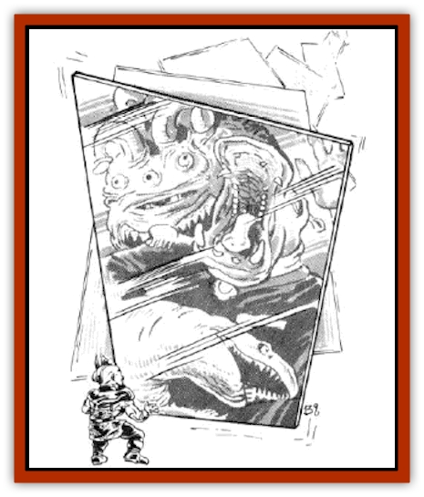

# Fractine

| Statistic | **Fractine** |
| --- | --- |
| **Activity Cycle:** | Always |
| **Alignment:** | Neutral |
| **Armor Class:** | -1 |
| **Climate/Terrain:** | Any space |
| **Damage/Attack:** | 2-8 |
| **Diet:** | Light and magic |
| **Frequency:** | Very rare |
| **Hit Dice:** | 6-13 |
| **Intelligence:** | Unknown |
| **Magic Resistance:** | 25% |
| **Morale:** | Fearless (20) |
| **Movement:** | Fl 1 to 24 (A) |
| **No. Appearing:** | 1 |
| **No. of Attacks:** | Area of effect (1 sq. ft. per HD) |
| **Organization:** | Solitary |
| **Size:** | H (1 sq. ft. per HD) |
| **Special Attacks:** | See below |
| **Special Defenses:** | See below |
| **THAC0:** | 6 HD: 15 / 7-8 HD: 13 / 9-10 HD: 11 / 11-12 HD: 9 / 13 HD: 7 |
| **Treasure:** | Nil |
| **XP Value:** | 6 HD: 2,000 (+1,000 per additional HD) |

Fractines appear as two-dimensional, mirrored, trapezoidal planes. When at rest, fractines resemble vast mirrors and can be manipulated to function as excellent scrying mirrors. To do so, a spelljamming scholar must focus his willpower on the subject he wishes to view, while touching a fractine. A Wisdom check (modified by a DM-selected difficulty penalty of -1 to -10) must succeed to view the subject. Failure results in 1d10 turns of exhaustion and a 10% chance that the fractine is stirred into motion, One can examine a subject's past, future, and weaknesses using the right techniques. However, the fractine's distorted surface may blur the results, obscuring crucial information.

Fractines are most commonly encountered in space in an active state, tumbling or folding and refolding like a piece of origami. They react to a variety of stimuli. They are attracted to motion, loud sounds, and magical energy. However, large bursts of energy (such as a *fireball* or *lightning bolt*) repulse fractines for 1d4 rounds. Spells affecting air can be used to control fractines. (The caster must roll a successful saving throw vs. spell each round or lose control.)

**Combat:** A fractine causes a variety of harmful, distortional efects. Physical attacks may be used to destroy or alter its course, but only silver or magical weapons or spells cause any damage. Furthermore, a fractine must be struck on one of its two faces to cause any damage.

Any physical damage to a fractine causes damage to the attacker. The attacker suffers 1d4x25% of the inflicted damage (round fractions up), though he receives a saving throw vs. petrification to suffer only half damage.

Once per round there is a 1% chance per point of damage inflicted that a fractine shatters into 1d4 independent fragments, each with one-third of the remaining HD and hp (shattering releases any held creatures).

A fractine receives a saving throw vs. any magical effect, if the effect gets past its magic resistance. If the saving throw is successful, the magical effect is redirected at random.

A fractine attacks by falling on its targets. The fractine passes through its victims, causing 2d4 points of damage and forcing a saving throw vs. breath weapon to avoid a special effect. If the saving throw fails, roll 1d20 for the effect.

| Roll | Effect |
| --- | --- |
| 1-3 | Blink (random direction and orientation) |
| 4-5 | Teleport (1d4x10 feet into air) |
| 6-7 | Deport* (Character's mind views his body from another plane; must roll Wisdom checks each round to control) |
| 8-9 | Turn ethereal* (AbIe to cast magic only, intangible) |
| 10-12 | Distortion* (Character's form suffers a distortion, DM's choice - Effects may shorten or lengthen limbs, make fat or thin, flatten, stretch, etc. A Dexterity check must succeed each round to perform any desired actions. |
| 13 | Transpose* (Part of body is exchanged with that of another victim, or it vanishes. Roll an Intelligence check to control body part.) |
| 14 | Reversed* (Any action the character takes becomes reversed) |
| 15 | Duplication** (Creates a duplicate of character; duplicate attacks) |
| 16-20 | Trap (As a mirror of life trapping; there is a 25% chance that another creature is released at the same time) |

* Effect lasts 1d4 rounds.
** Effect lasts 2d4+2 rounds.

**Habitat/Society:** It is not known whether fractines are intelligent creatures or merely spatial phenomena. Shattered fragments either follow divergent paths or merge once again.

**Ecology:** Fractines consume life, light, darkness, and magical energy. Each level, Hit Dice, spell level, and bonus provides 1 point of food. When a fractine has consumed a number of points equal to its total hit points, it leaves. Its movement rate is increased by 1 per point of light consumed and decreased by 1 per point of darkness (maximum of 24 and minimum of 1).

---
## Discovery & Documentation

**Source Publication:** MC7 Spelljammer Appendix I (1990)
**Campaign Setting:** Advanced Dungeons & Dragons 2nd Edition
**Author(s):** various

### Other Creatures Found in This Source Book
   * [[Aartuk|Aartuk]]
   * [[Albari|Albari]]
   * [[Ancient_Mariner|Ancient Mariner]]
   * [[Argos|Argos]]
   * [[Beholder_Abomination_Astereater|Beholder (Abomination), Astereater]]
   * [[Blazozoid|Blazozoid]]
   * [[Chattur|Chattur]]
   * [[Chevall|Chevall]]
   * [[Clockwork_Horror|Clockwork Horror]]
   * [[Colossus|Colossus]]
   * [[Delphinid|Delphinid]]
   * [[Dizantar|Dizantar]]
   * [[Dog|Dog]]
   * [[Dog_Bog_Hound|Dog, Bog Hound]]
   * [[Esthetic|Esthetic]]
   * [[Focoid|Focoid]]
   * [[Giant_Spacesea|Giant, Spacesea]]
   * [[Golem_Furnace|Golem, Furnace]]
   * [[Golem_Radiant|Golem, Radiant]]
   * [[Gravislayer|Gravislayer]]
   * [[Grommam|Grommam]]
   * [[Hadozee|Hadozee]]
   * [[Hamster_Giant_Space|Hamster, Giant Space]]
   * [[Jammer_Leech|Jammer Leech]]
   * [[Lakshu|Lakshu]]
   * [[Lumineaux|Lumineaux]]
   * [[Lutum|Lutum]]
   * [[Mimic_Space|Mimic, Space]]
   * [[Misi|Misi]]
   * [[Moon_Rogue|Moon, Rogue]]
   * [[Mortiss|Mortiss]]
   * [[Murderoid|Murderoid]]
   * [[Nay-Churr|Nay-Churr]]
   * [[Phlog-Crawler|Phlog-Crawler]]
   * [[Plasman|Plasman]]
   * [[Plasmoid_DeGleash|Plasmoid, DeGleash]]
   * [[Plasmoid_DelNoric|Plasmoid, DelNoric]]
   * [[Plasmoid_General_Information|Plasmoid, General Information]]
   * [[Plasmoid_Ontalak|Plasmoid, Ontalak]]
   * [[Puffer|Puffer]]
   * [[Q'nidar|Q'nidar]]
   * [[Rastipede|Rastipede]]
   * [[Reigar|Reigar]]
   * [[Rock_Hopper|Rock Hopper]]
   * [[Slinker|Slinker]]
   * [[Spider_Asteroid|Spider, Asteroid]]
   * [[Spiritjam|Spiritjam]]
   * [[Survivor|Survivor]]
   * [[Syllix|Syllix]]
   * [[Symbiont_Power|Symbiont, Power]]
   * [[Vine_Infinity|Vine, Infinity]]
   * [[Wiggle|Wiggle]]
   * [[Wizshade|Wizshade]]
   * [[Wryback|Wryback]]
   * [[Zard|Zard]]
   * [[Zodar|Zodar]]
