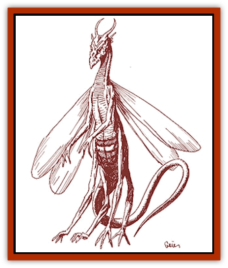

# Frelôn

| Statistic | **Frelôn** |
| --- | --- |
| **Activity Cycle:** | Any |
| **Alignment:** | Chaotic evil |
| **Armor Class:** | 3 |
| **Climate/Terrain:** | Temperate forests and hills |
| **Damage/Attack:** | 1d4/1d4/2d6/1d6 |
| **Diet:** | Carnivore |
| **Frequency:** | Very rare |
| **Hit Dice:** | 6+3 |
| **Intelligence:** | Average (8-10) |
| **Magic Resistance:** | 10% |
| **Morale:** | Fanatic (17-18) |
| **Movement:** | 8, Fl 18 (C) |
| **No. Appearing:** | 1d4 |
| **No. of Attacks:** | 4 |
| **Organization:** | Solitary |
| **Size:** | L (7' tall) |
| **Special Attacks:** | Poison |
| **Special Defenses:** | Nil |
| **THAC0:** | 13 |
| **Treasure:** | Nil |
| **XP Value:** | 2,000 |

The frelôn were originally created by [[Dragon_Savage_Coast_General_Information|dragons]] to serve a specific function: to seek and destroy the hated [[Aranea_Savage_Coast|araneas]]. They have since grown beyond this function, evolving into mysterious, yet very dangerous, creatures.

A frelôn looks like a cross between a dragon and a wasp. Its long, skinny body segments into two sections, though not quite the abdomen-and-thorax arrangement of a normal insect. Two pairs of long legs cause it to stand upright at 7 feet tall. A whiplike tail with a stinger extends from the base of the body, constantly snaking about as if restless to attack. The creature's upper pair of arms end in small claws that are capable of raking attacks and grasping small objects. The dragonlike head seems small for such a large creature, but its dangerous mouth is filled with a double row of tiny but sharp teeth. Head to tail, the creature is armored with mostly black scales, though it usually has several decorative bands of red or blue circling its lower body or running in striped patterns on the upper body and head. The frelôn possesses a set of wings, similar to those of a [[Dragonfly|dragonfly]]. These semi-transparent wings shimmer with a hint of reflected color.

Frelôns communicate with each other through buzzes, hums, and clicks. They also share an abbreviated language with all evil dragons and can still make themselves understood to the descendants of their creators.

**Combat:** The frelôn attacks mostly for food. It has grown fond of the taste of human and demihuman flesh and eats it as often as possible. The creature prefers aerial combat, where it can wrap its tail underneath and use all four attacks. However, a frelôn cannot attack creatures on the ground without landing first, because of its size and slow maneuverability. On the ground, the frelôn attacks with its forward claws and its bite. If fighting multiple opponents, the frelôn will fly off with the first one to fall. If the frelôn loses over half of its hit points, it will attempt to flee.

If the frelôn is attacking for the purpose of its created function, if it decides to flee, or if a victim proves too tenacious and the frelôn cannot escape, the creature will rely on its stinging attack. The frelôn will turn sideways, so it may attack its victim with one claw as well as the stinger. If multiple creatures attack the frelôn at melee range, the frelôn will always attack the first with conventional attack methods and the second with its stinger. The effects of the sting attack are described below. After a successful sting attack, the frelôn will withdraw from combat, flying to safety.

The frelôn can fly 180 feet per round. It cannot ascend more steeply than 45 degrees, moving 90 feet forward and 90 feet up. Descending, the frelôn can move 180 feet both forward and down. Because the frelôn's flight is magical, it can lift up to 200 pounds without penalty, and it can carry up to a maximum of 400 pounds at half its Movement Rate and a maneuverability class of D. The creature's wings also magically regenerate. Even if the wings are completely destroyed, the frelôn regains them within three turns. This regeneration does not heal lost hit points; it just allows use of the wings. Unlike other creatures, the frelôn can fly regardless of hit point damage to its body.

The sting of a frelôn produces several effects. Besides suffering 1d6 points of damage, any sting victim must make a successful saving throw vs. poison or fall unconscious for 2d4 rounds and suffer 1d4 turns of memory loss. After a successful sting attack, the frelôn always abandons the victim, even if hunting. This is because the stinger also acts as a syringe, inserting tiny eggs into the wound. Unless high-level magic (*heal*, *limited wish*, etc.) is used to immediately treat the wound, a young frelôn will eventually emerge and fly away. As most victims do not remember the frelôn attack due to memory loss, they rarely seek the help they need. Frelôns can inject their poison and eggs only once every two days.

Frelôn young begin to hatch after two weeks. For the next week, the victim suffers the loss of 1 hit point per day, as several of the tiny young feed on their host and each other. By the second week, only one frelôn is left, but its continued feeding causes the loss of 2 hit points per day. This loss accompanies waves of nausea and muscle pains as if the victim has contracted a disease or a case of food poisoning. During and after the second week, the surviving frelôn can influence its host as per a domination spell once every 24 hours. During the third and fourth weeks, the creature limits itself to only 1 hit point every few days (as if the victim might be getting better) though the nausea and muscle spasms will increase slightly.

The young frelôn can actually live in its host for up to one month before emerging for other nourishment. Its emergence forces the victim to attempt a saving throw vs. death magic. Failure indicates death, while success limits the effect to 4d8 points of damage. The emergence wound must be treated for disease and magically healed within 48 hours, or the victim will fall ill, dying within one week unless a *wish* or *regenerate* spell is used.

**Habitat/Society:** When fighting the araneas, the dragons created a new life form to be the bane of this spider race. They stripped away a part of themselves (and borrowed from a few other creatures) to create the frelôn. They endowed this predatory creature with the desire to seek and destroy the araneas, the Intelligence needed for both surviving in this harsh land and finding the reclusive spider people, and the natural abilities that make the frelôn a deadly hunter. The frelôns were designed as solitary creatures to make destroying large numbers of them at a time almost impossible. Each creature reaches maturity within six months and can then lay eggs, hopefully in an aranea. No mate is required for reproduction. The *domination* ability is for forcing a host to lead the frelôn to other araneas.

Frelôns threatened aranean settlements for centuries. For quite a bit of that time, the araneas were not even sure what danger they faced. However, when the Immortal patron of the dragons retired from the Conflict, the araneas again possessed a superior wealth of magic.

The araneas also discovered a weakness in the single-minded directive given to the frelôn that they were able to exploit. The dragons had not counted on the dual nature of the araneas. By revealing the aranean humanoid aspect to the frelôns, the araneas managed to confuse them and divert a majority of the threat. In an effort to fulfill their mission of destruction, the frelôns began to hunt all humanoid creatures.

This change of focus spread the frelôns throughout the lands of the Savage Coast and into surrounding areas. Even as far as the Arm of the Immortals, the [[Ee'aar|ee'aar]] were forced to launch a major campaign to eradicate the frelôn presence there. As the creatures spread, the araneas were also able to bring the menace under some semblance of control in Herath.

Today, frelôns seek the destruction of all humanoid races in their search for araneas. They do not care for treasure or power, taking only what they need to survive. At times they ally with nonhumanoid, intelligent creatures.

**Ecology:** The frelôns prey on humanoid races of any type, affecting the ecology at one of the highest levels possible. Their Intelligence makes them very dangerous foes. One frelôn, in the absence of any true opposition, can decimate a small village by attacking a few remote homes and planting eggs. Within a few months, dozens of young frelôns swarm the surrounding countryside.

At this point, it is unlikely that the dragons could stop this experiment gone awry, and it is unsure whether they would even want to. Crimson dragons have actually been known to convince frelôns to join them as guardians and servants. Lucky for the humanoid races, the frelôns still remain separate from one another, as they were originally designed. If they were to begin constructing social ties and communities, working together toward their common goal, their power would multiply accordingly.

Fortunately, the races are aware that the frelôn pose a threat to their lives. Larger cities usually post a bounty on the creatures. Wizards, alchemists and priests will pay well for frelôn body parts because of their usefulness in a variety of magical preparations. Some of the creature's smaller scales are necessary for *crimson essence*. Pieces of the creature's wings can be brewed into a *potion of flying*. Potions of *domination* can be formed from the frelôn's brain, if the frelôn is caught young enough.

Some parts of the creature do not even require enchantment to be of benefit. The poison from one frelôn is enough to coat a blade three times or an arrow six times. One dose will cause paralysis for 1d4 rounds, negated by a successful saving throw vs. poison. Some frelôns (25%) possess 5d4 scales which will each act as one ounce of *cinnabryl*, depleting in the normal fashion. These are formed when a young frelôn is exposed to the magical interaction between cinnabryl and someone possessing a Legacy. These scales are usually the colored ones up around the head. Once they are depleted, they are of no further use.

---
## Discovery & Documentation

**Source Publication:** Monstrous Compendium Savage Coast Appendix (Online Exclusive) (1995)
**Campaign Setting:** Mystara
**Author(s):** Loren L Coleman, Ted James, Thomas Zuvich, Cindi M. Rice

### Other Creatures Found in This Source Book
   * [[Aranea_Savage_Coast|Aranea (Savage Coast)]]
   * [[Arashaeem|Arashaeem]]
   * [[Batracine|Batracine]]
   * [[Cat_Marine|Cat, Marine]]
   * [[Cinnavixen|Cinnavixen]]
   * [[Clockwork_Swordsman|Clockwork Swordsman]]
   * [[Critter_Temple|Critter, Temple]]
   * [[Cursed_One|Cursed One]]
   * [[Deathmare|Deathmare]]
   * [[Dragon_Savage_Coast_Crimson|Dragon (Savage Coast), Crimson]]
   * [[Dragon_Savage_Coast_Red_Hawk|Dragon (Savage Coast), Red Hawk]]
   * [[Echyan|Echyan]]
   * [[Ee'aar|Ee'aar]]
   * [[Enduk|Enduk]]
   * [[Fachan_Savage_Coast|Fachan (Savage Coast)]]
   * [[Feliquine|Feliquine]]
   * [[Fiend_Narvaezan|Fiend, Narvaezan]]
   * [[Ghriest|Ghriest]]
   * [[Glutton_Sea|Glutton, Sea]]
   * [[Goatman|Goatman]]
   * [[Golem_Naâruk|Golem, Naâruk]]
   * [[Golem_Savage_Coast|Golem (Savage Coast)]]
   * [[Grudgling|Grudgling]]
   * [[Heraldic_Servant_I|Heraldic Servant I]]
   * [[Heraldic_Servant_II|Heraldic Servant II]]
   * [[Heraldic_Servant_III|Heraldic Servant III]]
   * [[Heraldic_Servant_IV|Heraldic Servant IV]]
   * [[Heraldic_Servant_V|Heraldic Servant V]]
   * [[Heraldic_Servant_General_Information|Heraldic Servant, General Information]]
   * [[Hermit_Sea|Hermit, Sea]]
   * [[Jorri|Jorri]]
   * [[Juhrion|Juhrion]]
   * [[Kla'a-tah|Kla'a-tah]]
   * [[Leech_Legacy|Leech, Legacy]]
   * [[Lich_Inheritor|Lich, Inheritor]]
   * [[Lizard_Kin_Savage_Coast|Lizard Kin (Savage Coast)]]
   * [[Lupasus|Lupasus]]
   * [[Lupin|Lupin]]
   * [[Lyra_Bird_Saragón|Lyra Bird, Saragón]]
   * [[Malfera|Malfera]]
   * [[Manscorpion_Nimmurian|Manscorpion, Nimmurian]]
   * [[Mythuínn_Folk|Mythuínn Folk]]
   * [[Neshezu|Neshezu]]
   * [[Nikt'oo|Nikt'oo]]
   * [[Nosferatu|Nosferatu]]
   * [[Omm-wa|Omm-wa]]
   * [[Omshirim|Omshirim]]
   * [[Parasite_Savage_Coast|Parasite (Savage Coast)]]
   * [[Phanaton|Phanaton]]
   * [[Plant_Savage_Coast|Plant (Savage Coast)]]
   * [[Pudding_Vermilion|Pudding, Vermilion]]
   * [[Rakasta|Rakasta]]
   * [[Ray_Forest|Ray, Forest]]
   * [[Shedu_Greater_Savage_Coast|Shedu, Greater (Savage Coast)]]
   * [[Shimmerfish|Shimmerfish]]
   * [[Skinwing|Skinwing]]
   * [[Spawn_of_Nimmur|Spawn of Nimmur]]
   * [[Spider-spy|Spider-spy]]
   * [[Spirit_Heroic|Spirit, Heroic]]
   * [[Spirit_Walleran|Spirit, Walleran]]
   * [[Succulus|Succulus]]
   * [[Swampmare|Swampmare]]
   * [[Symbiont_Shadow|Symbiont, Shadow]]
   * [[Tortle|Tortle]]
   * [[Troll_Legacy|Troll, Legacy]]
   * [[Trosip|Trosip]]
   * [[Tyminid|Tyminid]]
   * [[Utukku|Utukku]]
   * [[Voat|Voat]]
   * [[Voat_Herathian|Voat, Herathian]]
   * [[Vulturehound|Vulturehound]]
   * [[Wallara|Wallara]]
   * [[Wurmling|Wurmling]]
   * [[Wynzet|Wynzet]]
   * [[Yeshom|Yeshom]]
   * [[Zombie_Red|Zombie, Red]]
