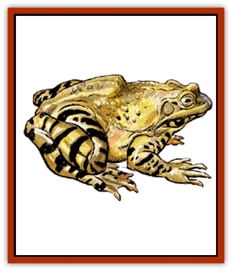

# Frog

| Statistic | **Giant** | **Killer** | **Poisonous** |
| --- | --- | --- | --- |
| **Activity Cycle:** | Any | Any | Any |
| **Alignment:** | Nil | Nil | Nil |
| **Armor Class:** | 7 | 8 | 8 |
| **Climate/Terrain:** | Any fresh water | Any fresh water | Any fresh water |
| **Damage/Attack:** | 1-3/1-6/2-8 | 1-2/1-2/2-5 | 1 |
| **Diet:** | Carnivore | Carnivore | Insectivore |
| **Frequency:** | Uncommon | Very rare | Rare |
| **Hit Dice:** | 1-3 | 1+4 | 1 |
| **Intelligence:** | Non- (0) | Non- (0) | Non- (0) |
| **Magic Resistance:** | Nil | Nil | Nil |
| **Morale:** | Average (8) | Unsteady (6) | Unsteady (6) |
| **Movement:** | 3, Sw 9 | 6, Sw 12 | 3, Sw 9 |
| **No. Appearing:** | 5-40 | 3-18 | 2-12 |
| **No. of Attacks:** | 1 | 3 | 1 |
| **Organization:** | Pack | Pack | Pack |
| **Size:** | T-M (2-6' long) | S (3' long) | T (6&rdquo;-1' long) |
| **Special Attacks:** | Tongue and swallow whole | Nil | Nil |
| **Special Defenses:** | Nil | Nil | Poison |
| **THAC0:** | 1 HD: 19 / 2-3 HD: 16 | 18 | 19 |
| **Treasure:** | Nil | Nil | Nil |
| **XP Value:** | 1 HD: 120 / 2 HD: 175 / 3 HD: 270 | 35 | 65 |

Giant frogs resemble their more common relatives in everything but size. Their enormous size means that they consider larger creatures as a source of food, making small creatures and even demihumans possible prey.

A giant frog can range from 2 to 6 feet in length and weigh between 50 and 250 pounds (a 2-foot frog weighs 50 pounds, adding 50 pounds for each additional foot of length). Frogs with 1 Hit Die are 2 feet long, while those 2 to 4 feet long have 2 Hit Dice, and those over 4 feet long have 3 Hit Dice.

The distance that a giant frog can jump is based upon its weight, with the maximum jumping distance for a 50-pound frog being 180 feet. Subtract 20 feet for every additional 50 pounds the frog weighs. A giant frog cannot jump backward or directly to either side, but can leap 30 feet straight up.

**Combat:** Because of its camouflaging color, a giant frog surprises opponents easily (-3 penalty to opponents' surprise rolls) when in its natural habitat. A giant frog uses its long, sticky tongue to entrap its victim. The tongue is equal in length to three times the frog's length and strikes with a +4 bonus to the attack roll. The tongue inflicts no damage when it hits.

Once a victim is caught by the frog's tongue, it has one chance to hit the tongue before the frog attempts to reel it in. If the tongue is hit, the frog releases the victim and does not attack that creature again. Otherwise, the victim is reeled in.

If the victim weighs less than the frog, it is dragged into the frog's mouth in the same round it attacked and missed striking the tongue. If the creature weighs more than the frog, an extra round is required for the frog to draw the creature in. This grants the victim another opportunity to hit the tongue. Any creature weighing more than twice the frog's weight cannot be pulled by the frog and is released on the third round after it was caught, even if the tongue is never struck.

Once the victim has been drawn to the frog's mouth, the frog attempts to eat it. If the giant frog successfully bites its victim in the first round the creature is in range, it automatically scores maximum damage. Frogs with 1 Hit Die bite for 1-3 points of damage, those with 2 Hit Dice l-6 points, and those with 3 Hit Dice inflict 2-8 points of biting damage.

On an attack roll result of 20, the frog can swallow whole any creature shorter than 3 feet long. Any creature swallowed whole has a chance to cut its way out of the frog with a sharp-edged weapon, but must roll an attack roll result of 18 or better. A victim has only three rounds to escape before asphyxiating. A successful escape kills the frog. Any damage inflicted upon a frog that has swallowed a creature whole has a 33% chance of also being inflicted on the swallowed victim.

Giant frogs fear fire and always retreat from it.

**Habitat/Society:** Giant frogs live in groups but don't have any real social structure. They are aggressive hunters and eat insects, fish, and small mammals. Large aquatic predators such as giant fish and giant turtles often prey upon them.

**Killer Frog**

  This smaller version of the giant frog attacks with sharp teeth and front talons. While it does not swallow victims whole, the killer frog is a vicious hunter and is especially fond of the taste of human flesh.

**Poisonous Frog**

  A rare type of normal frog, this breed secretes a contact poison from its skin, as well as with its bite. The weakness of the poison gives all victims a +4 bonus to their saving throws. Due to its weakness and the difficulty of collecting it, there is no market for this poison.

---
## Discovery & Documentation

**Source Publication:** MC2 Volume II (1993)
**Campaign Setting:** Advanced Dungeons & Dragons 2nd Edition
**Author(s):** Jay Batista, Scott Bennie, Grant Boucher, William W. Connors, Steve Gilbert, Heike Kubasch, James Lowder, David Edward Martin, Bruce Nesmith, Jean Rabe, Rick Swan, John J. Terra, Gary L. Thomas

### Other Creatures Found in This Source Book
   * [[Ant|Ant]]
   * [[Ant_Lion_Giant|Ant Lion, Giant]]
   * [[Ape_Carnivorous|Ape, Carnivorous]]
   * [[Baboon|Baboon]]
   * [[Badger|Badger]]
   * [[Barracuda|Barracuda]]
   * [[Beetle_Giant|Beetle, Giant]]
   * [[Bulette|Bulette]]
   * [[Bullywug|Bullywug]]
   * [[Dwarf_Duergar|Dwarf, Duergar]]
   * [[Dwarf_Gully|Dwarf, Gully]]
   * [[Eagle|Eagle]]
   * [[Eel|Eel]]
   * [[Elemental_Air_Kin|Elemental, Air Kin]]
   * [[Elemental_Water_Kin|Elemental, Water Kin]]
   * [[Elemental_Water_Kin_Water_Weird|Elemental, Water Kin, Water Weird]]
   * [[Firestar|Firestar]]
   * [[Firetail|Firetail]]
   * [[Fish_Giant|Fish, Giant]]
   * [[Gorgon|Gorgon]]
   * [[Hawk|Hawk]]
   * [[Heucuva|Heucuva]]
   * [[Hippocampus|Hippocampus]]
   * [[Hippogriff|Hippogriff]]
   * [[Kelpie|Kelpie]]
   * [[Kenku|Kenku]]
   * [[Killmoulis|Killmoulis]]
   * [[Kuo-Toa|Kuo-Toa]]
   * [[Lamia|Lamia]]
   * [[Lammasu|Lammasu]]
   * [[Lamprey|Lamprey]]
   * [[Leech|Leech]]
   * [[Leprechaun|Leprechaun]]
   * [[Leucrotta|Leucrotta]]
   * [[Locathah|Locathah]]
   * [[Lycanthrope_Wereboar|Lycanthrope, Wereboar]]
   * [[Lycanthrope_Werefox|Lycanthrope, Werefox]]
   * [[Mammal_Minimal|Mammal, Minimal]]
   * [[Mammal_Small|Mammal, Small]]
   * [[Mimic|Mimic]]
   * [[Morkoth|Morkoth]]
   * [[Muckdweller|Muckdweller]]
   * [[Myconid|Myconid]]
   * [[Naga|Naga]]
   * [[Obliviax|Obliviax]]
   * [[Octopus_Giant|Octopus, Giant]]
   * [[Otyugh|Otyugh]]
   * [[Piranha|Piranha]]
   * [[Plant_Dangerous_I|Plant, Dangerous I]]
   * [[Plant_Intelligent|Plant, Intelligent]]
   * [[Poltergeist|Poltergeist]]
   * [[Porcupine|Porcupine]]
   * [[Rat_Osquip|Rat, Osquip]]
   * [[Roc|Roc]]
   * [[Roper|Roper]]
   * [[Rot_Grub|Rot Grub]]
   * [[Rust_Monster|Rust Monster]]
   * [[Sahuagin|Sahuagin]]
   * [[Sea_Lion|Sea Lion]]
   * [[Sea_Horse_Giant|Sea Horse, Giant]]
   * [[Shambling_Mound|Shambling Mound]]
   * [[Shark|Shark]]
   * [[Sphinx|Sphinx]]
   * [[Squid_Giant|Squid, Giant]]
   * [[Stirge|Stirge]]
   * [[Swanmay|Swanmay]]
   * [[Tarrasque|Tarrasque]]
   * [[Tasloi|Tasloi]]
   * [[Triton|Triton]]
   * [[Troglodyte|Troglodyte]]
   * [[Urchin|Urchin]]
   * [[Urd|Urd]]
   * [[Weasel|Weasel]]
   * [[Wolverine|Wolverine]]
   * [[Yellow_Musk_Creeper|Yellow Musk Creeper]]
