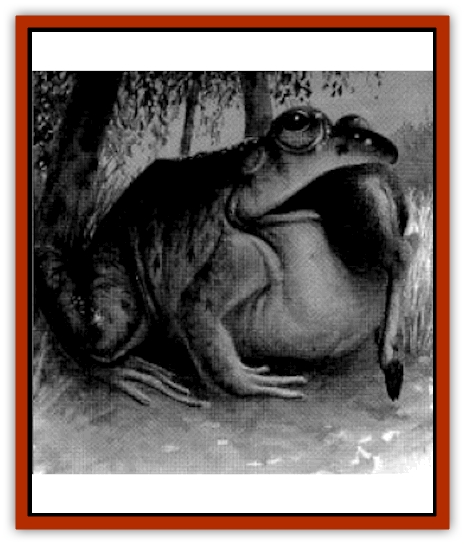

# Frog - Archer

| Statistic | **Frog, Archer** |
| --- | --- |
| **Activity Cycle:** | Any |
| **Alignment:** | 1-6 |
| **Armor Class:** | 6, Swim 12 |
| **Climate/Terrain:** | Any fresh water, often tropical |
| **Damage/Attack:** | Acid |
| **Diet:** | Carnivore |
| **Frequency:** | Very rare |
| **Hit Dice:** | 16 |
| **Intelligence:** | Incidental |
| **Magic Resistance:** | M (6' long) |
| **Morale:** |  |
| **Movement:** | 3 |
| **No. Appearing:** | 7 |
| **No. of Attacks:** | 1d8 |
| **Organization:** | Pack |
| **Size:** | -8 |
| **Special Attacks:** | Nil |
| **Special Defenses:** | Nil |
| **THAC0:** | 1 |
| **Treasure:** | 4 |
| **XP Value:** |  |

Archer frogs look like large specimens of the standard [[Frog|giant frog]]. They are usually mottled shades of green and brown.

**Combat:** In their natural surroundings, archer frogs' coloration gives them a natural camouflage, imposing a -3 penalty to opponents' surprise rolls. Like giant frogs, they attack with their tongues to a range of 18', at +4 to hit. An archer frog's tongue, however, ends in a hardened series of wicked barbs. The frog uses its tongue to pierce the body of its prey, causing 1d8 hp damage and drawing the victim into its mouth. The tongue barbs prevent prey from escaping; those that manage to pull free from the tongue suffer an additional 3d4 hp damage.

A victim pierced by an archer frog can cut itself free by slicing through the tongue. The tongue is AC 9 and must suffer 6 hp damage in a single blow to be severed. This damage is not subtracted from the archer frog's hit points. Once severed, the tongue regenerates, barbed tip and all, in about two weeks.

Once the prey is within the mouth, the archer frog's acidic saliva begins the process of digestion, causing an additional 1d4 hp damage each round, until the prey has been totally liquefied and swallowed. Non-organic materials (such as armor, weapons, and jewelry) are not digested; these items are spit out by the archer frog after dissolving its meal.

Once an archer frog has "speared" a victim on its tongue, it is virtually defenseless until its current victim is dissolved. For this reason, an archer frog prefers to target solo prey; parties of two or more capable of fighting back are seldom attacked.

**Habitat/Society:** Archer frogs, possibly because of their larger size and greater food requirements, are not found together in as great numbers as are other species of giant frogs and [[Toad_Giant|toads]]. They tend to hunt on their own, gathering only to mate and sleep. Possibly this is to prevent two different archer frogs from accidentally spearing the same prey - an awkward situation that would endanger both frogs until the victim was fully dissolved and the frogs' tongues were freed.

Because of their unique hunting method, archer frogs tend to concentrate on larger prey. Creatures smaller than a rabbit are difficult to spear with their tongues and are often ignored by the archer frogs in favor of creatures closer to their own size. The frogs have large, expandable throat-sacs which hold prey in much the same manner as a pelican's beak. This enables a full-grown archer frog to digest something as large as an [[Elf|elf]] or human in its mouth.

The throat-sacs also come into play during courtship rituals. In the springtime, the male archer frogs inflate their sacs and issue forth impressive bellows and croaks. These bellows attract females of the same species while simultaneously warning off competing males. They can often be heard from well over a mile away.

**Ecology:** If properly preserved, an archer frog's barbed tongue-tip can be used as a spearhead, harpoon tip, or similar weapon. Its flesh is considered a delicacy among many humanoid races. In fact, a common practice among those who hunt archer frogs is to silently follow one as it hunts, attacking it immediately after it captures prey of its own. This ensures that the archer frog is defenseless when attacked and also gains the frog's prey as well as the archer frog itself.

On rare occasions, archer frogs have been domesticated by humanoid races, usually [[Bullywug|bullywugs]], [[Grippli|grippli]], or <a href="lizarman">lizard men</a>. Bullywugs and lizard men use archer frogs as guard animals, often keeping them tied by a leash or chain to a certain area. Grippli, because of their smaller size, can use archer frogs as riding mounts. In either case, the archer frog makes a below-average war beast, as its combat abilities extend only to the first victim it spears with its tongue. Still, as the diminutive grippli assert, that's one less foe that they must face.

---
## Discovery & Documentation

**Source Publication:** Dragon247 (1998)
**Campaign Setting:** Dragon Magazine
**Author(s):** 

### Other Creatures Found in This Source Book
   * [[Frog_Ghoul|Frog, Ghoul]]
   * [[Toad_Leech|Toad, Leech]]
   * [[Toad_Spined|Toad, Spined]]
