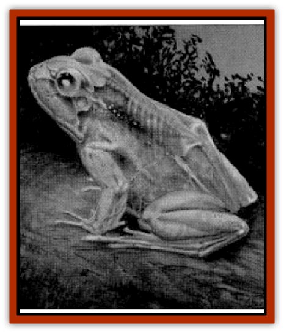

# Frog - Ghoul

| Statistic | **Frog, Ghoul** |
| --- | --- |
| **Activity Cycle:** | Night |
| **Alignment:** | Neutral |
| **Armor Class:** | 8 |
| **Climate/Terrain:** | Any fresh water |
| **Damage/Attack:** | 1-2 |
| **Diet:** | Insectivore |
| **Frequency:** | Very rare |
| **Hit Dice:** | 1+4 |
| **Intelligence:** | Animal (1) |
| **Magic Resistance:** | Nil |
| **Morale:** | Unsteady (6) |
| **Movement:** | 6, Sw 12 |
| **No. Appearing:** | 2-8 |
| **No. of Attacks:** | 1 |
| **Organization:** | Pack |
| **Size:** | S (2-3' long) |
| **Special Attacks:** | Blinding flash |
| **Special Defenses:** | Poison |
| **THAC0:** | 19 |
| **Treasure:** | Nil |
| **XP Value:** | 65 |

A ghoul [[Frog|frog]] appears to be some sort of zombified creature, but it is not. Its skin is translucent, revealing the skeleton, muscles, and internal organs. Large, black pupils give the illusion of hollow eye sockets, adding to the misconception.

Ghoul frogs are not undead and exhibit no ghoulish attributes: they cannot paralyze, nor do they feast on carrion. Nonetheless, the term "ghoul frog" has stuck, although they are sometimes called "[[Zombie|zombie]] frogs" or "skull frogs."

**Combat:** The skin of a ghoul frog gives off a faint luminescence that attracts flying insects at night. Those that fly too close are attacked by the frog's tongue, which draws the prey into the frog's mouth. Ghoul frogs normally attack only insects, but they can bite for 1-3 hp damage if cornered (although they flee from most attackers larger than themselves). Like most anurans, they have many small teeth, but only on their upper jaw. These teeth are used primarily to hold struggling prey steady so they can be swallowed whole.

Once per turn, a ghoul frog can generate a flash of bright light from its luminescent skin, causing victims to save vs. paralyzation or be blinded for 1d4 rounds, during which time the ghoul frog escapes. Ghoul frogs themselves are immune to the effects of such flashes. They are also somewhat resistant to the blinding effects of *light* and *continual light* spells; if either of these spells is cast directly on a ghoul frog's eyes, its attack rolls and saving throws are reduced by 2, not 4.

**Habitat/Society:** Ghoul frogs are often found in small packs, but they have no specific social structure. Staying in a group allows them to use their defensive flash more effectively, as they can take turns "flashing" enemies. They are never found far from a source of fresh water like a lake, pond, or stream, where they lay their jellylike eggs.

Ghoul frog tadpoles are transparent as their adult forms, although they do not gain their bioluminescence until after completing the metamorphosis into full adults. Glowing tadpoles would be too easily spotted by aquatic predators.

During daylight, ghoul frogs lie buried in the mud of the lake bottom, covering their skin and preventing its light from being spotted by predators. Only during the darkness of the night do they emerge and begin their hunt for insects.

**Ecology:** From a distance, the eerily-glowing ghoul frog is often mistaken for a [[Will_O'Wisp|will o'wisp]]. Those hoping to find a will o'wisp treasure trove are in for a disappointment, for ghoul frogs accumulate no treasure.

Ghoul frog flesh is bitter and mildly poisonous. Those eating it must save vs. poison or be violently nauseous for 1d4 hours. During this time, the afflicted individuals suffer a -2 attack penalty and a +2 AC penalty, as well as temporarily losing 24 points of Strength. Thus, ghoul frogs are not often hunted as prey. However, many predators try to stay close to a pack of ghoul frogs, waiting to pounce upon those creatures unfortunate enough to be blinded by the frogs' defensive flash.

In addition, ghoul frog skin, once dried and powered, can be a useful ingredient in the manufacture of magical inks used to transcribe various spells. It is predominantly used for such light-based spells as *faerie fire*, *dancing lights*, and so on, but it can also be used for *corpse visage* and similar spells that deal with at least the appearance of being undead.

Ghoul frog blood is a vital ingredient in the manufacture of *skeletal potions* (see *Dragon Magazine #198*, "The False Undead"), which turn the imbiber's skin and organs invisible but leave his bones unaffected. In a pinch, it can also be used to create *potions of invisibility*, but such potions are usually inferior in terms of duration and often cause a flickering luminescence that negates the benefits of the invisibility.

---
## Discovery & Documentation

**Source Publication:** Dragon247 (1998)
**Campaign Setting:** Dragon Magazine
**Author(s):** 

### Other Creatures Found in This Source Book
   * [[Frog_Archer|Frog, Archer]]
   * [[Toad_Leech|Toad, Leech]]
   * [[Toad_Spined|Toad, Spined]]
