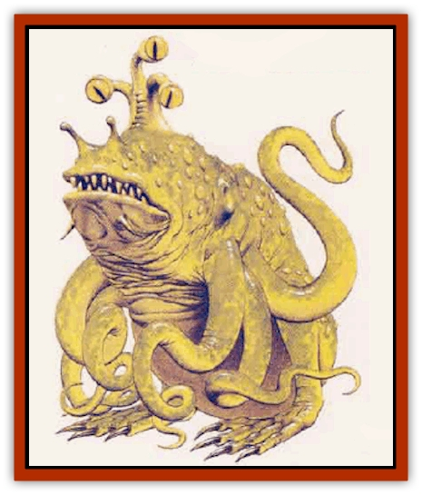

# Froghemoth

| Statistic | **Froghemoth** |
| --- | --- |
| **Activity Cycle:** | Any |
| **Alignment:** | Neutral |
| **Armor Class:** | 4 (tentacles 2, tongue 6) |
| **Climate/Terrain:** | Swamp |
| **Damage/Attack:** | 5d10 (bite) or 4&times; 1d4+4 (tentacle) |
| **Diet:** | Carnivore |
| **Frequency:** | Very rare |
| **Hit Dice:** | 16 |
| **Intelligence:** | Animal (1) |
| **Magic Resistance:** | Nil |
| **Morale:** | Fearless (19) |
| **Movement:** | 4 (in swamp), Sw 8 |
| **No. Appearing:** | 1 |
| **No. of Attacks:** | 1 or 4 |
| **Organization:** | Solitary |
| **Size:** | H (18' tall) |
| **Special Attacks:** | Swallow, constriction |
| **Special Defenses:** | Immune to fire, 1 hp/die from electricity (<i>slows</i> 1 rnd.), half damage from blunt weapons |
| **THAC0:** | 5 |
| **Treasure:** | Incidental |
| **XP Value:** | 21,000 |

This giant amphibian horror lurks in the darkest swamps and dankest subterranean pools. The froghemoth's 18-foot-long, 10-foot-wide body is yellow on the belly, shading to a light green on its sides and a mottled green on its back and thick, bowed rear legs. Two tentacles sprout from each shoulder. The tentacles are 15 feet or more long, green on top and yellowish underneath. The creature's nostrils are stalk-like, and its three eyes are housed on a protruding, retractable appendage that can be withdrawn. Its eyes are amber with a green tinge and have vertical slit pupils of bright green edged with orange.

When it is submerged, its tentacles trailing ashore and its eye and nostril stalks at water level, it appears to be nothing more than a plant growth of some sort.

**Combat:** The froghemoth prefers to float in a swampy area, or crouch amid shielding vegetation in order to ambush prey. The tongue is preferred if the prey is about 10 feet away, while its tentacles are used on more distant prey. If the tongue hits with a natural 19 or 20, the victim is immediately snapped into the froghemoth's mouth and swallowed whole; creatures larger than man-size are bitten instead. Swallowed creatures take 4d4 points of damage per round and become unconscious after two rounds. Any reduced to -10 hit points are digested and gone. Any creature swallowed and still conscious can attack with a short stabbing weapon no longer than a dagger.

If the tongue hits with any other roll, the prey receives a surprise roll. If not surprised, the victim can try to grab an object, like a tree or rope, making a normal attack roll against AC 10 for success. If no solidly anchored object can be grabbed quickly, the prey will be drawn to the froghemoths gaping jaws and bitten in the same round. If the prey holds onto something (forfeiting any attacks), make Strength checks, using a score of 19 for the froghemoth. The prey must both succeed and roll higher than the froghemoth or be drawn into the gaping mouth. Once in the mouth, the prey takes 5d10 damage per round. Recheck Strength each round until the froghemoth is killed or driven off, or its tongue is severed.

The tongue, when exposed, is AC 6 and can be severed by 12+1d4 points of damage. If the tongue is severed, the froghemot goes into a frenzy, inflicting double tentacle damage for 2-5 rounds, and then retreating to recover if it is still actively opposed.

The froghemoth can attack up to four different man-sized opponents with its tentacles. Each tentacle inflicts 1d4+4 hit points of constriction damage. Once a creature is hit by a tentacle, the damage is taken each round, unless the tentacle is severed or the creature spends a round pulling free and makes a successful open doors roll. The froghemoth's tentacles are AC 2 and are severed on taking ^1d4+18 points of damage.

The creature's body is Armor Class 4. Normal fire inflicts no damage upon the froghemoth, but has a 20% chance of driving the creature back for one round. Exceptionally hot fires (*fireball*) or a *burning hands* spell of 10 points or better inflict half damage. Lightning inflicts 1 point per die of damage and *slows* the froghemoth for one round.

A froghemoth will pursue fleeing prey onto dry land, but only for two or three rounds, then will return to its home waters. A severed tongue or tentacle regrows in 2-5 weeks.

**Habitat/Society:** A froghemoth lives only in large swamps or in shallow fresh water (100 feet or less). It can operate on dry land, but it moves in a series of awkward hops at half speed.

Once every nine years, froghemoths retum to their spawning ground to mate with others of their ilk. Every pair lays 10 to 100 eggs, each about a foot long, in shallow water. The tadpoles are immediately left to fend for themselves.

Immature froghemoths (tadhemoths) resemble fish (2 HD; AC 4; Dmg 2d4) with four pectoral fins (which will turn into tentacles) and two tails (which will turn into legs). For 6 months, the creatures grows about a foot per month, then gains about a foot every 2 months until it reaches full size. At 6 months, the tentacles start to develop. By the 10th month the legs start to develop, and by the 12th month the tadhemoth stage has ended. As the creature grows, its bite damage increases (3d8,4d8,4d10, etc.) Tadhemoths eat and are eaten by each other, only 10% survive more than a few days after hatching, and only 1% to 4% reach adult size. Barring violent death, froghemoths are thought to live up to 100 years.

**Ecology:** The froghemoth is very likely the dominant predator in its home region. Only very powerful creatures (like [[Dragon_General_Information|dragons]] or well-equipped adventurers) can hope to succeed against one. Froghemoth tadpoles cannot be trained, but it may be possible to capture one and move it someplace where it can act as a vicious and somewhat unreliable guard animal.

---
## Discovery & Documentation

**Source Publication:** Monstrous Compendium, 1995 Annual, Volume 2 (1995)
**Campaign Setting:** Advanced Dungeons & Dragons 2nd Edition
**Author(s):** Jon Pickens

### Other Creatures Found in This Source Book
   * [[Aboleth_Savant|Aboleth, Savant]]
   * [[Addazahr|Addazahr]]
   * [[Amiq_Rasol|Amiq Rasol]]
   * [[Arch-Shadow|Arch-Shadow]]
   * [[Automaton_Scaladar|Automaton, Scaladar]]
   * [[Automaton_Trobriand's|Automaton, Trobriand's]]
   * [[Bat_Sporebat|Bat, Sporebat]]
   * [[Beetle_Dragon|Beetle, Dragon]]
   * [[Bi-nou|Bi-nou]]
   * [[Boggle|Boggle]]
   * [[Brownie_Dobie|Brownie, Dobie]]
   * [[Brownie_Quickling|Brownie, Quickling]]
   * [[Cat_Crypt|Cat, Crypt]]
   * [[Cat_Great_Cath_Shee|Cat, Great, Cath Shee]]
   * [[Centaur-kin_Dorvesh|Centaur-kin, Dorvesh]]
   * [[Centaur-kin_Gnoat|Centaur-kin, Gnoat]]
   * [[Centaur-kin_Ha'pony|Centaur-kin, Ha'pony]]
   * [[Centaur-kin_Zebranaur|Centaur-kin, Zebranaur]]
   * [[Chronolily|Chronolily]]
   * [[Curst|Curst]]
   * [[Darktentacles|Darktentacles]]
   * [[Dinosaur_Aquatic|Dinosaur, Aquatic]]
   * [[Dinosaur_II|Dinosaur II]]
   * [[Dinosaur_III|Dinosaur III]]
   * [[Doppelganger_Greater|Doppelganger, Greater]]
   * [[Dragon_Brine|Dragon, Brine]]
   * [[Dragon_Half-|Dragon, Half-]]
   * [[Dragon-kin_Sea_Wyrm|Dragon-kin, Sea Wyrm]]
   * [[Dwarf_Wild|Dwarf, Wild]]
   * [[Ekimmu|Ekimmu]]
   * [[Elemental_Nature|Elemental, Nature]]
   * [[Elf_Winged|Elf, Winged]]
   * [[Fish_Great_Glacier|Fish (Great Glacier)]]
   * [[Fish_Subterranean|Fish, Subterranean]]
   * [[Fish_Toril|Fish (Toril)]]
   * [[Flareater|Flareater]]
   * [[Flumph|Flumph]]
   * [[Ghost_Casurua|Ghost, Casurua]]
   * [[Ghost_Ker|Ghost, Ker]]
   * [[Ghul|Ghul]]
   * [[Ghul-Kin|Ghul-Kin]]
   * [[Giant_Half-giant|Giant, Half-giant]]
   * [[Golem_Burning_Man|Golem, Burning Man]]
   * [[Golem_Phantom_Flyer|Golem, Phantom Flyer]]
   * [[Gulguthhydra|Gulguthhydra]]
   * [[Hakeashar|Hakeashar]]
   * [[Horse_Moon-|Horse, Moon-]]
   * [[Human_Dragonslayer|Human, Dragonslayer]]
   * [[Human_Vistana|Human, Vistana]]
   * [[Jellyfish_Giant|Jellyfish, Giant]]
   * [[Kalin|Kalin]]
   * [[Kholiathra|Kholiathra]]
   * [[Laerti|Laerti]]
   * [[Leucrotta_Greater|Leucrotta, Greater]]
   * [[Lich_Suel|Lich, Suel]]
   * [[Lurker_Shadow|Lurker, Shadow]]
   * [[Lycanthrope_Werepanther|Lycanthrope, Werepanther]]
   * [[Lycanthrope_Wereshark|Lycanthrope, Wereshark]]
   * [[Mammal_Herd_II|Mammal, Herd II]]
   * [[Marl|Marl]]
   * [[Meenlock|Meenlock]]
   * [[Mimic_Greater|Mimic, Greater]]
   * [[Mold_II|Mold II]]
   * [[Mummy_Creature|Mummy, Creature]]
   * [[Nyth|Nyth]]
   * [[Ooze_Slime_Jelly_Ghaunadan|Ooze/Slime/Jelly, Ghaunadan]]
   * [[Palimpsest|Palimpsest]]
   * [[Peltast|Peltast]]
   * [[Plant_Dangerous_II|Plant, Dangerous II]]
   * [[Pleistocene_Animal|Pleistocene Animal]]
   * [[Pudding_Subterranean|Pudding, Subterranean]]
   * [[Raggamoffyn|Raggamoffyn]]
   * [[Snake_Serpent|Snake, Serpent]]
   * [[Snake_Serpent_Vine|Snake, Serpent Vine]]
   * [[Sphinx_Draco-|Sphinx, Draco-]]
   * [[Sprite_Seelie_Faerie|Sprite, Seelie Faerie]]
   * [[Sprite_Unseelie_Faerie|Sprite, Unseelie Faerie]]
   * [[Squealer|Squealer]]
   * [[Turtle_Giant|Turtle, Giant]]
   * [[Umpleby|Umpleby]]
   * [[Vizier's_Turban|Vizier's Turban]]
   * [[Wall_Walker|Wall Walker]]
   * [[Webbird|Webbird]]
   * [[Yak-Man|Yak-Man]]
   * [[Zorbo|Zorbo]]
