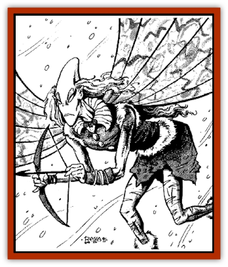

# Frost

| Statistic | **Frost** |
| --- | --- |
| **Activity Cycle:** | Any |
| **Alignment:** | Neutral good |
| **Armor Class:** | 9 (5 if flying) |
| **Climate/Terrain:** | Subarctic and cold/winter temperate forests |
| **Damage/Attack:** | 1-2 (dagger) |
| **Diet:** | Omnivore |
| **Frequency:** | Rare |
| **Hit Dice:** | ½ (1d4 hp) |
| **Intelligence:** | High |
| **Magic Resistance:** | 30% |
| **Morale:** |  |
| **Movement:** | 6, Fl 24 |
| **No. Appearing:** | 1d6 |
| **No. of Attacks:** | 1 |
| **Organization:** | Tribal |
| **Size:** | T (1' tall) |
| **Special Attacks:** | Spells |
| **Special Defenses:** | Invisible at will, immune to cold |
| **THAC0:** | 20 |
| **Treasure:** | Q&times;2 each |
| **XP Value:** | 650 |

Often called snow fairies, snow sprites, or winter folk, these small, mischievous beings inhabit dense forests, migrating to cooler regions as the seasons dictate. Frosts are tiny elfin creatures with whirring, beelike wings. Their skin is pale blue, though some from subarctic regions are a darker blue. Their hair is white or silvery, their eyes are blue or green, and their clothing tends to be white with patches of gray, black, blue, and green.

**Combat:** Frosts, like their cousins the [[Sprite|sprites]] and [[Sprite|pixies]], are prone to playing pranks on travelers, but they keep their tricks to a minimum. "Clever" pranks usually involve shaking snow down on burly fighters or creating ice patches. Frosts can use *control temperature, 10' radius* at will, at the 10th level of ability.

If evil or destructive beings annoy the frosts, however, they must be prepared for retaliation. Frosts never attack larger beings in hand-to-hand combat, but always flee and use their spells at a distance. They save their weapons skills for hunting small monsters or animals their own size. Initial attacks are made using the natural environment. For example, if large foes cross ice-covered lakes or ponds, frosts might use *control temperature* spells to cause the ice to crack under their foes' boots. Then they use spells to cause the water to refreeze if a being falls through the ice and is submerged or swimming. If the chance to use an avalanche trap presents itself, frosts try this against massed groups of their foes.

If this doesn't work, frosts are able to use *cone of cold* spells three times per day at the third level of ability (3d4+3 hp damage, 15-foot-long, 5-foot-wide cone). Each is also able to use *ice hands*, a spell-like power that causes 1-2 points of cold damage by touch, at will. *Ice hands* freezes up to one gallon of liquid per round, including potions and holy/unholy water. One frost in six can cast a *cold ray* from his hands once per day. This ray is 90 feet long, an inch wide, and causes 6d4+6 points of damage if a saving throw vs. spells is unsuccessful. No damage is suffered if the save is successful, as the ray is so narrow.

Frosts are immune to all cold. They take normal damage from fire- or heat-based spells, and flames causing 1 or more points of damage instantly sear off their wings, which cannot regrow. Because frosts are so light, they suffer only 1-2 points of damage from falling from any height over 10 feet, but suffer no damage if they land in a snowbank.

**Habitat/Society:** Frosts are nearly always found in small family groups, though some gatherings are exploratory bands out to see the wide world, cause a bit of trouble, or hunt for gems and crystals, which frosts love and hoard. Nomadic in nature, frosts make their lairs in hollow trees, rocky shelters, old animal dens, and the like, never staying in one place for more than a year. Frosts manufacture few things, usually only clothing, though it is not known how their fine cloth is created. Their dagger-like weapons are actually hard, sharp icicles.

If carefully approached and given gems, frosts can be very helpful to well-behaved beings who don't stay long in the frosts' woodlands. They like other small woodland fairies best, with [[Elf|elves]] and [[Dryad|dryads]] running a close second, [[Halfling|halflings]] third, and everyone else somewhere far behind. They war continually with small evil beings such as [[Brownie_Quickling|quicklings]]. Some frost communities work closely with elven and fairy bands to defend their woods against [[Goblin|goblins]] and other invaders, but are also likely to attack careless human loggers, hunters, and city-builders.

Frosts speak their own language, Elven, and up to three other languages of allied beings in their vicinity. They cannot read or write, and have no interest in learning to do so.

**Ecology:** Frosts have little overall effect on their environment, as their food and material needs are minute at best. Frosts have no known use as spell components, though it is rumored that certain evil sorcerers have investigated this possibility in the past. A few such sorcerers are known to have had unfortunate and fatal accidents when crossing icy rivers or traveling through dense winter, forests, and these losses have probably slowed this research.

---
## Discovery & Documentation

**Source Publication:** MC11 Forgotten Realms Appendix II (1991)
**Campaign Setting:** Advanced Dungeons & Dragons 2nd Edition
**Author(s):** Tim Beach, Tim Brown, William W. Connors, Dale Donovan, Ed Greenwood, Jeff Grubb, Bruce Heard, Slade Henson, Rob King, Colin McComb, Roger E. Moore, Bruce Nesmith, Jon Pickens, Jean Rabe, Dori Watry, Skip Williams

### Other Creatures Found in This Source Book
   * [[Alaghi|Alaghi]]
   * [[Alguduir|Alguduir]]
   * [[Beguiler|Beguiler]]
   * [[Bird_Toril|Bird (Toril)]]
   * [[Cantobele|Cantobele]]
   * [[Carapace|Carapace]]
   * [[Cat_Toril|Cat (Toril)]]
   * [[Chitine|Chitine]]
   * [[Cildabrin|Cildabrin]]
   * [[Dimensional_Warper|Dimensional Warper]]
   * [[Dragon_Deep|Dragon, Deep]]
   * [[Fachan_Toril|Fachan (Toril)]]
   * [[Fael|Fael]]
   * [[Feyr|Feyr]]
   * [[Firetail|Firetail]]
   * [[Gaund|Gaund]]
   * [[Gloomwing|Gloomwing]]
   * [[Golden_Ammonite|Golden Ammonite]]
   * [[Golem_Lightning|Golem, Lightning]]
   * [[Hamadryad|Hamadryad]]
   * [[Harrier|Harrier]]
   * [[Harrla|Harrla]]
   * [[Haun|Haun]]
   * [[Haundar|Haundar]]
   * [[Hendar|Hendar]]
   * [[Inquisitor|Inquisitor]]
   * [[Lhiannan_Shee|Lhiannan Shee]]
   * [[Loxo|Loxo]]
   * [[Manni|Manni]]
   * [[Manscorpion|Manscorpion]]
   * [[Mara|Mara]]
   * [[Morin|Morin]]
   * [[Naga_Dark|Naga, Dark]]
   * [[Orpsu|Orpsu]]
   * [[Plant_Carnivorous_Black_Willow|Plant, Carnivorous, Black Willow]]
   * [[Plant_Carnivorous_Toril|Plant, Carnivorous (Toril)]]
   * [[Plant_Dangerous_I|Plant, Dangerous I]]
   * [[Ring-Worm|Ring-Worm]]
   * [[Rohch|Rohch]]
   * [[Sand_Cat|Sand Cat]]
   * [[Saurial|Saurial]]
   * [[Sha'az|Sha'az]]
   * [[Silver_Dog|Silver Dog]]
   * [[Simpathetic|Simpathetic]]
   * [[Skuz|Skuz]]
   * [[Spider_Monkey|Spider, Monkey]]
   * [[Tren|Tren]]
