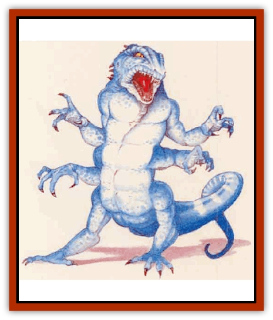
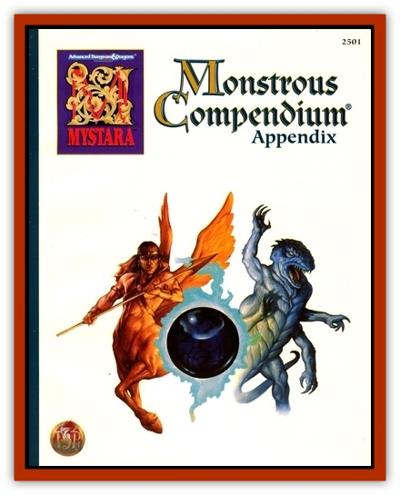

# Frost Salamander

| Statistic | **Frost Salamander** | **Ice Crab** |
| --- | --- | --- |
| **Activity Cycle:** | Any | Any |
| **Alignment:** | Chaotic evil | Neutral |
| **Armor Class:** | 3 | 5 |
| **Climate/Terrain:** | Any arctic (Paraplane of Ice) | Any arctic |
| **Damage/Attack:** | 1d6 (&times;4)/2d6 | 1d4 (&times;2) |
| **Diet:** | Omnivore | Ice |
| **Frequency:** | Very rare (Rare) | Rare |
| **Hit Dice:** | 12 | 2 |
| **Intelligence:** | Low (5-7) | Animal (1) |
| **Magic Resistance:** | Nil | Nil |
| **Morale:** | Steady (11) | Average (10) |
| **Movement:** | 12 | 6 |
| **No. Appearing:** | 1d3 | 2d4+1 |
| **No. of Attacks:** | 5 | 2 |
| **Organization:** | Solitary | Solitary |
| **Size:** | L (8' long) | S (2' diameter) |
| **Special Attacks:** | Radiates cold | Surprise, cold touch |
| **Special Defenses:** | Immune to cold, +1 or better to hit | Immune to cold |
| **THAC0:** | 9 | 19 |
| **Treasure:** | E | Q |
| **XP Value:** | 9,000 | 175 |

Frost salamanders, natives of the Paraelemental Plane of Ice, thrive in very cold places. They are sometimes found on other elemental planes and may find themselves summoned to the Prime Material Plane.

This creature looks like a large lizard with white or blue-white scales. Its six legs end in vicious claws that allow it to move along even the slickest ice. Frost salamanders have blue eyes and translucent white teeth that look like icicles.

The frost salamander gets its name because so many consider it a cold-dwelling version of the normal [[Elemental_Fire_Kin|salamander]], which comes from the Eremental Plane of Eire.

**Combat:** A frost salamander is immune to all cold-based attacks. It radiates cold in a 20-foot radius, causing 1d8 points of damage to all creatures within this area. It attacks without any plan other than to rip its opponent to shreds by the fastest means possible. Individual creatures do not coordinate attacks.

This monster never uses weapons; it attacks by rearing up on its hindmost legs, clawing with its four forward claws, then biting.

If near a pool of icy water, the frost salamander often pushes its victim into the water, possibly causing incidental damage from exposure, either during the battle or later. It carries its dead victims into an icy pool or other very chilly area, as it prefers to not eat warm flesh.

A frost salamander suffers an additional point of damage per die of damage in fire-based attacks.

**Habitat/Society:** Frost salamanders sometimes leave their otherplanar home to visit especially cold places on the Prime Material Plane for reasons known only to them, or through summoning.

Clearly, these creatures hate warm surroundings. In fact, they suffer 1 point of damage for each turn they spend in a region with a temperature above freezing. Typical frost salamander lairs are quite cold - near frozen pools or on windy, arctic plains. They bask in chilling winds the way most creatures relax in sunlight; they enjoy being recipients of such spells as *cone of cold*, too.

Items found in the lairs of frost salamanders often have frozen into blocks of ice or have turned very brittle from the cold; the low temperature almost always ruins magical potions. Melting treasure free can take several hours, and characters should not attempt to carry frozen items without hand coverings.

**Ecology:** Frost salamanders usually eat frozen meat but also can eat any plants they happen to find. These voracious predators prefer to avoid competition with other cold-dwelling creatures.

The sluggish, bright blue liquid in a frost salamanders veins can be used to temper a *frost brand*; a bone from this creature makes a fine component for a *wand of frost*.

Frost salamanders hate regular salamanders, and the enmity is returned; the two creatures attack one another on sight, on the rare occasions when they find themselves in the same place at the same time.

**Ice Crab**

  Ice crabs, sometimes found with a frost salamander, always stay in freezing areas too, especially icy pools. Ice crabs look much like normal crabs, but have two daws and only four legs; their white shells have pale blue edges.

Not only can these can blend in well with their surroundings, they are adept at remaining still until prey approaches; this ability gives opponents a -4 penalty to surprise rolls. A successful hit from a claw attack causes 1d4 points of normal damage, plus 1d3 hit points of cold damage.

Ice crabs collect only gems as treasure, usually diamonds or pearls.

---
## Discovery & Documentation

**Source Publication:** Mystara Appendix (1994)
**Campaign Setting:** Mystara
**Author(s):** John Nephew, Teeuwynn Woodruff, John Terra, Skip Williams

### Other Creatures Found in This Source Book
   * [[Actaeon|Actaeon]]
   * [[Agarat|Agarat]]
   * [[Ash_Crawler|Ash Crawler]]
   * [[Baldandar|Baldandar]]
   * [[Bargda|Bargda]]
   * [[Bhut|Bhut]]
   * [[Bird_Mystara|Bird (Mystara)]]
   * [[Blackball|Blackball]]
   * [[Choker|Choker]]
   * [[Coltpixie|Coltpixie]]
   * [[Crone_of_Chaos|Crone of Chaos]]
   * [[Darkhood|Darkhood]]
   * [[Darkwing|Darkwing]]
   * [[Decapus|Decapus]]
   * [[Deep_Glaurant|Deep Glaurant]]
   * [[Diabolus|Diabolus]]
   * [[Dimensional_Warper|Dimensional Warper]]
   * [[Dragon_Mystara_Crystalline|Dragon (Mystara), Crystalline]]
   * [[Dragon_Mystara_Jade|Dragon (Mystara), Jade]]
   * [[Dragon_Mystara_Onyx|Dragon (Mystara), Onyx]]
   * [[Dragon_Mystara_Ruby|Dragon (Mystara), Ruby]]
   * [[Drake_Mystara|Drake (Mystara)]]
   * [[Dragonfly|Dragonfly]]
   * [[Dusanu|Dusanu]]
   * [[Elemental_of_Chaos_Air_Earth|Elemental of Chaos, Air/Earth]]
   * [[Elemental_of_Chaos_Fire_Water|Elemental of Chaos, Fire/Water]]
   * [[Elemental_of_Law_Air_Earth|Elemental of Law, Air/Earth]]
   * [[Elemental_of_Law_Fire_Water|Elemental of Law, Fire/Water]]
   * [[Familiar_Mystara|Familiar (Mystara)]]
   * [[Fundamental_Air_Earth|Fundamental, Air/Earth]]
   * [[Fundamental_Fire_Water|Fundamental, Fire/Water]]
   * [[Gargantua_Mystara|Gargantua (Mystara)]]
   * [[Geonid|Geonid]]
   * [[Ghostly_Horde|Ghostly Horde]]
   * [[Giant_Athach|Giant, Athach]]
   * [[Giant_Hephaeston|Giant, Hephaeston]]
   * [[Golem_Drolem|Golem, Drolem]]
   * [[Golem_Mystara_I|Golem (Mystara) I]]
   * [[Golem_Mystara_II|Golem (Mystara) II]]
   * [[Golem_Mystara_III|Golem (Mystara) III]]
   * [[Gray_Philosopher|Gray Philosopher]]
   * [[Guardian_Warrior|Guardian Warrior]]
   * [[Gyerian|Gyerian]]
   * [[Herex|Herex]]
   * [[Hivebrood|Hivebrood]]
   * [[Horde|Horde]]
   * [[Hsiao|Hsiao]]
   * [[Huptzeen|Huptzeen]]
   * [[Hutaakan|Hutaakan]]
   * [[Imp_Mystara|Imp (Mystara)]]
   * [[Jellyfish_Giant_Mystara|Jellyfish, Giant (Mystara)]]
   * [[Kna|Kna]]
   * [[Kopru|Kopru]]
   * [[Lizard_Mystara|Lizard (Mystara)]]
   * [[Lizard-kin_Mystara|Lizard-kin (Mystara)]]
   * [[Lupin|Lupin]]
   * [[Lycanthrope_Werejaguar_Mystara|Lycanthrope, Werejaguar (Mystara)]]
   * [[Lycanthrope_Wereswine|Lycanthrope, Wereswine]]
   * [[Magen|Magen]]
   * [[Manikin|Manikin]]
   * [[Mek|Mek]]
   * [[Mujina|Mujina]]
   * [[Nagpa|Nagpa]]
   * [[Neh-thalggu|Neh-thalggu]]
   * [[Nightshade_Mystara|Nightshade (Mystara)]]
   * [[Nuckalavee|Nuckalavee]]
   * [[Pegataur|Pegataur]]
   * [[Phanaton|Phanaton]]
   * [[Plant_Dangerous_Mystara|Plant, Dangerous (Mystara)]]
   * [[Plasm|Plasm]]
   * [[Rakasta|Rakasta]]
   * [[Rock_Man|Rock Man]]
   * [[Sabreclaw|Sabreclaw]]
   * [[Sacrol|Sacrol]]
   * [[Scamille|Scamille]]
   * [[Shapeshifter|Shapeshifter]]
   * [[Shargugh|Shargugh]]
   * [[Shark-kin|Shark-kin]]
   * [[Sollux|Sollux]]
   * [[Spectral_Death|Spectral Death]]
   * [[Spectral_Hound|Spectral Hound]]
   * [[Spider-kin|Spider-kin]]
   * [[Spirit_Mystara|Spirit (Mystara)]]
   * [[Statue_Living|Statue, Living]]
   * [[Surtaki|Surtaki]]
   * [[Tabi|Tabi]]
   * [[Thoul|Thoul]]
   * [[Thunderhead|Thunderhead]]
   * [[Tiger_Ebon|Tiger, Ebon]]
   * [[Topi|Topi]]
   * [[Tortle|Tortle]]
   * [[Vampire_Velya|Vampire, Velya]]
   * [[White_Fang|White Fang]]
   * [[Worm_Mystara|Worm (Mystara)]]
   * [[Wyrd|Wyrd]]
   * [[Yowler|Yowler]]
   * [[Zombie_Lightning|Zombie, Lightning]]
