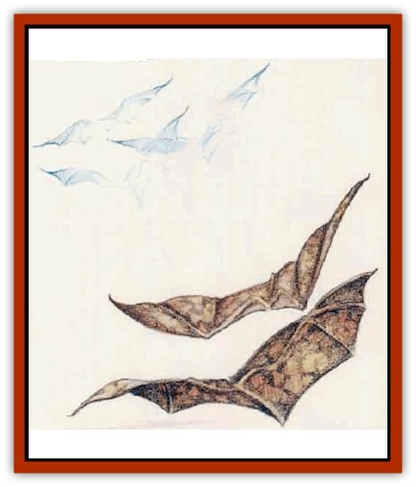

# Fundamental - Air - Earth

| Statistic | **Air** | **Earth** |
| --- | --- | --- |
| **Activity Cycle:** | Any | Any |
| **Alignment:** | Neutral | Neutral |
| **Armor Class:** | 6 | 3 |
| **Climate/Terrain:** | Any windy | Any cavern |
| **Damage/Attack:** | 1d6 (ram) | 1d6 (ram) |
| **Diet:** | Air | Earth or metal |
| **Frequency:** | Rare | Rare |
| **Hit Dice:** | 1+1 | 1+1 |
| **Intelligence:** | Semi- (3) | Semi- (3) |
| **Magic Resistance:** | Nil | Nil |
| **Morale:** | Average (8) | Steady (12) |
| **Movement:** | Fl 24 (A) | Fl 9 (B) |
| **No. Appearing:** | 2d10 | 2d10 |
| **No. of Attacks:** | 1 | 1 |
| **Organization:** | Flock | Flock |
| **Size:** | T (1' wingspan) | S (2½' wingspan) |
| **Special Attacks:** | Nil | Nil |
| **Special Defenses:** | See below | See below |
| **THAC0:** | 19 | 19 |
| **Treasure:** | Nil | Nil |
| **XP Value:** | 120 | 120 |

Among the least powerful creatures inhabiting the elemental planes are the [[Fundamental_All_Elements|fundamentals]]. Each of these creatures resembles a pair of [[Bat|bat]]-like wings without a head or body. Fundamentals never cease their flying, not even to land or rest a moment.

## Air Fundamental

Air fundamentals have a wingspan of approximately 1 foot. Their extraordinarily thin wings look transparent, while the creatures' color nearer their middle ranges from translucent, pearly white to pale blue. The only sound these elementals make is a whispery hum created by the minute vibrations of their tissue-thin wings.

**Combat:** In combat, air fundamentals flock together and swoop down on their target. It is not known how fundamentals "see" victims, although they may detect their body heat.

Due to these creatures' natural coloration, their opponents suffer a -2 penalty to surprise rolls.

A fundamental's only attack is a ramming dive in which the creature strikes its target with its own body, inflicting 1d6 points of damage. This attack does no damage to the fundamental itself.

These creatures can be harmed only by magic or magical weapons and remain immune to mind-affecting spells such as *sleep* and *charm*. Treat them as enchanted creatures for the purposes of spells such as *protection from evil*.)

**Habitat/Society:** Air fundamentals usually appear on the Prime Material Plane in parhcularly windy plces or at the tops of jagged mountains. Characters always encounter them in flocks, and they occasionally accompany more powerful elemental creatures to the Prime Material Plane.

Just how or why fundamental come to reside on the Prime Material Plane is unknown. Some theorize that these rather weak elementals find themselves inadvertently drawn into the Prime Material Plane when a more powerful elemental intentionally crosses over or is summoned from its home plane. Possibly, the more powerful elementals send these creatures to the Prime Material Plane for their own unknown purposes.

**Ecology:** Fundamentals, as foreigners to the Prime Material Plane, do not play an important role in the overall ecology of any area.

The body of an an air fundamental can be used to help create a *potion of flying*. However, when one of the creatures dies on the Prime Material Plane, its body quickly returns to the Elemental Plane of Air unless someone places it in a *blessed* container within two rounds of the creature's death.

## Earth Fundamental

Earth fundamentals, larger than the other three types, have a wingspan of up to 2½ feet. These very solid creatures boast thick wings of deep brown and black.

**Combat:** Earth fundamentals attack with the same swooping dives as their airy brethren. However, their ttactics often involve sweeping very low along the ground and attempting to knock their targets over. When an earth fundamental gets a 20 on an attack roll, its victim must make a successful saving throw vs. paralyzation or fall to the ground.

Earth fundamentals have the same immunities as air fundamentals.

**Habitat/Society:** Flocks of earth fundamentals gather on the Prime Material Plane in places where the element of earth seems particularly concentrated, including tar pits and deep caverns.

**Ecology:** Earth fundamentals consume earth, gems, and metal. They occasionally dine on the remains of an unfortunate adventuring party's armor.

If collected in a *blessed* container, the essence of an earth fundamental can help recharge a *wand of metal and mineral detection*.

---
## Discovery & Documentation

**Source Publication:** Mystara Appendix (1994)
**Campaign Setting:** Mystara
**Author(s):** John Nephew, Teeuwynn Woodruff, John Terra, Skip Williams

### Other Creatures Found in This Source Book
   * [[Actaeon|Actaeon]]
   * [[Agarat|Agarat]]
   * [[Ash_Crawler|Ash Crawler]]
   * [[Baldandar|Baldandar]]
   * [[Bargda|Bargda]]
   * [[Bhut|Bhut]]
   * [[Bird_Mystara|Bird (Mystara)]]
   * [[Blackball|Blackball]]
   * [[Choker|Choker]]
   * [[Coltpixie|Coltpixie]]
   * [[Crone_of_Chaos|Crone of Chaos]]
   * [[Darkhood|Darkhood]]
   * [[Darkwing|Darkwing]]
   * [[Decapus|Decapus]]
   * [[Deep_Glaurant|Deep Glaurant]]
   * [[Diabolus|Diabolus]]
   * [[Dimensional_Warper|Dimensional Warper]]
   * [[Dragon_Mystara_Crystalline|Dragon (Mystara), Crystalline]]
   * [[Dragon_Mystara_Jade|Dragon (Mystara), Jade]]
   * [[Dragon_Mystara_Onyx|Dragon (Mystara), Onyx]]
   * [[Dragon_Mystara_Ruby|Dragon (Mystara), Ruby]]
   * [[Drake_Mystara|Drake (Mystara)]]
   * [[Dragonfly|Dragonfly]]
   * [[Dusanu|Dusanu]]
   * [[Elemental_of_Chaos_Air_Earth|Elemental of Chaos, Air/Earth]]
   * [[Elemental_of_Chaos_Fire_Water|Elemental of Chaos, Fire/Water]]
   * [[Elemental_of_Law_Air_Earth|Elemental of Law, Air/Earth]]
   * [[Elemental_of_Law_Fire_Water|Elemental of Law, Fire/Water]]
   * [[Familiar_Mystara|Familiar (Mystara)]]
   * [[Frost_Salamander|Frost Salamander]]
   * [[Fundamental_Fire_Water|Fundamental, Fire/Water]]
   * [[Gargantua_Mystara|Gargantua (Mystara)]]
   * [[Geonid|Geonid]]
   * [[Ghostly_Horde|Ghostly Horde]]
   * [[Giant_Athach|Giant, Athach]]
   * [[Giant_Hephaeston|Giant, Hephaeston]]
   * [[Golem_Drolem|Golem, Drolem]]
   * [[Golem_Mystara_I|Golem (Mystara) I]]
   * [[Golem_Mystara_II|Golem (Mystara) II]]
   * [[Golem_Mystara_III|Golem (Mystara) III]]
   * [[Gray_Philosopher|Gray Philosopher]]
   * [[Guardian_Warrior|Guardian Warrior]]
   * [[Gyerian|Gyerian]]
   * [[Herex|Herex]]
   * [[Hivebrood|Hivebrood]]
   * [[Horde|Horde]]
   * [[Hsiao|Hsiao]]
   * [[Huptzeen|Huptzeen]]
   * [[Hutaakan|Hutaakan]]
   * [[Imp_Mystara|Imp (Mystara)]]
   * [[Jellyfish_Giant_Mystara|Jellyfish, Giant (Mystara)]]
   * [[Kna|Kna]]
   * [[Kopru|Kopru]]
   * [[Lizard_Mystara|Lizard (Mystara)]]
   * [[Lizard-kin_Mystara|Lizard-kin (Mystara)]]
   * [[Lupin|Lupin]]
   * [[Lycanthrope_Werejaguar_Mystara|Lycanthrope, Werejaguar (Mystara)]]
   * [[Lycanthrope_Wereswine|Lycanthrope, Wereswine]]
   * [[Magen|Magen]]
   * [[Manikin|Manikin]]
   * [[Mek|Mek]]
   * [[Mujina|Mujina]]
   * [[Nagpa|Nagpa]]
   * [[Neh-thalggu|Neh-thalggu]]
   * [[Nightshade_Mystara|Nightshade (Mystara)]]
   * [[Nuckalavee|Nuckalavee]]
   * [[Pegataur|Pegataur]]
   * [[Phanaton|Phanaton]]
   * [[Plant_Dangerous_Mystara|Plant, Dangerous (Mystara)]]
   * [[Plasm|Plasm]]
   * [[Rakasta|Rakasta]]
   * [[Rock_Man|Rock Man]]
   * [[Sabreclaw|Sabreclaw]]
   * [[Sacrol|Sacrol]]
   * [[Scamille|Scamille]]
   * [[Shapeshifter|Shapeshifter]]
   * [[Shargugh|Shargugh]]
   * [[Shark-kin|Shark-kin]]
   * [[Sollux|Sollux]]
   * [[Spectral_Death|Spectral Death]]
   * [[Spectral_Hound|Spectral Hound]]
   * [[Spider-kin|Spider-kin]]
   * [[Spirit_Mystara|Spirit (Mystara)]]
   * [[Statue_Living|Statue, Living]]
   * [[Surtaki|Surtaki]]
   * [[Tabi|Tabi]]
   * [[Thoul|Thoul]]
   * [[Thunderhead|Thunderhead]]
   * [[Tiger_Ebon|Tiger, Ebon]]
   * [[Topi|Topi]]
   * [[Tortle|Tortle]]
   * [[Vampire_Velya|Vampire, Velya]]
   * [[White_Fang|White Fang]]
   * [[Worm_Mystara|Worm (Mystara)]]
   * [[Wyrd|Wyrd]]
   * [[Yowler|Yowler]]
   * [[Zombie_Lightning|Zombie, Lightning]]
