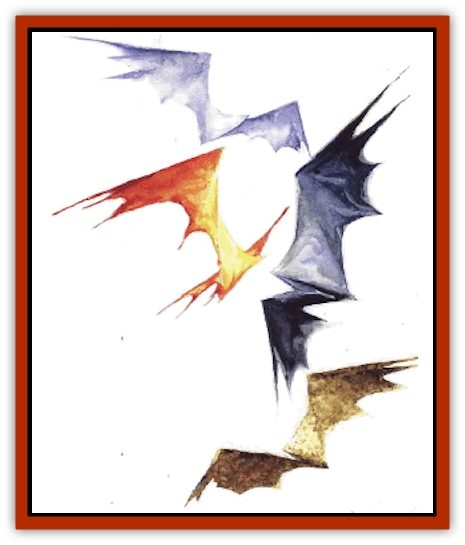

# Fundamental - All Elements

| Statistic | **Fundamental, All Elements** |
| --- | --- |
| **Activity Cycle:** | Any |
| **Alignment:** | Neutral |
| **Armor Class:** | 3-6 (see below) |
| **Climate/Terrain:** | Inner Planes |
| **Damage/Attack:** | 1d6 |
| **Diet:** | Varies |
| **Frequency:** | Common |
| **Hit Dice:** | 1+1 |
| **Intelligence:** | Semi- (3) |
| **Magic Resistance:** | Nil |
| **Morale:** | Average to steady (10-12) |
| **Movement:** | 9-24 (see below) |
| **No. Appearing:** | 2d10 |
| **No. of Attacks:** | 1 |
| **Organization:** | Flock |
| **Size:** | T (1-2' &ldquo;wingspan&rdquo;) |
| **Special Attacks:** | Nil |
| **Special Defenses:** | Struck only by +1 or better weapons, surprise, partial invisibility, immune to own element and <i>sleep</i> and <i>charm</i> |
| **THAC0:** | 19 |
| **Treasure:** | Nil |
| **XP Value:** | 175 |

Fundamentals are the weakest of the true elemental creatures (as opposed to other creatures native to the Elemental Planes). Still, no one knows the real dark of their nature, purpose, or how they fit into the mysterious scheme of the Inner Planes.

One of the most difficult-to-dispel myths regarding the fundamentals is the idea that they all appear as a pair of bodiless, headless [[Bat|bat]]-wings made of the appropriate element, flying eternally through the air. Although it's easy to see how a body might confuse their appearance, fundamentals are much more accurately described as narrow, nearly two-dimensional beings of elemental matter or energy. These little strips flutter and flap in the manner of a bat or certain birds. Fundamentals "fly" only in the sense that they pass through their own element unhindered and unhampered by forces like gravity. Sometimes fundamentals briefly "leap" from their element into another; [[Fundamental_Air_Earth|earth]] or [[Fundamental_Fire_Water|water fundamentals]] leaping into a nearby area of air might look as though they were flying low to the ground. Fundamentals that accidentally "leap" into their antithetical elements - say, [[Fundamental_Fire_Water|fire fundamentals]] into a water pocket - don't immediately die, but they can't stay there long. They can resist the opposite element for 1d4 rounds before fizzling out, dissolving, or otherwise dissipating.

The bat-wing idea probably originated when some fire fundamentals were confused with [[Fire_Bat|fire bats]], who do indeed have batlike wings.

**Combat:** All fundamentals defend themselves by simply ramming their bodies into an opponent, causing 1d6 points of damage. This is a relatively ineffective way to fight, but since they don't really "fly", such an attack doesn't actually hinder or throw off their movement. The fundamentals aren't harmed by this ramming attack in any way.

The stats above give a range of Armor Classes and movement rates. These depend on the relative composition (energy or solid), weight, and speed of the fundamentals.

| Fundamental Element | AC | MV |
| --- | --- | --- |
| Air, Ash, Dust, Smoke, Steam, Vacuum | 24 | 6 |
| Fire, Lightning, Radiance | 18 | 5 |
| Magma, Ooze, Water | 12 | 4 |
| Earth, Ice, Mineral, Salt | 9 | 3 |

Within their own element, fundamentals are hard to detect. In fact, they are 90% invisible when not moving. (Contrary to some reports, fundamentals do sometimes stop flying and simply drift.) When fundamentals attack creatures within their own elements, opponents suffer a -2 penalty to surprise rolls due to the creatures' natural coloration. These advantages lead wizards on the Prime or other terrestrial settings to summon [[Fundamental_Air_Earth|air fundamentals]] to attack their enemies more often than say, ooze fundamentals (which'd be spotted easily).

Fundamentals are entirely immune to the element that they represent. They are unaffected by spells involving sleep or cham. In addition, a body needs a +1 or better weapon to strike them.

**Habitat/Society:** Fundamentals don't fit into the standard "society" of the Inner Planes very well. They're not intelligent enough to work with (or against, for that matter) any of the organized forces there, and they're not powerful enough for anyone to really take notice of them. For example, the archomentals - the Elemental Princes of [[Archomental_Good|Good]] and [[Archomental_Evil|Evil]] - don't make any attempts to win over the fundamentals for their respective elements. The fundamentals just simply *are*.

**Ecology:** Fundamentals consume very little. They produce next to nothing and don't seem to product at all. They may not actually be living creatures at all, but rather some mysterious animate (but not sentient) extension of the element that they represent. A few cutters have suggested that fundamentals are to the Elemental, Paraelemental, and Quasielemental Planes what plant life is to more terrestrial settings. Such an idea is just strange enough to be true, but it's certainly difficult to prove.

Others still believe the theories of the explorer Revorus that fundamentals are just that - the fundamental expression of their element. Sure, they're not as powerful as actual [[Elemental_General_Information|elementals]], but they're still more basic, intrinsic, and &hellip; well, *fundamental* to the element and to the plane. Again, though, that's just conjecture.

At one time some graybeards thought that fundamentals might be young elementals, perhaps in a larval stage. This theory has definitely been discounted, simply because few (if any) of the elementals on any of the Inner Planes reproduce in that way.

---
## Discovery & Documentation

**Source Publication:** Planescape III (1996)
**Campaign Setting:** Planescape
**Author(s):** Monte Cook

### Other Creatures Found in This Source Book
   * [[Animental|Animental]]
   * [[Archomental_Evil|Archomental, Evil]]
   * [[Archomental_Good|Archomental, Good]]
   * [[Belker|Belker]]
   * [[Bzastra|Bzastra]]
   * [[Chososion|Chososion]]
   * [[Darklight|Darklight]]
   * [[Devete|Devete]]
   * [[Devourer_Planescape|Devourer (Planescape)]]
   * [[Dharum_Suhn|Dharum Suhn]]
   * [[Egarus|Egarus]]
   * [[Elemental_Athas_Lesser_Air_Earth|Elemental (Athas), Lesser, Air/Earth]]
   * [[Elemental_Athas_Lesser_Fire_Water|Elemental (Athas), Lesser, Fire/Water]]
   * [[Elemental_Fire_Kin_Salamander_II|Elemental, Fire Kin, Salamander II]]
   * [[Entrope|Entrope]]
   * [[Facet|Facet]]
   * [[Frost_Salamander|Frost Salamander]]
   * [[Fundamental_Air_Earth|Fundamental, Air/Earth]]
   * [[Fundamental_Fire_Water|Fundamental, Fire/Water]]
   * [[Garmorm|Garmorm]]
   * [[Homunculus_Elemental|Homunculus, Elemental]]
   * [[Immoth|Immoth]]
   * [[Khargra|Khargra]]
   * [[Klyndes|Klyndes]]
   * [[Magran|Magran]]
   * [[Menglis|Menglis]]
   * [[Nathri|Nathri]]
   * [[Ooze_Sprite|Ooze Sprite]]
   * [[Paraelemental|Paraelemental]]
   * [[Phirblas|Phirblas]]
   * [[Psurlon|Psurlon]]
   * [[Quasielemental_Negative|Quasielemental, Negative]]
   * [[Quasielemental_Positive|Quasielemental, Positive]]
   * [[Rast|Rast]]
   * [[Ravid|Ravid]]
   * [[Ruvoka|Ruvoka]]
   * [[Scile|Scile]]
   * [[Shad|Shad]]
   * [[Shocker|Shocker]]
   * [[Sislan|Sislan]]
   * [[Suisseen|Suisseen]]
   * [[Terithran|Terithran]]
   * [[Thoqqua|Thoqqua]]
   * [[Trilloch|Trilloch]]
   * [[Tsnng|Tsnng]]
   * [[Ungulosin|Ungulosin]]
   * [[Vacuous|Vacuous]]
   * [[Wavefire|Wavefire]]
   * [[Xag-Ya_Xeg-Yi|Xag-Ya/Xeg-Yi]]
   * [[Xill|Xill]]
