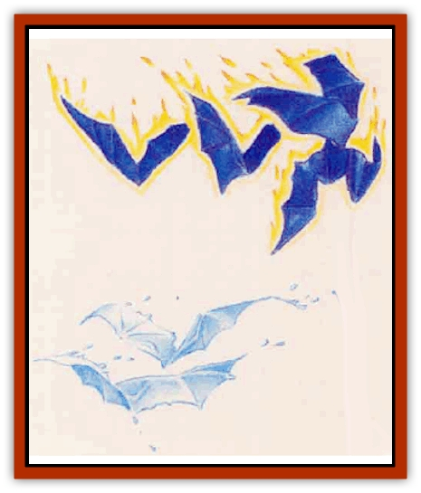

# Fundamental - Fire - Water

| Statistic | **Fire** | **Water** |
| --- | --- | --- |
| **Activity Cycle:** | Any | Any |
| **Alignment:** | Neutral | Neutral |
| **Armor Class:** | 5 | 4 |
| **Climate/Terrain:** | Any fiery | Any water |
| **Damage/Attack:** | 1d6 (ram) | 1d6 (ram) |
| **Diet:** | Any combustible | Any liquid |
| **Frequency:** | Rare | Rare |
| **Hit Dice:** | 1+1 | 1+1 |
| **Intelligence:** | Semi- (3) | Semi- (3) |
| **Magic Resistance:** | Nil | Nil |
| **Morale:** | Steady (12) | Steady (12) |
| **Movement:** | Fl 18 (B) | Fl 12 (B) |
| **No. Appearing:** | 2d10 | 2d10 |
| **No. of Attacks:** | 1 | 1 |
| **Organization:** | Flock | Flock |
| **Size:** | T (2' wingspan) | T (1-2' wingspan) |
| **Special Attacks:** | Nil | Nil |
| **Special Defenses:** | See below | See below |
| **THAC0:** | 19 | 19 |
| **Treasure:** | Nil | Nil |
| **XP Value:** | 175 | 120 |

Among the least powerful creatures inhabiting the elemental planes are the [[Fundamental_All_Elements|fundamentals]]. Each of these creatures resembles a pair of [[Bat|bat]]-like wings without a head or body. Fundamentals never cease their flying, not even to land or rest a moment.

## Fire Fundamental

This deep bluish-black creature appears constantly enshrouded in flames. Fire fundamentals have 2-foot wingspans and occasionally cause small fires when they brush by particularly flammable objects, such as dry leaves or paper.

**Combat:** In combat, fire fundamentals flock together and swoop around their opponents in a kinetic whirlwind of activity. It is unknown how fundamentals "see" their targets, although they may detect body heat.

A fundamental's only attack is a ramming dive in which the creature strikes its target with its own body, inflicting 1d6 points of damage. This attack does no damage to the fundamental itself.

These creatures can be harmed only by magic or magical weapons and remain immune to mind-affccting spells such as sleep and charm. Treat them as enchanted creatures for the purposes of spells such as protection from evil. In addition to the above immunities, these fundamentals suffer no damage from fire attacks.

**Habitat/Society:** Fire fundamentals usually appear on the Prime Material Plane in spots such as volcanoes or places where natural gas commonly burns. They always move in flocks and often accompany more powerful elemental creatures to the Prime Material Plane.

Just how or why fundamental come to reside on the Prime Material Plane is unknown. Some theorize that these rather weak elementals find themselves inadvertently drawn into the Prime Material Plane when a more powerful elemental intentionally crosses over or is summoned from its home plane. Possibly, the more powerful elementals send these creatures to the Prime Material Plane for their own unknown purposes.

**Ecology:** Fundamentals, as foreigners to the Prime Material Plane, do not play an important role in the overall ecology of any area.

The body of a fire Fundamental can help create a *potion of fire resistance*. As with others of its kind, when one of the these fundamentals dies on the Prime Material Plane, its body quickly returns to the Elemental Plane of Fire, unless placed inside a *blessed* container within two rounds of the creature's death.

## Water Fundamental

Water fundamentals bear translucent wings spanning 1 to 2 feet. Tiny droplets of water continually spray from these wet, glistening wings. In bright sunlight, they appear as fantastically beautiful, rainbow-colored creatures, casting pools of colored light over the surface of the water as they skim above it.

**Combat:** Water fundamentals attack with the same swooping dives as their fiery brethren. Tactically, these water-based creatures tend to charge a target straight on, en masse.

Water fundamentals share the normal immunities of their kind. In addition, their lack of coloration means that the creatures surprise their foes easily (except in direct sunlight): opponents suffer a -2 penalty to their surprise rolls.

**Habitat/Society:** Characters always see water fundamentals flying above large bodies of water. They are most often found above deep water, particularly oceans and the deepest of lakes. Not only do they consume water for sustenance, they must immerse themselves in it at least once an hour per day in order to survive.

**Ecology:** The water that composes much of this creature's body can be used in the creation of a *potion of water breathing*. However, a fundamental that dies on the Prime Material Plane quickly vanishes, returning to the Elemental Plane of Water. In order to use this fundamental fluid, a character must collect it in a *blessed* container or mix it into the potion within two rounds of the creature's death.

---
## Discovery & Documentation

**Source Publication:** Mystara Appendix (1994)
**Campaign Setting:** Mystara
**Author(s):** John Nephew, Teeuwynn Woodruff, John Terra, Skip Williams

### Other Creatures Found in This Source Book
   * [[Actaeon|Actaeon]]
   * [[Agarat|Agarat]]
   * [[Ash_Crawler|Ash Crawler]]
   * [[Baldandar|Baldandar]]
   * [[Bargda|Bargda]]
   * [[Bhut|Bhut]]
   * [[Bird_Mystara|Bird (Mystara)]]
   * [[Blackball|Blackball]]
   * [[Choker|Choker]]
   * [[Coltpixie|Coltpixie]]
   * [[Crone_of_Chaos|Crone of Chaos]]
   * [[Darkhood|Darkhood]]
   * [[Darkwing|Darkwing]]
   * [[Decapus|Decapus]]
   * [[Deep_Glaurant|Deep Glaurant]]
   * [[Diabolus|Diabolus]]
   * [[Dimensional_Warper|Dimensional Warper]]
   * [[Dragon_Mystara_Crystalline|Dragon (Mystara), Crystalline]]
   * [[Dragon_Mystara_Jade|Dragon (Mystara), Jade]]
   * [[Dragon_Mystara_Onyx|Dragon (Mystara), Onyx]]
   * [[Dragon_Mystara_Ruby|Dragon (Mystara), Ruby]]
   * [[Drake_Mystara|Drake (Mystara)]]
   * [[Dragonfly|Dragonfly]]
   * [[Dusanu|Dusanu]]
   * [[Elemental_of_Chaos_Air_Earth|Elemental of Chaos, Air/Earth]]
   * [[Elemental_of_Chaos_Fire_Water|Elemental of Chaos, Fire/Water]]
   * [[Elemental_of_Law_Air_Earth|Elemental of Law, Air/Earth]]
   * [[Elemental_of_Law_Fire_Water|Elemental of Law, Fire/Water]]
   * [[Familiar_Mystara|Familiar (Mystara)]]
   * [[Frost_Salamander|Frost Salamander]]
   * [[Fundamental_Air_Earth|Fundamental, Air/Earth]]
   * [[Gargantua_Mystara|Gargantua (Mystara)]]
   * [[Geonid|Geonid]]
   * [[Ghostly_Horde|Ghostly Horde]]
   * [[Giant_Athach|Giant, Athach]]
   * [[Giant_Hephaeston|Giant, Hephaeston]]
   * [[Golem_Drolem|Golem, Drolem]]
   * [[Golem_Mystara_I|Golem (Mystara) I]]
   * [[Golem_Mystara_II|Golem (Mystara) II]]
   * [[Golem_Mystara_III|Golem (Mystara) III]]
   * [[Gray_Philosopher|Gray Philosopher]]
   * [[Guardian_Warrior|Guardian Warrior]]
   * [[Gyerian|Gyerian]]
   * [[Herex|Herex]]
   * [[Hivebrood|Hivebrood]]
   * [[Horde|Horde]]
   * [[Hsiao|Hsiao]]
   * [[Huptzeen|Huptzeen]]
   * [[Hutaakan|Hutaakan]]
   * [[Imp_Mystara|Imp (Mystara)]]
   * [[Jellyfish_Giant_Mystara|Jellyfish, Giant (Mystara)]]
   * [[Kna|Kna]]
   * [[Kopru|Kopru]]
   * [[Lizard_Mystara|Lizard (Mystara)]]
   * [[Lizard-kin_Mystara|Lizard-kin (Mystara)]]
   * [[Lupin|Lupin]]
   * [[Lycanthrope_Werejaguar_Mystara|Lycanthrope, Werejaguar (Mystara)]]
   * [[Lycanthrope_Wereswine|Lycanthrope, Wereswine]]
   * [[Magen|Magen]]
   * [[Manikin|Manikin]]
   * [[Mek|Mek]]
   * [[Mujina|Mujina]]
   * [[Nagpa|Nagpa]]
   * [[Neh-thalggu|Neh-thalggu]]
   * [[Nightshade_Mystara|Nightshade (Mystara)]]
   * [[Nuckalavee|Nuckalavee]]
   * [[Pegataur|Pegataur]]
   * [[Phanaton|Phanaton]]
   * [[Plant_Dangerous_Mystara|Plant, Dangerous (Mystara)]]
   * [[Plasm|Plasm]]
   * [[Rakasta|Rakasta]]
   * [[Rock_Man|Rock Man]]
   * [[Sabreclaw|Sabreclaw]]
   * [[Sacrol|Sacrol]]
   * [[Scamille|Scamille]]
   * [[Shapeshifter|Shapeshifter]]
   * [[Shargugh|Shargugh]]
   * [[Shark-kin|Shark-kin]]
   * [[Sollux|Sollux]]
   * [[Spectral_Death|Spectral Death]]
   * [[Spectral_Hound|Spectral Hound]]
   * [[Spider-kin|Spider-kin]]
   * [[Spirit_Mystara|Spirit (Mystara)]]
   * [[Statue_Living|Statue, Living]]
   * [[Surtaki|Surtaki]]
   * [[Tabi|Tabi]]
   * [[Thoul|Thoul]]
   * [[Thunderhead|Thunderhead]]
   * [[Tiger_Ebon|Tiger, Ebon]]
   * [[Topi|Topi]]
   * [[Tortle|Tortle]]
   * [[Vampire_Velya|Vampire, Velya]]
   * [[White_Fang|White Fang]]
   * [[Worm_Mystara|Worm (Mystara)]]
   * [[Wyrd|Wyrd]]
   * [[Yowler|Yowler]]
   * [[Zombie_Lightning|Zombie, Lightning]]
