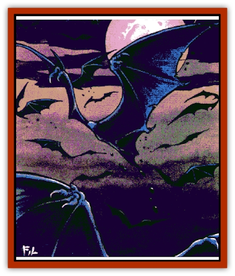

# Fundamental - Negative

| Statistic | **Fundamental, Negative** |
| --- | --- |
| **Activity Cycle:** | Any |
| **Alignment:** | Neutral Evil |
| **Armor Class:** | 3 |
| **Climate/Terrain:** | Negative Energy Plane |
| **Damage/Attack:** | 1d6 (ram) |
| **Diet:** | Life Force |
| **Frequency:** | Rare |
| **Hit Dice:** | 1+1 |
| **Intelligence:** | Semi- (3) |
| **Magic Resistance:** | 10% |
| **Morale:** | Steady (12) |
| **Movement:** | Fl 18 (B) |
| **No. Appearing:** | 2-20 |
| **No. of Attacks:** | 1 |
| **Organization:** | Murder |
| **Size:** | T (2' wingspan) |
| **Special Attacks:** | Teem |
| **Special Defenses:** | Immune to normal weapons, cold, and mind-affecting attacks |
| **THAC0:** | 19 |
| **Treasure:** | Nil |
| **XP Value:** | 420 |

Negative [[Fundamental_All_Elements|fundamentals]] are weakly empowered manifestations of the Negative Energy Plane. They resemble pairs of flapping [[Bat|bat]]-like wings devoid of bodies, heads, or other features. These creatures infest the Negative Energy Plane in great murders (flocks), winging their way endlessly through the final Void.

Negative fundamentals are only semi-intelligent; they have no language of their own and are unable to learn other languages. However, these creatures share a low-level empathic bond amongst themselves. With this bond, they are able to congregate and maneuver in unison, even though they possess no overt means of sensing their environment. A negative fundamental is always aware of others of its kind within 100 feet.

**Combat:** Negative fundamentals target living beings as prey, drawn by raw life force (negative fundamentals can sense living beings within 100 feet). When a murder senses life, the fundamentals rise as a group into the air, then descend upon their prey; because of the fundamentals' dead-black coloration, opponents suffer a -2 penalty on surprise checks in conditions of low light.

Negative fundamentals most often attack by ramming their prey; contact with living flesh drains life force, causing 1d6 points of damage.

Negative fundamentals can coordinate their efforts through their empathic bond, greatly increasing the efficiency of each individual's attack; this is referred to as a *teem* attack. When a murder *teems* (30% chance each enccounter), the flock swams a particular victim, buffeting and wheeling with their midnight wings so thickly that the THAC0 of each teeming fundamental drops by 1 for every fundamental involved in the attack. For example, if a group of 10 negative fundamentals successfully *teem*, the THAC0 of each is 9 rather than 19. Teem attacks last for 1d4+4 rounds, and the creatures' THAC0 can be reduced to a minimum of 5.

Negative fundamentals are harmed only by magical weapons, and 10% of spells cast upon these creatures are merely drained harmlessly into their bodies. Mind-affecting powers and attacks involving cold have no effect upon negative fundamentals.

**Habitat/Society:** Negative fundamentals are native to the Negative Energy Plane, and it is only very seldom that any ever find their way to more populated planes and realms. From time to time, however, 1d10 of these creatures will be drawn to the Prime Material Plane when a powerful undead creature is created. For example, when a [[Vampire_General_Information|vampire]] rises from the dead, a link between it and the Negative Energy plane is formed for the first time. A murder of these creatures can sometimes be drawn down this conduit, so that when the vampire first breaches its tomb, a burst of midnight wings also emerges.

**Ecology:** Natives to the Negative Energy Plane, these creatures are sustained in their unending flights by the medium of their own existence. However, when drawn into any plane other than their home plane, negative fundamentals are drawn to feed on the life force of living creatures.

A negative fundamental that is able to absorb at least six points of life force a week for six weeks has a 50% chance to split into two in a sort of asexual fission. Each new creature has exactly the statistics of the previous single creature. A negative fundamental which is unable to absorb at least six points of life force in one week while on a plane other than its home plane simply evaporates into nothing.

---
## Discovery & Documentation

**Source Publication:** Return to the Tomb of Horrors (1998)
**Campaign Setting:** Greyhawk
**Author(s):** Bruce R. Cordell, Gary Gygax

### Other Creatures Found in This Source Book
   * [[Bone_Weird|Bone Weird]]
   * [[Elemental_Negative_Energy|Elemental, Negative Energy]]
   * [[Moilian_Heart|Moilian Heart]]
   * [[Moilian_Zombie|Moilian Zombie]]
   * [[Vestige|Vestige]]
   * [[Winter-Wight|Winter-Wight]]
