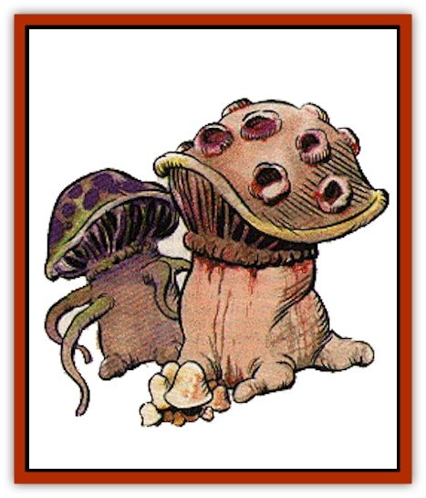

# Fungus

| Statistic | **Ascomoid** | **Gas spore** | **Phycomid** | **Shrieker** | **Violet** |
| --- | --- | --- | --- | --- | --- |
| **Activity Cycle:** | Any | Any | Any | Any | Any |
| **Alignment:** | Neutral (evil) | Neutral | Neutral (evil) | Neutral | Neutral |
| **Armor Class:** | 3 | 9 | 5 | 7 | 7 |
| **Climate/Terrain:** | Subterranean | Subterranean | Subterranean | Subterranean | Subterranean |
| **Damage/Attack:** | See below | See below | 3-6/3-6 | Nil | See below |
| **Diet:** | Scavenger | Scavenger | Scavenger | Scavenger | Scavenger |
| **Frequency:** | Very rare | Rare | Rare | Common | Rare |
| **Hit Dice:** | 6+6 | 1 hp | 5 | 3 | 3 |
| **Intelligence:** | Unratable | Non- (0) | Unratable | Non- (0) | Non- (0) |
| **Magic Resistance:** | Nil | Nil | Nil | Nil | Nil |
| **Morale:** | Champion (15) | Average (8) | Elite (14) | Steady (12) | Steady (12) |
| **Movement:** | 12 (see below) | 3 | 3 | 1 | 1 |
| **No. Appearing:** | 1 | 1-3 | 1-4 | 2-8 (2d4) | 1-4 |
| **No. of Attacks:** | 1 | 1 | 2 | 0 | 1-4 |
| **Organization:** | Multicellular | Multicellular | Multicellular | Multicellular | Multicellular |
| **Size:** | M to L (5-10' dia.) | M (4-6' dia.) | T (2' dia.) | M (4-7') | M (4-7') |
| **Special Attacks:** | Spore jet | See below | Infection | Nil | See below |
| **Special Defenses:** | See below | Nil | See below | Noise | Nil |
| **THAC0:** | 13 | N/A | 15 | 17 | 17 |
| **Treasure:** | Nil | Nil | Nil | Nil | Nil |
| **XP Value:** | 1,400 | 120 | 650 | 120 | 175 |

Fungi are simple plants that lack chlorophyll, true stems, roots, and leaves. Fungi are incapable of photosynthesis and live as parasites or saprophytes.

## Ordinary Fungi

Ordinary fungi are well known to man: molds, yeast, mildew, mushrooms, and puffballs. These plants include both useful and harmful varieties.

**Combat:** Ordinary fungi do not attack or defend themselves, but they are prolific and can spread where unwanted.

Adventurers who have lost rations to mold or clothing to mildew have had unpleasant encounters with fungi.

**Habitat/Society:** The bodies of most true fungi consist of slender cottony filaments. Anyone who wishes to see this for himself need only leave a damp piece of bread in a cupboard for a day or two. Examining the black mold on the bread with a magnifying glass will show off not only the filaments, but also the spore bodies at the top of these. The spores are what gives mold its color.

Most fungi reproduce asexually by cell division, budding, fragmentation, or spores. Those that reproduce sexually alternate a sexual generation (gametophyte) with a spore-producing (sporophyte) one. Fungi grow best in dark, damp environments, which they can find all too easily in a kitchen cupboard, backpack, or boot. A warm environment is preferred by some, such as yeasts and certain molds, but excessive heat kills fungi.

Proper storage and cleanliness can be used to avoid most ordinary fungi.

**Ecology:** Fungi break down organic matter, thus playing an important part in the nitrogen cycle by decomposing dead organisms into ammonia. Without the action of mushrooms and bracket fungi, soil renewal could not take place as readily as it does.

Fungi are also useful to man for many purposes. Yeasts are valuable as fermenting agents, raising bread and brewing wines, beers, and ales. Certain molds are important for cheese production. The color in blue cheese is a mold that has been encouraged to grow in this semisoft cheese.

Many fungi are edible, and connoisseurs consider some to be delicious. Pigs are used to hunt for truffles, an underground fungus that grows near tree roots and gives food a piquant flavor. No one has as yet managed to cultivate truffles -- an enterprising botanist could make a mint by learning to grow these.

Mushrooms, the fruiting body of another underground fungus, can sometimes be eaten, but can be so poisonous that the novice mushroom hunter is allowed but one mistake in picking. The mycelium producing a single mushroom might extend beneath the ground for several feet in any direction. Medicinally, green molds (such as penicillium) can be used as folk remedies for various bacterial infections.

An alchemist expert in the ways of fungi can produce a variety of useful substances from their action on various materials.

## Violet Fungus

Violet fungus growths resemble shriekers, and are usually (75%) encountered with them. The latter are immune to the touch of violet fungi, and the two types of creatures complement each other's existence.

**Combat:** Violet fungi favor rotted animal matter to grow upon. Each fungus has one to four branches with which it flails out if any animal comes within range (see following). The excretion from these branches rots flesh in one round unless a successful saving throw vs. poison is rolled or a *cure disease* spell is used. The branch length of this fungi depends upon the fungi's size. Violet fungi range from four to seven feet tall, the smallest having one-foot-long branches, the five-foot-tall fungi having two-foot-long branches, and so on. Any sized growth can have up to four branches.

## Shrieker

Shriekers are normally quiet, mindless fungi that are ambulatory. They are dangerous to dungeon explorers because of the hellish racket they make.

**Combat:** Light within 30 feet or movement within 10 feet causes a shrieker to emit a piercing shriek that lasts for 1-3 rounds. This noise has a 50% chance of attracting wandering monsters each round thereafter.

**Habitat/Society:** They live in dark places beneath the ground, often in the company of violet fungi. When the shriekers attract curious dungeon dwellers by their shrieking, the violet fungi are able to kill them with their branches, leaving plenty of organic matter for these saprophytic life forms to feed on.

**Ecology:** [[Worm|Purple worms]] and [[Shambling_Mound|shambling mounds]] greatly prize shriekers as food, and don't seem to mind the noise while eating.

Shrieker spores are an important ingredient in *potions of plant control*.

## Phycomid

The algae-like phycomids resemble fibrous blobs of decomposing, milk-colored matter with capped fungi growing out of them. They exude a highly alkaline substance (like lye) when attacking.

**Combat:** These fungoid monsters have sensory organs for heat, sound, and vibrations located in several clusters. When phycomids attack, they extrude a tube and discharge the alkaline fluid in small globules that have a range of 1d6+6 feet.

In addition to alkaline damage, the globs that these creatures discharge might also cause victims to serve as hosts for new phycomid growth. If a victim fails a saving throw vs. poison, the individual begins to sprout mushroom-like growths in the infected area. This occurs in 1d4+4 rounds and inflicts 1d4+4 points of damage. The growths then spread throughout the host body, killing it in 1d4+4 turns, and turning it into a new phycomid. A *cure disease* spell will stop the spread through the host.

## Ascomoid

Ascomoids are huge, puffball-like fungi with very thick, leathery skin. They move by rolling.

**Combat:** At first, an ascomoid's movement is slow - 3 for the first round, 6 the next, then 9, then finally 12 - but they can keep it up for hours without tiring.

Ascomoids attack by rolling into or over opponents. Small- and medium-sized opponents are knocked down and must rise during the next round or remain prone.

The creature's surface is covered with numerous pocks which serve as sensory organs. Each pock can also emit a jet of spores to attack dangerous enemies. Large opponents or those who have inflicted damage upon the ascomoids are always attacked by spore jets. The stream of spores is about one foot in diameter and 30 feet long. Upon striking, the stream puffs into a cloud of variable diameter (five to 20 feet). The creatures under attack must roll a successful saving throw vs. poison or die from infection in their internal systems in 1d4 rounds. Even those who save are blinded and choked to such an extent that they require 1d4 rounds to recover and rejoin melee. Meanwhile, they are nearly helpless, and all attacks upon them gain a +4 bonus to attack rolls with no shield or Dexterity bonuses allowed.

Different types of weapons affect the ascomoid differently. Piercing weapons, such as spears, score double damage. Shorter stabbing weapons do damage as if against a small-sized opponent. Blunt weapons do not harm ascomoids; slashes and cuts from edged weapons cause only 1 point of damage. An ascomoid saves against magical attacks, such as *magic missiles*, *fireballs*, and lightning, with a +4 bonus to the saving throw; damage is only 50% of normal. (Cold-based attacks are at normal probabilities and damage.) As these fungi have no minds by ordinary standards, all spells affecting the brain (*charm*, *ESP*, etc.), unless specific to plants, are useless.

## Gas Spore

At any distance greater than 10 feet, a gas spore is 90% likely to be mistaken for a [[Beholder_and_Beholder-kin_I|beholder]]. Even at close ranges there is a 25% possibility that the creature is seen as a beholder, for a gas spore has a false central eye and rhizome growths atop it that strongly resemble the eye stalks of a beholder.

**Combat:** If the spore is struck for even 1 point of damage it explodes. Every creature within a 20-foot radius suffers 6d6 points of damage (3d6 if a saving throw vs. wands is successful).

If a gas spore makes contact with exposed flesh, the spore shoots tiny rhizomes into the living matter and grows through the victim's system within one round. The gas spore dies immediately. The victim must have a *cure disease* spell cast on him within 24 hours or die, sprouting 2d4 gas spores.

---
## Discovery & Documentation

**Source Publication:** Monstrous Manual (1995)
**Campaign Setting:** Advanced Dungeons & Dragons 2nd Edition
**Author(s):** Tim Beach

### Other Creatures Found in This Source Book
   * [[Aarakocra|Aarakocra]]
   * [[Aboleth|Aboleth]]
   * [[Ankheg|Ankheg]]
   * [[Arcane|Arcane]]
   * [[Argos|Argos]]
   * [[Aurumvorax|Aurumvorax]]
   * [[Baatezu_Lesser_Abishai|Baatezu, Lesser, Abishai]]
   * [[Baatezu_General_Information|Baatezu, General Information]]
   * [[Baatezu_Greater_Pit_Fiend|Baatezu, Greater, Pit Fiend]]
   * [[Banshee|Banshee]]
   * [[Basilisk|Basilisk]]
   * [[Bat|Bat]]
   * [[Bear|Bear]]
   * [[Beetle_Giant|Beetle, Giant]]
   * [[Behir|Behir]]
   * [[Beholder_and_Beholder-kin_I|Beholder and Beholder-kin I]]
   * [[Beholder_and_Beholder-kin_II|Beholder and Beholder-kin II]]
   * [[Bird|Bird]]
   * [[Brain_Mole|Brain Mole]]
   * [[Broken_One|Broken One]]
   * [[Brownie|Brownie]]
   * [[Bugbear|Bugbear]]
   * [[Bulette|Bulette]]
   * [[Bullywug|Bullywug]]
   * [[Carrion_Crawler|Carrion Crawler]]
   * [[Cat_Great|Cat, Great]]
   * [[Catoblepas|Catoblepas]]
   * [[Cat_Small|Cat, Small]]
   * [[Cave_Fisher|Cave Fisher]]
   * [[Centaur|Centaur]]
   * [[Centipede|Centipede]]
   * [[Chimera|Chimera]]
   * [[Cloaker|Cloaker]]
   * [[Cockatrice|Cockatrice]]
   * [[Couatl|Couatl]]
   * [[Crabman|Crabman]]
   * [[Crawling_Claw|Crawling Claw]]
   * [[Crocodile|Crocodile]]
   * [[Crustacean_Giant|Crustacean, Giant]]
   * [[Crypt_Thing|Crypt Thing]]
   * [[Death_Knight|Death Knight]]
   * [[Deepspawn|Deepspawn]]
   * [[Dinosaur_I|Dinosaur I]]
   * [[Displacer_Beast|Displacer Beast]]
   * [[Dog|Dog]]
   * [[Dog_Moon|Dog, Moon]]
   * [[Dolphin|Dolphin]]
   * [[Doppelganger|Doppelganger]]
   * [[Dracolich|Dracolich]]
   * [[Dragon_Brown|Dragon, Brown]]
   * [[Dragon_Chromatic_Black|Dragon, Chromatic, Black]]
   * [[Dragon_Chromatic_Blue|Dragon, Chromatic, Blue]]
   * [[Dragon_Chromatic_Green|Dragon, Chromatic, Green]]
   * [[Dragon_Cloud|Dragon, Cloud]]
   * [[Dragon_Chromatic_Red|Dragon, Chromatic, Red]]
   * [[Dragon_Chromatic_White|Dragon, Chromatic, White]]
   * [[Dragon_Deep|Dragon, Deep]]
   * [[Dragon_Gem_Amethyst|Dragon, Gem, Amethyst]]
   * [[Dragon_Gem_Crystal|Dragon, Gem, Crystal]]
   * [[Dragon_Gem_Emerald|Dragon, Gem, Emerald]]
   * [[Dragon_Gem_Sapphire|Dragon, Gem, Sapphire]]
   * [[Dragon_Gem_Topaz|Dragon, Gem, Topaz]]
   * [[Dragon_Metallic_Brass|Dragon, Metallic, Brass]]
   * [[Dragon_Metallic_Bronze|Dragon, Metallic, Bronze]]
   * [[Dragon_Metallic_Copper|Dragon, Metallic, Copper]]
   * [[Dragon_Mercury|Dragon, Mercury]]
   * [[Dragon_Metallic_Gold|Dragon, Metallic, Gold]]
   * [[Dragon_Mist|Dragon, Mist]]
   * [[Dragon_Metallic_Silver|Dragon, Metallic, Silver]]
   * [[Dragon_General_Information|Dragon, General Information]]
   * [[Dragon_Shadow|Dragon, Shadow]]
   * [[Dragon_Steel|Dragon, Steel]]
   * [[Dragon_Yellow|Dragon, Yellow]]
   * [[Dragonne|Dragonne]]
   * [[Dragon_Turtle|Dragon Turtle]]
   * [[Dragonet_Faerie_Dragon|Dragonet, Faerie Dragon]]
   * [[Dragonet_Fire_Drake|Dragonet, Fire Drake]]
   * [[Dragonet_Pseudodragon|Dragonet, Pseudodragon]]
   * [[Dryad|Dryad]]
   * [[Dwarf_Derro|Dwarf, Derro]]
   * [[Dwarf|Dwarf]]
   * [[Elemental_Athas_General_Information|Elemental (Athas), General Information]]
   * [[Elemental_Air_Kin|Elemental, Air Kin]]
   * [[Elemental_Earth_Kin|Elemental, Earth Kin]]
   * [[Elemental_Fire_Kin|Elemental, Fire Kin]]
   * [[Elemental_Water_Kin|Elemental, Water Kin]]
   * [[Elemental_of_Chaos_Air_Earth|Elemental of Chaos, Air/Earth]]
   * [[Elemental_of_Chaos_Fire_Water|Elemental of Chaos, Fire/Water]]
   * [[Elemental_Composite|Elemental, Composite]]
   * [[Elemental_Air_Earth|Elemental, Air/Earth]]
   * [[Elemental_Fire_Water|Elemental, Fire/Water]]
   * [[Elemental_General_Information|Elemental, General Information]]
   * [[Elephant|Elephant]]
   * [[Elf|Elf]]
   * [[Elf_Aquatic|Elf, Aquatic]]
   * [[Elf_Drow|Elf, Drow]]
   * [[Ettercap|Ettercap]]
   * [[Eyewing|Eyewing]]
   * [[Feyr|Feyr]]
   * [[Fish|Fish]]
   * [[Frog|Frog]]
   * [[Galeb_Duhr|Galeb Duhr]]
   * [[Gargantua|Gargantua]]
   * [[Gargoyle_I|Gargoyle I]]
   * [[Genie|Genie]]
   * [[Ghost|Ghost]]
   * [[Ghoul|Ghoul]]
   * [[Giant_Cloud|Giant, Cloud]]
   * [[Giant_Cyclops|Giant, Cyclops]]
   * [[Giant_Desert|Giant, Desert]]
   * [[Giant_Ettin|Giant, Ettin]]
   * [[Giant_Firbolg|Giant, Firbolg]]
   * [[Giant_Fire|Giant, Fire]]
   * [[Giant_Fog|Giant, Fog]]
   * [[Giant_Fomorian|Giant, Fomorian]]
   * [[Giant_Frost|Giant, Frost]]
   * [[Giant_Hill|Giant, Hill]]
   * [[Giant_Jungle|Giant, Jungle]]
   * [[Giant_Mountain|Giant, Mountain]]
   * [[Giant_Reef|Giant, Reef]]
   * [[Giant_Stone|Giant, Stone]]
   * [[Giant_Storm|Giant, Storm]]
   * [[Giant_Verbeeg|Giant, Verbeeg]]
   * [[Giant_Wood|Giant, Wood]]
   * [[Gibberling|Gibberling]]
   * [[Giff|Giff]]
   * [[Gith|Gith]]
   * [[Gith_Pirate_of|Gith, Pirate of]]
   * [[Githyanki|Githyanki]]
   * [[Githzerai|Githzerai]]
   * [[Gloomwing|Gloomwing]]
   * [[Gnoll|Gnoll]]
   * [[Gnome|Gnome]]
   * [[Gnome_Spriggan|Gnome, Spriggan]]
   * [[Goblin|Goblin]]
   * [[Golem_General_Information|Golem, General Information]]
   * [[Golem_I_Greater_Golem|Golem I (Greater Golem)]]
   * [[Golem_II_Lesser_Golem|Golem II (Lesser Golem)]]
   * [[Golem_III|Golem III]]
   * [[Golem_IV|Golem IV]]
   * [[Golem_V|Golem V]]
   * [[Golem_VI_Stone_Variants|Golem VI (Stone Variants)]]
   * [[Gorgon|Gorgon]]
   * [[Grell_Colonial|Grell, Colonial]]
   * [[Gremlin_Jermlaine|Gremlin, Jermlaine]]
   * [[Gremlin|Gremlin]]
   * [[Griffon|Griffon]]
   * [[Grimlock|Grimlock]]
   * [[Grippli|Grippli]]
   * [[Hag|Hag]]
   * [[Halfling|Halfling]]
   * [[Harpy|Harpy]]
   * [[Hatori|Hatori]]
   * [[Haunt|Haunt]]
   * [[Hell_Hound|Hell Hound]]
   * [[Heucuva|Heucuva]]
   * [[Hippocampus|Hippocampus]]
   * [[Hippogriff|Hippogriff]]
   * [[Hobgoblin|Hobgoblin]]
   * [[Homunculus|Homunculus]]
   * [[Hook_Horror|Hook Horror]]
   * [[Horse|Horse]]
   * [[Human|Human]]
   * [[Hydra|Hydra]]
   * [[Imp|Imp]]
   * [[Insect_Giant|Insect, Giant]]
   * [[Insect_Swarm|Insect Swarm]]
   * [[Intellect_Devourer|Intellect Devourer]]
   * [[Invisible_Stalker|Invisible Stalker]]
   * [[Ixitxachitl|Ixitxachitl]]
   * [[Jackalwere|Jackalwere]]
   * [[Kenku|Kenku]]
   * [[Ki-rin|Ki-rin]]
   * [[Kirre|Kirre]]
   * [[Kobold|Kobold]]
   * [[Kuo-Toa|Kuo-Toa]]
   * [[Lamia|Lamia]]
   * [[Lammasu|Lammasu]]
   * [[Leech|Leech]]
   * [[Leprechaun|Leprechaun]]
   * [[Leucrotta|Leucrotta]]
   * [[Lich|Lich]]
   * [[Living_Wall|Living Wall]]
   * [[Lizard|Lizard]]
   * [[Lizard_Man|Lizard Man]]
   * [[Locathah|Locathah]]
   * [[Lurker|Lurker]]
   * [[Lycanthrope_General_Information|Lycanthrope, General Information]]
   * [[Lycanthrope_Seawolf|Lycanthrope, Seawolf]]
   * [[Lycanthrope_Werebear|Lycanthrope, Werebear]]
   * [[Lycanthrope_Wereboar|Lycanthrope, Wereboar]]
   * [[Lycanthrope_Werebat|Lycanthrope, Werebat]]
   * [[Lycanthrope_Werefox|Lycanthrope, Werefox]]
   * [[Lycanthrope_Wererat|Lycanthrope, Wererat]]
   * [[Lycanthrope_Wereraven|Lycanthrope, Wereraven]]
   * [[Lycanthrope_Weretiger|Lycanthrope, Weretiger]]
   * [[Lycanthrope_Werewolf|Lycanthrope, Werewolf]]
   * [[Mammal|Mammal]]
   * [[Mammal_Giant|Mammal, Giant]]
   * [[Mammal_Herd_I|Mammal, Herd I]]
   * [[Mammal_Small|Mammal, Small]]
   * [[Manscorpion|Manscorpion]]
   * [[Manticore|Manticore]]
   * [[Medusa_Maedar|Medusa, Maedar]]
   * [[Medusa|Medusa]]
   * [[Mephit_General_Information|Mephit, General Information]]
   * [[Merman|Merman]]
   * [[Mimic|Mimic]]
   * [[Mind_Flayer|Mind Flayer]]
   * [[Minotaur|Minotaur]]
   * [[Mist_Crimson_Death|Mist, Crimson Death]]
   * [[Mist_Vampiric|Mist, Vampiric]]
   * [[Mold_I|Mold I]]
   * [[Moldman|Moldman]]
   * [[Mongrelman|Mongrelman]]
   * [[Morkoth|Morkoth]]
   * [[Muckdweller|Muckdweller]]
   * [[Mudman|Mudman]]
   * [[Mummy_Greater|Mummy, Greater]]
   * [[Mummy|Mummy]]
   * [[Myconid|Myconid]]
   * [[Naga|Naga]]
   * [[Naga_Dark|Naga, Dark]]
   * [[Neogi|Neogi]]
   * [[Nightmare|Nightmare]]
   * [[Nymph|Nymph]]
   * [[Octopus_Giant|Octopus, Giant]]
   * [[Ogre|Ogre]]
   * [[Ogre_Half-|Ogre, Half-]]
   * [[Ooze_Slime_Jelly_I|Ooze/Slime/Jelly I]]
   * [[Ooze_Slime_Jelly_II|Ooze/Slime/Jelly II]]
   * [[Ooze_Slime_Jelly_Slithering_Tracker|Ooze/Slime/Jelly, Slithering Tracker]]
   * [[Orc|Orc]]
   * [[Otyugh|Otyugh]]
   * [[Owlbear_I|Owlbear I]]
   * [[Pegasus|Pegasus]]
   * [[Peryton|Peryton]]
   * [[Phantom|Phantom]]
   * [[Phoenix|Phoenix]]
   * [[Piercer|Piercer]]
   * [[Plant_Dangerous_I|Plant, Dangerous I]]
   * [[Plant_Intelligent|Plant, Intelligent]]
   * [[Poltergeist|Poltergeist]]
   * [[Pudding_Deadly|Pudding, Deadly]]
   * [[Quaggoth|Quaggoth]]
   * [[Rakshasa|Rakshasa]]
   * [[Rat|Rat]]
   * [[Rat_Osquip|Rat, Osquip]]
   * [[Remorhaz|Remorhaz]]
   * [[Revenant|Revenant]]
   * [[Roc|Roc]]
   * [[Roper|Roper]]
   * [[Rust_Monster|Rust Monster]]
   * [[Sahuagin|Sahuagin]]
   * [[Satyr|Satyr]]
   * [[Scorpion|Scorpion]]
   * [[Sea_Lion|Sea Lion]]
   * [[Selkie|Selkie]]
   * [[Shadow|Shadow]]
   * [[Shedu|Shedu]]
   * [[Sirine|Sirine]]
   * [[Skeleton|Skeleton]]
   * [[Skeleton_Giant|Skeleton, Giant]]
   * [[Skeleton_Warrior|Skeleton, Warrior]]
   * [[Slaad|Slaad]]
   * [[Slug_Giant|Slug, Giant]]
   * [[Snake|Snake]]
   * [[Snake_Winged|Snake, Winged]]
   * [[Spectre|Spectre]]
   * [[Sphinx|Sphinx]]
   * [[Spider|Spider]]
   * [[Sprite|Sprite]]
   * [[Squid_Giant|Squid, Giant]]
   * [[Stirge|Stirge]]
   * [[Su-Monster|Su-Monster]]
   * [[Swanmay|Swanmay]]
   * [[Tabaxi|Tabaxi]]
   * [[Tako|Tako]]
   * [[Tanar'ri_True_Balor|Tanar'ri, True, Balor]]
   * [[Tanar'ri_True_Marilith|Tanar'ri, True, Marilith]]
   * [[Tarrasque|Tarrasque]]
   * [[Tasloi|Tasloi]]
   * [[Thought_Eater|Thought Eater]]
   * [[Thri-kreen|Thri-kreen]]
   * [[Titan|Titan]]
   * [[Toad_Giant|Toad, Giant]]
   * [[Treant|Treant]]
   * [[Triton|Triton]]
   * [[Troglodyte|Troglodyte]]
   * [[Troll|Troll]]
   * [[Umber_Hulk|Umber Hulk]]
   * [[Unicorn|Unicorn]]
   * [[Urchin|Urchin]]
   * [[Vampire|Vampire]]
   * [[Wemic|Wemic]]
   * [[Whale|Whale]]
   * [[Wight|Wight]]
   * [[Will_O'Wisp|Will O'Wisp]]
   * [[Wolf|Wolf]]
   * [[Wolfwere|Wolfwere]]
   * [[Worm|Worm]]
   * [[Wraith|Wraith]]
   * [[Wyvern|Wyvern]]
   * [[Xorn|Xorn]]
   * [[Yeti|Yeti]]
   * [[Yuan-ti_Histachii|Yuan-ti, Histachii]]
   * [[Yuan-ti|Yuan-ti]]
   * [[Yugoloth_Guardian|Yugoloth, Guardian]]
   * [[Zaratan|Zaratan]]
   * [[Zombie|Zombie]]
