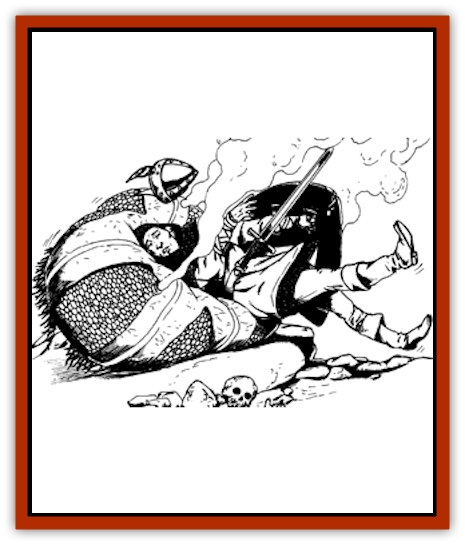

# Fungus - Cushion

| Statistic | **Fungus, Cushion** |
| --- | --- |
| **Activity Cycle:** | Any |
| **Alignment:** | Neutral |
| **Armor Class:** | 10 |
| **Climate/Terrain:** | Dry subterranean areas |
| **Damage/Attack:** | Nil |
| **Diet:** | Scavenger |
| **Frequency:** | Uncommon |
| **Hit Dice:** | 1 hit point |
| **Intelligence:** | Non- (0) |
| **Magic Resistance:** | Nil |
| **Morale:** | n/a |
| **Movement:** | Nil |
| **No. Appearing:** | 1-8 |
| **No. of Attacks:** | Nil |
| **Organization:** | Solitary |
| **Size:** | S-L (2-8' diameter) |
| **Special Attacks:** | Poisonous spores |
| **Special Defenses:** | Nil |
| **THAC0:** | 20 |
| **Treasure:** | Incidental; 5% chance of O,P,R,U |
| **XP Value:** | 35 |

The cushion fungus is usually found in dry, dark, underground areas having little or no air movement. This fungus is typically oval in shape, about knee-high when mature, and up to 8' in diameter at its largest. Its pastel coloration ranges from pink to purple, with the outer surface of the fungus having the texture of fine velvet.

**Combat:** Any movement of air or an increase in the ambient temperature (such as from a torch or warm-blooded creature) in the vicinity of a mature fungus will cause it to release an almost-invisible cloud of spores in a 40' diameter. Some observers have described this spore cloud as resembling the shimmering distortion of heat rising through the air from a hot surface. A successful wisdom check on 4d6, or such spells or devices that detect invisibility, are required to notice the cloud. Assume that the spore cloud will be released one round after a being or heat source passes within 30' of the cushion fungus, or two rounds after a being or heat source passes within 31-60' of it. The cloud remains active in the air for 5-8 turns thereafter.

Creatures caught within a spore cloud must save against poison or will begin to feel drowsy, with a deep, peaceful sleep coming on in 1-4 rounds. Even those who save are affected as per a confusion spell for 1-4 rounds, and must save again 10 rounds later if they haven't left the vicinity of the fungus. Creatures failing their saves will fall, usually onto or near the velvety soft fungus, and remain in this state until they are removed from the radius of the cloud and a *neutralize poison* spell is cast on them (without this spell, 1-3 days are required before the victim wakes up).
The cushion fungus itself will burst if someone falls on it heavily, which happens if the person struck by sleepiness is within 3' of the cushion and fails a dexterity check on 1d20 when he falls. A burst fungi emits a 60'-diameter cloud of spores for 2-5 turns, and those caught within this thick cloud have a -2 on their saving throws vs. poison, sleeping for 3-6 days if they fail. If the fungus does not burst, spores will continue to be emitted as long as victims are breathing or snoring nearby.

Over a period of 4-16 days, a sleeping victim dies of starvation and thirst, begins to decompose, and is digested by the fungus's spores on the body. The body then slowly becomes covered with the velvetlike fungus until, 5-30 days after the being's death, it has become a new cushion fungus. A body that falls on and bursts a cushion fungus takes only 3-12 days to turn into a fungus if the victim dies. In any event, a sleeping victim who manages to revive requires no further care except for eating and drinking.

**Habitat/Society:** This fungus grows only in areas with little or no air movement (abandoned dungeons, vaults, crypts, blocked caverns, etc.). If brought to an area with any regular air movement, perhaps on a spore-carrying body, the spores will not mature.

**Ecology:** The fungus's digestive enzymes are incapable of digesting inorganic items, so metallic items, jewelry, gems, and so forth will continue to exist within the body of the fungus. Some adventurers have told of finding treasure within oddly shaped cushion fungi, but cutting one open invites trouble. It is said that the spores of this fungus are valuable to alchemists and mages for use in *potions of sleep*, *confusion*, and *feign death*.

---
## Discovery & Documentation

**Source Publication:** Dragon172 (1991)
**Campaign Setting:** Dragon Magazine
**Author(s):** 

### Other Creatures Found in This Source Book
   * [[Averx|Averx]]
   * [[Biclops|Biclops]]
