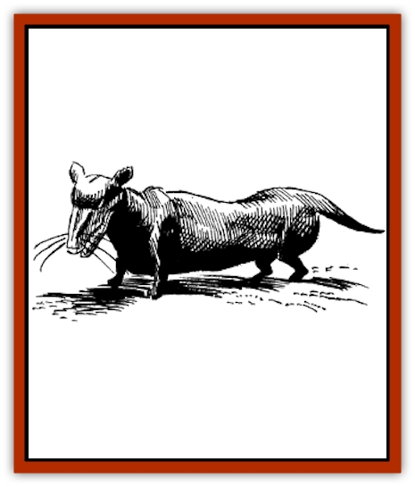
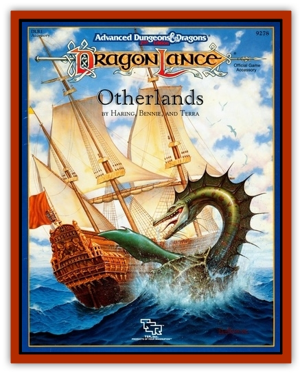

# Funno

| Statistic | **Funno** |
| --- | --- |
| **Activity Cycle:** | Day |
| **Alignment:** | Neutral |
| **Armor Class:** | 7 |
| **Climate/Terrain:** | Subterranean |
| **Damage/Attack:** | 1-3 |
| **Diet:** | Herbivore |
| **Frequency:** | Common |
| **Hit Dice:** | 1 |
| **Intelligence:** | Low (5-7) |
| **Magic Resistance:** | Nil |
| **Morale:** | Unreliable (2) |
| **Movement:** | 6 |
| **No. Appearing:** | 10-100 |
| **No. of Attacks:** | 1 |
| **Organization:** | Herd |
| **Size:** | S (3' long) |
| **Special Attacks:** | Nil |
| **Special Defenses:** | Nil |
| **THAC0:** | 20 |
| **Treasure:** | Nil |
| **XP Value:** | 15 |

The funno is an unremarkable-looking animal; at first glance, it is difficult to believe that the people of Chorane could not survive without them.

The funno is a member of the rodent family, looking a lot like a large, shaggy dachshund (about three feet long) with the head of a [[Rat|rat]]. Funnos range from tan to chocolate brown in color, with the occasional all-black specimen. They weigh 25 to 30 pounds each.

**Combat:** The funno is not much of a fighter, preferring to run from any threat, or if that is not possible, to cower and whimper. If cornered and sufficiently agitated, however (say, a group of small children teasing it for several minutes), it will turn and nip at its attackers with surprisingly sharp teeth.

**Habitat/Society:** In the wild, funnos stick together for mutual protection, raising the herd's young communally. They travel the passages of Chorane with remarkable agility. They eat practically any sort of plant or fungus they can find. When raised domestically, funnos lose what little free spirit they once had, content to wander about their pens, waiting for the daily feeding and the inevitable trip to the slaughter pen.

**Ecology:** Funno meat, while not incredibly tasty, is a welcome change from the Choranian's steady diet of brak and other fungi. However, it is not the funno's meat that makes it a prized commodity.

The hide of the funno is a soft and pliable leather that can be formed into many shapes. However, once those shaped pieces are treated with medrocide (a liquid extract of the medroc fungus), the hide hardens into a substance of surprising strength and hardness. Formed into armor, it is as effective as chain mail; it can also be formed into shields, swords, axes, spears, and other weapons, as it holds an edge quite well.

Medrocide not only hardens the hides, but it is used as a powerful glue to attach pieces of hide to each other. By forming funno hides into standard shapes, then putting them together with medrocide glue, any number of important things can be made. Bridges, ladders, carts, garden tools, baskets, fences, platforms, tables, chairs, even entire buildings.all have been made of cured funno hides in Chorane.

---
## Discovery & Documentation

**Source Publication:** DLR1 Otherlands (1992)
**Campaign Setting:** Dragonlance
**Author(s):** Haring, Bennie, and Terra

### Other Creatures Found in This Source Book
   * [[Bolandi|Bolandi]]
   * [[Dragon_Brine|Dragon, Brine]]
   * [[Ogre_Mischta|Ogre, Mischta]]
   * [[Ogre_Nzunta|Ogre, Nzunta]]
   * [[Razhak|Razhak]]
   * [[Spirit_Wisdom|Spirit, Wisdom]]
   * [[Ursoi|Ursoi]]
