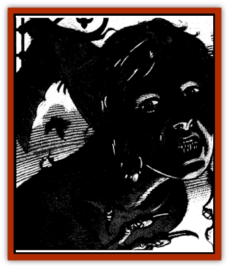

# Furies

| Statistic | **Furies** |
| --- | --- |
| **Activity Cycle:** | Day |
| **Alignment:** | Lawful evil |
| **Armor Class:** | 7 |
| **Climate/Terrain:** | Ravenloft |
| **Damage/Attack:** | 1-4/1-4/1-6: rake 1-4/1-4 |
| **Diet:** | Nil |
| **Frequency:** | Unique |
| **Hit Dice:** | 7 |
| **Intelligence:** | Exceptional (15-16) |
| **Magic Resistance:** | Nil |
| **Morale:** | Fearless (19-20) |
| **Movement:** | 6, Fl 15 (C) |
| **No. Appearing:** | 3 |
| **No. of Attacks:** | 3 |
| **Organization:** | Triune |
| **Size:** | M (6' tall) |
| **Special Attacks:** | Attribute drain |
| **Special Defenses:** | See below |
| **THAC0:** | 13 |
| **Treasure:** | Nil |
| **XP Value:** | 5,000 per sister |

The Furies are three malicious creatures who strive to prevent the redemption of Ravenloft's evil denizens. These foul sisters wander the Demiplane of Dread seeking those who would turn away from the path of evil. When they find such a person, the trio descends upon him and attempts to force him to continue his depravity and commit greater and greater crimes.

The Furies always appear together and take the form of [[Harpy|harpy]]-like creatures. They have the clawed legs of vultures and the black leathery wings of enormous bats. Their torsos and heads are those of beautiful, unclad women with coal black skin and raven hair. They have teeth as long and sharp as needles and long talons of bone capping their fingers. Their eyes glow dusky red and their breath carries the smell of rotting meat.

The Furies seem unhindered by the many languages of humans and demihumans, for they always taunt their victim in his native language. Magical or psionic attempts to silence them or force them to speak when they do not wish to will always fail.

**Combat:** The Furies have an innate ability to locate their victim, making it impossible for him to hide from them even with magical means. It may well be that one is safe from the sisters beyond the domains of Ravenloft.

When possible, they begin any skirmish by diving down on their prey from trees, high cliffs, of other perches. When they are able to attack in this manner they gain a +2 bonus to their Attack and Damage Rolls. Once in melee combat, the Furies do not generally seek to pull back and arrange a second such ambush.

The dark sisters attack with their deadly talons. slashing twice in each round for 1d4 points of damage each, In addition, they can bite a victim for 1d6 points. If both of their talons hit, they are assumed to have gotten a grip on their victim and are able to rake with their vultures' legs, A successful attack with these keen claws inflicts 1d4 points of damage each.

While all five of a Fury's physical attacks must be directed at a single target, the creatures have a special attack that can be employed upon any single target within 5 feet of them. Thrice per day, each of the sisters can exhale a breath of putrid air that has the same effects as a *stinking cloud* spell but affects only one person.

While the Furies will employ these tactics in most battles, they carry magical *scourges +3* they save for their primary victim. During any round that the Furies do not make their normal melee attacks they may strike once with these barbed whips, inflicting 1d4 points of damage with each hit. In addition to their normal damage, the lashes of the Furies have the ability to drain Ability Score points from their targets. Alecto's scourge destroys 1 point of Wisdom, Tisiphone's drains Strength, and Megarea's reduces the victim's Intelligence. Unless the target is slain, lost Ability Score points are regained at a rate of 1 per day. A Fury can employ her stinking breath in the same round that she uses her Scourge.

The sisters can also *change self* at will, taking the form of old crones. They use this ability when they must act without revealing their true natures.

Although they are not undead, the Furies can be turned by a cleric of good alignment as if they were vampires. However, this attempt requires one round for each of the sisters and will only succeed if the priest invokes their names individually. Turning the sisters will only drive them off until their next visitation and they cannot be destroyed or commanded in this fashion.

When a victim dies at the hands (or scourges) of the Furies, spells such as *raise dead*, *resurrection*, *reincarnate*, or *wish* cast with the intent of bringing the victim back to life will serve only as an *animate dead* spell. The target of the spell will rise from the grave as a zombielike creature with half the Hit Dice it had in life. Such an undead creature will obey the caster of the spell.

The dark sisters cannot intentionally harm creatures of good alignment, although they may direct their fetid breath at them. They may strike at neutral and evil characters freely, but prefer to attack the latter over the former if given a choice.

Only the attacks of good aligned characters do full damage to one of the Furies. They take only half damage from any attack made by a neutral creature and are entirely immune to harm by any evil being.

The furies are immune to all spells and psionics that attempt to control the mind or body. They are further immune to all spells from the school of Enchantment/charm or the sphere of Charm.

In addition to these powers, each of the three sisters has unique abilities that affect how she conducts combat. Complete information about these wretched creatures will be found at the end of this entry.

**Habitat/Society:** The three sisters are always found together. It is not known where their lair is, if one exists at all. They appear to move freely between all the domains of Ravenloft and even a domain lord cannot prevent their entry or exit from his lands.

Known to the [[Human_Vistana|Vistani]] as Alecto, Tisiphone, and Megarea, these creatures are said to have originated amid the Gray Wastes. How they came to be trapped in the Demiplane of Dread and what relationship they might have to macabre powers behind the swirling Mists of Ravenloft is unknown.

The furies seem to have an uncanny sense that tells them when someone who has begun to travel down the seductive road of evil is attempting to atone for his wrongs and return his spirit to a state of grace. Exactly how this ability functions, or what its parameters might be, is unknown. It is clear from past experience that the furies have no interest in those who are trapped in the first or second stages of corruption, known to the Vistani as *the enticement* and *the invitation*. Only those who have progressed to the third and fourth stages, *the touch of darkness* and *the embrace* are of interest to this foul triad. It is worth mentioning that those lamentable few who have moved beyond the fourth stage, becoming *creatures of Ravenloft* or *lords of a domain* are beyond salvation and thus of no interest to the furies.

When a repentant creature comes to the attention of the furies, they swoop out of the mists and make a lair in some out of the way place. If possible, this will be an area that is often visited by the person who has captured their interest. If no such place is available, they will nest where they must and then arrange to lure their victim to them.

In the shape of crones, they will contact the one who seeks atonement and befriend him. Using every bit of their considerable guile and wit, they will seek to persuade the poor dupe to undertake additional acts of evil. It is their hope to lure him beyond the fourth stage of corruption to a point where redemption is no longer possible. Once this is done, the furies lose all interest in their victim and abandon him to his fate, no matter what promises they might have made to him previously.

If their victim resists, they will recount his crimes and assure him of his doom. Taunting him mercilessly, they will say whatever they must to cajole the tortured spirit to violent outbursts or evil reactions.

The sisters will attempt to halt the redemption of an individual only three times. If they have not been successful after this, they will decide to simply destroy him. The sisters always select a public setting for their attack and strike with the intention of torturing their victim to death. Thus. they will do everything in their power to make his demise as painful as possible. It is their belief that this will be a lesson to other evildoers who might wish to renounce their malevolent ways. The furies will quickly kill any creature that attempts to stand in the way of their dark purpose.

Any time one of the furies is reduced to 0 hit points, she will dissipate with her scourge in a vaporous black cloud. If any of the furies are destroyed in this manner, the remaining sisters will continue to fight. The next time the furies return to torment their victim, any fallen sister will appear fully restored to health.

If all three of the furies are slain in a single battle or if the victim has not been slain after three attacks, the sisters will abandon their quest. They will not return and the taint of evil, including any curses or maledictions under which the victim suffers, will be lifted.

**Ecology:** The furies thrive on the flesh of intelligent creatures. Between the three of them, they will consume an average man or similar creature each day. They are careful to conceal their hunting, however, for fear that the location of their lair will be given away and their mission interfered with.

**Alecto**

  Also called *the Implacable* and *She Who Must Not Be Named* by the Vistani, this sister has the spell-casting powers of a 10th level priest and normally enters combat with a full complement of spells. She has access to the All, Animal, Combat, Creation, Divination, Elemental, Necromantic, Plant, Protection, Summoning, and Weather spheres. When rolling saving throws, Alecto may use the more favorable number of the fighter of priest classes. Alecto's preferred spells include *call lightning*, *cause light wounds*, *charm person*, *continual light*, *dispel good*, *dispel magic*, *endure heat/endure cold*, *entangle*, *faerie fire*, *hold person*, *protection from good (10' radius)*, *silence (15' radius)*, *spell immunity*, *trip*, and *true seeing*.

**Tisiphone**

  Also known as *the Avenger* by the Vistani, Tisiphone has the prowess of a 10th level warrior. This gives her a THAC0 of 11 and allows her to employ 10-sided Hit Dice. Unlike her sisters, Tisiphone may combine her bite and claw attacks with her scourge.

She may strike with her scourge, bite, and one talon in a single round, but may not also rake with her rear claws even if all of these attacks hit. Tisiphone's saving throws are made as a 10th level fighter.

**Megarea**

  Known to the Vistani as *the Disputatious*, Megarea possesses the spell casting power of a 10th level wizard. She enters combat having memorized her full complement of spells. She can select any spells from the schools of Abjuration, Alteration, Invocation/Evocation, and Necromancy. Her saving throws are made at the more advantageous number of the fighter or wizard class.

Megarea's preferred spells are *chill touch*, *color spray*, *cone of cold*, *darkness 15' radius*, *dispel magic*, *flaming sphere*, *hold portal*, *lightning bolt*, *magic missile*, *minor globe of invulnerability*, *passwall*, *polymorph other*, *protection from normal missiles*, *stinking cloud*, *stoneskin*, and *web*.

---
## Discovery & Documentation

**Source Publication:** Ravenloft Appendix III (1991)
**Campaign Setting:** Ravenloft
**Author(s):** Kirk Botulla

### Other Creatures Found in This Source Book
   * [[Akikage|Akikage]]
   * [[Animator_Common|Animator, Common]]
   * [[Animator_Greater|Animator, Greater]]
   * [[Animator_Minor|Animator, Minor]]
   * [[Animator_General_Information|Animator, General Information]]
   * [[Bakhna_Rakhna|Bakhna Rakhna]]
   * [[Baobhan_Sith|Baobhan Sith]]
   * [[Beetle_Scarab|Beetle, Scarab]]
   * [[Boneless|Boneless]]
   * [[Boowray|Boowray]]
   * [[Bruja|Bruja]]
   * [[Carrionette|Carrionette]]
   * [[Carrion_Stalker|Carrion Stalker]]
   * [[Cat_Midnight|Cat, Midnight]]
   * [[Cat_Skeletal|Cat, Skeletal]]
   * [[Cloaker_Resplendent|Cloaker, Resplendent]]
   * [[Cloaker_Shadow|Cloaker, Shadow]]
   * [[Cloaker_Undead|Cloaker, Undead]]
   * [[Corpse_Candle|Corpse Candle]]
   * [[Death's_Head_Tree|Death's Head Tree]]
   * [[Doppelganger_Ravenloft|Doppelganger (Ravenloft)]]
   * [[Familiar_Pseudo-|Familiar, Pseudo-]]
   * [[Familiar_Undead|Familiar, Undead]]
   * [[Feathered_Serpent|Feathered Serpent]]
   * [[Fenhound|Fenhound]]
   * [[Figurine_Ceramic|Figurine, Ceramic]]
   * [[Figurine_Crystal|Figurine, Crystal]]
   * [[Figurine_Ivory|Figurine, Ivory]]
   * [[Figurine_Obsidian|Figurine, Obsidian]]
   * [[Figurine_Porcelain|Figurine, Porcelain]]
   * [[Figurine_General_Information|Figurine, General Information]]
   * [[Fleas_of_Madness|Fleas of Madness]]
   * [[Geist|Geist]]
   * [[Ghost_Animal|Ghost, Animal]]
   * [[Golem_Flesh_Ravenloft|Golem, Flesh (Ravenloft)]]
   * [[Golem_Mist_Ravenloft|Golem, Mist (Ravenloft)]]
   * [[Golem_Wax_Ravenloft|Golem, Wax (Ravenloft)]]
   * [[Gremishka|Gremishka]]
   * [[Hag_Spectral|Hag, Spectral]]
   * [[Head_Hunter|Head Hunter]]
   * [[Hearth_Fiend|Hearth Fiend]]
   * [[Hebi-No-Onna|Hebi-No-Onna]]
   * [[Hound_Phantom|Hound, Phantom]]
   * [[Hound_Skeletal|Hound, Skeletal]]
   * [[Imp_Wishing|Imp, Wishing]]
   * [[Ivy_Crawling|Ivy, Crawling]]
   * [[Jack_Frost|Jack Frost]]
   * [[Jolly_Roger|Jolly Roger]]
   * [[Kizoku|Kizoku]]
   * [[Lashweed|Lashweed]]
   * [[Leech_Magical|Leech, Magical]]
   * [[Leech_Psionic|Leech, Psionic]]
   * [[Lich_Defiler|Lich, Defiler]]
   * [[Lich_Drow|Lich, Drow]]
   * [[Lich_Elemental|Lich, Elemental]]
   * [[Lich_Psionic|Lich, Psionic]]
   * [[Living_Tattoo|Living Tattoo]]
   * [[Lycanthrope_Loup-garou|Lycanthrope, Loup-garou]]
   * [[Lycanthrope_Werejackal|Lycanthrope, Werejackal]]
   * [[Lycanthrope_Werejaguar_Ravenloft|Lycanthrope, Werejaguar (Ravenloft)]]
   * [[Lycanthrope_Wereleopard|Lycanthrope, Wereleopard]]
   * [[Lycanthrope_Wereray|Lycanthrope, Wereray]]
   * [[Mist_Ferryman|Mist Ferryman]]
   * [[Moor_Man|Moor Man]]
   * [[Obedient|Obedient]]
   * [[Odem|Odem]]
   * [[Paka|Paka]]
   * [[Plant_Blood_Rose|Plant, Blood Rose]]
   * [[Plant_Fearweed|Plant, Fearweed]]
   * [[Radiant_Spirit|Radiant Spirit]]
   * [[Recluse|Recluse]]
   * [[Remnant_Aquatic|Remnant, Aquatic]]
   * [[Rushlight|Rushlight]]
   * [[Sea_Spawn_Master|Sea Spawn, Master]]
   * [[Sea_Spawn_Minion|Sea Spawn, Minion]]
   * [[Shadow_Asp|Shadow Asp]]
   * [[Shattered_Brethren|Shattered Brethren]]
   * [[Skeleton_Archer|Skeleton, Archer]]
   * [[Skeleton_Insectoid|Skeleton, Insectoid]]
   * [[Skin_Thief|Skin Thief]]
   * [[Spirit_Psionic|Spirit, Psionic]]
   * [[Strahd_Skeleton|Strahd Skeleton]]
   * [[Strahd_Zombie|Strahd Zombie]]
   * [[Unicorn_Shadow|Unicorn, Shadow]]
   * [[Vampire_Drow|Vampire, Drow]]
   * [[Vampire_Nosferatu|Vampire, Nosferatu]]
   * [[Vampire_Oriental|Vampire, Oriental]]
   * [[Virus_General_Information|Virus, General Information]]
   * [[Virus_I|Virus I]]
   * [[Virus_II|Virus II]]
   * [[Virus_III|Virus III]]
   * [[Vorlog|Vorlog]]
   * [[Will_O'Dawn|Will O'Dawn]]
   * [[Will_O'Deep|Will O'Deep]]
   * [[Will_O'Mist|Will O'Mist]]
   * [[Will_O'Sea|Will O'Sea]]
   * [[Zombie_Cannibal|Zombie, Cannibal]]
   * [[Zombie_Desert|Zombie, Desert]]
   * [[Zombie_Wolf|Zombie Wolf]]
   * [[Zombie_Fog|Zombie Fog]]
