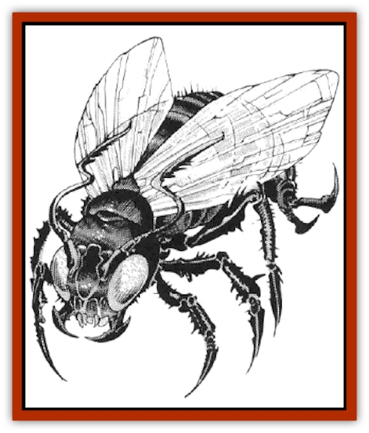

# Fyrefly

| Statistic | **Fyrefly** |
| --- | --- |
| **Activity Cycle:** | Night |
| **Alignment:** | Chaotic Neutral |
| **Armor Class:** | 5 |
| **Climate/Terrain:** | Any Tropical, Sub-tropical, or Temperate |
| **Damage/Attack:** | 1 |
| **Diet:** | Herbivore/scavenger |
| **Frequency:** | Rare |
| **Hit Dice:** | 1 hp (Attacks as 5 HD) |
| **Intelligence:** | Average (9) |
| **Magic Resistance:** | Nil |
| **Morale:** | Steady (11) |
| **Movement:** | Fl 18 (A) |
| **No. Appearing:** | 1 (but see below) |
| **No. of Attacks:** | 1 |
| **Organization:** | Solitary |
| **Size:** | T (1&rdquo;) |
| **Special Attacks:** | Starts Fire |
| **Special Defenses:** | Immune to Fire Attacks |
| **THAC0:** | 20 (15) |
| **Treasure:** | Nil |
| **XP Value:** | 175 |

The fyrefly is a large, slow-moving black insect with red wings and reddish eyes. It is normally a benign insect which flits from plant to plant, eating leaves and rotting vegetation. For most of its life, it causes no harm to anyone. It is during the creature's reproductive cycle when it becomes dangerous to other creatures.

**Combat:** When a fyrefly is doused with water or hit with a cold-based spell, it falls into dormancy. It appears dead, but will awaken in 24 hours and begin its feeding process again.

When a fyrefly comes in contact with a flammable object, there is a chance it will burst into flame. To determine this chance, first determine the flammability of the object in question. On an average fighter, for example, perhaps only 10% of his/her attire would be flammable, while on a wizard almost 90% would be. On any hit, roll percentile dice to see if the fyrefly hit a flammable object. Any flammable object hit by a fyrefly, adult or larval, must save vs. normal fire or be set ablaze. Persons in burning clothing suffer 1-6 hit points of damage per round until the fire is extinguished. Hits that do not strike burnable objects are assumed to hit flesh, causing 1 hit point damage.

The fyrefly will only attack living creatures while it is in its larval stage, immediately after it has reproduced (see below). At this time, it becomes frenzied, and will seek to set fire to any living creature. When the fyrefly is in this agitated state, it becomes extremely aggressive, and attacks as a 5 HD monster (THAC0 15). Because of its extreme quickness, it becomes much more difficult to hit, with an effective Armor Class of 5. (If, for some reason, a larval fyrefly is resting, its Armor Class falls to 9.) During its aggressive phase, it flies at anything that moves, believing itself to be invincible.

When in its larval state, the fyrefly is immune to fire and fire-based attacks, but cold-based attacks will immediately cause the creature to fall dormant. Water splashed on a larval firefly will also cause dormancy if the insect fails a saving throw vs. paralysis.

Larval fyreflies will swarm, and area of effect spells will have a reasonable chance to take out most of the creatures, but 10% of the creatures will always survive such an attack. Remember that larval fyreflies usually swarm around a creature, and an area of effect spell will undoubtedly affect that creature, also.

**Habitat/Society:** The adult fyrefly is a solitary insect, which lives in forested areas. Fyreflies spend most of their time gathering food and sleeping, waiting until the day they are to reproduce. Fyreflies voluntarily avoid others of their species, moving off into their own separate feeding areas. They sleep during the day, and feed constantly at night, pausing only to move to another leaf.

A swarm of larval fyreflies are born from one fyrefly which has fed constantly for two months. The firefly will seek out a fire to fly into in order to reproduce. The 'fly is not killed by the fire, but rather reverts to its larval state to reproduce. It metamorphoses into a small, insect-shaped mote of extremely hot fire. This may be noticed by a much brighter area inside the fire into which the fyrefly has flown. At this time, it begins a process of divisions which, if left unchecked, will produce dozens of tiny balls of flame. If the fire is quenched while the parent fyrefly waits to split, the 'fly will be unable to reproduce, and will burn out in 10 minutes. If the fyrefly is undisturbed, it will produce two larval fireflies after 10 minutes in the fire. The original 'fly dies, but its two offspring remain in the fire. For each succeeding round, each will generate two offspring, after which they leave the flame. So, two rounds after the first split, 2 fyrefly larva leave the main fire, 4 the following round, then 8, then 16, then 32, and finally 64. The final 64 fyreflies are incapable of producing any more offspring at this time. After a larval firefly leaves the fire, it burns until it is killed or sent into dormancy, or until 10 rounds have elapsed, when it falls dormant on its own and begins its transition to adulthood. This transition takes 9 days.

**Ecology:** Fyreflies are the creation of the mad wizard Grebdews, who accidentally allowed his "pets" to escape into the world.

Fyreflies would pose no problem to mankind were it not for their peculiar breeding habits. They are prized for use in many fire-based potions.

---
## Discovery & Documentation

**Source Publication:** MC14 Fiend Folio Appendix (1992)
**Campaign Setting:** Fiends Folio
**Author(s):** Don Bingle, John Terra, Wes Nicholson, Tim Beach, Steve Hardinger, Kris Hardinger, Rob Nicholls, Greg Swedberg, Al Boyce, Vince Garcia, Norm Ritchie

### Other Creatures Found in This Source Book
   * [[Aballin|Aballin]]
   * [[Achaierai|Achaierai]]
   * [[Adherer|Adherer]]
   * [[Algoid|Algoid]]
   * [[Al-Mi'raj|Al-Mi'raj]]
   * [[Apparition|Apparition]]
   * [[Caterwaul|Caterwaul]]
   * [[Coffer_Corpse|Coffer Corpse]]
   * [[Crabman|Crabman]]
   * [[Dark_Creeper|Dark Creeper]]
   * [[Dark_Stalker|Dark Stalker]]
   * [[Darter|Darter]]
   * [[Denzelian|Denzelian]]
   * [[Dune_Stalker|Dune Stalker]]
   * [[Dwarf_Urdunnir|Dwarf, Urdunnir]]
   * [[Falcon_Fire|Falcon, Fire]]
   * [[Faux_Faerie|Faux Faerie]]
   * [[Flawder|Flawder]]
   * [[Gambado|Gambado]]
   * [[Garbug|Garbug]]
   * [[Giant_Fhoimorien|Giant, Fhoimorien]]
   * [[Gibberling|Gibberling]]
   * [[Gorbel|Gorbel]]
   * [[Grimlock|Grimlock]]
   * [[Hellcat|Hellcat]]
   * [[Ice_Lizard|Ice Lizard]]
   * [[Iron_Cobra|Iron Cobra]]
   * [[Khargra|Khargra]]
   * [[Mantari|Mantari]]
   * [[Penanggalan|Penanggalan]]
   * [[Pernicon|Pernicon]]
   * [[Phantom_Stalker|Phantom Stalker]]
   * [[Retriever|Retriever]]
   * [[Ruve|Ruve]]
   * [[Scathe|Scathe]]
   * [[Sheet_Ghoul_Sheet_Phantom|Sheet Ghoul/Sheet Phantom]]
   * [[Shocker|Shocker]]
   * [[Spanner|Spanner]]
   * [[Stwinger|Stwinger]]
   * [[Sussurus|Sussurus]]
   * [[Symbiotic_Jelly|Symbiotic Jelly]]
   * [[Terithran|Terithran]]
   * [[Thunder_Children|Thunder Children]]
   * [[Troll_Ice|Troll, Ice]]
   * [[Tween|Tween]]
   * [[Umpleby|Umpleby]]
   * [[Volt|Volt]]
   * [[Xill|Xill]]
   * [[Xvart|Xvart]]
   * [[Zygraat|Zygraat]]
