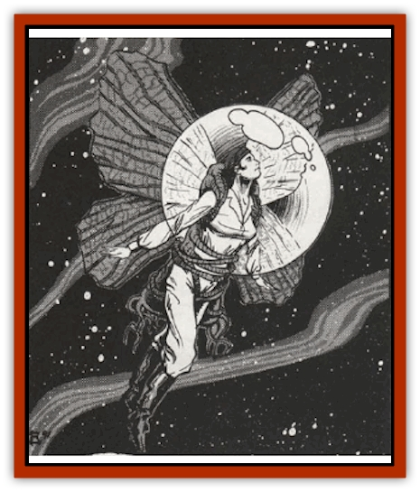

# Gadabout

| Statistic | **Gadabout** |
| --- | --- |
| **Activity Cycle:** | Any |
| **Alignment:** | Neutral |
| **Armor Class:** | 7 |
| **Climate/Terrain:** | Wildspace, shipboard |
| **Damage/Attack:** | N/A |
| **Diet:** | Photosynthetic |
| **Frequency:** | Rare |
| **Hit Dice:** | N/A |
| **Intelligence:** | Non- (0) |
| **Magic Resistance:** | Nil |
| **Morale:** | N/A |
| **Movement:** | 2 |
| **No. Appearing:** | 1 |
| **No. of Attacks:** | N/A |
| **Organization:** | None |
| **Size:** | M (4'-6' wide) |
| **Special Attacks:** | N/A |
| **Special Defenses:** | N/A |
| **THAC0:** | N/A |
| **Treasure:** | Nil |
| **XP Value:** | Nil |

Spacefaring elves use this small winged plant as personal conveyance for short-distance travel outside a spelljammer's air envelope, such as boarding actions between ships, or as emergency life-support.

The gadabout reflexively wraps its branches around the wearer, spreads its butterfly-like <q>wings</q> and allows its wearer to fly through space in a continually refreshed air bubble. This bubble is generated when the plant takes in carbon dioxide and gives off oxygen. The photosynthetic promotion of the colorful wing-leaves even provide a nourishing syrup, which the user can drink from a flexible stalk near his or her head.

This closed environment exists as long as the wings remain intact and there is sufficient sunlight. In the phlogiston, a *continual light* spell can substitute for sunlight.

**Habitat/Society:** As these plants remain under the elves' control, information about their growth and development is sketchy at best. The elves have only recently sanctiones gadabouts for sale to non-elven races.

Gadabouts do not generate seeds. Therefore, each gadabout is a rare commodity. Since the plants are expensive (2,500 gp each), owners jealously guard them: no one has yet dissected one.

**Ecology:** Easily cared for, the gadabout requires only sunlight and occasional waters. Adventurers of any class can use the gadabout, controlling it by thought as a wizard or priest controls a helm. Scholars do not know how the elves achieved this crucial modification.

Though gadabouts are hardy, they do not tolerate abuse well. When punctured, the entire plant undergoes rapid decomposition, turning to an evil-smelling mess within two hours.

Gadabouts, as well as flitters, men-o-war, and armadas, are modified fruit from the [[Starfly_Plant|starfly plant]]. The gadabout is arrested in the motile fruit stage, and modified further to be seedless as well as responsive to commands.

Gadabouts live about 25 years. The central part of the plant remains the same size; the only parts that grow are the wings. As with the other elven spacefaring plants, owners must trim the wings occasionally. The central plant is flexible enough to accommodate various humanoid body types. Ogres as well as gnomes have used them.

---
## Discovery & Documentation

**Source Publication:** MC9 Spelljammer Appendix II (1991)
**Campaign Setting:** Planescape
**Author(s):** Scott Davis, Newton Ewell, John Terra

### Other Creatures Found in This Source Book
   * [[Alchemy_Plant|Alchemy Plant]]
   * [[Allura|Allura]]
   * [[Aperusa|Aperusa]]
   * [[Autognome|Autognome]]
   * [[Bionoid|Bionoid]]
   * [[Bloodsac|Bloodsac]]
   * [[Buzzjewel|Buzzjewel]]
   * [[Constellate|Constellate]]
   * [[Contemplator|Contemplator]]
   * [[Dohwar|Dohwar]]
   * [[Dragon_Moon|Dragon, Moon]]
   * [[Dragon_Stellar|Dragon, Stellar]]
   * [[Dragon_Sun|Dragon, Sun]]
   * [[Dreamslayer|Dreamslayer]]
   * [[Dweomerborn|Dweomerborn]]
   * [[Fal|Fal]]
   * [[Feesu|Feesu]]
   * [[Fire_Bat|Fire Bat]]
   * [[Firebird|Firebird]]
   * [[Firelich|Firelich]]
   * [[Flowfiend|Flowfiend]]
   * [[Gammaroid|Gammaroid]]
   * [[Gonn|Gonn]]
   * [[Gossamer|Gossamer]]
   * [[Grav|Grav]]
   * [[Great_Dreamer|Great Dreamer]]
   * [[Greatswan|Greatswan]]
   * [[Grell_Colonial|Grell, Colonial]]
   * [[Gullion|Gullion]]
   * [[Insectare|Insectare]]
   * [[Lhee|Lhee]]
   * [[Mercurial_Slime|Mercurial Slime]]
   * [[Meteorspawn|Meteorspawn]]
   * [[Monitor|Monitor]]
   * [[Owl_Space|Owl, Space]]
   * [[Pristatic|Pristatic]]
   * [[Scro|Scro]]
   * [[Selkie_Star|Selkie, Star]]
   * [[Silatic|Silatic]]
   * [[Skullbird|Skullbird]]
   * [[Sleek|Sleek]]
   * [[Sluk|Sluk]]
   * [[Space_Swine|Space Swine]]
   * [[Sphinx_Astro-|Sphinx, Astro-]]
   * [[Spirit_Warrior|Spirit Warrior]]
   * [[Starfly_Plant|Starfly Plant]]
   * [[Stargazer|Stargazer]]
   * [[Undead_Stellar|Undead, Stellar]]
   * [[Witchlight_Marauder|Witchlight Marauder]]
   * [[Xixchil|Xixchil]]
   * [[Yitsan|Yitsan]]
   * [[Zurchin|Zurchin]]
