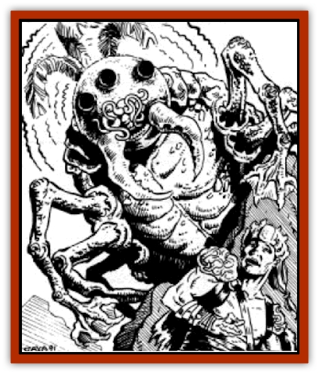

# Gaj

| Statistic | **Gaj** |
| --- | --- |
| **Activity Cycle:** | Any |
| **Alignment:** | Neutral evil |
| **Armor Class:** | 2 |
| **Climate/Terrain:** | Sands, stony barrens, rocky badlands, and islands |
| **Damage/Attack:** | 1d6 |
| **Diet:** | Carnivore |
| **Frequency:** | Very Rare |
| **Hit Dice:** | 7 |
| **Intelligence:** | Very (11-12) |
| **Magic Resistance:** | Nil |
| **Morale:** | Champion (15) |
| **Movement:** | 12 |
| **No. Appearing:** | 1-2 |
| **No. of Attacks:** | 1 |
| **Organization:** | Solitary |
| **Size:** | L (6' diameter) |
| **Special Attacks:** | See below |
| **Special Defenses:** | See below |
| **THAC0:** | 13 |
| **Treasure:** | Z |
| **XP Value:** | 2,000 |

**Psionics Summary**

| Level | Dis/Sci/Dev | Attack/Defense | Score | PSPs |
| --- | --- | --- | --- | --- |
| 8 | 1/4/13 | II,EW,PB/IF,MB,M-,TW | 17 | 120 |

**Telepathy -** *Sciences:* domination, mass domination, probe, tower of iron will; *Devotions:* aversion, contact, ego whip, ESP, false sensory input, id insinuation, inflict pain, intellect fortress, life detection, mental barrier, mind blank, psionic blast, send thoughts.

The gaj is a psionic horror. Physically, it appears as a large reptile resembling a beetle in appearance. Its body is covered by a scaly, rust-orange shell about six feet in diameter. From beneath this shell protrude six four-jointed legs which end in webbed feet with long, sharp claws.

Its head is a spongy white globe about two feet in diameter. Spaced at even intervals around the head are six compound eyes. A pair of barbed mandibles as long as a man's arms flank six fingerlike appendages that hang over its mouth, and three feathery stalks rise from the top of the head.

**Combat:** The gaj strikes with its psionic attack modes first, trying to disable its opponents before moving in for the kill. If this fails, or once the opponents are disabled, the gal tries to kill its prey with its two huge mandibles.

Whenever the gaj makes a successful hit, the victim must save vs. paralyzation or be held by the mandibles until he breaks the hold (as if wrestling; see *Punching and Wrestling* in *Chapter 9: Combat* of the *DMG*). While held, the victim suffers five points of damage per round. More importantly, the gaj wraps its feathery antenna around the victim's head and psionically *probes* his innermost thoughts. Unlike the standard psionic *probe*, however, this is a painful, destructive process. The victim loses 1d4 points of Intelligence or Wisdom (distributed randomly on a point by point basis) each round he is held. This loss is permanent, and once the victim's Intelligence or Wisdom drops to 0, he becomes a mindless husk and will soon die of starvation and thirst.

The hard shell covering the gaj's body reduces the damage that all non-metallic weapons cause it. Thus, all non-metal weapons inflict half their normal damage to these monsters. In melee, it can also protect its vulnerable head by pulling it beneath its shell. This leaves the dangerous mandibles exposed, and does not reduce its combat effectiveness at all.

**Habitat/Society:** The gaj are solitary hunters that prey on other intelligent life forms. They prefer to live in rocky areas where their shells serve as camouflage, or in sandy areas where they can hide themselves from predators in a shallow burrow. Most often, they are found alone, but occasionally mated pairs are encountered.

**Ecology:** Like all carnivores, the gaj eat flesh to provide their bodies with physical energy. Unlike most other animals, however, the gaj derive their mental energy from the thoughts of other beings, through the effects of their *probe* powers. No matter where they live, the gaj are constantly using their feathery antennas to search the horizon with their psionic *life detection* powers for signs of their favorite prey-other intelligent races. After a week without consuming the thoughts of an intelligent creature, the gaj starts losing PSPs at the rate of 1d10 per day. The lost PSPs are fully recovered once the gaj feeds, but if his total number of PSPs ever drops to 0, he loses his psionic powers and his will to live. Within a week, the creature will die.

---
## Discovery & Documentation

**Source Publication:** Dark Sun Campaign Setting (original) (1991)
**Campaign Setting:** Dark Sun
**Author(s):** Timothy B. Brown, Troy Denning, William W. Connors, J. Robert King, Brom and Tom Baxa,

### Other Creatures Found in This Source Book
   * [[Animal_Domestic_Athas_I|Animal, Domestic (Athas) I]]
   * [[Belgoi|Belgoi]]
   * [[Braxat|Braxat]]
   * [[Dragon_of_Tyr|Dragon of Tyr]]
   * [[Dune_Freak|Dune Freak]]
   * [[Giant_Athach|Giant, Athach]]
   * [[Gith|Gith]]
   * [[Jozhal|Jozhal]]
   * [[Kluzd|Kluzd]]
   * [[Silk_Wyrm|Silk Wyrm]]
   * [[Tembo|Tembo]]
   * [[Wezer|Wezer]]
