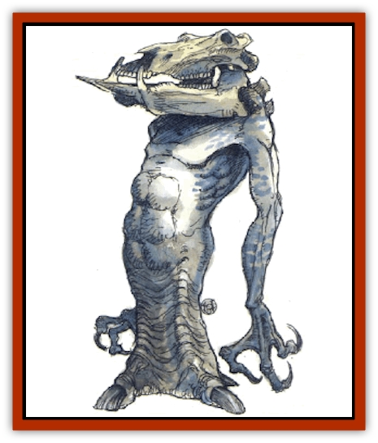

# Gambado

| Statistic | **Gambado** |
| --- | --- |
| **Activity Cycle:** | Day |
| **Alignment:** | Chaotic neutral |
| **Armor Class:** | 6 |
| **Climate/Terrain:** | Temperate and subtropical/plains and subterranean |
| **Damage/Attack:** | 1d8/1d4 (&times;2) |
| **Diet:** | Carnivore |
| **Frequency:** | Rare |
| **Hit Dice:** | 4 |
| **Intelligence:** | Low (5-7) |
| **Magic Resistance:** | Nil |
| **Morale:** | Steady (11-12) |
| **Movement:** | See below |
| **No. Appearing:** | 1d8 |
| **No. of Attacks:** | 3 |
| **Organization:** | Solitary or family |
| **Size:** | M (6' tall) |
| **Special Attacks:** | Nil |
| **Special Defenses:** | Nil |
| **THAC0:** | 17 |
| **Treasure:** | R |
| **XP Value:** | 175 |

Known by the folk name of "springing skulls of doom", these creatures construct a lair and ambush passersby. Gambados are completely amoral, caring only for their own survival, their next meal, and their personal treasure.

Gambados are generally pale gray in color, but they often camouflage themselves with soil and clays found in the course of digging their pit lairs. These extraordinary-looking creatures are man-sized, with a powerful human torso and two arms that end in three curved claws. Supported on the strong, flat neck is what appears to be the creature's head, but is actually a skull of another creature. Gambados use found skulls to house their heads, similar in principle to the hermit crab. They have special muscles that secure the placement of the skull and work its jaw. Skulls of horned, long-toothed, or other interesting animals are favored by plains gambados, while those with subterranean lairs prefer humanoid skulls.

A gambado's torso narrows downward to a 3-foot-long cylinder of cartilage and muscle that can be compressed spring-style and suddenly released for lunging up and forward. This columnar leg ends abruptly in three long and flat single-toed feet. The gambado moves by springing. Jumping vertically, it can just reach a 14-foot-high ceiling with its head, and it leaps horizontally at a rate of 12. The radially arrayed and retractable clawed feet allow the gambado to rapidly shift direction or stop suddenly, having good traction.

**Combat:** A gambado normally attacks from its lair - a pit dug some 6 feet deep - with its head just at ground level and its leg contracted for springing. The monster constructs a cover for its pit out of rock, wood, rags, and old bones, with only a small hole in the center through which its skull head pokes out. An approaching creature sees only the skull, apparently lying on the ground. The cover will not support the weight of any creature larger than a rat, and it will not encumber the outward spring of the gambado when it strikes.

If a living creature comes within 4 feet of the skull head, the gambado springs out and attacks, first biting with its ersatz head for 1d8 points of damage. Thereafter it also attacks with its claws, each of which inflicts 1d4 points of damage. The gambado will flee rather than fight to the death.

**Habitat/Society:** If a gambado kills a victim, it ignores all booty on the victim except coins, gems, and small pieces of jewelry. These are compulsively sorted by type and color, fondled and held up to light, then compulsively resorted. Finally, the objects are taken into the pit and stored, although some are scattered about or left on the ground in order to attract future victims. The gambado eats its victim, then variously reconstructs the cover for its lair, retreats into the pit to digest its meal, and awaits further prey. Gambados can go for several months between major meals. At least once every 10 days the gambado uncovers its hoard to sort and admire the various objects again.

Once thought to be solitary creatures, barbados are found in groups too. If a location is successful in terms of food and booty, a gambado will return to its former lair and collect its family, which moves to the new area. In some places, as many as eight gambado pits may be found in close proximity. Sages believe that barbados communicate with one another through a quiet strumming of the ground, using extremely rapid and minute movements of their springing leg, although this may be nothing more than a means of keeping the leg muscles exercised and ready for action during long periods of waiting.

**Ecology:** The elastic hide of the gambado's leg is sometimes used for connectors in lengths of pipe or for similar applications. If recognized by someone who has dealt with gambados, a lair may serve to guard the rear of a passing party from less intelligent wandering monsters.

---
## Discovery & Documentation

**Source Publication:** MC14 Fiend Folio Appendix (1992)
**Campaign Setting:** Fiends Folio
**Author(s):** Don Bingle, John Terra, Wes Nicholson, Tim Beach, Steve Hardinger, Kris Hardinger, Rob Nicholls, Greg Swedberg, Al Boyce, Vince Garcia, Norm Ritchie

### Other Creatures Found in This Source Book
   * [[Aballin|Aballin]]
   * [[Achaierai|Achaierai]]
   * [[Adherer|Adherer]]
   * [[Algoid|Algoid]]
   * [[Al-Mi'raj|Al-Mi'raj]]
   * [[Apparition|Apparition]]
   * [[Caterwaul|Caterwaul]]
   * [[Coffer_Corpse|Coffer Corpse]]
   * [[Crabman|Crabman]]
   * [[Dark_Creeper|Dark Creeper]]
   * [[Dark_Stalker|Dark Stalker]]
   * [[Darter|Darter]]
   * [[Denzelian|Denzelian]]
   * [[Dune_Stalker|Dune Stalker]]
   * [[Dwarf_Urdunnir|Dwarf, Urdunnir]]
   * [[Falcon_Fire|Falcon, Fire]]
   * [[Faux_Faerie|Faux Faerie]]
   * [[Flawder|Flawder]]
   * [[Fyrefly|Fyrefly]]
   * [[Garbug|Garbug]]
   * [[Giant_Fhoimorien|Giant, Fhoimorien]]
   * [[Gibberling|Gibberling]]
   * [[Gorbel|Gorbel]]
   * [[Grimlock|Grimlock]]
   * [[Hellcat|Hellcat]]
   * [[Ice_Lizard|Ice Lizard]]
   * [[Iron_Cobra|Iron Cobra]]
   * [[Khargra|Khargra]]
   * [[Mantari|Mantari]]
   * [[Penanggalan|Penanggalan]]
   * [[Pernicon|Pernicon]]
   * [[Phantom_Stalker|Phantom Stalker]]
   * [[Retriever|Retriever]]
   * [[Ruve|Ruve]]
   * [[Scathe|Scathe]]
   * [[Sheet_Ghoul_Sheet_Phantom|Sheet Ghoul/Sheet Phantom]]
   * [[Shocker|Shocker]]
   * [[Spanner|Spanner]]
   * [[Stwinger|Stwinger]]
   * [[Sussurus|Sussurus]]
   * [[Symbiotic_Jelly|Symbiotic Jelly]]
   * [[Terithran|Terithran]]
   * [[Thunder_Children|Thunder Children]]
   * [[Troll_Ice|Troll, Ice]]
   * [[Tween|Tween]]
   * [[Umpleby|Umpleby]]
   * [[Volt|Volt]]
   * [[Xill|Xill]]
   * [[Xvart|Xvart]]
   * [[Zygraat|Zygraat]]
