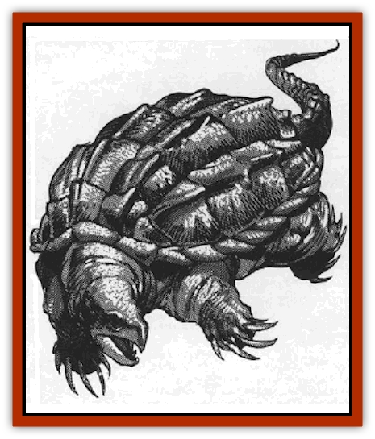

# Gammaroid

| Statistic | **Gammaroid** |
| --- | --- |
| **Activity Cycle:** | Any |
| **Alignment:** | Neutral |
| **Armor Class:** | -2/-10 |
| **Climate/Terrain:** | Any |
| **Damage/Attack:** | 10d6/10d6/60d4 |
| **Diet:** | Omnivore |
| **Frequency:** | Very rare |
| **Hit Dice:** | 100 |
| **Intelligence:** | Animal (1) |
| **Magic Resistance:** | Nil |
| **Morale:** | Fearless (19-20) |
| **Movement:** | 9, SR 9 |
| **No. Appearing:** | 1 |
| **No. of Attacks:** | 3 |
| **Organization:** | Solitary |
| **Size:** | G (2500' diameter) |
| **Special Attacks:** | See below |
| **Special Defenses:** | Hide limbs, flame sheath |
| **THAC0:** | 5 |
| **Treasure:** | Varies |
| **XP Value:** | 125,000 |

The gammaroid is a gargantuan variety of the [[Turtle_Giant|giant snapping turtle]]. Like its terrestrial cousin, it has a voracious appetite and rules any territory it occupies. Its unique breeding habits have made it the source of monster legends and religious rites on many worlds.

**Combat:** On land or in space, the gammaroid is a fearsome opponent. In space, the gammaroid masquerades as an asteroid, allowing smaller rocks to adhere to its body by gravidic attraction. When prey happens by, its enormous head shoots forth, smashing victims with 6d4 hull points of damage from its powerful jaws. This attack can swallow small vessels whole. The bony ridges of the gammarold's beak are sharp enough to rip through ship hulls, and its claws do 1d6 hull points of rending damage on impact (or 10d6 to a living target).

The gammaroid can also pursue fleeing prey by retracting its legs and head, rotating on its central axis, and flying at spelljamming speeds (SR 9, maneuverability F). When this deadly missile hits a ship, the target suffers an automatic "Ship shaken" critical hit; the whirling serrated edge of the gammaroid's shell may (30% chance) cut in half or utterly destroy the ship. In atmosphere, atmospheric friction from its rapid rotation creates an enveloping *fireball* that causes an additional 12d6 damage. The gammaroid uses this whirling attack primarily against its favorite prey, the [[Gossamer|gossamer noble]].

**Habitat/Society:** Gammaroids spawn on planetary bodies larger than size A. They land near geologically unstable regions, homing in on areas where the heat is near the surface (up to ten miles deep). The female digs until she reaches magma, then lays 2-8 eggs in the lava pit. When the egg laying is completed she crawls from the hole, allowing it to collapse behind her. Within 50 years, the young gammaroids hatch and tunnel upward, usually surfacing far away from the hatchery. This spawning causes great destruction to surface dwellings, and even the largest underground monsters are easy prey to the hungry hatchlings.

**Ecology:** The gammaroid is the undisputed master of any ecosystem it inhabits. Its only natural enemy is the gossamer noble, which it disables by cutting off the tentacles, then attacking with claws and enormous jaws. Though the gammaroid prefers the gossamer noble, it may attack spelljamming ships during times of great hunger to get at the soft, tiny mortals inside. However, the metal-and-woood canisters that hold the small feasts do not settle well with the gammaroid's palate.

The lifespans of gammaroids are very long. Specimens with shell growth patterns indicating millennia of molts have been recorded. The shells of dead gammaroids are quite useful as spelljammer hulls, as the lightness and toughness of the shell combine to make a highly maneuverable armored vessel. They can fetch a king's ransom.

---
## Discovery & Documentation

**Source Publication:** MC9 Spelljammer Appendix II (1991)
**Campaign Setting:** Planescape
**Author(s):** Scott Davis, Newton Ewell, John Terra

### Other Creatures Found in This Source Book
   * [[Alchemy_Plant|Alchemy Plant]]
   * [[Allura|Allura]]
   * [[Aperusa|Aperusa]]
   * [[Autognome|Autognome]]
   * [[Bionoid|Bionoid]]
   * [[Bloodsac|Bloodsac]]
   * [[Buzzjewel|Buzzjewel]]
   * [[Constellate|Constellate]]
   * [[Contemplator|Contemplator]]
   * [[Dohwar|Dohwar]]
   * [[Dragon_Moon|Dragon, Moon]]
   * [[Dragon_Stellar|Dragon, Stellar]]
   * [[Dragon_Sun|Dragon, Sun]]
   * [[Dreamslayer|Dreamslayer]]
   * [[Dweomerborn|Dweomerborn]]
   * [[Fal|Fal]]
   * [[Feesu|Feesu]]
   * [[Fire_Bat|Fire Bat]]
   * [[Firebird|Firebird]]
   * [[Firelich|Firelich]]
   * [[Flowfiend|Flowfiend]]
   * [[Gadabout|Gadabout]]
   * [[Gonn|Gonn]]
   * [[Gossamer|Gossamer]]
   * [[Grav|Grav]]
   * [[Great_Dreamer|Great Dreamer]]
   * [[Greatswan|Greatswan]]
   * [[Grell_Colonial|Grell, Colonial]]
   * [[Gullion|Gullion]]
   * [[Insectare|Insectare]]
   * [[Lhee|Lhee]]
   * [[Mercurial_Slime|Mercurial Slime]]
   * [[Meteorspawn|Meteorspawn]]
   * [[Monitor|Monitor]]
   * [[Owl_Space|Owl, Space]]
   * [[Pristatic|Pristatic]]
   * [[Scro|Scro]]
   * [[Selkie_Star|Selkie, Star]]
   * [[Silatic|Silatic]]
   * [[Skullbird|Skullbird]]
   * [[Sleek|Sleek]]
   * [[Sluk|Sluk]]
   * [[Space_Swine|Space Swine]]
   * [[Sphinx_Astro-|Sphinx, Astro-]]
   * [[Spirit_Warrior|Spirit Warrior]]
   * [[Starfly_Plant|Starfly Plant]]
   * [[Stargazer|Stargazer]]
   * [[Undead_Stellar|Undead, Stellar]]
   * [[Witchlight_Marauder|Witchlight Marauder]]
   * [[Xixchil|Xixchil]]
   * [[Yitsan|Yitsan]]
   * [[Zurchin|Zurchin]]
