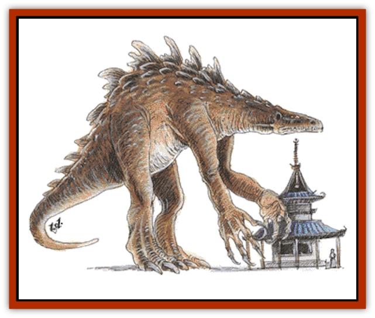

# Gargantua

| Statistic | **Humanoid** | **Insectoid** | **Reptilian** |
| --- | --- | --- | --- |
| **Activity Cycle:** | Any | Any | Night |
| **Alignment:** | Chaotic neutral | Chaotic neutral | Chaotic neutral |
| **Armor Class:** | 4 | 6 | 2 |
| **Climate/Terrain:** | Tropical and subtropical islands, jungles, and mountains | Tropical, subtropical, and temperate mountains | Tropical and subtropical islands |
| **Damage/Attack:** | 4-40/4-40 | 3-30 | 3-30/3-30/6-60 |
| **Diet:** | Omnivore | Omnivore | Special |
| **Frequency:** | Very rare | Rare | Rare |
| **Hit Dice:** | 35 | 20-30 | 50 |
| **Intelligence:** | Low (5-7) | Low (5-7) | Low (5-7) |
| **Magic Resistance:** | Nil | Nil | Nil |
| **Morale:** | Elite (14) | Elite (13) | Elite (14) |
| **Movement:** | 21 | 6, Fl 36 (E) | 18, Sw 12 |
| **No. Appearing:** | 1-2 | 1-3 | 1-2 |
| **No. of Attacks:** | 2 | 1 | 3 |
| **Organization:** | Solitary or mated pair | Solitary or mated pair | Solitary or mated pair |
| **Size:** | G (80-100' tall) | G (60' long) | G (100-200' tall) |
| **Special Attacks:** | Trample | See below | See below |
| **Special Defenses:** | Regeneration | Regeneration | Regeneration |
| **THAC0:** | 5 | 5 | 5 |
| **Treasure:** | Nil | Nil | Nil |
| **XP Value:** | 28,000 | 20 HD: 14,000 / 30 HD: 24,000 | 43,000 |

Gargantua are truly monstrous species, both in size and ferocity. Whether they are throwbacks to another age, aberrations of natural processes, or results of crazed magical experiments is unknown.

Gargantua appear in many different forms, but most resemble gigantic humanoids, insects, and reptiles. Of these three types, the most common is also the largest and most dangerous: the reptilian gargantua. The reptilian gargantua is so immense that it dwarfs virtually all of the world's creatures. Some reptilian gargantua move on all fours. Most, however, are bipedal, supported by two massive legs rivaling the width of the largest tree trunks. The creature's body is thick and bulky. Rocky scales - usually dark green with black accents - cover it from head to toe. Its smooth belly is a lighter shade of green. Certain rare types have mottled scales in shades of brown, gray, and yellow.

Its hands are almost human, though each of its four, long fingers ends in a hooked claw. Its feet are flat and broad, with webbed toes. The toes also end in hooked claws, but they're shorter and thicker than those on its fingers. A bony ridge stretches from the base of its neck, down along its spine, and extending the length of its immense tail.

The head of the reptilian gargantua is somewhat small in proportion to its body. It has two glaring eyes, usually gold or bright red. Its nostrils are flush with its head, and its ears are twin triangular projections resembling tiny wings. Its mouth is a wide slash that nearly bisects its entire head and is lined with rows of long fangs.

The reptilian gargantua cannot speak, but it emits deafening roars that sound like the trumpeting of a bull [[Elephant|elephant]] amplified a thousandfold. It can breathe both air and water.

**Combat:** Although it has some degree of intelligence, the actions of the reptilian gargantua - along with the actions of most gargantua - are those of mindless brutes bent on destruction for destruction's sake. It attacks with sweeping rakes of its front claws and lunging bites from its powerful jaws. If moving upright, it can trample victims for 10-100 (10d10) hit points of damage. It continually sweeps the ground it with its massive tail, swinging 90 feet behind it and to each side. Any creature within range of the tail must make a successful saving throw vs. death or suffer 8-80 (8d10) hit points of damage.

A rampaging reptilian gargantua is all but oblivious to its surroundings, crushing everything - and everyone - in its path. The ground trembles under its weight when it walks. Since quaking earth always foreshadows its appearance, it never can surprise its prey. When swimming, a reptilian gargantua is similarly handicapped, as its appearance is always preceded by swirling waters or crashing waves. Additionally, its immense size makes it easy to spot from a distance. Furthermore, the squealing roars that accompany its every action make it virtually impossible to ignore.

The reptilian gargantua's tough hide gives it an Armor Class of 2, forming a strong defense against most physical attacks. When it does suffer damage, the creature can regenerate 4 hit points per round. Fortunately, reptilian gargantua seldom bother humans. But their memories are long, and their appetite for revenge is nearly limitless. Humans who attack reptilian gargantua, disturb their lairs, or otherwise provoke the creatures will find themselves relentlessly pursued - even it means the gargantua must cross thousands of miles of ocean. This creature's hunger for revenge is seldom satisfied until it has thoroughly ravaged its attackers' villages. Sometimes, entire provinces will be laid to ruin.

The surest way to provoke the wrath of a reptilian gargantua is to threaten its offspring. Adult gargantua have remarkable mental bonds with their young, enabling them to locate their young with pinpoint accuracy at an unlimited range.

In spite of their reputation as mindless destroyers, reptilian gargantua actually possess a simple empathy that enables them to sense the emotions and desires of others, albeit on a primitive level. They seem to instinctively know which creatures bear them ill will, and direct their attacks accordingly.

**Habitat/Society:** A few reptilian guargantua make their home on the floors of subtropical oceans. Most, however, live on remote tropical islands, far from civilized lands. Such islands are scattered throughout the oceans of Kara-Tur, with most of them uncharted. The most notable exception is the Isle of Gargantua, one of the Outer Isles off the southwestern tip of Wa. This island is inhabited entirely by gargantua of various types.

Explorers in the arctic regions of Kara-Tur once found a maturing reptilian gargantua frozen in a block of ice. The explorers built a massive sled to haul their discovery back to civilization. The ice began to thaw en route, reviving the creature. The gargantua shattered the melting ice block, crushed his captors, and lumbered into the mountains.

Any grotto or cave that provides shelter, privacy, and sufficient room to house a reptilian gargantua can serve as its lair. Fiercely territorial, a reptilian gargantua and its family usually claim an area of several square miles as their personal property, defending it against any and all intruders. Since their eyes are sensitive to bright light, the creatures spend most of the day sleeping in their lairs, becoming active at night to search for food and patrol their territory. Their thunderous roars make their presence known to all. Reptilian gargantua do not collect treasure or any other items.

Reptilian gargantua live several hundred years. They choose mates within a few years of reaching maturity, and remain with them for the rest of their lives. A female reptilian gargantua gives birth to a single offspring once per century. The birth of a reptilian gargantua is marked by shattering thunderstorms that rock the skies over the territory of its parents for 101 days.

An immature reptilian gargantua stands about 20-40 feet tall. It also has 10 HD (THAC0 11) and a movement rate of 12 (Sw 9). A youngling's claws inflict 1-10 hit points of damage each, and its bite inflicts 2-24 (2d12) hit points of damage. Its tail - not nearly as formidable as an adult's - sweeps the ground in an arch reaching 20 feet behind and to both sides, inflicting 3-18 (3d6) points of damage to all victims who fail their save vs. death.

**Ecology:** The reptilian gargantua is an omnivore. It primarily eats plants, swallowing whole trees in a single gulp. But it also enjoys living prey of all varieties. It can even dine on minerals, gems, and other inorganic substances in times of scarce vegetation and game.

Reptilian gargantua shun the company of other creatures. They especially dislike other types of gargantua, which sometimes compete with their reptilian cousins for the same territory.

Reptilian gargantua have two properties useful to humans: The petal of any flower that grows in the footprint of a reptilian gargantua can serve as a component for a *potion of growth*. Such a flower must grow naturally in the footprint; it cannot have been planted there by a human or other intelligent being.

As noted above, thunderstorms occur when a reptilian gargantua is born. If a dead creature of any kind is struck by a lightning bolt from such a storm, the bolt acts as *resurrection* spell.

**Humanoid Gargantua**

  Humanoid gargantua are the least intelligent type. They resemble gigantic humans, somewhat anthropoid facially, with stooped shoulders, long arms, and jutting jaws. Long, greasy hair dangles about their shoulders, though a few humanoid gargantua are completely bald. They stand 80 to 100 feet tall and are sometimes covered with black, brown, or golden fur. Their skin color ranges from pale pink to dull yellow to deep black. They have blunt noses, huge ears, and bright eyes, which are usually brown or red. Single-eyed humanoid gargantua also are rumored to exist.

Humanoid gargantua have no language of their own, but because of their strong empathy with humans, they are able to comprehend short phrases of human languages 25% of the time. The movements and other actions of humanoid gargantua are typically accompanied by thunderous bellowing and grunting.

The creature attacks with its two fists for 4-40 (3d10) hit points of damage each. It seldom uses weapons or tools, since its blunt fingers manipulate these objects with difficulty. However, reports exist of humanoid gargantua wielding trees like clubs. The creatures also can make trampling attacks on anyone (or anything) who comes underfoot, causing 10-100 (10d10) points of damage. Humanoid gargantua regenerate hit points at the rate of 4 per round.

Like reptilian gargantua, humanoid gargantua possess a simple empathy that enables them to sense the basic emotions and desires of others. Unless hungry, they tend to avoid creatures who intend them no harm, while actively seeking out and pursuing those with hostile intentions.

Humanoid gargantua live in valleys, in suitably sized caves in remote, jagged mountains, or on their own islands, far from civilized regions. They collect no treasure, spending most of their time eating and sleeping.

 They live for several centuries, and mate for life. Once every hundred years or so, a female humanoid gargantua gives birth to 1-2 offspring. An immature humanoid gargantua is about 20-30 feet tall. It has 8 HD (THAC0 13) and a movement rate of 15. Its fists inflict 1-10 points of damage each. It cannot make trampling attacks.

These monsters peacefully coexist with other creatures in their environment, but humanoid gargantua compete fiercely with rival gargantua, and violent conflicts often result. Many such conflicts continue until one of the gargantua is dead.

Humanoid gargantua eat all types of game and vegetation, preferring deer, bears, horses, and similar game.

**Insectoid Gargantua**

  Adult insectoid gargantua resemble immense moths. Their bodies are covered with fine fur, usually gray or black, and their wings bear colorful patterns in brilliant blue, red, yellow, and green. Their movements and other actions are accompanied by a piercing screech that sounds like a warning siren.

The insectoid gargantua begins life as a gigantic egg, which hatches to reveal a gigantic larva. This larval form has 20 HD. As a larva, the insectoid gargantua can shoot a strand of cocoon silk to a range of 60 feet. This silk is exceptionally strong and sticky, adhering to whatever it hits. With this silken strand, the larva can entangle and immobilize victims. A strand can be severed in three ways: with 20 points of damage from an edged weapon, a successful "bend bars/lift gates" roll, or by monsters of 10 HD or more.

The larval insectoid gargantua grows at a phenomenal rate, increasing 1 HD per week. Upon attaining 25 HD, the larva spins a cocoon and enters the pupal stage. It remains a pupa for 2-8 (2d4) weeks, finally emerging as an immense moth with 30 HD. In this form, the creature can no longer spin silk. However, by flapping its wings, it can create a huge windstorm, 60 feet wide and extending 240 feet ahead. To remain safe, everyone and everything within the path of the storm must be solidly anchored (e.g., tied to a boulder). Unanchored victims must make a saving throw vs. death with a -4 penalty. Those who fail their saving throw are blown back 10 to 40 feet, suffering 1d6 hit points of damage for every 10 feet blown.

Insectoid gargantua establish lairs in the valleys and caverns of warm, mountainous regions. They live for several hundred years. Females lay a single egg every decade, but there is only a 20% chance that any given egg is fertile.

These mothlike creatures eat all types of game and vegetation. They prefer mulberry trees, and in just a few hours, a hungry insectoid gargantua can consume an entire grove of them.

The silk of insectoid gargantua larvae can be woven into cloth from which magical robes are created.

---
## Discovery & Documentation

**Source Publication:** Monstrous Manual (1995)
**Campaign Setting:** Advanced Dungeons & Dragons 2nd Edition
**Author(s):** Tim Beach

### Other Creatures Found in This Source Book
   * [[Aarakocra|Aarakocra]]
   * [[Aboleth|Aboleth]]
   * [[Ankheg|Ankheg]]
   * [[Arcane|Arcane]]
   * [[Argos|Argos]]
   * [[Aurumvorax|Aurumvorax]]
   * [[Baatezu_Lesser_Abishai|Baatezu, Lesser, Abishai]]
   * [[Baatezu_General_Information|Baatezu, General Information]]
   * [[Baatezu_Greater_Pit_Fiend|Baatezu, Greater, Pit Fiend]]
   * [[Banshee|Banshee]]
   * [[Basilisk|Basilisk]]
   * [[Bat|Bat]]
   * [[Bear|Bear]]
   * [[Beetle_Giant|Beetle, Giant]]
   * [[Behir|Behir]]
   * [[Beholder_and_Beholder-kin_I|Beholder and Beholder-kin I]]
   * [[Beholder_and_Beholder-kin_II|Beholder and Beholder-kin II]]
   * [[Bird|Bird]]
   * [[Brain_Mole|Brain Mole]]
   * [[Broken_One|Broken One]]
   * [[Brownie|Brownie]]
   * [[Bugbear|Bugbear]]
   * [[Bulette|Bulette]]
   * [[Bullywug|Bullywug]]
   * [[Carrion_Crawler|Carrion Crawler]]
   * [[Cat_Great|Cat, Great]]
   * [[Catoblepas|Catoblepas]]
   * [[Cat_Small|Cat, Small]]
   * [[Cave_Fisher|Cave Fisher]]
   * [[Centaur|Centaur]]
   * [[Centipede|Centipede]]
   * [[Chimera|Chimera]]
   * [[Cloaker|Cloaker]]
   * [[Cockatrice|Cockatrice]]
   * [[Couatl|Couatl]]
   * [[Crabman|Crabman]]
   * [[Crawling_Claw|Crawling Claw]]
   * [[Crocodile|Crocodile]]
   * [[Crustacean_Giant|Crustacean, Giant]]
   * [[Crypt_Thing|Crypt Thing]]
   * [[Death_Knight|Death Knight]]
   * [[Deepspawn|Deepspawn]]
   * [[Dinosaur_I|Dinosaur I]]
   * [[Displacer_Beast|Displacer Beast]]
   * [[Dog|Dog]]
   * [[Dog_Moon|Dog, Moon]]
   * [[Dolphin|Dolphin]]
   * [[Doppelganger|Doppelganger]]
   * [[Dracolich|Dracolich]]
   * [[Dragon_Brown|Dragon, Brown]]
   * [[Dragon_Chromatic_Black|Dragon, Chromatic, Black]]
   * [[Dragon_Chromatic_Blue|Dragon, Chromatic, Blue]]
   * [[Dragon_Chromatic_Green|Dragon, Chromatic, Green]]
   * [[Dragon_Cloud|Dragon, Cloud]]
   * [[Dragon_Chromatic_Red|Dragon, Chromatic, Red]]
   * [[Dragon_Chromatic_White|Dragon, Chromatic, White]]
   * [[Dragon_Deep|Dragon, Deep]]
   * [[Dragon_Gem_Amethyst|Dragon, Gem, Amethyst]]
   * [[Dragon_Gem_Crystal|Dragon, Gem, Crystal]]
   * [[Dragon_Gem_Emerald|Dragon, Gem, Emerald]]
   * [[Dragon_Gem_Sapphire|Dragon, Gem, Sapphire]]
   * [[Dragon_Gem_Topaz|Dragon, Gem, Topaz]]
   * [[Dragon_Metallic_Brass|Dragon, Metallic, Brass]]
   * [[Dragon_Metallic_Bronze|Dragon, Metallic, Bronze]]
   * [[Dragon_Metallic_Copper|Dragon, Metallic, Copper]]
   * [[Dragon_Mercury|Dragon, Mercury]]
   * [[Dragon_Metallic_Gold|Dragon, Metallic, Gold]]
   * [[Dragon_Mist|Dragon, Mist]]
   * [[Dragon_Metallic_Silver|Dragon, Metallic, Silver]]
   * [[Dragon_General_Information|Dragon, General Information]]
   * [[Dragon_Shadow|Dragon, Shadow]]
   * [[Dragon_Steel|Dragon, Steel]]
   * [[Dragon_Yellow|Dragon, Yellow]]
   * [[Dragonne|Dragonne]]
   * [[Dragon_Turtle|Dragon Turtle]]
   * [[Dragonet_Faerie_Dragon|Dragonet, Faerie Dragon]]
   * [[Dragonet_Fire_Drake|Dragonet, Fire Drake]]
   * [[Dragonet_Pseudodragon|Dragonet, Pseudodragon]]
   * [[Dryad|Dryad]]
   * [[Dwarf_Derro|Dwarf, Derro]]
   * [[Dwarf|Dwarf]]
   * [[Elemental_Athas_General_Information|Elemental (Athas), General Information]]
   * [[Elemental_Air_Kin|Elemental, Air Kin]]
   * [[Elemental_Earth_Kin|Elemental, Earth Kin]]
   * [[Elemental_Fire_Kin|Elemental, Fire Kin]]
   * [[Elemental_Water_Kin|Elemental, Water Kin]]
   * [[Elemental_of_Chaos_Air_Earth|Elemental of Chaos, Air/Earth]]
   * [[Elemental_of_Chaos_Fire_Water|Elemental of Chaos, Fire/Water]]
   * [[Elemental_Composite|Elemental, Composite]]
   * [[Elemental_Air_Earth|Elemental, Air/Earth]]
   * [[Elemental_Fire_Water|Elemental, Fire/Water]]
   * [[Elemental_General_Information|Elemental, General Information]]
   * [[Elephant|Elephant]]
   * [[Elf|Elf]]
   * [[Elf_Aquatic|Elf, Aquatic]]
   * [[Elf_Drow|Elf, Drow]]
   * [[Ettercap|Ettercap]]
   * [[Eyewing|Eyewing]]
   * [[Feyr|Feyr]]
   * [[Fish|Fish]]
   * [[Frog|Frog]]
   * [[Fungus|Fungus]]
   * [[Galeb_Duhr|Galeb Duhr]]
   * [[Gargoyle_I|Gargoyle I]]
   * [[Genie|Genie]]
   * [[Ghost|Ghost]]
   * [[Ghoul|Ghoul]]
   * [[Giant_Cloud|Giant, Cloud]]
   * [[Giant_Cyclops|Giant, Cyclops]]
   * [[Giant_Desert|Giant, Desert]]
   * [[Giant_Ettin|Giant, Ettin]]
   * [[Giant_Firbolg|Giant, Firbolg]]
   * [[Giant_Fire|Giant, Fire]]
   * [[Giant_Fog|Giant, Fog]]
   * [[Giant_Fomorian|Giant, Fomorian]]
   * [[Giant_Frost|Giant, Frost]]
   * [[Giant_Hill|Giant, Hill]]
   * [[Giant_Jungle|Giant, Jungle]]
   * [[Giant_Mountain|Giant, Mountain]]
   * [[Giant_Reef|Giant, Reef]]
   * [[Giant_Stone|Giant, Stone]]
   * [[Giant_Storm|Giant, Storm]]
   * [[Giant_Verbeeg|Giant, Verbeeg]]
   * [[Giant_Wood|Giant, Wood]]
   * [[Gibberling|Gibberling]]
   * [[Giff|Giff]]
   * [[Gith|Gith]]
   * [[Gith_Pirate_of|Gith, Pirate of]]
   * [[Githyanki|Githyanki]]
   * [[Githzerai|Githzerai]]
   * [[Gloomwing|Gloomwing]]
   * [[Gnoll|Gnoll]]
   * [[Gnome|Gnome]]
   * [[Gnome_Spriggan|Gnome, Spriggan]]
   * [[Goblin|Goblin]]
   * [[Golem_General_Information|Golem, General Information]]
   * [[Golem_I_Greater_Golem|Golem I (Greater Golem)]]
   * [[Golem_II_Lesser_Golem|Golem II (Lesser Golem)]]
   * [[Golem_III|Golem III]]
   * [[Golem_IV|Golem IV]]
   * [[Golem_V|Golem V]]
   * [[Golem_VI_Stone_Variants|Golem VI (Stone Variants)]]
   * [[Gorgon|Gorgon]]
   * [[Grell_Colonial|Grell, Colonial]]
   * [[Gremlin_Jermlaine|Gremlin, Jermlaine]]
   * [[Gremlin|Gremlin]]
   * [[Griffon|Griffon]]
   * [[Grimlock|Grimlock]]
   * [[Grippli|Grippli]]
   * [[Hag|Hag]]
   * [[Halfling|Halfling]]
   * [[Harpy|Harpy]]
   * [[Hatori|Hatori]]
   * [[Haunt|Haunt]]
   * [[Hell_Hound|Hell Hound]]
   * [[Heucuva|Heucuva]]
   * [[Hippocampus|Hippocampus]]
   * [[Hippogriff|Hippogriff]]
   * [[Hobgoblin|Hobgoblin]]
   * [[Homunculus|Homunculus]]
   * [[Hook_Horror|Hook Horror]]
   * [[Horse|Horse]]
   * [[Human|Human]]
   * [[Hydra|Hydra]]
   * [[Imp|Imp]]
   * [[Insect_Giant|Insect, Giant]]
   * [[Insect_Swarm|Insect Swarm]]
   * [[Intellect_Devourer|Intellect Devourer]]
   * [[Invisible_Stalker|Invisible Stalker]]
   * [[Ixitxachitl|Ixitxachitl]]
   * [[Jackalwere|Jackalwere]]
   * [[Kenku|Kenku]]
   * [[Ki-rin|Ki-rin]]
   * [[Kirre|Kirre]]
   * [[Kobold|Kobold]]
   * [[Kuo-Toa|Kuo-Toa]]
   * [[Lamia|Lamia]]
   * [[Lammasu|Lammasu]]
   * [[Leech|Leech]]
   * [[Leprechaun|Leprechaun]]
   * [[Leucrotta|Leucrotta]]
   * [[Lich|Lich]]
   * [[Living_Wall|Living Wall]]
   * [[Lizard|Lizard]]
   * [[Lizard_Man|Lizard Man]]
   * [[Locathah|Locathah]]
   * [[Lurker|Lurker]]
   * [[Lycanthrope_General_Information|Lycanthrope, General Information]]
   * [[Lycanthrope_Seawolf|Lycanthrope, Seawolf]]
   * [[Lycanthrope_Werebear|Lycanthrope, Werebear]]
   * [[Lycanthrope_Wereboar|Lycanthrope, Wereboar]]
   * [[Lycanthrope_Werebat|Lycanthrope, Werebat]]
   * [[Lycanthrope_Werefox|Lycanthrope, Werefox]]
   * [[Lycanthrope_Wererat|Lycanthrope, Wererat]]
   * [[Lycanthrope_Wereraven|Lycanthrope, Wereraven]]
   * [[Lycanthrope_Weretiger|Lycanthrope, Weretiger]]
   * [[Lycanthrope_Werewolf|Lycanthrope, Werewolf]]
   * [[Mammal|Mammal]]
   * [[Mammal_Giant|Mammal, Giant]]
   * [[Mammal_Herd_I|Mammal, Herd I]]
   * [[Mammal_Small|Mammal, Small]]
   * [[Manscorpion|Manscorpion]]
   * [[Manticore|Manticore]]
   * [[Medusa_Maedar|Medusa, Maedar]]
   * [[Medusa|Medusa]]
   * [[Mephit_General_Information|Mephit, General Information]]
   * [[Merman|Merman]]
   * [[Mimic|Mimic]]
   * [[Mind_Flayer|Mind Flayer]]
   * [[Minotaur|Minotaur]]
   * [[Mist_Crimson_Death|Mist, Crimson Death]]
   * [[Mist_Vampiric|Mist, Vampiric]]
   * [[Mold_I|Mold I]]
   * [[Moldman|Moldman]]
   * [[Mongrelman|Mongrelman]]
   * [[Morkoth|Morkoth]]
   * [[Muckdweller|Muckdweller]]
   * [[Mudman|Mudman]]
   * [[Mummy_Greater|Mummy, Greater]]
   * [[Mummy|Mummy]]
   * [[Myconid|Myconid]]
   * [[Naga|Naga]]
   * [[Naga_Dark|Naga, Dark]]
   * [[Neogi|Neogi]]
   * [[Nightmare|Nightmare]]
   * [[Nymph|Nymph]]
   * [[Octopus_Giant|Octopus, Giant]]
   * [[Ogre|Ogre]]
   * [[Ogre_Half-|Ogre, Half-]]
   * [[Ooze_Slime_Jelly_I|Ooze/Slime/Jelly I]]
   * [[Ooze_Slime_Jelly_II|Ooze/Slime/Jelly II]]
   * [[Ooze_Slime_Jelly_Slithering_Tracker|Ooze/Slime/Jelly, Slithering Tracker]]
   * [[Orc|Orc]]
   * [[Otyugh|Otyugh]]
   * [[Owlbear_I|Owlbear I]]
   * [[Pegasus|Pegasus]]
   * [[Peryton|Peryton]]
   * [[Phantom|Phantom]]
   * [[Phoenix|Phoenix]]
   * [[Piercer|Piercer]]
   * [[Plant_Dangerous_I|Plant, Dangerous I]]
   * [[Plant_Intelligent|Plant, Intelligent]]
   * [[Poltergeist|Poltergeist]]
   * [[Pudding_Deadly|Pudding, Deadly]]
   * [[Quaggoth|Quaggoth]]
   * [[Rakshasa|Rakshasa]]
   * [[Rat|Rat]]
   * [[Rat_Osquip|Rat, Osquip]]
   * [[Remorhaz|Remorhaz]]
   * [[Revenant|Revenant]]
   * [[Roc|Roc]]
   * [[Roper|Roper]]
   * [[Rust_Monster|Rust Monster]]
   * [[Sahuagin|Sahuagin]]
   * [[Satyr|Satyr]]
   * [[Scorpion|Scorpion]]
   * [[Sea_Lion|Sea Lion]]
   * [[Selkie|Selkie]]
   * [[Shadow|Shadow]]
   * [[Shedu|Shedu]]
   * [[Sirine|Sirine]]
   * [[Skeleton|Skeleton]]
   * [[Skeleton_Giant|Skeleton, Giant]]
   * [[Skeleton_Warrior|Skeleton, Warrior]]
   * [[Slaad|Slaad]]
   * [[Slug_Giant|Slug, Giant]]
   * [[Snake|Snake]]
   * [[Snake_Winged|Snake, Winged]]
   * [[Spectre|Spectre]]
   * [[Sphinx|Sphinx]]
   * [[Spider|Spider]]
   * [[Sprite|Sprite]]
   * [[Squid_Giant|Squid, Giant]]
   * [[Stirge|Stirge]]
   * [[Su-Monster|Su-Monster]]
   * [[Swanmay|Swanmay]]
   * [[Tabaxi|Tabaxi]]
   * [[Tako|Tako]]
   * [[Tanar'ri_True_Balor|Tanar'ri, True, Balor]]
   * [[Tanar'ri_True_Marilith|Tanar'ri, True, Marilith]]
   * [[Tarrasque|Tarrasque]]
   * [[Tasloi|Tasloi]]
   * [[Thought_Eater|Thought Eater]]
   * [[Thri-kreen|Thri-kreen]]
   * [[Titan|Titan]]
   * [[Toad_Giant|Toad, Giant]]
   * [[Treant|Treant]]
   * [[Triton|Triton]]
   * [[Troglodyte|Troglodyte]]
   * [[Troll|Troll]]
   * [[Umber_Hulk|Umber Hulk]]
   * [[Unicorn|Unicorn]]
   * [[Urchin|Urchin]]
   * [[Vampire|Vampire]]
   * [[Wemic|Wemic]]
   * [[Whale|Whale]]
   * [[Wight|Wight]]
   * [[Will_O'Wisp|Will O'Wisp]]
   * [[Wolf|Wolf]]
   * [[Wolfwere|Wolfwere]]
   * [[Worm|Worm]]
   * [[Wraith|Wraith]]
   * [[Wyvern|Wyvern]]
   * [[Xorn|Xorn]]
   * [[Yeti|Yeti]]
   * [[Yuan-ti_Histachii|Yuan-ti, Histachii]]
   * [[Yuan-ti|Yuan-ti]]
   * [[Yugoloth_Guardian|Yugoloth, Guardian]]
   * [[Zaratan|Zaratan]]
   * [[Zombie|Zombie]]
