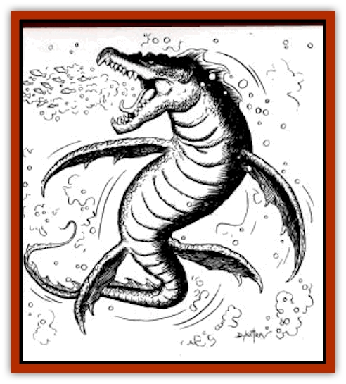

# Gargouille

| Statistic | **Gargouille** |
| --- | --- |
| **Activity Cycle:** | Day |
| **Alignment:** | Neutral |
| **Armor Class:** | 0 |
| **Climate/Terrain:** | Temperate or tropical saltwater or freshwater |
| **Damage/Attack:** | 3-30 or 2-20 |
| **Diet:** | Carnivore |
| **Frequency:** | Very Rare |
| **Hit Dice:** | ? |
| **Intelligence:** | Low (7) |
| **Magic Resistance:** | Nil |
| **Morale:** | Fearless (20) |
| **Movement:** | 3, Swim 20 |
| **No. Appearing:** | 1 |
| **No. of Attacks:** | 1 |
| **Organization:** | Solitary |
| **Size:** | G (70' long) |
| **Special Attacks:** | Breath weapon, swallow whole |
| **Special Defenses:** | Immune to water-based attacks |
| **THAC0:** | 9 |
| **Treasure:** | B,R,S,T,U |
| **XP Value:** | 10,000 |

The gargouille is a sea dragon resembling a prehistoric [[Dinosaur_Aquatic|mosasaur]] (such as the Tylosaurus of Cretaceous seas). It is one of the most terrible of all aquatic monsters. Although it can travel slowly on land, it is still a terror to coastal communities.

**Combat:** The gargouille has one of two attack forms in melee combat: a tail slap that causes 2-20 hp damage or a bite with its huge jaws that inflicts 3-30 hp damage. It can also swallow whole any creature of Size L or smaller on an attack roll of 19+. Each round after being swallowed, a victim suffers 1-6 hp digestive damage from the monster's stomach acid.

What makes the gargouille so famous is that it is a waterbreathing dragon. Specifically, the gargouille can magically generate water inside its body and spout a cone-shaped water attack 10 feet wide at the base and 50 feet wide at the end of the 100' stream. This water causes 5-50 hp damage (victims who save vs. breath weapon suffer only half) and knocks creatures of Size H and smaller off their feet unless they make another successful save vs. breath weapon (with a -2 penalty). A single round's application of this water weapon is enough to capsize small craft such as rafts, canoes, and small sailing vessels and galleys such as the cog. Two rounds of uninterrupted jetting, and even a full-sized galleon sinks. Two rounds of this breath weapon on land effectively floods an acre of ground into uselessness. Afterward, of course, the gargouille feasts the bodies of all the people and animals that have been drowned. It is also immune to all water-based attacks.

**Habitat/Society:** Gargouilles are solitary animals, much like conventional dragons. In part, this is because not even those areas most teeming with life can support the appetites of two or more of these enormous beasts. After a brief mating encounter, male and female separate, the female laying her eggs inside an underwater cave or on some distant shore. She leaves the eggs after burying them, but she buries them so well that most PC parties have absolutely no chance of finding them. (The mining proficiency is needed to find where the excavation was made and then covered up.) These eggs take four months to hatch, and the young are able to take care of themselves immediately after birth. Although gargouilles do not actually use the wealth they glean from flooded towns and sunken ships, they like to keep it-and the ships themselves- as trophies to remind all living things (including each other) of their hunting prowess.

**Ecology:** The gargouille is a voracious monster that will eat any  living thing, attacking dragon turtles, whales, and even giant  whales if no other prey is available. Even the huge kraken  know better than to challenge a gargouille in its own territory.  Gargouilles live only in those marine and coastal areas teeming  with fish and other prey. When they cannot find them, they  must migrate in search of food, abandoning their lairs. This  voracity is the key to their fearless nature.

On rare occasions, gargouilles band together to create largescale floods by combining their breath weapon attacks. It is still uncertain whether they do so to improve their hunting or for some other reason.

After a gargouille is slain, anyone who cuts it open discovers a sac the size of an elephant's stomach, filled with magical water. Filling a jug or bowl with this water can be an important part of the process of creating magical items such as an *alchemy jug*, a *beaker of plentiful potions*, a *decanter of endless water*, or a *bowl commanding water elementals*, while using this water as an ingredient enhances one's chances of success when creating any type of magical potion (base chance is increased to 80%).

---
## Discovery & Documentation

**Source Publication:** Dragon248 (1998)
**Campaign Setting:** Dragon Magazine
**Author(s):** Gregory W. Detwiler, Terry Dykstra

### Other Creatures Found in This Source Book
   * [[Amphitere|Amphitere]]
   * [[Cetus_Lesser|Cetus, Lesser]]
   * [[Dragonet|Dragonet]]
   * [[Dragon_Orange_Sodium|Dragon, Orange (Sodium)]]
   * [[Dragon_Purple_Energy|Dragon, Purple (Energy)]]
   * [[Dragon_Yellow_Salt|Dragon, Yellow (Salt)]]
   * [[Hai_Riyo|Hai Riyo]]
   * [[Peluda|Peluda]]
   * [[Sirrush|Sirrush]]
   * [[Vore_Lekiniskiy_Master_Fire_Worm|Vore Lekiniskiy, Master Fire Worm]]
