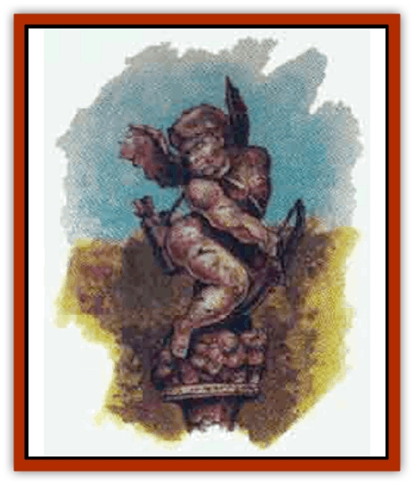
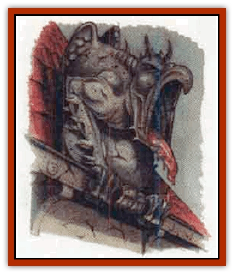
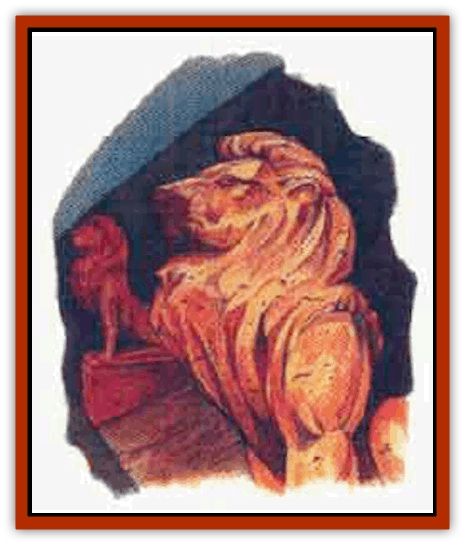
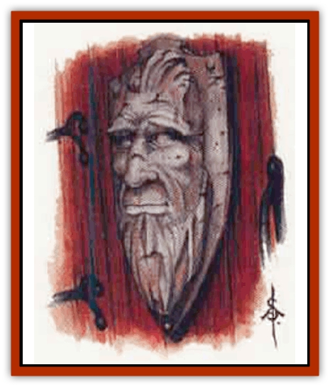

# Gargoyle II

| Statistic | **Archer** | **Grandfather Plaque** | **Spouter** | **Stone Lion** |
| --- | --- | --- | --- | --- |
| **Activity Cycle:** | Any | Day | Any | Day |
| **Alignment:** | Chaotic evil | Lawful neutral | Neutral evil | Neutral good |
| **Armor Class:** | 9 | 6 | 6 | 2 |
| **Climate/Terrain:** | Building or ruin | Building or ruin | Building or ruin | Building or ruin |
| **Damage/Attack:** | 1d10 | Nil | 1d4+1/1d4+1 | 1d8/1d8/1d10 |
| **Diet:** | Nil | Nil | Nil | Nil |
| **Frequency:** | Very rare | Very rare | Very rare | Very rare |
| **Hit Dice:** | 4+5 | 6+2 | 5+7 | 8+3 |
| **Intelligence:** | Low (5-7) | Average (8-10) | Low (5-7) | Low (5-7) |
| **Magic Resistance:** | Nil | Nil | Nil | Nil |
| **Morale:** | Elite (13-14) | Fanatic (17-18) | Elite (13-14) | Champion (15-16) |
| **Movement:** | 6 | 0 | 12 | 21 |
| **No. Appearing:** | 1 | 1 | 1 (rarely more) | 1 |
| **No. of Attacks:** | 1 | Nil | 2 | 3 |
| **Organization:** | Solitary | Solitary | Solitary | Solitary |
| **Size:** | S (4' tall) | S (1-2' tall) | S (3' tall) | M (7' long) |
| **Special Attacks:** | Nil | Magic missile, shout, weakness | Acid | <i>Scare</i> |
| **Special Defenses:** | +1 or better magical weapon to hit, camouflage | +1 or better magical weapon to hit, camouflage | +1 or better magical weapon to hit, camouflage | +1 or better magical weapon to hit, camouflage |
| **THAC0:** | 17 | Nil | 15 | 11 |
| **Treasure:** | Nil | Nil | Nil | Nil |
| **XP Value:** | 975 | 2,000 | 1,400 | 3,000 |

## 

Archer

The archer [[Gargoyle_I|gargoyle]] is a malicious creation that looks like a cheerful cherub or, more rarely, a ferocious amazon. Its only sizable weapon or means of attack is a stubby bow and quiver of arrows, apparently carved as part of the statne. The archer typically stands in a fountain or on a ledge high up the wall, or serves as a garden ornament, moving to attack only when an intruder enters its territory. It can remain motionless for as long as it desires.

**Combat:** The archer can conceal itself against stone so that it is only 20% likely to be spotted under normal conditions. True to its name, the archer gargoyle uses its bow and arrows as its primary weapon. The bow is not a true bow, and the arrows are stone, but they allow the archer to make an arrowlike magical attack that hits with a THACO of 17 and inflicts 1d10 points of damage. The "arrow" has a range of 120 yards. Even when engaged in melee, the archer uses the bow at point blank range. The archer can be struck only by weapons of +1 or better enchantment.

**Habitat/Society:** These evil creatures love to shoot at passersby, even those who pose no threat, and are thus rarely found guarding the domiciles of good-aligned persons. When found in the wild, the archer is on an unending hunt, slaying every living thing it meets. More than one village has been routed by one of these gargoyles, which delights in mayhem and bloodshed. The archer is a loner and avoids contact with all others of its kind.

**Ecology:** The archer need not eat, drink, or sleep. Unlike other types of gargoyles, the archer has a profound destructive impact on its surroundings, because of its tendency to kill every creature and person in its territory, leaving the carcasses to rot. Special hunting parties are often immediately organized to eliminate the menace of a roving archer when one moves into the area.

## 

Spouter

The spouter gargoyle generally looks like an ugly [[Imp|imp]]. It is often found perched above a door or serving as a raingutter outlet on a roof. Its mouth always gapes hideously. Its forearms sport two rows of sharp spikes; on its back are two undersized wings, far too small to provide flight. When motionless, it is indistinguishable from normal stonework. However, plant life and structures in the area will often be pitted and scarred, as if by acid.

**Combat:** Anyone who enters the spouter's territory without uttering a password or making the appropriate gesture will be attacked, usually from above, by the spouter's acid spittle. The spittle can be used once every four rounds and has a range of just 5 feet (unless the attack is from above - the spouter can hit anyone directly below, no matter how far down). The acid inflicts 2d20 points of damage, with a successful saving throw vs. breath weapon indicating half damage. If the spouter's opponents escape or prove resistant to the acid, the gargoyle can float down using its tiny undersized wings to break its fall. On the ground, the spouter can attack using its armspikes, which cause 1d4+1 points of damage per attack.

The spouter has a nasty streak and revels in "accidently" attacking its master or his associates, even if it recognizes them as safe.

The spouter is immune to all forms of acid, is struck only by weapons of +1 enchantment or better, and can climb walls with a 90% chance of success.

**Habitat/Society:** Though matched sets of spouters are occaionally found, usually there will be only one. Very rarely, a group of 1d4+2 spouters will find each other and join for mutual defense of their territorry. There isn't much competition between group members, so they will choose no chieftain or ruler. Sometimes a "free" spouter, one whose master has been slain, will offer its services to a powerful evil entity, such is its love of mayhem and its guardian instinct.

**Ecology:** Spouters need not eat, drink or sleep, and can remain perfectly motionless for any length of time. Thus, they usually have little impact on their surroundings, other than the havoc their acid wreaks on local plants and structures.

## 

Stone Lion

The stone [[Cat_Great|lion]] is a solemn guardian. often found in pairs, and generally serving good-aligned priests and wizards. The lion has an excellent memory for faces and scents and cannot be fooled by disguises. The lion is usually set up near the main door of the house, but is occasionally placed on a ledge overhead - the stone lion can jump down 20 feet without harm.

**Combat:** The stone lion is a superior combattant, functioning as if it had Strength and Dexterity scores of 18. It attacks with its crushing bite and deadly claws, but often defeats its opponents with speed and agility rather than physical power.

The stone lion has one special power. It can roar once every three rounds, and this functions as a *scare* spell. Like other gargoyles, a stone lion can be hit only by weapons of +1 or better enchantment.

**Habitat/Society:** Unlike other types of gargoyles, a stone lion is a kindly creation and seeks to serve as a protector rather than a wreaker of havoc. It occasionally acts as a pett or companion to its owner, and can form genuine friendships with living beings as well as other stone lions. When motionless, the stone lion is indistinguishable from a statue of a lion carved from stone.

When its creator dies and the stone lion becomes free-willed, it will often seek to continue its guardian duties along more public lines. Most commonly, they become defenders of temples or of public buildings. They patrol these confines at night, sitting motionless during the day unless needed.

**Ecology:** The stone lion is a magical guardian that has little or no impact on its environment. It need not eat, drink, or sleep. When not accompanying its master or patrolling the area. the lion is content to sit motionless, defending its territory.

## 

Grandfather Plaque

The grandfather plaque is an immobile guardian that serves to secure a particular door. The plaque resembles a bas relief of a male human face with strong, dignified features. The gargoyle is placed on the stone lintel of a door, and can secure them with a *wizard lock* (as if cast by a 6th-level wizard), and can open and close them at will.

The plaque has enough intelligence to screen guests, and it is gifted with telepathy so that it can converse with its master (and only its master - the grandfather plaque can communicate telepathically with only one person, designated at the time of its creation). It can speak to others normally.

**Combat:** If attacked, the plaque can defend itself with three magical powers. First, each eye can discharge one *magic missile* per round. Second, the grandfather plaque can *shout*, as the 4th-level wizard spell, once per turn. Third, anyone who touches either the plaque or the guarded door without permission must make a saving throw vs. spell or be weakened as if by a *ray of enfeeblement*, the 2nd-level wizard spell.

Grandfather plaques can be hit only by weapons of +1 or better enchantment.

**Habitat/Society:** The grandfather plaque is totally devoted to guarding its door, and loyally serves whoever lives within. Its focus is usually narrow; unless a response is needed, a grandfather plaque seldom initiates any action. When found on an abandoned building, the plaque will try to get people to either remove it from the building or rebuild the ruin - its existence is meaningless without people to guard.

If there is more than one grandfather plaque on a building, they guard separate doors, they are never found together.

**Ecology:** The grandfather plaque need not eat, sleep, or drink. It has no impact on its surroundings, except when it slays an intruder and the bones and treasure become scattered about. An unattached plaque will freely give adventurers any treasure it has accumulated, as long as they promise to restore the gargoyle to its true purpose.

---
## Discovery & Documentation

**Source Publication:** Monstrous Compendium, 1996 Annual, Volume 3 (1995)
**Campaign Setting:** Advanced Dungeons & Dragons 2nd Edition
**Author(s):** Jon Pickens

### Other Creatures Found in This Source Book
   * [[Alaghi|Alaghi]]
   * [[Alhoon|Alhoon]]
   * [[Aranea_Savage_Coast|Aranea (Savage Coast)]]
   * [[Arcane_Head|Arcane Head]]
   * [[Banedead|Banedead]]
   * [[Banelich|Banelich]]
   * [[Bat_Bonebat|Bat, Bonebat]]
   * [[Beetle|Beetle]]
   * [[Belgoi|Belgoi]]
   * [[Bladeling|Bladeling]]
   * [[Braxat|Braxat]]
   * [[Bunyip|Bunyip]]
   * [[Burbur|Burbur]]
   * [[Bvanen|Bvanen]]
   * [[Cat_Great_Snow_Tiger|Cat, Great, Snow Tiger]]
   * [[Chosen_One|Chosen One]]
   * [[Chronovoid|Chronovoid]]
   * [[Cildabrin|Cildabrin]]
   * [[Coffer_Corpse|Coffer Corpse]]
   * [[Disenchanter|Disenchanter]]
   * [[Dog_Temporal|Dog, Temporal]]
   * [[Dragon_Cerilia|Dragon (Cerilia)]]
   * [[Dragon_Ghost|Dragon, Ghost]]
   * [[Dragon_Lesser_Undead|Dragon, Lesser Undead]]
   * [[Dragon_Neutral_Amber|Dragon, Neutral, Amber]]
   * [[Dread_Warrior|Dread Warrior]]
   * [[Dreamweaver|Dreamweaver]]
   * [[Dream_Spawn_Greater_Ennui|Dream Spawn, Greater, Ennui]]
   * [[Dream_Spawn_Lesser_Morph|Dream Spawn, Lesser, Morph]]
   * [[Dwarf_Arctic|Dwarf, Arctic]]
   * [[Dwarf_Urdunnir|Dwarf, Urdunnir]]
   * [[Eel_Giant_Moray|Eel, Giant Moray]]
   * [[Elemental_Fire_Kin_Tome_Guardian|Elemental, Fire Kin, Tome Guardian]]
   * [[Elf_Rockseer|Elf, Rockseer]]
   * [[Ethyk|Ethyk]]
   * [[Faerie_Faerie_Fiddler|Faerie, Faerie Fiddler]]
   * [[Faerie_Petty_Bramble|Faerie, Petty, Bramble]]
   * [[Faerie_Petty_Gorse|Faerie, Petty, Gorse]]
   * [[Faerie_Petty|Faerie, Petty]]
   * [[Firenewt|Firenewt]]
   * [[Formian|Formian]]
   * [[Giant_Cerilia|Giant (Cerilia)]]
   * [[Goblin_Cerilia|Goblin (Cerilia)]]
   * [[Golem_Magic|Golem, Magic]]
   * [[Golem_Shaboath|Golem, Shaboath]]
   * [[Hag_Bheur|Hag, Bheur]]
   * [[Hamadryad|Hamadryad]]
   * [[Hound_of_Ill-Omen|Hound of Ill-Omen]]
   * [[Human_Cerilia|Human (Cerilia)]]
   * [[Hybsil|Hybsil]]
   * [[Ibrandlin|Ibrandlin]]
   * [[Imp_Chaos|Imp, Chaos]]
   * [[Ixitxachitl_Ixzan|Ixitxachitl, Ixzan]]
   * [[Jabberwock|Jabberwock]]
   * [[Kyton|Kyton]]
   * [[Kyuss_Son_of|Kyuss, Son of]]
   * [[Lillend|Lillend]]
   * [[Life-Shaped_Creation_Guardian|Life-Shaped Creation, Guardian]]
   * [[Life-Shaped_Creation_Transport|Life-Shaped Creation, Transport]]
   * [[Lycanthrope_Werecrocodile|Lycanthrope, Werecrocodile]]
   * [[Lycanthrope_Werespider|Lycanthrope, Werespider]]
   * [[Magedoom|Magedoom]]
   * [[Manotaur|Manotaur]]
   * [[Mastiff_Shadow|Mastiff, Shadow]]
   * [[Meazel|Meazel]]
   * [[Mist_Scarlet_Dancer|Mist, Scarlet Dancer]]
   * [[Needleman|Needleman]]
   * [[Orc_Neo-Orog|Orc, Neo-Orog]]
   * [[Orc_Ondonti|Orc, Ondonti]]
   * [[Owlbear_II|Owlbear II]]
   * [[Pegataur|Pegataur]]
   * [[Phaerimm|Phaerimm]]
   * [[Reggelid|Reggelid]]
   * [[Render|Render]]
   * [[Saurial|Saurial]]
   * [[Scalamagdrion|Scalamagdrion]]
   * [[Sharn|Sharn]]
   * [[Snake_Messenger|Snake, Messenger]]
   * [[Spirit_Forest_Uthraki|Spirit, Forest, Uthraki]]
   * [[Spirit_Forest_Wood_Man|Spirit, Forest, Wood Man]]
   * [[Spirit_Ice_Orglash|Spirit, Ice, Orglash]]
   * [[Spirit_Rock_Thomil|Spirit, Rock, Thomil]]
   * [[Strider_Giant|Strider, Giant]]
   * [[Tembo|Tembo]]
   * [[Temporal_Glider|Temporal Glider]]
   * [[Temporal_Stalker|Temporal Stalker]]
   * [[Tether_Beast|Tether Beast]]
   * [[Thessalmonster|Thessalmonster]]
   * [[Time_Dimensional|Time Dimensional]]
   * [[Tomb_Tapper|Tomb Tapper]]
   * [[Undead_Dragon_Slayer|Undead Dragon Slayer]]
   * [[Unicorn_Black_Toril|Unicorn, Black (Toril)]]
   * [[Vaath|Vaath]]
   * [[Vortex_Spider|Vortex Spider]]
   * [[Weredragon|Weredragon]]
   * [[Zhentarim_Spirit|Zhentarim Spirit]]
