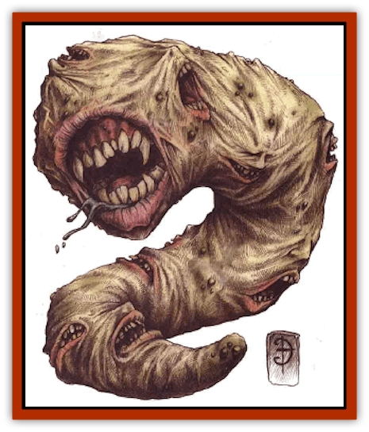

# Garmorm

| Statistic | **Garmorm** |
| --- | --- |
| **Activity Cycle:** | Any |
| **Alignment:** | Chaotic evil |
| **Armor Class:** | 4 or 0 |
| **Climate/Terrain:** | Astral Plane |
| **Damage/Attack:** | 2d6 + 1d4 per absorbed face |
| **Diet:** | Mental energy |
| **Frequency:** | Rare |
| **Hit Dice:** | 5-10 |
| **Intelligence:** | Very to genius (12-18) |
| **Magic Resistance:** | 25% |
| **Morale:** | Steady (11-12) |
| **Movement:** | 18 |
| **No. Appearing:** | 1d3 |
| **No. of Attacks:** | 1d6+5 |
| **Organization:** | Solitary |
| **Size:** | L (12' long) |
| **Special Attacks:** | Mental absorption, spells, magical items |
| **Special Defenses:** | Immune to psionics |
| **THAC0:** | 5-6 HD: 15 / 7-8 HD: 13 / 9-10 HD: 11 |
| **Treasure:** | V |
| **XP Value:** | 5 HD: 8,000 / 6 HD: 9,000 / 7 HD: 10,000 / 8 HD: 11,000 / 9 HD: 12,000 / 10 HD: 13,000 |

Few sounds are as terrible and wonderful as the song of the Garmorm sung by the creature itself. A garmorm is a roundish, limbless beast with a huge, tooth-filled maw. This fearsome predator of the Astral Plane is also known as a mindworm or even a faceworm. These odd names derive from the fact that the creature feeds on the mental energies of others, and if a sod's mind is absorbed by the monster, a replica of his face appears in its flesh. The faces press their way out of the garmorm's body to the extent that the faces can even speak, bite, and possibly cast spells - but mostly, they sing.

The garmorm communicates only through its song.

**Combat:** In combat, the garmorm sings its deadly song. At given portions of the song, the creature snaps its jaws upon a victim, using not only its huge, toothy mouth (which causes 2d6 points of damage) but also the maw of each face protruding from its flesh (which cause 1d4 points of damage each). Garmorm usually have from five to 10 absorbed faces, so they can make from six to 11 (or 1d6+5) attacks.

The song can also incorporate spells if one or more of the faces once belonged to a spellcaster (if determining randomly, there is a 10% chance per head). Only one spell can be cast per round, regardless of the number of spellcaster faces. Each face possesses the full complement of spells it would have memorized or prayed for normally (random determination for a cleric or wizard of level 2d4+1). Even worse, each day the spellcasting faces regain their total number of spells just as if the absorbed berks had memorized or prayed for the day's spells.

If someone absorbed into the garmorm had magical items, the creature can use the powers of those objects as a part of the song. It can't use magical items that require a touch (a *staff of striking*, magical weapons, and the like), but most rings, rods, wands, and many miscellaneous magical items shill work. A garmorm usually has 1d4 items: the DM can determine which items' powers are available to the creature. Only one such power can be used in a round, and only in a round in which the garmorm casts no other spell. Thus, in one round the garmorm can cast a spell (either from an absorbed spellcaster or an item) and bite with its various mouths, or it can attempt to absorb another victim as described below.

While it sings its horrible song, the garmorm has the potential to absorb the minds of its foes. Every round, the garmorm can target an opponent with its main mouth and attempt to "swallow" the foe, although not in the usual sense. The opponent may make a saving throw versus death magic; if failed, the sod's body is drawn into the beast and instantly dissolves. (Magic resistance may also be applied against this effect.) Then the poor berk's mind becomes one with the garmorm "choir", his face appearing on the skin of the beast. When this happens, the garmorm's Hit Die total increases by one, as does the number of bite attacks it can make each round. Likewise, if the victim had magical items or spellcasting ability, the garmorm can use these as mentioned above. A garmorm can have only up to 10 faces (and HD) at a time, although it continues to absorb victims even after it has reached this maximum. It gains no new HD or attacks from the new additions, but the greedy creature consumes them nonetheless.

Interestingly, the garmorm's song seems to be an essential component of the absorption process. Canny planewalkers wise to the danger of the garmorm have taken to equipping themselves with *silence* spells in the event that they encounter one of these beasts. If it cannot sing, it cannot absorb minds or cast spells.

A victim whose mind has been absorbed can be rescued only if the garmorm is slain within 10 rounds after the poor sod was "eaten". If the beast is killed within that time, the berk reconstitutes, mind intact, within the garmorm's belly. At this point, the victim has only 1 hit point and is too weak to free himself - he must be cut out of the garmorm.

However, if the basher isn't freed within 10 rounds after being absorbed, his mind remains within the garmorm for 4d4 weeks as a willing participant in the beast's "collective". After this time, the garmorm loses that sod's Hit Die and bite attack and must find a new victim. No garmorm has ever been encountered with fewer than five absorbed minds - this must be a minimum threshold for the beasts.

The garmorm has the ability to remain on the Astral Plane and still attack foes on planes that touch the Astral (it perceives both planes simultaneously). Unless the victims have the ability to see into the Astral Plane, these attacks are always made with surprise. Fighting the astral garmorm requires a magical item or spell; to a nonastral body, the garmorm is essentially invisible and its AC drops to 0. Bashers tell tales of friends being devoured right before their eyes by an invisible force. These may be tales of the garmorm - especially if the stories allude to a mysterious song heard from far away.

Lastly, all garmorm are immune to psionic attacks and powers.

**Habitat/Society:** The garmorm's a creature of intense hunger, intense loneliness, and intense evil. Selfish in the extreme, it absorbs and feeds upon the minds of others for its own gain. Though sometimes found with others of its kind in small groups, the garmorm is more likely to keep to itself. The reason for this lies in its argumentative and irritable nature. Even the multiple faces of a single garmorm sometimes quarrel or express exasperation with one another.

Riding the waves of thought in the Astral, grazing on the plane's background energy like a terrible bovine beast, a garmorm never willingly leaves its plane of origin. It will, however, happily feed on poor sods on the Prime or the top layers of the Outer Planes who wander too near its corresponding Astral location.

Garmorm are hated enemies of the [[Terithran|terithran]] of the Ethereal, although no one knows exactly why - or how - two races that should never have met could develop such an enmity.

On very rare occasions, individual garmorm have even been known to form alliances with a [[Githyanki|githyanki]], although no one knows what benefit either creature gains from the seeming partnership.

**Ecology:** Garmorm feed on the minds of any sentient being. They reproduce in an asexual manner not entirely understood, but which seems to involve budding off some of the absorbed minds into a new garmorm.

This concept has the graybeards wondering how much of the beast is simply the garmorm itself, and how much is the minds that it absorbs. The faces of those absorbed, and the song they sing, seem to indicate that they are more than happy with their new situation. Those freed from the belly of the beast have no memory of what occurred within. No one scams to know the whole dark.

Once they've slain the beast, canny bashers know to open up the innards of a garmorm, because some of the magical items used by the absorbed sods within it can still be round and used. (As above, magical items last 4d4 weeks within the creature's body.) Generally, a perceptive planewalker can recover at least two good, working devices. Considering the dangers of the Astral, every little bit helps.

---
## Discovery & Documentation

**Source Publication:** Planescape III (1996)
**Campaign Setting:** Planescape
**Author(s):** Monte Cook

### Other Creatures Found in This Source Book
   * [[Animental|Animental]]
   * [[Archomental_Evil|Archomental, Evil]]
   * [[Archomental_Good|Archomental, Good]]
   * [[Belker|Belker]]
   * [[Bzastra|Bzastra]]
   * [[Chososion|Chososion]]
   * [[Darklight|Darklight]]
   * [[Devete|Devete]]
   * [[Devourer_Planescape|Devourer (Planescape)]]
   * [[Dharum_Suhn|Dharum Suhn]]
   * [[Egarus|Egarus]]
   * [[Elemental_Athas_Lesser_Air_Earth|Elemental (Athas), Lesser, Air/Earth]]
   * [[Elemental_Athas_Lesser_Fire_Water|Elemental (Athas), Lesser, Fire/Water]]
   * [[Elemental_Fire_Kin_Salamander_II|Elemental, Fire Kin, Salamander II]]
   * [[Entrope|Entrope]]
   * [[Facet|Facet]]
   * [[Frost_Salamander|Frost Salamander]]
   * [[Fundamental_Air_Earth|Fundamental, Air/Earth]]
   * [[Fundamental_Fire_Water|Fundamental, Fire/Water]]
   * [[Fundamental_All_Elements|Fundamental, All Elements]]
   * [[Homunculus_Elemental|Homunculus, Elemental]]
   * [[Immoth|Immoth]]
   * [[Khargra|Khargra]]
   * [[Klyndes|Klyndes]]
   * [[Magran|Magran]]
   * [[Menglis|Menglis]]
   * [[Nathri|Nathri]]
   * [[Ooze_Sprite|Ooze Sprite]]
   * [[Paraelemental|Paraelemental]]
   * [[Phirblas|Phirblas]]
   * [[Psurlon|Psurlon]]
   * [[Quasielemental_Negative|Quasielemental, Negative]]
   * [[Quasielemental_Positive|Quasielemental, Positive]]
   * [[Rast|Rast]]
   * [[Ravid|Ravid]]
   * [[Ruvoka|Ruvoka]]
   * [[Scile|Scile]]
   * [[Shad|Shad]]
   * [[Shocker|Shocker]]
   * [[Sislan|Sislan]]
   * [[Suisseen|Suisseen]]
   * [[Terithran|Terithran]]
   * [[Thoqqua|Thoqqua]]
   * [[Trilloch|Trilloch]]
   * [[Tsnng|Tsnng]]
   * [[Ungulosin|Ungulosin]]
   * [[Vacuous|Vacuous]]
   * [[Wavefire|Wavefire]]
   * [[Xag-Ya_Xeg-Yi|Xag-Ya/Xeg-Yi]]
   * [[Xill|Xill]]
