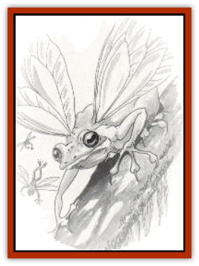
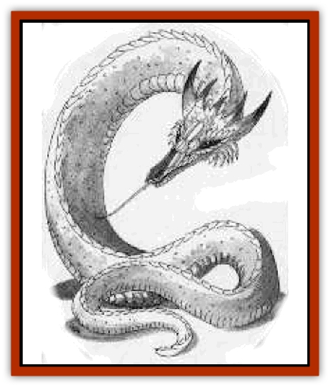
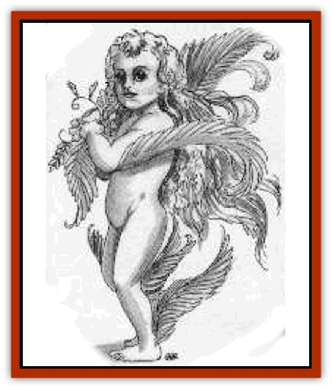
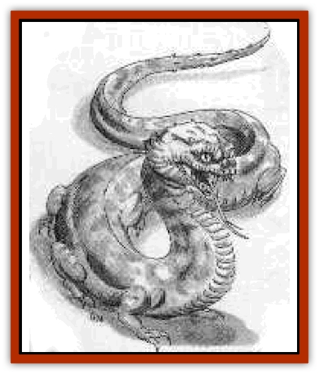

# Garradalaigh - General Information

[[Audreeana|]]Little is known about the garradalaighs (ga-ROD-a-lays), creatures of legend said to grant boons to wizards. Whether the beasts were [[Breiryn|]]companions, servants, or minions of the gods, historians cannot say. In fact, whether they even existed - or continue to exist today - is a subject of controversy.

Garradalaighs are said to appear only to those men and women who fervently embrace magic. The beasts supposedly walk with such wizards willingly, offering their skills and abilities in exchange for potion and magical treasures or other payment. Scholars who accept the legends as truth say that, while the power of these creatures has diminished since ancient times, they are still formidable.

Scholars have named each garradalaigh for the wizard who first recorded its presence. (As sightings date back to the days before the Deismar cataclysm, these wizards are all elves.) The creatures' true names are now known only to the long-dead gods. Lost to the ages, those names are the subjects of occasional quests by [[Cabhaigh|]]overly inquisitive apprentices. It is rumored that to know a garradalaigh's true name is to hold absolute control over it. [[Daegandal|]]The garradalaigh then becomes not merely a companion, but soldier, servitor, and partner. If this is true, any wizard with control over one of the creatures could become powerful enough to sweep across the land, laying domains low with a wave of his hand.

Legend holds that it is possible for a wizard regent to contct one of these creatures, though the methods are not foolproof. Ancient tomes and tales offer several means:

<ul><li>One book mentions a spell said to summon garradalaighs, but the name of that spell has been lost. It is said to have cost a minor fortune in components and required elaborate protections. Nonetheless, the spell is reputed to have worked only about 10% of the time; when it failed, it usually claimed its would-be casters as victims.</li><li>A popular story among first-year students at the Royal College of Sorcery says that a garradalaigh might simply [[Garigal|]]appear before a chosen mage, seeking the company of a spellcaster. Such a visitation would be rare in the extreme, unheard of in recent history.</li><li>There are reports of an ancient, dark device that tugs at the heart of a garradalaigh, forcing it to do the bidding of a wizard. Like the summoning spell, most scholars doubt it ever existed.</li><li>It is said that a nonevil wizard can call one of these creatures by simply meditating - in doing so he telepathically makes it understood that he desires the companionship of a garradalaigh. According to legend, a creature summoned by this means always has an alignment that matches the wizard's.</li></ul>[[Rhoeghn|]]The legends also say that when encountered, these creatures grant boons in exchange for some kind of payment from the wizard. The payment could be as simple as providing companionship, as expensive as supplying potions or magical items (which the beasts are purpoted to collect - and sometimes eat), or as involved as completing a quest.

[[Siddwynd|]]The creatures may arrive and leave within the same day or accompany a wizard for a year or more. Most tales describe the creatures staying for only a few days, then returning to whatever they call home.

Woodsmen, wizards, and expert trackers have never been able to find the lairs of these creatures. A few who thought themselves close to finding a lair disappeared without a trace - perhaps victims of a garradalaigh's ire.

The eight garradalaighs described in these pages - [[Audreeana|audreeana]], [[Breiryn|breiryn]], [[Cabhaigh|cabhaigh]], [[Daegandal|daegandal]], [[Garigal|garigal]], [[Rhoeghn|rhoeghn]], [[Siddwynd|siddwynd]], and [[Tualleiaght|tualleiaght]] - are powerful creatures of legend that are said to enjoy the company of mages. We [[Tualleiaght|]]must stress the mythical nature of these beasts, however - their existence has never been satisfactorily documented. It is possible that some exist and others do not.

The statistics provided are extrapolated from ancient texts. Where no consensus could be found among various sources, the information is listed as "Mythical" or "Unknown".

*DM Note:* If a garradalaigh appears in a campaign, its power is such that when rolling for hit points the DM should count all 1s, 2s, and 3s as 4s.

---
## Discovery & Documentation

**Source Publication:** Book of Magecraft (1994)
**Campaign Setting:** Birthright
**Author(s):** Carrie A. Bebris, Anne Brown, Jean Rabe, Steven Schend, Ed Stark

### Other Creatures Found in This Source Book
   * [[Audreeana|Audreeana]]
   * [[Breiryn|Breiryn]]
   * [[Cabhaigh|Cabhaigh]]
   * [[Daegandal|Daegandal]]
   * [[Garigal|Garigal]]
   * [[Rhoeghn|Rhoeghn]]
   * [[Siddwynd|Siddwynd]]
   * [[Tualleiaght|Tualleiaght]]
