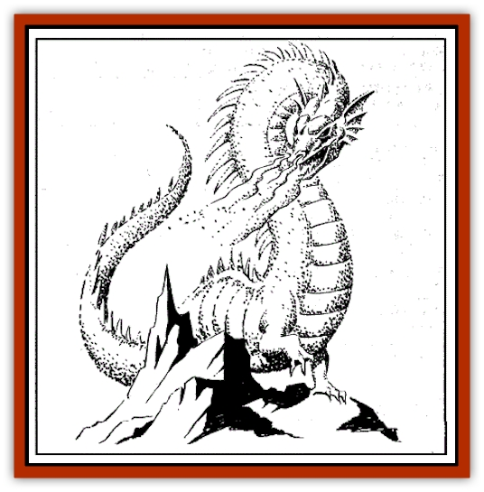

# Gaumahavi - Greater Purple Dragon

| Statistic | **Gaumahavi, Greater Purple Dragon** |
| --- | --- |
| **Activity Cycle:** | Any, but most active at twilight |
| **Alignment:** | Neutral |
| **Armor Class:** | - 2 |
| **Climate/Terrain:** | Subarctic desert, high mountains |
| **Damage/Attack:** | 1-8/1-8/5-30 |
| **Diet:** | Special (Carnivore) |
| **Frequency:** | Very Rare (unique) |
| **Hit Dice:** | 16 (128 hit points) |
| **Intelligence:** | Exceptional (15-16) |
| **Magic Resistance:** | 35% |
| **Morale:** | Fanatic (19) |
| **Movement:** | 15, Fl 40 |
| **No. Appearing:** | 1 |
| **No. of Attacks:** | 3 or dust storm and/or spell |
| **Organization:** | Solitary |
| **Size:** | G (125' long) |
| **Special Attacks:** | Special |
| **Special Defenses:** | Only hit by +3 or better magical weapons in astral (dust) form. |
| **THAC0:** | 5 |
| **Treasure:** | Nil |
| **XP Value:** | 18,000 |

Gaumahavi is a unique type of dragon. Though her long, snaky form is similar in appearance to that of an [[Dragon_Oriental_Lung_General_Information|oriental dragon]], she has little in common with them.

Thousands of years ago, Gaumahavi was the pet leopard of Surtava, the famous Ulgarian prince who gave up his power and wealth to seek enlightenment as a beggar, and who founded the Padhran religion now followed by the citizens of Ra-Khati. As a result of her close contact to the Padhra, Gaumahavi developed a soul. This newfound soul set Gaumahavi on a series of incarnations; her present incarnation is that of a great purple dragon.

**Combat:** In battle, Gaumahavi is a cunning predator who approaches combat in much the same way she approached hunting in her previous lives as predators. She uses her spells and breath weapons to disable her opponents, then keeps her exposure to a minimum while moving in for the kill.

Gaumahavi is the Great Dragon of the Desert Winds. As such, she has complete control over air currents within a 500-yard radius, and twice per day can create five rounds of dust storm causing 2d4 points of damage per round and knocking the victim off his feet (save vs. breath weapon for half damage and to retain footing). Gaumahavi's breath weapon, which she can use up to nine times a day, consists of a great cloud of powdery purple dust 100 feet long. This cloud is 5 feet in diameter at the base and 50 feet at the end. It does 8d10 points of choking damage to any breathing creature (save vs. breath weapons for half damage)

She can polymorph into any predatory animal or assume astral form at will. When in astral form, a shadow of her body, in the form of purple dust, remains on the Prime Material Plane. This form can only be struck by +3 or better magical weapons. By dissolving one dust body and forming another in a different part of the world, she is able to move over great distances instantaneously.

Gaumahavi can cast the following spells once per day: Wizard: 1) *color spray*, *gaze reflection*; 2) *darkness, 15' radius*, *whispering wind*; 3) *blink*, *wind wall*; 4) *dimension door*, *rainbow pattern*; 5) *telekinesis*, *teleport*; 6) *control weather*, *project image*; 7) *reverse gravity*, *vanish*.

Priest: 1) *animal friendship*, *locate animals or plants*; 2) *snake charm*, *speak with animals*; 3) *hold animal*, *summon insects*; 4) *giant insect*, *repel insects*; 5) *animal growth*.

**Habitat/Society:** Gaumahavi prefers to inhabit arid lands at high altitudes. She is by nature a solitary creature who avoids contact with men, though she is occasionally coerced into cooperating with certain powerful individuals. A nomadic huntress, Gaumahavi does not collect treasure.

**Ecology:** In astral form, Gaumahavi draws her sustenance from the mystic energies of Toril. However, in normal corporeal form, she is a voracious carnivore

---
## Discovery & Documentation

**Source Publication:** FRA3 Blood Charge (1990)
**Campaign Setting:** Forgotten Realms
**Author(s):** Troy Denning, Anne Brown, Paul Abrams

### Other Creatures Found in This Source Book
   * [[Ambuchar_Devayam_Tan_Chin|Ambuchar Devayam/Tan Chin]]
   * [[Sandiraksiva_The_Black_Courser|Sandiraksiva, The Black Courser]]
   * [[Dowagu|Dowagu]]
