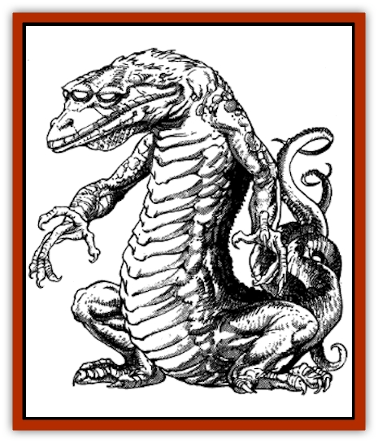

# Gaund

| Statistic | **Gaund** |
| --- | --- |
| **Activity Cycle:** | Any |
| **Alignment:** | Neutral |
| **Armor Class:** | 6 |
| **Climate/Terrain:** | Subterranean, hot caverns |
| **Damage/Attack:** | 1-4/1-4/1-6/1-8 |
| **Diet:** | Omnivorous |
| **Frequency:** | Rare |
| **Hit Dice:** | 4+4 |
| **Intelligence:** | Average (8-10) |
| **Magic Resistance:** | Nil |
| **Morale:** | Elite (13-14) |
| **Movement:** | 15 |
| **No. Appearing:** | 1-20 |
| **No. of Attacks:** | 4 + special |
| **Organization:** | Group |
| **Size:** | M (6' tall) |
| **Special Attacks:** | See below |
| **Special Defenses:** | See below |
| **THAC0:** | 17 |
| **Treasure:** | Q&times;4 |
| **XP Value:** | 650 |

Gaund are gray-green reptilian creatures with three glowing red eyes and are often mistaken for large [[Lizard|lizards]] by adventurers. They are intelligent, but spend most of their time on all fours. They rise upon their hind legs and balance with their tails only in combat or when surveying their surroundings. Their skin is scaled and leathery, and of a somewhat lighter color on the underside. They communicate in a language of singing clicks and hollow whistling sounds.

**Combat:** Gaunds have 90' infravision, excellent hearing, and great sensitivity to vibrations. This prevents them from being effectively blinded by exposure to light or darkness, or by the obscuring effects of smoke or vapors. They are surprised only on a roll of 1 on a 1d6.

In combat, gaunds do not use weapons of any sort, but leap about constantly, hurling themselves at and upon opponents, slashing with their claws (1d4 points of damage), snapping with their jaws (1d6 points of damage), and using their tails as lashes or whips (1d8 points of damage). They are fearless, and the death of a fellow often drives them to fight with even greater ferocity.

If pinned down or caught from the rear, the gaund kicks with its powerful rear legs for two attacks that cause 3d4 points of damage. These are the only circumstances in which they use their rear claws.

The most feared attack of the gaund is the gaze or "ray" attack it can make with its central eye. This orb is protected by a bony hood which limits its field of vision so the gaund must aim its head to use the gaze. The gaze produces a magical effect identical to the 2nd-level clerical *heat metal* spell upon any one opponent or object within a range of 90 feet. This gaze can be used against one creature per round and is in addition to its normal attacks. The ray attack can be countered by any means effective against the spell.

Gaund suffer no damage at all from heat or normal fire, even [[Dragon_Turtle|dragon turtle]] steam. Magical fire attacks inflict less damage upon them, causing 2 points of damage per die, with a minimum of 1 point of damage per die. However, they are especially susceptible to cold-based attacks (+2 to each die of damage). They are also susceptible to sonic attacks and make saving throws against them at a penalty of -2.

**Habitat/Society:** Gaunds live in groups of up to twenty members, although large colonies of many groups have sometimes been found. They live in dry, fiery caverns, and are only rarely encountered in cool climates or above ground.

Gaunds are omnivorous. Although they do not build, use tools, or seem to have any type of social structure, they do husband food carefully, often maintaining breeding colonies of lesser animals to ensure themselves of a plentiful supply.

Gaund mating rituals include an upright, shuffling, head-to-head dance during which an an egg-bearing female turns a fiery orange. After a gestation period of about four months, 1-4 eggs are produced. These have leathery shells and are covered with a clear, spicy-scented slime. This substance is known to neutralize nearly all acids and, if smeared on a flammable item, increases its saving throw vs. fire by a bonus of +3.

Gaunds guard their eggs ferociously for the 3-12 days it takes them to hatch. The young are small (2+4 Hit Dice), and do not develop the gaze attack until they reach maturity 3 to 6 months later.

Gaunds hoard gems and pretty stones of all types, and have been known to trade these for food with adventuring parties too strong for them to overcome. Generally, however, they seem both hostile toward intruders and territorial. Their lands should not be entered casually.

**Ecology:** Gaunds live a very simple and naturalistic life, so basic that they are often mistaken for nonintelligent, dangerous lizards. They are hunted for their hard and durable teeth by humanoids who live nearby. Tools and daggers fashioned from this material dull easily but do not easily split or shatter. Gaund tails are highly valued for their rich, succulent meat, which does not readily spoil.

**Frost Gaund**

  This gaund variation lives only in very cold regions. Its color is bluish-gray or slate-gray. Its eyes are a glowing blue. Its ray has the effect of *chill metal*, as the 2nd-level clerical spell. The creature resists cold-based attacks and is susceptible to fire-based attacks. Its eggs are encased in a slime that protects them from extreme cold. It is otherwise identical to the normal gaund.

---
## Discovery & Documentation

**Source Publication:** MC11 Forgotten Realms Appendix II (1991)
**Campaign Setting:** Advanced Dungeons & Dragons 2nd Edition
**Author(s):** Tim Beach, Tim Brown, William W. Connors, Dale Donovan, Ed Greenwood, Jeff Grubb, Bruce Heard, Slade Henson, Rob King, Colin McComb, Roger E. Moore, Bruce Nesmith, Jon Pickens, Jean Rabe, Dori Watry, Skip Williams

### Other Creatures Found in This Source Book
   * [[Alaghi|Alaghi]]
   * [[Alguduir|Alguduir]]
   * [[Beguiler|Beguiler]]
   * [[Bird_Toril|Bird (Toril)]]
   * [[Cantobele|Cantobele]]
   * [[Carapace|Carapace]]
   * [[Cat_Toril|Cat (Toril)]]
   * [[Chitine|Chitine]]
   * [[Cildabrin|Cildabrin]]
   * [[Dimensional_Warper|Dimensional Warper]]
   * [[Dragon_Deep|Dragon, Deep]]
   * [[Fachan_Toril|Fachan (Toril)]]
   * [[Fael|Fael]]
   * [[Feyr|Feyr]]
   * [[Firetail|Firetail]]
   * [[Frost|Frost]]
   * [[Gloomwing|Gloomwing]]
   * [[Golden_Ammonite|Golden Ammonite]]
   * [[Golem_Lightning|Golem, Lightning]]
   * [[Hamadryad|Hamadryad]]
   * [[Harrier|Harrier]]
   * [[Harrla|Harrla]]
   * [[Haun|Haun]]
   * [[Haundar|Haundar]]
   * [[Hendar|Hendar]]
   * [[Inquisitor|Inquisitor]]
   * [[Lhiannan_Shee|Lhiannan Shee]]
   * [[Loxo|Loxo]]
   * [[Manni|Manni]]
   * [[Manscorpion|Manscorpion]]
   * [[Mara|Mara]]
   * [[Morin|Morin]]
   * [[Naga_Dark|Naga, Dark]]
   * [[Orpsu|Orpsu]]
   * [[Plant_Carnivorous_Black_Willow|Plant, Carnivorous, Black Willow]]
   * [[Plant_Carnivorous_Toril|Plant, Carnivorous (Toril)]]
   * [[Plant_Dangerous_I|Plant, Dangerous I]]
   * [[Ring-Worm|Ring-Worm]]
   * [[Rohch|Rohch]]
   * [[Sand_Cat|Sand Cat]]
   * [[Saurial|Saurial]]
   * [[Sha'az|Sha'az]]
   * [[Silver_Dog|Silver Dog]]
   * [[Simpathetic|Simpathetic]]
   * [[Skuz|Skuz]]
   * [[Spider_Monkey|Spider, Monkey]]
   * [[Tren|Tren]]
