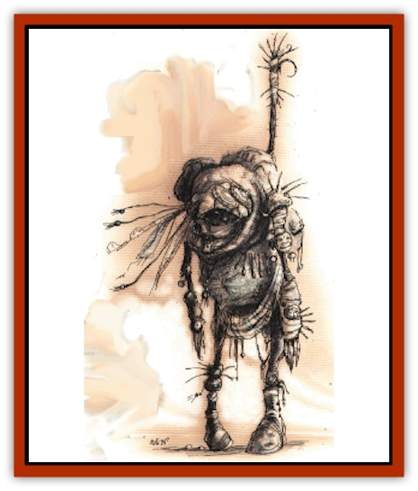

# Gautiere

| Statistic | **Gautiere** |
| --- | --- |
| **Activity Cycle:** | Any |
| **Alignment:** | Neutral evil |
| **Armor Class:** | 6 |
| **Climate/Terrain:** | Carceri |
| **Damage/Attack:** | 1d4/1d4 or 1d10 (+1 or more for Strength) |
| **Diet:** | Carnivore |
| **Frequency:** | Uncommon |
| **Hit Dice:** | 4+3 |
| **Intelligence:** | Average to very (8-12) |
| **Magic Resistance:** | Nil |
| **Morale:** | Fanatic (17-18) |
| **Movement:** | 12 |
| **No. Appearing:** | 1d4+1 |
| **No. of Attacks:** | 2 or 1 |
| **Organization:** | Tribe |
| **Size:** | L(7' tall) |
| **Special Attacks:** | Acid touch, possible spell use |
| **Special Defenses:** | Immune to acid, fire, and heat |
| **THAC0:** | 17 |
| **Treasure:** | O,U |
| **XP Value:** | 975 / Leaders: 1,400 |

The gautiere are gaunt, gray-skinned humanoids with clawed hands and pointed teeth. They wrap themselves in rags and strips of whatever cloth or hide they can find to protect themselves from the stinging, flesh-rending winds of Minethys.

The connection between the gautiere and the ancient tiere (if they ever even existed) is unknown. Did the tiere, in their unswerving quest for revenge, willingly condemn themselves in their own ritual? Or are the gautiere the twisted and hollow remains of the mortal tiere, sentenced to the prison-like realm of Carceri forever for daring to lash out against a power? No one knows.

**Combat:** The gautiere move with deliberate hesitation, sizing up their foes carefully, but once they have committed themselves to a battle they see it to its end. They have jagged claws on their twisted hands, and each bare hand can inflict 1d4 points of damage. However, they prefer to use a weapon they call a xaen, a heavy battle staff covered in bony barbs, spikes, and hooks that inflicts 1d10 points of damage per strike. Each gautlere has a Strength score of at least 16 (the minimal Strength to wield a xaen), and many have scores of 17, 18, and even 19.

The gautiere have a special arcane ability which allows them to transform the flesh of another into a horribly foul acid. This power is usable only once each day, and it requires them to touch the foe they wish to harm, but it inflicts 3d6 points of damage upon a poor victim affected by the attack. This acidic damage is very difficult to heal, taking twice the time of normal rest to recover the lost hit points, and cutting in half the amount of damage (of this wound only) healed by spells.

Gautiere are immune to this acidic attack as they are immune to all acids, fire, and heat. They are harmed by other attack forms normally. Gautiere Armor Class is a result of the leathery skin and the rags that they wrap themselves in.

A very few gautiere (1 in 50) are able to cast spells as a 1st-6th level wizard in addition to their normal abilities. These are usually leaders of some sort. Gautiere are *never* priests; they have an inherent distrust - some would say hatred - for deities of all sorts.

**Habitat/Society:** The gautiere cast themselves in the role of wanderers and nomads, roaming the ever-changing dunes of their plane in search of nothing. As the legendary tiere were absolute in their devotion and later their quest for vengeance, so the gautiere are absolute in their resigned acceptance of their race's position, hovering on the edge of oblivion.

They organize themselves in small tribes of 4d6+10 individuals. It is rare that outsiders encounter an entire tribe, however, for they keep themselves well hidden. Far more commonly, travelers meet a hunting party as it hunts the few other creatures native to this plane (they prefer [[Vargouille|vargouilles]], [[Mephit_General_Information|mephits]], and large, spiny sand-fish). The gautiere are evil, but they are not devious - they are straightforward in their malevolence, blatant in their cruelty. They are brutal and uncaring when it comes to others, willing to let another die if saving that life might put the gautiere at risk. Some take this cruelty a step further, becoming wantonly sadistic and belligerently violent.

Gautiere take mates and have young as other races do, but their life is one of constant, minute-to-minute struggle. The wind never stops and the food is scarce. Water is scarcer still. Because of these difficulties, the heartless gautiere cling to their tribes and diligently follow the orders of their tribal leaders (individuals with +1 hp per Hit Dle, a Strength score of 19, an Intelligence score of 15-16, and possible spell use).

**Ecology:** No matter what their origin, the gautiere are truly prisoners within their own plane. They cannot use portals to escape Carceri (even if they find the correct gate key), bound there by the nature of the plane. Only powerful magic cast by an outsieder can allow them to leave - and very few wizards are going out of their way to thrust  the gautiere upon the rest of the planes. The gautiere war with the gehreleths only when they must, and do whatever they can to avoid becoming embroiled in the Blood War.

---
## Discovery & Documentation

**Source Publication:** Planes of Conflict (1995)
**Campaign Setting:** Planescape
**Author(s):** Colin Mccomb, Dale Donovan

### Other Creatures Found in This Source Book
   * [[Aeserpent|Aeserpent]]
   * [[Asuras|Asuras]]
   * [[Buraq|Buraq]]
   * [[Delphon|Delphon]]
   * [[Diakk|Diakk]]
   * [[Ethyk|Ethyk]]
   * [[Linqua|Linqua]]
   * [[Ni'iath|Ni'iath]]
   * [[Phiuhl|Phiuhl]]
   * [[Quesar|Quesar]]
   * [[Slasrath|Slasrath]]
   * [[Warden_Beast|Warden Beast]]
   * [[Yugoloth_Greater_Baernaloth|Yugoloth, Greater, Baernaloth]]
