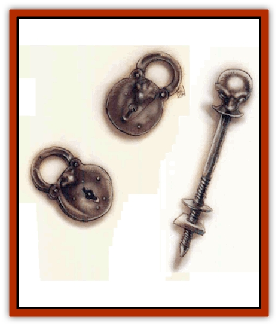

# Gear Spirit

| Statistic | **Gear Spirit** |
| --- | --- |
| **Activity Cycle:** | Any |
| **Alignment:** | Lawful neutral |
| **Armor Class:** | 4 |
| **Climate/Terrain:** | Mechanus |
| **Damage/Attack:** | 1d6 or by weapon |
| **Diet:** | Special (metal) |
| **Frequency:** | Very rare |
| **Hit Dice:** | 1+3 |
| **Intelligence:** | Average (8-10) |
| **Magic Resistance:** | 5% |
| **Morale:** | Steady (11) |
| **Movement:** | 6, Br 6 |
| **No. Appearing:** | 1 |
| **No. of Attacks:** | 1 |
| **Organization:** | Solitary |
| **Size:** | S (4' tall) |
| **Special Attacks:** | Command machinery, reduce armor |
| **Special Defenses:** | Meld with metal |
| **THAC0:** | 19 |
| **Treasure:** | Nil |
| **XP Value:** | 975 |

Gear spirits come in many different forms, but their function remains the same: to tend the great gears of Mechanus and to ensure that they run smoothly. Unlike [[Modron|modrons]], gear spirits are individuals who have tasks and specific gears assigned to them. Because of this, their shapes vary widely.

Though their name might indicate an incorporeal nature, gear spirits are actually pieces of living metal - machines who have free will. They are usually small, taking the form of a common mechanical device or tool. They have eyes, ears, noses, and so forth, but the placement of these is highly irregular. Individual spirits usually take a name based on their appearance. Some common names include Ball-and-Chain, Chair, Axle, and Padlock.

**Combat:** Though it isn't exactly a fearsome fighter, a gear spirit does have some abilities that give pause to those who face it in battle. For one thing, a gear spirit can change its arms to any tool it desires, including weaponry. It can even  make a crossbow from itself, with unlimited bolts to fire.

Another, more dangerous, quality is the spirit's ability to *meld with metal*. As with a *meld with stone* spell, the gear spirit can merge with any kind of manufactured metal or machinery. Once it's blended with a machine, it can command the mechanical device to obey its will. but only within the functions of the device. For example, although a gear spirit could unlock a door or fire a ballista, it could not make a lamppost attack a passerby - though it could make a wheel roll someone over.

Lastly, a gear spirit has the ability to *reduce armor*. Every time a spirit strikes someone in melee combat who is wearing metal armor, the AC value of that armor is reduced by one point. (The ability is inactive in ranged combat.) Magic bonuses are the last to be destroyed, and Dexterity bonuses are unaffected. When armor loses its last point of AC, the armor is considered completely destroyed.

Gear spirits are immune to mind-affecting spells and any spells that affect emotion. Like modrons, spells that drain life energy are also ineffective against these creatures. Furthermore, any attacks against these spirits involving fire, cold, or acid suffer a -1 penalty on all attack rolls; the creatures also gain a +1 bonus on saving throws versus these attack forms. However, gear spirits are highly vulnerable to rust, for their exterior decays at twice the rate of normal metal. There is no more horrifying fate for gear spirits than being shackled in a dank, wet cell and doomed to death by oxidization - except, perhaps, confronting a [[Dragon_Rust|rust dragon]].

**Habitat/Society:** A gear spirit is unique to Mechanus, and its work on that plane is rumored to be essential for the smooth running of the gears. Thus, the modrons have, over the centuries, learned to dominate the gear spirits for the good of the gears. This means that the gear spirits are officially secured to their gears by the modrons - a fact that rankles the spirits just a little, even if what they are tied to is their beloved gears. Though they're lawful, gear spirits have more personality than modrons, and they resent the feeling of being underlings to the modrons.

There's some spirits who've found that such servitude rankles more than just a little. These creatures slip away from their duties, leaving the cog to spin unsupervised. Though there's only a small possibility that the gear's motion may be disrupted, there's certainly enough of a chance to warrant a modron task force to be sent after the errant spirit. Likewise, occasionally some gear spirits are affected by an urge very similar to the aborigine "walkabout"; that is, the gear spirits take it into their mind simply to wander off. In either case, it might take years to find the hiding or lost spirit, but the modrons'll continue looking for it until it is brought back to Mechanus - for it�s only then that a new gear spirit can be formed. While a spirit's gone, the modrons do their best to keep the gear from malfunctioning, but they simply don't have the innate ties to it that a gear spirit does.

**Ecology:** A gear spirit is inextricably tied to a gear, much like a nature spirit (such as a [[Dryad|dryad]]) is tied to a specific tree or place. The gear spirit, unlike these other spirits, can leave its place by taking a piece of the gear with it. This portion holds the essence of the gear: if the gear spirit loses or misplaces the piece, the spirit sickens and dies within a month. Likewise, if the spirit's kept away from manufactured metals or machinery for a month, it dies. It simply can't abide being away from metal.

A few centuries ago it was reported that there was one gear spirit for every gear in Mechanus. If that's the case, then there's an awful lot of really small gears hidden away on that plane, because the population of gear spirits has grown considerably over the decades. The latest popular theory states that there's several gear spirits to a gear, but that they all share part of the gear's essence. This seems more likely than the one-to-one ratio hypothesis.

---
## Discovery & Documentation

**Source Publication:** Planes of Law (1995)
**Campaign Setting:** Planescape
**Author(s):** Colin McComb, Wolfgang Baur

### Other Creatures Found in This Source Book
   * [[Achaierai|Achaierai]]
   * [[Archon|Archon]]
   * [[Baatezu_Lesser_Kocrachon|Baatezu, Lesser, Kocrachon]]
   * [[Bladeling|Bladeling]]
   * [[Busen|Busen]]
   * [[Dragon_Rust|Dragon, Rust]]
   * [[Formian|Formian]]
   * [[Hellcat|Hellcat]]
   * [[Kyton|Kyton]]
   * [[Moigno|Moigno]]
   * [[Parai|Parai]]
