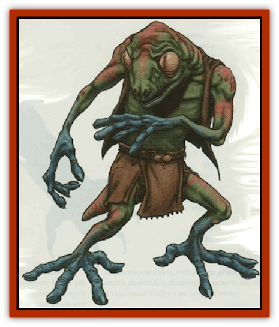

# Geckonid

| Statistic | **Geckonid** |
| --- | --- |
| **Activity Cycle:** | Night |
| **Alignment:** | Neutral good |
| **Armor Class:** | 4 |
| **Climate/Terrain:** | Tropical, subtropical or urban |
| **Damage/Attack:** | By weapon type |
| **Diet:** | Carnivore |
| **Frequency:** | Very rare |
| **Hit Dice:** | 1 |
| **Intelligence:** | Average (8-10) |
| **Magic Resistance:** | Nil |
| **Morale:** | Steady (11-12) |
| **Movement:** | 12, climb 12 |
| **No. Appearing:** | 1-8 or 2-20 |
| **No. of Attacks:** | 1 |
| **Organization:** | Tribal |
| **Size:** | M (5-6' tail) |
| **Special Attacks:** | Nil |
| **Special Defenses:** | See below |
| **THAC0:** | 19 |
| **Treasure:** | D |
| **XP Value:** | 35 |

Small, quick, brightly-colored, and curious, geckonids are the friendliest of the lizard peoples. Soft, interconnecting scales of green, blue, red, and brown cover their skin. Most stand around 5' tall (except the tokays - see below). Their limbs are short and thin, their tails short and stubby. The most striking features of the geckonids are their eyes: huge, bulbous orbs on either side of their faces. Most interesting, though, are the suction cups on their fingers and toes that allow them to climb walls and ceilings as if they were floors.

**Combat:** Geckonids would rather run away than fight, since their teeth and claws are too small to cause damage. If forced to fight, they use speed and climbing to their advantage.

Since they can stick to almost any surface and leap up to 30', geckonids often have the advantage of surprise. In combat they run along walls to throw off their opponents, dodge blows by leaping to the ceiling, and - if things go badly - scamper up a steep surface. If fighting in an area where there are a lot of surfaces (indoors, urban streets, forest or jungle, or similar environments), they have the AC given above. While fighting in the open, they can still rely on their natural speed and dexterity, but their AC drops to 7. Immobilized geckonids are AC 10.

Geckonids can see invisible creatures and objects. They do not realize the things they see are invisible and, if associating with others, assume that everybody else notices the invisible person or object as well. They can all Climb Walls (95%), Hide in Shadows (50%), Move Silently (75%), and Backstab, which is their favored method of fighting. Geckonids have mild chameleon abilities. Their skin color changes slightly according to their mood and surroundings.

**Habitat/Society:** Geckonids live in small communal tribes and prefer small villages in steaming jungles and forests.

Geckonids are driven by an insatiable curiosity. They love to explore, and they frequently wander into nearby cities, which they consider  treasuries of unending interest. After exposure to civilisation, geckonids often become  thieves  (up to 12th level) or even mages (up to 7th level), with a corresponding increase in Hit Dice. They do not feel avarice. Rather, they steal as an excuse to poke around in others' belongings, It amuses them to dodge the law by running up the sides of buildings and peeking over the edges  to see the the looks on the guards' faces.

Geckonids are generally friendly, cheerful, and polite in their own odd manner. They have a different way of thinking. They like to observe conversations, interjecting only to make a strange comment or tell a joke only they understand. For instance, a geckonid might loudly croak in someone's face, then pretend the speaker had said something important in the geckonid's own language. Or, a geckonid might hold open his mouth for several minutes. If asked why, the geckonid claims to be waiting for the birds to come out. Geckonids play bizarre, harmless pranks on their friends when they are bored.

**Ecology:** Geckonids live on birds, small animals, and insects. In the wild, the small weak geckonids have much to fear from predators. Were it not for their speed and climbing abilities, the species would have vanished long ago.

**Tokays**

  The dark side of normal geckonids, tokays are large, strong, and ill-tempered. Tokays stand almost 6' tail and have teeth large enough to bite for 1d4 points of damage. All have pink scales with gray dots. Tokays tend toward neutral or neutral evil. If they take a class, they usually become thieves to steal and cause trouble. They have the same odd outlook as other geckonids but with a rude, cruel bent. The loud croak of a tokay geckonid sounds somewhat like a dog barking.

---
## Discovery & Documentation

**Source Publication:** Dragon268 (2000)
**Campaign Setting:** Dragon Magazine
**Author(s):** Michael Kuciak, Pete Venters

### Other Creatures Found in This Source Book
   * [[Agrutha|Agrutha]]
   * [[Crocodilian|Crocodilian]]
   * [[Varanid|Varanid]]
