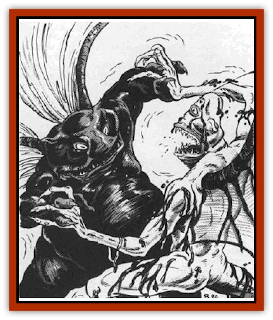
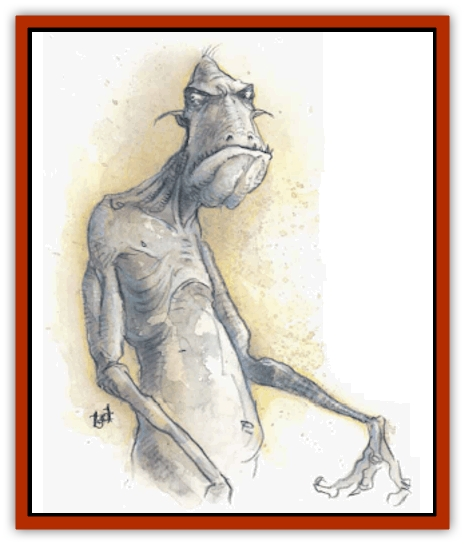
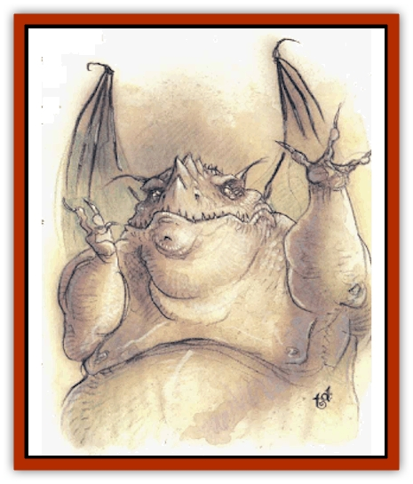
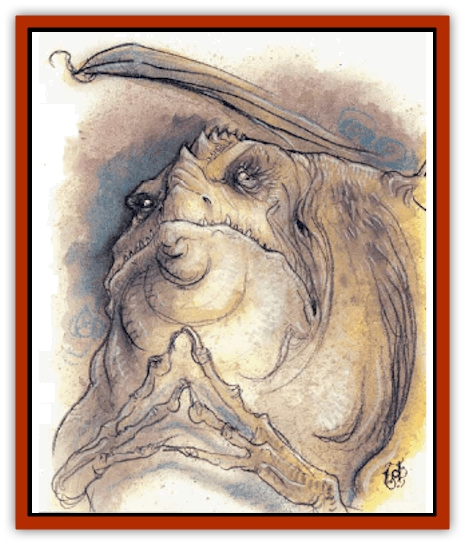

# Gehreleth

| Statistic | **Farastu** | **Kelubar** | **Shator** |
| --- | --- | --- | --- |
| **Activity Cycle:** | Any | Any | Any |
| **Alignment:** | Chaotic evil | Chaotic evil | Chaotic evil |
| **Armor Class:** | -1 | -2 | -3 |
| **Climate/Terrain:** | Carceri | Carceri | Carceri |
| **Damage/Attack:** | 1d6+1/1dG+1/3d4 or weapon +7 (Strength bonus) | 2d4/2d4/4d4 or weapon +9 (Strength bonus) | 1d6+1/1d6+1/3d4 or weapon +9 (Strength bonus) |
| **Diet:** | Carnivore | Carnivore | Carnivore |
| **Frequency:** | Very rare | Very rare | Very rare |
| **Hit Dice:** | 11 | 13 | 15 |
| **Intelligence:** | Average (8-10) | Very (11-12) | Genius (17-18) |
| **Magic Resistance:** | 50% | 50% | 50% |
| **Morale:** | Champion (15-16) | Champion (15-16) | Fanatic (17-18) |
| **Movement:** | 15, Fl 30 (C) | 12, Fl 24 (C) | 9, Fl 18 (C) |
| **No. Appearing:** | 1 | 1 | 1 |
| **No. of Attacks:** | 3 | 3 | 3 |
| **Organization:** | Solitary | Solitary | Solitary |
| **Size:** | M (7' tall) | M (6½'tall) | M (6' tall) |
| **Special Attacks:** | Battle frenzy, adhesive | Stench, acidic slime | Magical weapons |
| **Special Defenses:** | Adhesive, +1 or better weapons to hit | +2 or better weapons to hit | Immune to nonmagical attacks, +3 or better weapons to hit, +2 to surprise rolls |
| **THAC0:** | 9 | 7 | 5 |
| **Treasure:** | Nil | Nil | Nil |
| **XP Value:** | 14,000 | 17,000 | 22,000 |

Among the forbidden books in the library of Everhaite is a text on gehreleth society, *The Three Bodies of Evil* by Carlvian Everhaite, an otherwise anonymous [[Elf_Drow|drow]] wizard. Fragments of the text are known to men, notably a poetic redaction entitled *Calls of ye Lower Planes* by Nephrosis Curwen. Here are some of his remarks on gehreleth society.

"The Gehreleth are known to worship or honor a patron deity called Apomps, the Three-sided One. This entity not only can manifest as any of the three Gehreleth races, it is in fact directly supposed to be the father and promoter of each Gehreleth. The Three-sided One breathes life into the fallen and rotting corpses of those foolish enough to venture into the Lower Planes transforming them into Farastu. This entity presents each of the Gehreleth an obsidian triangle, which is considered the personal link they have with Him. This is their only loyalty. Should the triangle for any reason be taken from them, they will do much to retrieve it. Possession of the triangle, I suspect, allows each Gehreleth to posses the memories of the whole race to a limited extent. They know who has summoned others of their kind, and their plans of revenge can span the lives of many individuals.

"Each of the races has certain peculiarities. The Farastu and the Kelubar can undergo a lengthy and painful process of self-liquefaction into the secretion they most frequently exude. These pools of tar and slime can be bottled and stored for centuries as a kind of �instant army'.

"The Farastu, if they are not banished after summoning, delight in setting themselves up as kings of stupid, easily bullied inhabitants of the local plane. The Farastu pursue this promotion as compensation for the servility they must observe in the Lower Planes. It is believed that the Three-sided One promotes this practice, as it permits him to know of the goings-on on other planes. Apomps seldom promotes a Farastu on any plane save for Carceri.

"The Kelubar are mad for wands and other small handheld magical items. By sneaking such easily concealed magical items back to the Lower Planes, the Kelubar can gain an important edge in the power struggles that characterize Gehreleth society.

"The Shator often travel to other planes for their favorite occupation - writing. Shator works are of two categories: magical texts on how to summon creatures from the Lower Planes other than Gehreleth (usually named creatures that the Gehreleth have some particular hatred for), and philosophical texts that promote ideas of futility and cosmic angst. When dwelling in the Prime Material Plane, the Shator hide behind a human whom they set up a philosopher or poet. These men and women come to bad ends when the Shator has decided that its mission is done.

"When dwelling on other planes, the Shators' favorite pets are [[Chimera|chimerae]]. Oddly, they sometimes show concern for these beings, treating them like a human treats a kitten."

Gehreleths inhabit Carceri, part of the killing grounds in the eternal Blood War. However, these fiends take no part in the conflict, instead roaming Carceri as random agents of destruction. Gehreleths look disgusting and unsightly.

Gehreleths speak a guttural language of their own, but use their *tongues* ability to communicate with others.

## 

Farastu

The farastu are tall, slender humanoids with long arms and heads. Their Strength is 19 (+7 damage adjustment), and they weigh about 420 pounds. They are the commoners of Carceri.

**Combat:** Farastu are wicked things that attack any nongehreleth they encounter. They often fight to the death, ignoring morale rolls.

Although the vile farastu have several spell-like and special abilities, they prefer to enter combat with their two claws (1d6+1 damage) and fangs (3d4 damage).

A farastu reaches a battle frenzy after six rounds of combat or when reduced to half normal hit points. In a frenzy the farastu doubles its number of normal attacks, and all attacks get a +2 bonus.

Farastu gehreleths secrete a black, tarlike substance that is slightly adhesive (5% chance that anything it touches sticks). If an attacking farastu sticks to its opponent, the opponent gains another attack sequence immediately. If an attacking opponent sticks to the farastu, the farastu gains a +4 attack roll bonus and the stuck opponent loses initiative. If a weapon sticks to the farastu, there is a 25% chance that it is jerked from the attacker's grip. It takes one round to pull away a stuck weapon.

A farastu can employ the following spell-like powers at 11th level of spell use, one at a time, once per round: *detect good*, *detect invisibility*, *detect magic*, *dispel magic* (twice per day), *ESP*, *fear*, *fog cloud* (3 times per day), *invisibility*, *tongues*, and *weakness* (reverse of strength, 3 times per day). Farastu gehreleths can *gate* in 1-2 additional farastu once per day with a 40% chance of success.

Farastu are harmed only by +1 or hetter weapons. Acid or poison have no effect. Farastu gehreleth take half damage from cold- and fire-based attacks. They are immune to fear of all types, as well as all illusions and phantasms. Farastu have 120' infravision.

## 

Kelubar

Kelubar are slimy, ebon humanoids, shorter than farastu and thicker in the lower torso and limbs. Their hands are large and their huge heads oval: the horizontal axis is longest. Their effective Strength is 20 (+8 damage adjustment), and they weigh close to 500 pounds. They are the middle class of Carceri.

**Combat:** Kelubar are known as "slime gehreleths" because their skin constantly exudes a slimy secretion with a debilitating odor. Anyone within 30 feet of a kelubar in combat must successfully save vs. poison or be incapacitated for 1-10 melee rounds.

Kelubar attack with their nails (2d4 damage) and teeth (4d4 damage). In addition, each attack inflicts 1d6 damage due to the acidic nature of the kelubar's slime (save vs. poison for half damage).

Kelubar can employ all of the spell-like abilities available to farastu, plus these, at 13th level of spell use: *ray of enfeeblement* (once per day) and *spider climb*. Once per day a kelubar can attempt to *gate* in 1-2 additional kelubar (40% chance) or 1-2 farastu (60% chance).

Kelubar are completely immune to fire, acid, cold-based, and poison attacks. Weapons of less than +2 enchantment do no harm. They have infravision to 120'.

## 

Shator

Shator are 6' tall, squat and broad. Their humanoid form appears draped in shaggy skins. Their huge heads are mostly mouth, with jaws like a giant bulldog. Their Strength is 21 (+9 damage adjustment), and they weigh 560 pounds. Shators are the nobility of Carceri.

**Combat:** The greatest of the gehreleths, shators are the most intelligent and cunning of the gehreleths. In combat they choose their best option, often favoring their spell-like abilities over physical attacks and retreating from stronger opponents. Due to their sharp senses shators have a +2 bonus on their surprise rolls.

Shators attack with two claws (1d8+1 damage) and bite (5d4 damage). They can also wield weapons (45% chance for magical weapon). Both weapon and natural attacks gain Strength bonuses.

Shators can use all the spell-like abilities available to the farastu, plus the following, at 15th level of spell use: *beguile* (as a *rod of beguiling*, once per day), *cloudkill* (once per day), *ray of enfeeblement* (3 times per day), and *stinking cloud* (3 times per day). A shator can always *gate* in either 1-6 farastu or 1-4 kelubar. They have a 30% chance to summon 1-2 shators. They can summon only once per day.

The shator gehreleth is immune to all nonmagical attacks (fire, acid, cold, etc.) and to mind-affecting and illusion spells. No magical weapon of less than +3 enchantment affects them. All edged weapons have -1 penalties to hit and damage a shator. They have 120' infravision.

**Habitat/Society:** Few societies on the Lower Planes are stranger than that of the gehreleths. These enigmatic fiends fight without mercy against intruders, but have never been known to attack one another. Explanations for this puzzle range from instinct to intra-species empathy; no explanation yet advanced answers all the facts.

The gehreleths are the "summoning stock" of the Lower Planes. A wizard or priest who summons a lower-planar creature often gets a gehreleth - unfortunately. Gehreleths are dangerous to summoners because they avenge deeds they are forced to perform, often plotting revenge for many years. They never forget. Gehreleths, particularly the farastu, may even disobey a summoner, regardless of the importance of the mission. They are stubborn and hate servitude.

Despite their chaotic nature, the gehreleths pragmatically observe a class system based on raw power. The farastu are the lower class and sometimes servants. Kelubar form the middle class, shators the upper class and commanders.

**Ecology:** Gehreleths are spawned from the decaying bodies of beings that have traveled to the Lower Planes and died there. Some unidentified evil power gives them life and motivates them to destroy. They produce nothing of value and serve no purpose to anything around them.

Freshly transformed cadavers always become farastu. If a greater gehreleth is destroyed, an existing lesser rises in status and take its place; the lesser farastu ranks are replenished from new corpses.

Normally there are 3,333 of each variety of gehreleth. When the Blood War on the Lower Planes rages its strongest, the gehreleths increase their numbers to twice normal. Because they never take part in the war and are independent of the [[Baatezu_General_Information|baatezu]] and [[Tanar'ri_General_Information|tanar'ri]], presumably this population increase protects them from both sides.

---
## Discovery & Documentation

**Source Publication:** MC8 Outer Planes Appendix (1990)
**Campaign Setting:** Planescape
**Author(s):** Timothy B. Brown, Jamie LaFountain

### Other Creatures Found in This Source Book
   * [[Aasimon_Agathinon|Aasimon, Agathinon]]
   * [[Aasimon_Deva|Aasimon, Deva]]
   * [[Aasimon_Light|Aasimon, Light]]
   * [[Aasimon_General_Information|Aasimon, General Information]]
   * [[Aasimon_Planetar|Aasimon, Planetar]]
   * [[Aasimon_Solar|Aasimon, Solar]]
   * [[Air_Sentinel|Air Sentinel]]
   * [[Animal_Lord|Animal Lord]]
   * [[Archon|Archon]]
   * [[Baatezu_Lesser_Abishai|Baatezu, Lesser, Abishai]]
   * [[Baatezu_Greater_Amnizu|Baatezu, Greater, Amnizu]]
   * [[Baatezu_Lesser_Barbazu|Baatezu, Lesser, Barbazu]]
   * [[Baatezu_Greater_Cornugon|Baatezu, Greater, Cornugon]]
   * [[Baatezu_Lesser_Erinyes|Baatezu, Lesser, Erinyes]]
   * [[Baatezu_General_Information|Baatezu, General Information]]
   * [[Baatezu_Greater_Gelugon|Baatezu, Greater, Gelugon]]
   * [[Baatezu_Lesser_Hamatula|Baatezu, Lesser, Hamatula]]
   * [[Baatezu_Lemure|Baatezu, Lemure]]
   * [[Baatezu_Least_Nupperibo|Baatezu, Least, Nupperibo]]
   * [[Baatezu_Lesser_Osyluth|Baatezu, Lesser, Osyluth]]
   * [[Baatezu_Greater_Pit_Fiend|Baatezu, Greater, Pit Fiend]]
   * [[Baatezu_Least_Spinagon|Baatezu, Least, Spinagon]]
   * [[Balaena|Balaena]]
   * [[Bariaur|Bariaur]]
   * [[Bebilith|Bebilith]]
   * [[Bodak|Bodak]]
   * [[Dog_Moon|Dog, Moon]]
   * [[Dragon_Adamantite|Dragon, Adamantite]]
   * [[Einheriar|Einheriar]]
   * [[Githyanki|Githyanki]]
   * [[Githzerai|Githzerai]]
   * [[Hordling|Hordling]]
   * [[Lammasu_Celestial|Lammasu, Celestial]]
   * [[Larva|Larva]]
   * [[Maelephant|Maelephant]]
   * [[Marut|Marut]]
   * [[Mediator|Mediator]]
   * [[Mortai|Mortai]]
   * [[Night_Hag|Night Hag]]
   * [[Nightmare|Nightmare]]
   * [[Noctral|Noctral]]
   * [[Per|Per]]
   * [[Phoenix|Phoenix]]
   * [[Slaad|Slaad]]
   * [[Tanar'ri_Greater_Babau|Tanar'ri, Greater, Babau]]
   * [[Tanar'ri_Greater_Chasme|Tanar'ri, Greater, Chasme]]
   * [[Tanar'ri_Greater_Nabassu|Tanar'ri, Greater, Nabassu]]
   * [[Tanar'ri_Least_Dretch|Tanar'ri, Least, Dretch]]
   * [[Tanar'ri_Least_Manes|Tanar'ri, Least, Manes]]
   * [[Tanar'ri_Least_Rutterkin|Tanar'ri, Least, Rutterkin]]
   * [[Tanar'ri_Lesser_Alu-Fiend|Tanar'ri, Lesser, Alu-Fiend]]
   * [[Tanar'ri_Lesser_Bar-Lgura|Tanar'ri, Lesser, Bar-Lgura]]
   * [[Tanar'ri_Lesser_Cambion|Tanar'ri, Lesser, Cambion]]
   * [[Tanar'ri_Lesser_Succubus|Tanar'ri, Lesser, Succubus]]
   * [[Tanar'ri_Guardian_Molydeus|Tanar'ri, Guardian, Molydeus]]
   * [[Tanar'ri_General_Information|Tanar'ri, General Information]]
   * [[Tanar'ri_True_Balor|Tanar'ri, True, Balor]]
   * [[Tanar'ri_True_Glabrezu|Tanar'ri, True, Glabrezu]]
   * [[Tanar'ri_True_Hezrou|Tanar'ri, True, Hezrou]]
   * [[Tanar'ri_True_Marilith|Tanar'ri, True, Marilith]]
   * [[Tanar'ri_True_Nalfeshnee|Tanar'ri, True, Nalfeshnee]]
   * [[Tanar'ri_True_Vrock|Tanar'ri, True, Vrock]]
   * [[Titan|Titan]]
   * [[Translator|Translator]]
   * [[T'uen-rin|T'uen-rin]]
   * [[Vaporighu|Vaporighu]]
   * [[Warden_Beast|Warden Beast]]
   * [[Yugoloth_Greater_Arcanaloth|Yugoloth, Greater, Arcanaloth]]
   * [[Yugoloth_Lesser_Dergoloth|Yugoloth, Lesser, Dergoloth]]
   * [[Yugoloth_Lesser_Hydroloth|Yugoloth, Lesser, Hydroloth]]
   * [[Yugoloth_General_Information|Yugoloth, General Information]]
   * [[Yugoloth_Lesser_Mezzoloth|Yugoloth, Lesser, Mezzoloth]]
   * [[Yugoloth_Greater_Nycaloth|Yugoloth, Greater, Nycaloth]]
   * [[Yugoloth_Lesser_Piscoloth|Yugoloth, Lesser, Piscoloth]]
   * [[Yugoloth_Greater_Ultroloth|Yugoloth, Greater, Ultroloth]]
   * [[Yugoloth_Lesser_Yagnoloth|Yugoloth, Lesser, Yagnoloth]]
   * [[Zoveri|Zoveri]]
