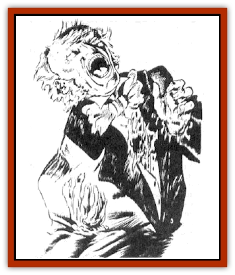
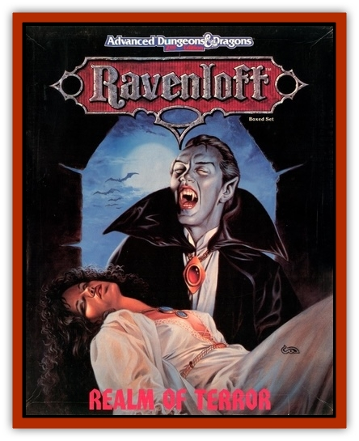

# Geist

| Statistic | **Geist** |
| --- | --- |
| **Activity Cycle:** | Night (usually) |
| **Alignment:** | Varies |
| **Armor Class:** | 10 |
| **Climate/Terrain:** | Any (border ethereal) |
| **Damage/Attack:** | Nil |
| **Diet:** | Nil |
| **Frequency:** | Very rare |
| **Hit Dice:** | Nil |
| **Intelligence:** | Varies |
| **Magic Resistance:** | Special |
| **Morale:** | Fearless (19-20) |
| **Movement:** | Fl 12 (A) |
| **No. Appearing:** | 1 |
| **No. of Attacks:** | Nil |
| **Organization:** | Solitary |
| **Size:** | M (6' tall) |
| **Special Attacks:** | Panic |
| **Special Defenses:** | Invulnerable |
| **THAC0:** | Nil |
| **Treasure:** | Nil |
| **XP Value:** | 0 |

A geist is the undead spirit of a person. It resembles a [[Ghost|ghost]] or [[Haunt|haunt]], but is relatively harmless. It is a transparent image of the person at the moment of death. Since death can be violent, geists may have broken necks or gaping, fatal wounds. Others, who died more peacefully or perhaps as a result of poison, may show no outward signs of trauma. Geists always appear to be clothed in the garments they wore at the time of death.

These spirints leave no trace of themselves on the real world. They have no odor, and cannot manipulate physical objects. Even the sight and sound of a geist is elusive; like a hallucination, it is only seen and heard in a person's mind. Characters who are protected from mental attacks cannot perceive a geist. At times a geist may wish to be witnessed by some people in a group but not others. The geist can choose who will sense it and who will not.

Geists can speak, and choose who will hear them. Language is not a barrier; a geist speaks the universal language of the mind.

**Combat:** A geist cannot engage in combat; its most powerful weapon is speech. An Armor Class of 10 has been provided above because characters may attempt to strike it. Any "hit" passes right through the geist's body. The spirit may pretend to attack a character, but its attacks pass through the victim's body harmlessly.

The sight of a geist is highly alarming. Usually, viewers assume that they are seeing a ghost or haunt. Characters who see a geist must make a successful Fear Check or flee in panic. If the geist is particularly gruesome, a Horror Check may be in order.

A geist can give the impression it is teleporting. It decides to not be visible, moves to a new spot, and becomes visible again. It can move through any physical object unimpeded. Magical wardings do keep a geist out, however.

Spells or magical items cannot divine information about a geist, such as its alignment, truthfulness. etc. A *true seeing* spell or equivalent magic allows a character to perceive a blurry, white image of the geist even when it chooses to be invisible. *Dismissal*, *banishment*, *wish*, *abjure*, and *holy word* spells (or equivalent magic) will send the geist to its final resting place. Otherwise, it is immune to all magic and all spells.

**Habitat/Society:** A geist can exist in any climate. It usually haunts the location of its death, and its territory is limited to a single building or small area. In rare cases, a geist may be able to roam farther.

As solitary undead creatures, geists have no society of their own. A geist may be willing to talk to living beings, however. Its personality and alignment at the time of death determine its attitude and reactions. Some geists are helpful, while others spread lies and confusion.

**Ecology:** A geist is created when a person dies traumatically. Usually there is some deed left undone or some penance to be paid. The spirit of the person refuses to leave the plane (or demiplane) on which he died, becoming a geist instead.

**Greater Geist**

  These spirits can cast illusions that include sound. However, the illusions always have a transparent quality to them and are never believed to be real. The greater geist can make itself appear as solid flesh, though it is not. It can alter the appearance of its clothing and the condition of its body. For example, it might choose to remove its head and carry it around. It cannot change its appearance to resemble another person. Most often, however, a greater geist looks as it did at the time of death.

---
## Discovery & Documentation

**Source Publication:** Ravenloft Campaign Setting, 1st Ed. ("Realm of Terror") (1994)
**Campaign Setting:** Ravenloft
**Author(s):** Bruce Nesmith and Andria Hayday

### Other Creatures Found in This Source Book
   * [[Gremishka|Gremishka]]
   * [[Lycanthrope_Loup-garou|Lycanthrope, Loup-garou]]
   * [[Odem|Odem]]
   * [[Strahd_Skeleton|Strahd Skeleton]]
   * [[Strahd_Zombie|Strahd Zombie]]
   * [[Vampire_Nosferatu|Vampire, Nosferatu]]
