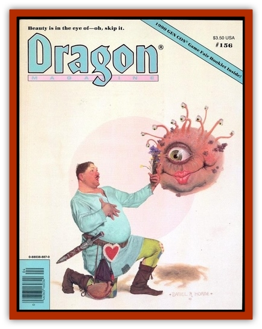

# Gello Monster

| Statistic | **Gello Monster** |
| --- | --- |
| **Activity Cycle:** | Any |
| **Alignment:** | Neutral, if squishy |
| **Armor Class:** | 10 |
| **Climate/Terrain:** | Any/Subterranean |
| **Damage/Attack:** | See below |
| **Diet:** | Omnivore |
| **Frequency:** | Very rare |
| **Hit Dice:** | 1-28 (3d10 -2) servings |
| **Intelligence:** | Non- (0) |
| **Magic Resistance:** | Immune to all spells (see below) |
| **Morale:** | Fearless (20) until snarfed; then Average (10) |
| **Movement:** | 9 (and can climb flawlessly) |
| **No. Appearing:** | 1 |
| **No. of Attacks:** | 1 smother |
| **Organization:** | Solitary |
| **Size:** | S (1-3' square, or 1-28 cubic feet) |
| **Special Attacks:** | Smothering |
| **Special Defenses:** | Only harmed by snarfing (see below) |
| **THAC0:** | Nil; see below |
| **Treasure:** | Incidental |
| **XP Value:** | 10 calories per serving |

The gello monster is a variant of the [[Ooze_Slime_Jelly_II|gelatinous cube]]. These dreaded monsters came into being when a convention of gelatin merchants, which had mistakenly been held in the Grotto of the Gelatinous Cubes because the organizer thought it sounded appropriate, was ambushed by a horde of gelatinous cubes. The cubes, of course, devoured all that was there, including many of the gelatin mixes that the merchants had on display. Once inside the cubes, the gelatin mixes diffused throughout their bodies, reacting with the internal juices of the cubes and radically altered their physiology.

The cubes, of course, acquired the flavor and coloring of the mixes they consumed, and are now found in many colors and flavors, varying from red to puce, and from cherry to blackberry-orange. As a result of having acquired the coloring of the gelatin mixes, the silent-moving gello monsters cause victims to have a -1 on their surprise rolls (gello monsters are small, which helps, but they all smell very strongly of whatever flavor they happen to be).

When attacking, a gello monster slithers up a character's body and attempts to cover his breathing orifices, doing 2-8 hp smothering damage per round (no to-hit roll required). Once a meal is dead, a gello monster takes 2-8 days to eat it by means of weak digestive juice (also a result of the gelatin infusion).

Defensively, gello monsters are well-nigh invulnerable. Blows from edged weapons only divide them evenly into smaller monsters, and blunt weapons bounce off them harmlessly, with a 35% chance of hitting the wielder on the rebound. Magical spells affect them, but only in a limited way. Heat- and cold-based spells make them either warmer or colder but do not harm them, and all other spells have similar results. For example, a *magic missile* attack would make one only quiver, and an *ice storm* would only serve as a decorative topping.

The only way to defeat a gello monster is to snarf it - i.e., eat it as fast as possible. Snarfing attacks are made by rolling 4d6 vs. the snarfer's constitution. If the roll is less than the constitution of the snarfer, then he has successfully snarfed one serving of damage against the gello monster. If the roll is greater, the character is unable to snarf that round (but he can try later, as there's always room for gello). If the roll equals a snarfer's constitution, he must rest for one round but may automatically snarf on the following round. If a snarfer eats at least two servings but then fails his snarfing roll three times in a row, he may snarf no more and must excuse himself from combat. If the snarfer does not escape, he will be at the mercy of the gello monster. About one cubic foot of a gello monster equals the amount a character may snarf in one round.

Huge versions of gello monsters are whispered of, so large that only giants could snarf them. Little else is known.

*Created by: William S. Greenway*

---
## Discovery & Documentation

**Source Publication:** Dragon156 (1990)
**Campaign Setting:** Dragon Magazine
**Author(s):** Mark Nelson, Bruce A. Heard

### Other Creatures Found in This Source Book
   * [[Death_Sheep|Death Sheep]]
   * [[Dragon_Pink|Dragon, Pink]]
   * [[Dragonet_Paper_Dragon|Dragonet, Paper Dragon]]
   * [[Golem_Tin|Golem, Tin]]
   * [[Killer_Spruce|Killer Spruce]]
   * [[Man-Drake|Man-Drake]]
   * [[Pigeontoad|Pigeontoad]]
   * [[Tickler|Tickler]]
   * [[Wooly_Mammoth_Blink|Wooly Mammoth, Blink]]
