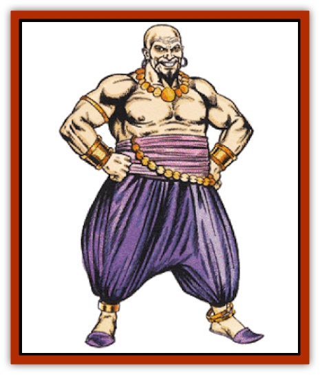
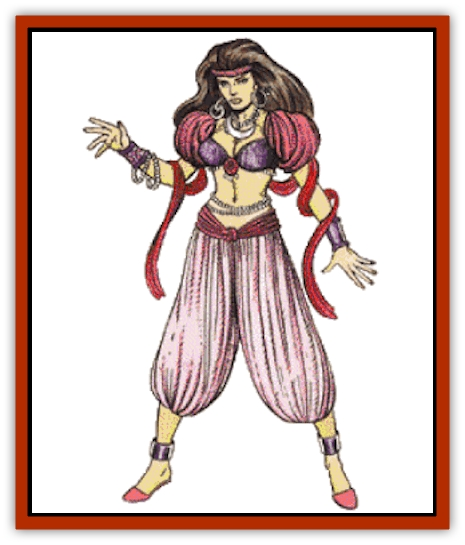
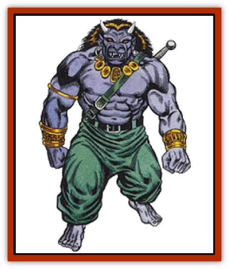
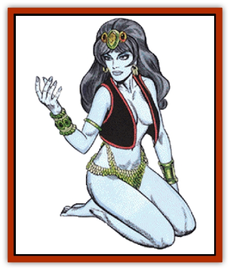

# Genie

| Statistic | **Dao** | **Djinni** | **Efreeti** | **Jann** | **Marid** |
| --- | --- | --- | --- | --- | --- |
| **Activity Cycle:** | Day | Day | Day | Day | Day |
| **Alignment:** | Neutral evil | Chaotic good | Neutral (lawful evil) | Neutral (good) | Chaotic neutral |
| **Armor Class:** | 3 | 4 | 2 | 2 (5) | 0 |
| **Climate/Terrain:** | Earth | Air | Fire | Any land | Water |
| **Damage/Attack:** | 3-18 (3d6) | 2-16 (2d8) | 3-24 (3d8) | 1-8 + Strength bonus or by weapon + Strength bonus | 4-32 (4d8) |
| **Diet:** | Omnivore | Omnivore | Omnivore | Omnivore | Omnivore |
| **Frequency:** | Rare | Very rare | Very rare | Very rare | Very rare |
| **Hit Dice:** | 8+3 | 7+3 | 10 | 6+2 | 13 |
| **Intelligence:** | Low to very (5-12) | Average to highly (8-14) | Very (11-12) | Very to exceptional (11-16) | High to genius (13-18) |
| **Magic Resistance:** | Nil | Nil | Nil | 20% | 25% |
| **Morale:** | Champion (15-16) | Elite (13-14) | Champion (15-16) | Champion (15) | Champion (16) |
| **Movement:** | 9, Fl 15 (B), Br 6 | 9, Fl 24 (A) | 9, Fl 24 (B) | 12, Fl 30 (A) | 9, Fl 15 (B), Sw 24 |
| **No. Appearing:** | 1 | 1 | 1 | 1-2 | 1 |
| **No. of Attacks:** | 1 | 1 | 1 | 1 | 1 |
| **Organization:** | Khanate | Caliphate | Sultanate | Amirate | Padishate |
| **Size:** | L (8-11' tall) | L (10½' tall) | L (12' tall) | M (6-7' tall) | H (18' tall) |
| **Special Attacks:** | See below | See below | See below | See below | See below |
| **Special Defenses:** | See below | See below | See below | See below | See below |
| **THAC0:** | 11 | 13 | 11 | 15 | 7 |
| **Treasure:** | Nil | Nil | Nil | Nil | Nil |
| **XP Value:** | 5,000 | 5,000 / Noble: 11,000 | 8,000 | 3,000 (+1,000 per added Hit Die) | 16,000 |

Genies come from the elemental planes. There, among their own kind, they are have their own societies. Genies are sometimes encountered on the Prime Material plane and are often summoned specifically to perform some service for a powerful wizard or priest. All genies can travel to any of the elemental planes, as well as the Prime Material and Astral planes. Genies speak their own tongue and that of any intelligent beings they meet through a limited form of telepathy.

## 

Djinni

The djinn are genies from the elemental plane of Air. It should be noted that "djinn" is the plural form of their name, while "djinni" is the singular.

**Combat:** The djinn's magical nature enables them to do any of the following once per day: *create nutritious food* for 2d6 persons and *create water* or *create wine* for 2d6 persons; *create soft goods* (up to 16 cubic feet) or *create wooden items* (up to 9 cubic feet) of a permanent nature; *create metal*, up to 100 pounds weight with a short life span (the harder the metal the less time it lasts; gold has about a 24 hour existence while djinni steel lasts only one hour); *create illusion* as a 20th-level wizard with both visible and audible components, which last without concentration until touched or magically dispelled; use *invisibility*, *gaseous form*, or *wind walk*.

Once per day, the genie can create a *whirlwind*, which the it can ride or even direct at will from a distance. The whirlwind is a cone-shaped spiral, measuring up to 10 feet across at its base, 40 feet across at the top, and up to 70 feet in height (the djinni chooses the dimensions). Its maximum speed is 18, with maneuverability class A. The whirlwind's base must touch water or a solid surface, or it will dissolve. It takes a full turn for the whirlwind to form or dissolve. During that time, the whirlwind inflicts no damage and has no other effect. The whirlwind lasts as long as the djinni concentrates on it, moving at the creature's whim. If the whirlwind strikes a non-aerial creature with fewer than 2 Hit Dice, the creature must make a saving throw vs. breath weapon for each round of contact with the whirlwind, or be swept off its feet, battered, and killed. Hardier beings, as well as aerial or airborne creatures, take 2d6 points of damage per round of contact with the whirlwind.

A djinni can ride its whirlwind and even take along passengers, who (like the djinni) suffer no damage from the buffeting winds. The whirlwind can carry the genie and up to six man-sized or three genie-sized companions.

Airborne creatures or attacks receive a -1 penalty to attack and damage rolls against a djinni, who also receives a +4 bonus to saving throws against gas attacks and air-based spells.

Djinn are nearly impossible to capture by physical means; a djinni who is overmatched in combat usually takes to flight and uses its whirlwind to buffet those who follow. Genies are openly contemptuous of those life forms that need wings or artificial means to fly and use illusion and invisibility against such enemies. Thus, the capture and enslavement of djinn is better resolved by the DM on a case-by-case basis. It is worth noting, however, that a good master will typically encourage a djinni to additional effort and higher performance, while a demanding and cruel master encourages the opposite.

Djinn are able to carry up to 600 pounds, on foot or flying, without tiring. They can carry double that for a short time: three turns if on foot, or one turn if flying. For each 100 pounds below the maximum, add one turn to the time a djinni may walk or fly before tiring. A fatigued djinni must rest for an hour before performing any additional strenuous activity.

**Habitat/Society:** The djinn's native land is the elemental plane of Air, where they live on floating islands of earth and rock, anywhere from 1,000 yards to several miles across. They are crammed with buildings, courtyards, gardens, fountains, and sculptures made of elemental flames. In a typical djinn landhold there are 3d10 djinn of various ages and powers, as well as 1d10 jann and 1d10 elemental creatures of low intelligence. All are ruled by the local sheik, a djinn of maximum hit points.

The social structure of Djinn society is based on rule by a caliph, served by various nobles and officials (viziers, beys, emirs, sheiks, sheriffs, and maliks). A caliph rules all the djinn estates within two days' travel, and is advised by six viziers who help maintain the balance of the landholdings. If a landhold is attacked by a large force, a messenger (usually the youngest djinni) is sent to the next landhold, which sends aid and dispatches two more messengers to warn the next landholds; in this fashion the entire nation is warned.

**Noble Djinn**

  Some djinn (1%) are "noble" and are able to grant three wishes to their masters. [[Genie_Noble_Djinni|Noble djinn]] perform no other services and, upon granting the third wish are freed of their servitude. Noble djinn are as strong as efreet, with 10 Hit Dice. They strike for 3d8 points of damage, and the whirlwinds they create cause 3d6 hit points of damage.

## 

Dao

A dao is a genie from the elemental plane of Earth. While they are generally found on that plane (though even there they are uncommon), the dao love to come to the Prime Material plane to work evil. Dao speak all of the languages of the genies, as well as Common and the tongue of [[Elemental_Air_Earth|earth elementals]].

**Combat:** The dao's magical abilities enable them to use any of the following magical powers, one at a time, once each per day: *change self*, *detect good*, *detect magic*, *gaseous form*, *invisibility*, *misdirection*, *passwall*, *spectral force*, and *wall of stone*. They can also fulfill another's *limited wish* (in a perverse way) once each day. Dao can use *rock to mud* three times per day and *dig* six times per day. Dao perform all magic as 18th-level spellcasters.

A dao can carry up to 500 pounds without tiring. Double weight will cause tiring in three turns, but for every 100 pounds of weight under 1,000, the dao may add one turn to the duration of its carrying ability. After tiring, a dao must rest for one hour. Dao can move through earth (not worked stone) at a burrowing speed of 6. They cannot take living beings with them, but can safely carry inanimate objects.

Dao are not harmed by earth-related spells, but holy water has twice its normal effect upon these monsters.

**Habitat/Society:** The dao dwell in the Great Dismal Delve on their own plane and in deep caves, caverns, or cysts on the Prime Material plane. Dao settle pockets of elemental matter on their own plane, bending those pockets to their will and desire. A dao mazework contains 4d10 dao, as well as 8d10 elemental and non-elemental slaves. Each mazework is ruled by an ataman or hetman who is advised by a seneschal. The loyalty of a mazework's ataman to the Great Dismal Delve is always questionable, but the seneschals are chosen by the [[Genie_Noble_Dao|khan of the dao]], and their loyalty is to him alone.

The khan of the dao lives at the center of the great mazework called the Great Dismal Delve. The land within the delve is said to be larger than most Prime Material continents. The Great Dismal Delve is linked to all manner of elemental pockets, so the khan can call forth whatever powers he needs. The population of dao in the delve is unknown, as is the number of slaves that constantly work the tunnels and clear away damage caused by the quakes which frequently shake it.

Dao dislike servitude as much as efreet and are even more prone to malice and revenge than their fiery counterparts.

**Ecology:** The dao manage a thriving business of trade, driven by a desire for more power and access to precious gems. High on their list of hatreds are most other genies (except efreet, with whom they trade worked metals for minerals). They also have little use for other elemental creatures; the dao value these only if they can exploit them in some fashion.

## 

Efreeti

The efreet (singular: efreeti) are genies from the elemental plane of Fire. They are enemies of the djinn and attack them whenever they are encountered. A properly summoned or captured efreeti can be forced to serve for a maximum of 1,001 days, or it can be made to fulfill three wishes. Efreet are not willing servants and seek to pervert the intent of their masters by adhering to the letter of their commands.

The efreet are said to be made of basalt, bronze, and solid flames. They are massive, solid creatures.

**Combat:** An efreeti is able to do the following once per day: grant up to three *wishes*; use *invisibility*, *gaseous form*, *detect magic*, *enlarge*, *polymorph self*, and *wall of fire*; create an illusion with both visual and audio components which will last without concentration until magically dispelled or touched. An efreeti can also produce flame or use pyrotechnics at will. Efreet are immune to normal fire-based attacks, and even an attack with magical fire suffers a -1 penalty on all attack and damage rolls.

Efreet can carry up to 750 pounds on foot or flying, without tiring. They can also carry double weight for a limited time: three turns on foot or one turn aloft. For each 150 pounds of weight under 1500, add one turn to either walking or flying time permitted. After tiring, the efreeti must rest for one hour.

**Habitat/Society:** Efreet are infamous for their hatred of servitude, desire for revenge, cruel nature, and ability to beguile and mislead. The efreet's primary home is their great citadel, the fabled City of Brass, but there are many other efreet outposts throughout the plane of Fire.

An efreet outpost is a haven for 4d10 efreet and is run as a military station to watch or harass others in the plane. These outposts are run by a malik or vali of maximum normal hit points. There is a 10% chance that the outpost is also providing a temporary home for 1d4 jann or 1d4 dao (the only other genies efreet tolerate). Outpost forces are usually directed against incursions from the elemental plane of Air, but they can be directed against any travelers deemed suitable for threats, robbery, and abuse.

Efreet are neutral, but tend toward organized evil. They are ruled by a [[Genie_Noble_Efreeti|grand sultan]] who makes his home in the City of Brass. He is advised by a variety of beys, amirs, and maliks concerning actions within the plane, and by six great pashas who deal with efreet business on the Prime Material plane.

The City of Brass is a huge citadel that is home to the majority of efreet. It hovers in the hot regions of the plane and is often bordered by seas of magma and lakes of glowing lava. The city sits upon a hemisphere of golden, glowing brass some 40 miles across. From the upper towers rise the minarets of the great bastion of the Sultan's Palace. Vast riches are said to be in the palace of the sultan. The city has an efreet population that far outnumbers the great cities of the Prime Material plane. The sultan wields the might of a Greater Power, while many of his advisors are akin to Lesser Powers and Demi-Powers.

**Ecology:** [[Elemental_Fire_Water|Fire elementals]] tend to avoid the efreet, whom they feel are oppressive and opportunistic. Djinn hate them, and there have been numerous djinn-efreet clashes. Efreet view most other creatures either as enemies or servants, a view that does not endear them to other genies.

## 

Marid

The marids are said to be born of the ocean, having currents for muscles and pearls for teeth. These genies from the elemental plane of Water are the most powerful of all genies. They are also the most individualistic and chaotic of the elemental races, and only rarely deign to serve others.

On their own plane they are rare; marids travel so seldom to the Prime Material plane that many consider marids to be creatures of legend only.

**Combat:** Marids perform as 26th-level spellcasters, and can use any of the following magical powers, one at a time, twice each per day: *detect evil*, *detect good*, *detect invisibility*, *detect magic*, *invisibility*, *liquid form* (similar to *gaseous form*), *polymorph self*, and *purify water*. Marids can use any of the following up to seven times per day: *gaseous form*, *lower water*, *part water*, *wall of fog*, or *water breathing* (used on others, lasting up to one full day). Once per year a marid can use *alter reality*.

Marids can always *create water*, which they may direct in a powerful jet up to 60 yards long. Victims struck by the jet take 1d6 points of damage and must make a successful saving throw vs. breath weapon or be blinded for 1d6 rounds. Marids also have the innate ability to *water walk* (as the ring).

A marid can carry 1,000 pounds. Double weight causes tiring in three turns. For every 200 pounds under 2,000, add one turn to the time the marid can carry before tiring. A tired marid must rest for one hour.

Marids swim, breathe water, are at home at any depth, and have infravision. They are not harmed by water-based spells. Cold-based spells grant them a +2 bonus to saving throws and -2 to each die of damage. Fire inflicts +1 per die of damage, with saving throws at a -1 penalty. Steam does not harm them.

**Habitat/Society:** Marids live in a loose empire ruled by a [[Genie_Noble_Marid|padisha]]. Each marid lays some claim to royalty; they are all shahs, atabegs, beglerbegs, or mufti at the very least. There have often been several simultaneous "single true heirs" to the padisha's throne through the eons.

A marid household numbers 2d10 and is located around loosely grouped elemental pockets containing the necessities for marid life. Larger groups of marids gather for hunts and tournaments, where individual effort is heavily emphasized.

Marids are champion tale-tellers, although most of their tales emphasize their own prowess, and belittle others. When communicating with a marid, one must attempt to keep the conversation going without continual digression for one tale or another, while not offending the marid. Marids consider it a capital offense for a lesser being to offend a marid.

Marids are both fiercely independent and extremely egoistical. They are not easily forced to perform actions; even if convinced through flattery and bribery to obey, they often stray from their intended course to seek some other adventure that promises greater glory, or to instruct lesser creatures on the glories of the marids.

Most mages skilled in summoning and conjuration consider marids to be more trouble than they are worth, which accounts for the great lack of items of marid control (as opposed to those affecting efreet and djinn). Marids can travel the Ethereal plane, in addition to those planes to which all genies can travel.

**Ecology:** Marids tolerate their genie relatives, putting up with jann and djinn like poor cousins, while they have an aversion to efreet and dao. Their attitude toward the rest of the world is similar; most creatures from other planes are considered lesser beings, not fit to be bothered with unless one lands in the feast hall at an inopportune time.

## Janni

The jann are the weakest of the elemental humanoids known collectively as genies. Jann are formed out of all four elements and must therefore spend most of their time on the Prime Material plane. In addition to speaking Common and all the languages of genies, jann can speak with animals.

**Combat:** Jann often wear chain mail armor (60% chance), giving them an effective AC of 2. They typically use great scimitars which inflict 2d8 damage to small and medium creatures, and 4d4 points of damage to larger opponents. They also use composite long bows. Male jann have exceptional Strength scores; roll percentile dice for their Strengths. For female jann, roll percentile dice and subtract 50; anything above 0 indicates percentage Strength equal to that number, while anything below indicates 18 Strength.

Jann can use one the following magical powers each round: *enlarge* or *reduce*, twice each per day; *invisibility* three times per day; *create food and water* once per day as a 7th-level priest; and *etherealness* (as the armor) once per day for a maximum of one hour. Jann perform at 12th-level ability, except as noted.

**Habitat/Society:** Jann favor forlorn deserts and hidden oases, where they have both privacy and safety. Jann society is very open, and males and females are regarded as equals. A tribe is made up of 1d20+10 individuals and is ruled by a sheik and one or two viziers. Exceptionally powerful sheiks are given the title of amir, and in times of need they gather and command large forces of jann (and sometimes allied humans).

Many jann tribes are nomadic, traveling with flocks of camels, goats, or sheep from oasis to oasis. These itinerant jann appear human in every respect, and are often mistaken for them, unless they are attacked. Jann are strong and courageous, and they do not take kindly to insult or injury. The territory of a jann tribe can extend hundreds of miles in any direction.

While traveling, male jann live in large, colorful tents with their wives and married male children, and their families. Married daughters move away to live with their new husbands. When a family eventually grows large enough that it can no longer reside comfortably in the tent, a new tent is built, and a son takes his wife and family with him to this new dwelling. At permanent oases, the jann live not only in tents, but also in elegantly styled structures built from materials brought from any of the elemental planes.

Jann are able to dwell in air, earth, fire, or water environments for up to 48 hours. This includes the elemental planes, to which any janni can travel, even taking up to six individuals along if those others hold hands in a circle with the janni. Failure to return to the Prime Material plane within 48 hours inflicts 1 point of damage per additional hour on the jann, until the jann dies or returns to the Prime Material plane. Travel to another elemental plane is possible, without damage, providing at least two days are spent on the Prime Material plane immediately prior to the travel.

**Ecology:** Jann are suspicious of humans, dislike demihumans, and detest humanoids. Jann accept djinn, but shun dao, efreet, and marids. They sometimes befriend humans or work with them for a desired reward, like potent magical items.

One ethic the jann share with other nomads is the cultural demand for treating guests with honor and respect. Innocent visitors (including humans) are treated hospitably during their stay, but some day might be expected to return the favor.

**Jann Leaders**

  Jann leaders have 17-18 Intelligence, and 10% have 19 Strength. Sheiks have up to 8 Hit Dice, amirs up to 9. Viziers have 17-20 Intelligence and the following magical powers, each usable three times per day at 12th-level spellcasting ability: *augury*, *detect magic*, and *divination*.

---
## Discovery & Documentation

**Source Publication:** Monstrous Manual (1995)
**Campaign Setting:** Advanced Dungeons & Dragons 2nd Edition
**Author(s):** Tim Beach

### Other Creatures Found in This Source Book
   * [[Aarakocra|Aarakocra]]
   * [[Aboleth|Aboleth]]
   * [[Ankheg|Ankheg]]
   * [[Arcane|Arcane]]
   * [[Argos|Argos]]
   * [[Aurumvorax|Aurumvorax]]
   * [[Baatezu_Lesser_Abishai|Baatezu, Lesser, Abishai]]
   * [[Baatezu_General_Information|Baatezu, General Information]]
   * [[Baatezu_Greater_Pit_Fiend|Baatezu, Greater, Pit Fiend]]
   * [[Banshee|Banshee]]
   * [[Basilisk|Basilisk]]
   * [[Bat|Bat]]
   * [[Bear|Bear]]
   * [[Beetle_Giant|Beetle, Giant]]
   * [[Behir|Behir]]
   * [[Beholder_and_Beholder-kin_I|Beholder and Beholder-kin I]]
   * [[Beholder_and_Beholder-kin_II|Beholder and Beholder-kin II]]
   * [[Bird|Bird]]
   * [[Brain_Mole|Brain Mole]]
   * [[Broken_One|Broken One]]
   * [[Brownie|Brownie]]
   * [[Bugbear|Bugbear]]
   * [[Bulette|Bulette]]
   * [[Bullywug|Bullywug]]
   * [[Carrion_Crawler|Carrion Crawler]]
   * [[Cat_Great|Cat, Great]]
   * [[Catoblepas|Catoblepas]]
   * [[Cat_Small|Cat, Small]]
   * [[Cave_Fisher|Cave Fisher]]
   * [[Centaur|Centaur]]
   * [[Centipede|Centipede]]
   * [[Chimera|Chimera]]
   * [[Cloaker|Cloaker]]
   * [[Cockatrice|Cockatrice]]
   * [[Couatl|Couatl]]
   * [[Crabman|Crabman]]
   * [[Crawling_Claw|Crawling Claw]]
   * [[Crocodile|Crocodile]]
   * [[Crustacean_Giant|Crustacean, Giant]]
   * [[Crypt_Thing|Crypt Thing]]
   * [[Death_Knight|Death Knight]]
   * [[Deepspawn|Deepspawn]]
   * [[Dinosaur_I|Dinosaur I]]
   * [[Displacer_Beast|Displacer Beast]]
   * [[Dog|Dog]]
   * [[Dog_Moon|Dog, Moon]]
   * [[Dolphin|Dolphin]]
   * [[Doppelganger|Doppelganger]]
   * [[Dracolich|Dracolich]]
   * [[Dragon_Brown|Dragon, Brown]]
   * [[Dragon_Chromatic_Black|Dragon, Chromatic, Black]]
   * [[Dragon_Chromatic_Blue|Dragon, Chromatic, Blue]]
   * [[Dragon_Chromatic_Green|Dragon, Chromatic, Green]]
   * [[Dragon_Cloud|Dragon, Cloud]]
   * [[Dragon_Chromatic_Red|Dragon, Chromatic, Red]]
   * [[Dragon_Chromatic_White|Dragon, Chromatic, White]]
   * [[Dragon_Deep|Dragon, Deep]]
   * [[Dragon_Gem_Amethyst|Dragon, Gem, Amethyst]]
   * [[Dragon_Gem_Crystal|Dragon, Gem, Crystal]]
   * [[Dragon_Gem_Emerald|Dragon, Gem, Emerald]]
   * [[Dragon_Gem_Sapphire|Dragon, Gem, Sapphire]]
   * [[Dragon_Gem_Topaz|Dragon, Gem, Topaz]]
   * [[Dragon_Metallic_Brass|Dragon, Metallic, Brass]]
   * [[Dragon_Metallic_Bronze|Dragon, Metallic, Bronze]]
   * [[Dragon_Metallic_Copper|Dragon, Metallic, Copper]]
   * [[Dragon_Mercury|Dragon, Mercury]]
   * [[Dragon_Metallic_Gold|Dragon, Metallic, Gold]]
   * [[Dragon_Mist|Dragon, Mist]]
   * [[Dragon_Metallic_Silver|Dragon, Metallic, Silver]]
   * [[Dragon_General_Information|Dragon, General Information]]
   * [[Dragon_Shadow|Dragon, Shadow]]
   * [[Dragon_Steel|Dragon, Steel]]
   * [[Dragon_Yellow|Dragon, Yellow]]
   * [[Dragonne|Dragonne]]
   * [[Dragon_Turtle|Dragon Turtle]]
   * [[Dragonet_Faerie_Dragon|Dragonet, Faerie Dragon]]
   * [[Dragonet_Fire_Drake|Dragonet, Fire Drake]]
   * [[Dragonet_Pseudodragon|Dragonet, Pseudodragon]]
   * [[Dryad|Dryad]]
   * [[Dwarf_Derro|Dwarf, Derro]]
   * [[Dwarf|Dwarf]]
   * [[Elemental_Athas_General_Information|Elemental (Athas), General Information]]
   * [[Elemental_Air_Kin|Elemental, Air Kin]]
   * [[Elemental_Earth_Kin|Elemental, Earth Kin]]
   * [[Elemental_Fire_Kin|Elemental, Fire Kin]]
   * [[Elemental_Water_Kin|Elemental, Water Kin]]
   * [[Elemental_of_Chaos_Air_Earth|Elemental of Chaos, Air/Earth]]
   * [[Elemental_of_Chaos_Fire_Water|Elemental of Chaos, Fire/Water]]
   * [[Elemental_Composite|Elemental, Composite]]
   * [[Elemental_Air_Earth|Elemental, Air/Earth]]
   * [[Elemental_Fire_Water|Elemental, Fire/Water]]
   * [[Elemental_General_Information|Elemental, General Information]]
   * [[Elephant|Elephant]]
   * [[Elf|Elf]]
   * [[Elf_Aquatic|Elf, Aquatic]]
   * [[Elf_Drow|Elf, Drow]]
   * [[Ettercap|Ettercap]]
   * [[Eyewing|Eyewing]]
   * [[Feyr|Feyr]]
   * [[Fish|Fish]]
   * [[Frog|Frog]]
   * [[Fungus|Fungus]]
   * [[Galeb_Duhr|Galeb Duhr]]
   * [[Gargantua|Gargantua]]
   * [[Gargoyle_I|Gargoyle I]]
   * [[Ghost|Ghost]]
   * [[Ghoul|Ghoul]]
   * [[Giant_Cloud|Giant, Cloud]]
   * [[Giant_Cyclops|Giant, Cyclops]]
   * [[Giant_Desert|Giant, Desert]]
   * [[Giant_Ettin|Giant, Ettin]]
   * [[Giant_Firbolg|Giant, Firbolg]]
   * [[Giant_Fire|Giant, Fire]]
   * [[Giant_Fog|Giant, Fog]]
   * [[Giant_Fomorian|Giant, Fomorian]]
   * [[Giant_Frost|Giant, Frost]]
   * [[Giant_Hill|Giant, Hill]]
   * [[Giant_Jungle|Giant, Jungle]]
   * [[Giant_Mountain|Giant, Mountain]]
   * [[Giant_Reef|Giant, Reef]]
   * [[Giant_Stone|Giant, Stone]]
   * [[Giant_Storm|Giant, Storm]]
   * [[Giant_Verbeeg|Giant, Verbeeg]]
   * [[Giant_Wood|Giant, Wood]]
   * [[Gibberling|Gibberling]]
   * [[Giff|Giff]]
   * [[Gith|Gith]]
   * [[Gith_Pirate_of|Gith, Pirate of]]
   * [[Githyanki|Githyanki]]
   * [[Githzerai|Githzerai]]
   * [[Gloomwing|Gloomwing]]
   * [[Gnoll|Gnoll]]
   * [[Gnome|Gnome]]
   * [[Gnome_Spriggan|Gnome, Spriggan]]
   * [[Goblin|Goblin]]
   * [[Golem_General_Information|Golem, General Information]]
   * [[Golem_I_Greater_Golem|Golem I (Greater Golem)]]
   * [[Golem_II_Lesser_Golem|Golem II (Lesser Golem)]]
   * [[Golem_III|Golem III]]
   * [[Golem_IV|Golem IV]]
   * [[Golem_V|Golem V]]
   * [[Golem_VI_Stone_Variants|Golem VI (Stone Variants)]]
   * [[Gorgon|Gorgon]]
   * [[Grell_Colonial|Grell, Colonial]]
   * [[Gremlin_Jermlaine|Gremlin, Jermlaine]]
   * [[Gremlin|Gremlin]]
   * [[Griffon|Griffon]]
   * [[Grimlock|Grimlock]]
   * [[Grippli|Grippli]]
   * [[Hag|Hag]]
   * [[Halfling|Halfling]]
   * [[Harpy|Harpy]]
   * [[Hatori|Hatori]]
   * [[Haunt|Haunt]]
   * [[Hell_Hound|Hell Hound]]
   * [[Heucuva|Heucuva]]
   * [[Hippocampus|Hippocampus]]
   * [[Hippogriff|Hippogriff]]
   * [[Hobgoblin|Hobgoblin]]
   * [[Homunculus|Homunculus]]
   * [[Hook_Horror|Hook Horror]]
   * [[Horse|Horse]]
   * [[Human|Human]]
   * [[Hydra|Hydra]]
   * [[Imp|Imp]]
   * [[Insect_Giant|Insect, Giant]]
   * [[Insect_Swarm|Insect Swarm]]
   * [[Intellect_Devourer|Intellect Devourer]]
   * [[Invisible_Stalker|Invisible Stalker]]
   * [[Ixitxachitl|Ixitxachitl]]
   * [[Jackalwere|Jackalwere]]
   * [[Kenku|Kenku]]
   * [[Ki-rin|Ki-rin]]
   * [[Kirre|Kirre]]
   * [[Kobold|Kobold]]
   * [[Kuo-Toa|Kuo-Toa]]
   * [[Lamia|Lamia]]
   * [[Lammasu|Lammasu]]
   * [[Leech|Leech]]
   * [[Leprechaun|Leprechaun]]
   * [[Leucrotta|Leucrotta]]
   * [[Lich|Lich]]
   * [[Living_Wall|Living Wall]]
   * [[Lizard|Lizard]]
   * [[Lizard_Man|Lizard Man]]
   * [[Locathah|Locathah]]
   * [[Lurker|Lurker]]
   * [[Lycanthrope_General_Information|Lycanthrope, General Information]]
   * [[Lycanthrope_Seawolf|Lycanthrope, Seawolf]]
   * [[Lycanthrope_Werebear|Lycanthrope, Werebear]]
   * [[Lycanthrope_Wereboar|Lycanthrope, Wereboar]]
   * [[Lycanthrope_Werebat|Lycanthrope, Werebat]]
   * [[Lycanthrope_Werefox|Lycanthrope, Werefox]]
   * [[Lycanthrope_Wererat|Lycanthrope, Wererat]]
   * [[Lycanthrope_Wereraven|Lycanthrope, Wereraven]]
   * [[Lycanthrope_Weretiger|Lycanthrope, Weretiger]]
   * [[Lycanthrope_Werewolf|Lycanthrope, Werewolf]]
   * [[Mammal|Mammal]]
   * [[Mammal_Giant|Mammal, Giant]]
   * [[Mammal_Herd_I|Mammal, Herd I]]
   * [[Mammal_Small|Mammal, Small]]
   * [[Manscorpion|Manscorpion]]
   * [[Manticore|Manticore]]
   * [[Medusa_Maedar|Medusa, Maedar]]
   * [[Medusa|Medusa]]
   * [[Mephit_General_Information|Mephit, General Information]]
   * [[Merman|Merman]]
   * [[Mimic|Mimic]]
   * [[Mind_Flayer|Mind Flayer]]
   * [[Minotaur|Minotaur]]
   * [[Mist_Crimson_Death|Mist, Crimson Death]]
   * [[Mist_Vampiric|Mist, Vampiric]]
   * [[Mold_I|Mold I]]
   * [[Moldman|Moldman]]
   * [[Mongrelman|Mongrelman]]
   * [[Morkoth|Morkoth]]
   * [[Muckdweller|Muckdweller]]
   * [[Mudman|Mudman]]
   * [[Mummy_Greater|Mummy, Greater]]
   * [[Mummy|Mummy]]
   * [[Myconid|Myconid]]
   * [[Naga|Naga]]
   * [[Naga_Dark|Naga, Dark]]
   * [[Neogi|Neogi]]
   * [[Nightmare|Nightmare]]
   * [[Nymph|Nymph]]
   * [[Octopus_Giant|Octopus, Giant]]
   * [[Ogre|Ogre]]
   * [[Ogre_Half-|Ogre, Half-]]
   * [[Ooze_Slime_Jelly_I|Ooze/Slime/Jelly I]]
   * [[Ooze_Slime_Jelly_II|Ooze/Slime/Jelly II]]
   * [[Ooze_Slime_Jelly_Slithering_Tracker|Ooze/Slime/Jelly, Slithering Tracker]]
   * [[Orc|Orc]]
   * [[Otyugh|Otyugh]]
   * [[Owlbear_I|Owlbear I]]
   * [[Pegasus|Pegasus]]
   * [[Peryton|Peryton]]
   * [[Phantom|Phantom]]
   * [[Phoenix|Phoenix]]
   * [[Piercer|Piercer]]
   * [[Plant_Dangerous_I|Plant, Dangerous I]]
   * [[Plant_Intelligent|Plant, Intelligent]]
   * [[Poltergeist|Poltergeist]]
   * [[Pudding_Deadly|Pudding, Deadly]]
   * [[Quaggoth|Quaggoth]]
   * [[Rakshasa|Rakshasa]]
   * [[Rat|Rat]]
   * [[Rat_Osquip|Rat, Osquip]]
   * [[Remorhaz|Remorhaz]]
   * [[Revenant|Revenant]]
   * [[Roc|Roc]]
   * [[Roper|Roper]]
   * [[Rust_Monster|Rust Monster]]
   * [[Sahuagin|Sahuagin]]
   * [[Satyr|Satyr]]
   * [[Scorpion|Scorpion]]
   * [[Sea_Lion|Sea Lion]]
   * [[Selkie|Selkie]]
   * [[Shadow|Shadow]]
   * [[Shedu|Shedu]]
   * [[Sirine|Sirine]]
   * [[Skeleton|Skeleton]]
   * [[Skeleton_Giant|Skeleton, Giant]]
   * [[Skeleton_Warrior|Skeleton, Warrior]]
   * [[Slaad|Slaad]]
   * [[Slug_Giant|Slug, Giant]]
   * [[Snake|Snake]]
   * [[Snake_Winged|Snake, Winged]]
   * [[Spectre|Spectre]]
   * [[Sphinx|Sphinx]]
   * [[Spider|Spider]]
   * [[Sprite|Sprite]]
   * [[Squid_Giant|Squid, Giant]]
   * [[Stirge|Stirge]]
   * [[Su-Monster|Su-Monster]]
   * [[Swanmay|Swanmay]]
   * [[Tabaxi|Tabaxi]]
   * [[Tako|Tako]]
   * [[Tanar'ri_True_Balor|Tanar'ri, True, Balor]]
   * [[Tanar'ri_True_Marilith|Tanar'ri, True, Marilith]]
   * [[Tarrasque|Tarrasque]]
   * [[Tasloi|Tasloi]]
   * [[Thought_Eater|Thought Eater]]
   * [[Thri-kreen|Thri-kreen]]
   * [[Titan|Titan]]
   * [[Toad_Giant|Toad, Giant]]
   * [[Treant|Treant]]
   * [[Triton|Triton]]
   * [[Troglodyte|Troglodyte]]
   * [[Troll|Troll]]
   * [[Umber_Hulk|Umber Hulk]]
   * [[Unicorn|Unicorn]]
   * [[Urchin|Urchin]]
   * [[Vampire|Vampire]]
   * [[Wemic|Wemic]]
   * [[Whale|Whale]]
   * [[Wight|Wight]]
   * [[Will_O'Wisp|Will O'Wisp]]
   * [[Wolf|Wolf]]
   * [[Wolfwere|Wolfwere]]
   * [[Worm|Worm]]
   * [[Wraith|Wraith]]
   * [[Wyvern|Wyvern]]
   * [[Xorn|Xorn]]
   * [[Yeti|Yeti]]
   * [[Yuan-ti_Histachii|Yuan-ti, Histachii]]
   * [[Yuan-ti|Yuan-ti]]
   * [[Yugoloth_Guardian|Yugoloth, Guardian]]
   * [[Zaratan|Zaratan]]
   * [[Zombie|Zombie]]
