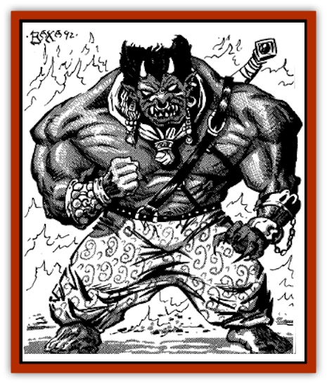

# Genie - Noble Efreeti

| Statistic | **Genie, Noble Efreeti** |
| --- | --- |
| **Activity Cycle:** | Day |
| **Alignment:** | Lawful evil |
| **Armor Class:** | -1 |
| **Climate/Terrain:** | Elemental fire, desert |
| **Damage/Attack:** | 4-32/4-32 |
| **Diet:** | Omnivore |
| **Frequency:** | Very rare |
| **Hit Dice:** | 13 |
| **Intelligence:** | Very to Exceptional (11-16) |
| **Magic Resistance:** | 15% |
| **Morale:** | Fanatic (18) |
| **Movement:** | 12 Fl 30 (B) |
| **No. Appearing:** | 1 |
| **No. of Attacks:** | 2 |
| **Organization:** | Sultanate |
| **Size:** | L (15' tall) |
| **Special Attacks:** | See below |
| **Special Defenses:** | See below |
| **THAC0:** | 7 |
| **Treasure:** | U |
| **XP Value:** | 11,000 |

These hulking warlords are the cruel rulers of the [[Genie|efreet]], though in theory they all obey the Sultan of the City of Brass. They plot and scheme against one another with a degree of cunning and skill usually seen only in the Lower Planes. They care nothing for humans and generally try to corrupt those sha'ir powerful enough to command them. Their arrogance and lust for power have won them few friends on either the Elemental or Prime Material Planes.

A noble efreeti is even more massive and solid than a common efreeti, though they share the same appearance: skin the color of basalt, hair of brass, and eyes of flame. The noble efreet wear baggy pantaloons, a shoulder harness for swords and daggers, and massive jewelry, generally armbands and earrings. The males enjoy showing off their muscled chests and broad shoulders, and so only wear tunics and cloaks when cold demands it; this is a matter of status and pride in strength rather than pure vanity. Noble efreet are not as vain as other genie nobles, as they depend on force and treachery rather than wit, appearances, and skill to persuade their fellow nobles to follow them. Their goal in choosing weapons, clothes, and jewelry is as much to intimidate others as to adorn themselves.

**Combat:** Noble efreet are powerful warriors, trained in magical and physical combat from a very young age. Although they are masters of strategy and trickery, they delight in the raw power that bloodshed gives them, and they lead their followers in battle rather than skulking in the rear.

Noble efreet can perform each of the following spell-like functions three times per day: grant *wishes* to creatures from the Prime Material Plane, become invisible, assume *gaseous form*, *detect magic*, *enlarge*, *polymorph* themselves, create an illusion with visual, olfactory, tactile, and audio components which will last without concentration until touched or magically dispelled, *sunscorch*, *misdirect*, or create a *wall of fire*. When in gaseous form, noble efreet resemble smoke, often in an undefined pillar shape. When polymorphed among humans, a noble efreet often takes the form of a colorful rooster or a youth of sterling features.

A noble efreet can also produce flame, flame arrows, sundazzle, or cause pyrotechnics at will. Fire attacks do no harm to noble efreet if the fire is nonmagical; magical fire causes half damage. In addition, once per day noble efreet can sow *fire seeds* or surround themselves with a *fire shield*. Once per week they can use *fire track*. Once per month a noble efreet can cast *conflagration*. Noble efreet perform all magic at the 16th level of spell use.

Noble efreet can carry up to 3,000 pounds, afoot or flying, without tiring, though they will only do so if magically compelled or in fear of their lives. They can carry double weight for only a limited time.three turns afoot or one turn aloft. (For each 300 pounds under 6,000, add one turn to either walking or flying time permitted.) After tiring from extreme exertion, a noble efreeti must rest for six full turns. Normally, noble efreet command common efreet to perform all such tasks.

When hunting, noble efreet enjoy the kill but prefer not to do all the work of wearing down an opponent themselves. They prefer to watch as their common efreet hunters and summoned creatures (such as [[Hell_Hound|hell hounds]]) harry the prey, then throw themselves into battle at the last minute to claim a kill. Toying with one's opponents is considered an art form among the noble efreet, and their ability at playing "cat-and-mouse" is remarkable. They also employ flying creatures of the Elemental Plane of Fire as "hawks" in their hunts.

**Habitat/Society:** Noble efreet fall into two camps: those native to the City of Brass and those who command the efreet of the Prime Material Plane. The city itself hovers in the hot regions of the Plane of Elemental Fire and often borders seas of paraelemental magma and lakes of glowing lava. It is a huge, glittering haven of avarice and malice 40 miles wide, its base a hemisphere of golden, glowing brass. From the upper terrace rise the minarets of the great citadel of the Sultan's Palace, where great riches are said to be kept. The beys and amirs of the City of Brass serve the Sultan of the Efreet; though the lesser efreet are neutral, their rulers are more inclined to law and evil than their subjects. Though the streets of the city are kept clean and the palaces are showpieces in a gaudy way, an air of blood and suffering hangs over everything, due largely to the numberless glum servants found on every street and in every hallway.

While most noble efreet fill their palaces with rich works of gold, priceless ceramics, and masterfully-woven rugs and tapestries, others merely create temporary illusionary treasures to impress their visitors as needed. Female noble efreet are kept apart in a state of seclusion from male company, but they do have their own heirarchy within households. They hold no official power with the sultan and his court, but the scheming nature of the efreet results in many of the females effectively ruling through figurehead males.

The palaces of noble efreet in the City of Brass are large and imposing and swarming with servants. A typical noble household consists of 1-6 noble efreet, 4-40 common efreet who serve as overseers and bodyguards, 10-100 [[Genie|jann]] and other imported slaves, 10 summoned intelligent elemental creatures for specialized tasks, 2-4 [[Nightmare|nightmares]], and 3-18 elemental hawks and hounds. The slaves of the efreet are magically protected from the flames of the city, but these protections must be renewed each week. Thus, escaped slaves rarely survive their freedom. The palaces are all small fortresses as well as overflowing dens of slavery, able to keep out spies, assassins, hostile nobles, and the merely curious while providing spacious quarters for the noble family.

The beys and amirs of the city are each responsible for 1-4 of the efreet's military outposts elsewhere on the Plane of Fire, each of which is a haven for 4-40 efreet ruled by a malik or vali (common efreet of maximum normal hit points). These outposts are strictly military and spartanly functional. The only chamber of any comfort whatsoever is the chamber the bey or amir occupies when he visits, a duty most beys and amirs perform as infrequently as decorum permits. Each outpost usually houses 10-100 prisoners and captives who are being broken to a life of service to the efreet.

The noble efreet of the Prime Material Plane are servants of the six great pashas who rule them in the sultan's name. Their camps are generally deep in the desert, often in ruined or abandoned cities. If their camps are discovered they are moved overnight to a new location, either by physically transporting all the goods of the genies in the camp or by transporting the same in the twinkling of an eye through the use of magic.

Noble efreet are great patrons of the hunt and are often found whiling away their days using both elemental hawks and hounds to track down the odd animals of the Elemental Plane of Fire. They also enjoy the use of bronze chariots pulled by nightmares in slave hunts. Their elemental hawks and hounds are sent ahead, and common efreet are often used as beaters to flush out game. These hunts involve 1-6 noble efreet and their retinue of 5-30 common efreet servitors, as well as 2-20 hounds or hawks. The nobles each have their own chariot.

**Ecology:** Noble efreet see all living things as either their servants or their enemies and acknowledge no one but their caliphs and pashas as their masters. Thus their reaction to other races is usually to either force them into servitude or to destroy those who cannot be enslaved. This has made them greatly feared by other creatures of the Elemental Plane of Fire, but it hasn't won them any friends. Almost all [[Elemental_Fire_Kin|salamanders]], [[Elemental_Fire_Water|fire elementals]], and other natives of the plane will gladly assist those who wish to embarrass the efreet. There have been cases of efreet princes who have demonstrated better behavior when wooing human maidens. However, even in these cases the noble efreet often demand that their true nature be kept hidden from other humans. Whether this is due to magical limitations, a wish to escape the notice of other genies, or some other reason is unclear. For the noble efreet, the wooing is just another form of the hunt.

**The Sultan of the Efreet**

  The master of the City of Brass is also referred to as the Lord of Flame, the Incandescent Potentate, the Tempering and Eternal Flame of Truth, Fuel of the Unquenchable Legions, the Most Puissant of Hunters, Marshall of the Order of the Fiery Heart, the Smoldering Dictator, and the Crimson Firebrand. The Sultan of the Efreet is constantly accompanied by a horde of 20-70 common efreet bodyguards, 1-20 entertainers, and 4-40 noble efreet courtiers, all of them vying for his attention and approval. This circus can be quite comical, though laughing in the presence of these efreet worthies is invariably fatal; they take themselves very seriously indeed.

The Sultan of the Efreet has 20 Hit Dice and maximum hit points. He has all the powers of a noble efreet as well as access to all spells of the province of fire magics once per day. In addition, he may use *flames of justice* at will. The Sultan is also immune to both magical and normal fire, and he is constantly surrounded by a nimbus of pale red fire and a halo of smoke. These cause 1d10 points of damage to anyone within 10' who is not immune to both magical fire and poison gas. No amount of water or magic can douse his magical fire.

The sultan sports a tiny goatee, his hands end in extremely long, almost knifelike claws, and his eyes constantly spark like fire. Due to his aurora of flame, the sultan wears only clothes capable of withstanding extreme heat, generally armor of whitehot iron, but sometimes delicate pantaloons and robes made of tiny blackened links of adamantite. His armoring gives the sultan an Armor Class of -5.

Audiences with the Sultan of the Efreet are held in an iron chamber at the center of his palace in the City of Brass, a smoky blast furnace of a room with reddish light and little air. Ornaments of alloyed gold and brass are everywhere, and chained fire elementals provide both heat and light.

In fulfilling his military duties, the Sultan often organizes drills, marches, and parades of spit-and-polish precision. These occasions require the entire population of the City of Brass to turn out and watch the spectacle of the sultan.s might march by; indeed, the disruption of thousands of efreet marching through the streets and turning the squares and suqs into drillgrounds makes undertaking any other task impossible.

When he travels to the Prime Material Plane, the Sultan of the Efreet always first appears as a firestorm that scorches the earth for hundreds of yards around. He prefers to appear in extremely hot environments like volcanoes, hot springs, and forest fires. This is not done out of any deference to the property or lives of creatures unable to withstand fire, but simply for his own comfort in adjusting to the frigid temperatures of the Prime Material Plane. Once he has arrived, he travels with a full military escort of 20-200 jann, 2-20 common efreet warriors, and a single noble efreeti emir. These numbers are tripled when visiting the pashas of the Prime Material Plane, whose loyalty must always be enforced with an iron fist.

---
## Discovery & Documentation

**Source Publication:** MC13 Al-Qadim Appendix (1992)
**Campaign Setting:** Al-Qadim (Forgotten Realms)
**Author(s):** C. Terry Phillips

### Other Creatures Found in This Source Book
   * [[Ammut|Ammut]]
   * [[Ashira|Ashira]]
   * [[Asuras|Asuras]]
   * [[Black_Cloud_of_Vengeance|Black Cloud of Vengeance]]
   * [[Buraq|Buraq]]
   * [[Camel|Camel]]
   * [[Camel_of_the_Pearl|Camel of the Pearl]]
   * [[Centaur_Desert|Centaur, Desert]]
   * [[Copper_Automaton|Copper Automaton]]
   * [[Debbi|Debbi]]
   * [[Elephant_Bird|Elephant Bird]]
   * [[Gen|Gen]]
   * [[Genie_Noble_Dao|Genie, Noble Dao]]
   * [[Genie_Noble_Djinni|Genie, Noble Djinni]]
   * [[Genie_Noble_Marid|Genie, Noble Marid]]
   * [[Genie_Tasked_Architect_Builder|Genie, Tasked, Architect/Builder]]
   * [[Genie_Tasked_Artist|Genie, Tasked, Artist]]
   * [[Genie_Tasked_Guardian|Genie, Tasked, Guardian]]
   * [[Genie_Tasked_Herdsman|Genie, Tasked, Herdsman]]
   * [[Genie_Tasked_Slayer|Genie, Tasked, Slayer]]
   * [[Genie_Tasked_Warmonger|Genie, Tasked, Warmonger]]
   * [[Genie_Tasked_Winemaker|Genie, Tasked, Winemaker]]
   * [[Ghost_Mount|Ghost Mount]]
   * [[Ghul|Ghul]]
   * [[Giant_Desert|Giant, Desert]]
   * [[Giant_Jungle|Giant, Jungle]]
   * [[Giant_Reef|Giant, Reef]]
   * [[Giant_Zakhara_General_Information|Giant (Zakhara), General Information]]
   * [[Hama|Hama]]
   * [[Heway|Heway]]
   * [[Living_Idol|Living Idol]]
   * [[Lycanthrope_Werehyena|Lycanthrope, Werehyena]]
   * [[Lycanthrope_Werelion|Lycanthrope, Werelion]]
   * [[Markeen|Markeen]]
   * [[Maskhi|Maskhi]]
   * [[Mason_Wasp_Giant|Mason Wasp, Giant]]
   * [[Nasnas|Nasnas]]
   * [[Pahari|Pahari]]
   * [[Rom|Rom]]
   * [[Sabu_Lord|Sabu Lord]]
   * [[Sakina|Sakina]]
   * [[Serpent_Lord|Serpent Lord]]
   * [[Serpent_Winged|Serpent, Winged]]
   * [[Silat|Silat]]
   * [[Simurgh|Simurgh]]
   * [[Stone_Maiden|Stone Maiden]]
   * [[Vishap|Vishap]]
   * [[Zaratan|Zaratan]]
   * [[Zin|Zin]]
